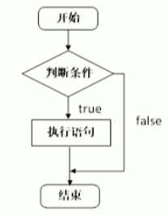
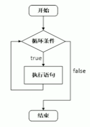
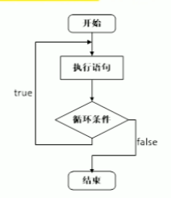

# 4 程序流程结构

C/C++支持最基本的三种程序运行结构：==顺序结构、选择结构、循环结构==

- 顺序结构：程序按顺序执行，不发生跳转
- 选择结构：依据条件是否满足，有选择地执行相应功能
- 循环结构：依据条件是否满足，循环多次值行某段代码

## 4.1 选择结构

### 4.1.1 if语句

**作用**：执行满足条件地语句

if语句地三种形式：

- 单行格式if语句
- 多行格式if语句
- 多条件地if语句

1. 单行格式if语句：`if(条件){ 条件满足执行的语句 }`
   
   > 注意：if条件表达式后不要加分号
   >
2. 多行格式if语句：`if(条件){ 条件满足执行的语句 }else{ 条件不满足执行的语句 };`
   
3. 多条件的if语句：`if(){}else if(){}...else{}`
   

```cpp
int main()
{
    //输入一个分数，如果分数大于600，考上一本大学
    //如果没考上，打印未考上一本
    int n;
    cout << "请输入一个考试分数:" << endl;
    cin >> n;
    cout << "您输入的分数是: " << n << endl;
    if(n > 600){
        cout << "恭喜考上一本大学" << endl;
    }else if(n > 500){
        cout << "恭喜考上二本大学" << endl;
    }else if(n > 400){
        cout << "恭喜考上三本大学" << endl;
    }else{
        cout << "未考上大学，请再接再厉" << endl;
    }

    return 0;
}
```

**嵌套if语句**：在if语句中，可以嵌套使用if语句，达到更精确的条件判断

```cpp
int main()
{
    //输入一个分数，如果分数大于600，考上一本大学
    //如果没考上，打印未考上一本
    int n;
    cout << "请输入一个考试分数:" << endl;
    cin >> n;
    cout << "您输入的分数是: " << n << endl;
    if(n > 600){
        // cout << "恭喜考上一本大学" << endl;
        if(n > 700){
            cout << "TsingHua" << endl;
        }else if(n > 689){
            cout << "Peiking" << endl;
        }else{
            cout << "TJU" << endl;
        }
    }else if(n > 500){
        cout << "恭喜考上二本大学" << endl;
    }else if(n > 400){
        cout << "恭喜考上三本大学" << endl;
    }else{
        cout << "未考上大学" << endl;
    }

    return 0;
}
```

案例：三只小猪称体重，哪知最重？

```cpp
#include<iostream>
using namespace std;
int main()
{
	int a, b, c;
	cin >> a >> b >> c;
	if(a >= b){
		if(a >= c)	cout << "a: " << a << endl;
		else		cout << "c: " << c << endl;
	}else{
		if(b >=c )	cout << "b: " << b << endl;
		else		cout << "c: " << c << endl;
	}
	return 0;
}
```

### 4.1.2 三目运算符

**作用**：通过三目运算符实现简单的判断

**语法**：`表达式1 ? 表达式2 : 表达式3`

**含义**：如果表达式1的值为真，则执行表达式2，并返回表达式2的结果；如果表达式1的值为假，则执行表达式3，并返回表达式3的结果。

```cpp
int main()
{
    //三目运算符
    //创建3个变量a b c，将a和b作比较，将变量大的值赋值给变量c
    int a = 10, b = 20, c;
    c = a > b ? a : b;
    cout << "c = " << c << endl;    //c = 20

    //在C++中三目运算符返回的是变量，可以继续赋值
    ((a > b) ? a : b) = 100;
    cout << "a = " << a << endl; // 10
    cout << "b = " << b << endl; // 100

    return 0;
}
```

> **三目运算符可以作为右值，将计算的结果赋值给左边变量；也可以将结果作为左值，进行后续运算**

### 4.1.3 switch语句

**作用**：执行多条分支语句

**语法**：

```cpp
switch(表达式){
    case 结果1: 执行语句1;
    break;
    case 结果2: 执行语句2;
    break;
    //...
    default: 执行语句;
    break;
}
```

电影打分案例：

```cpp
int main()
{
    //switch: 给电影打分
    int score;
    cout << "Enter your score: " << endl;
    cin >> score;
    cout << "You scored: " << score << endl;
    switch(score){
        case 5:
            cout << "Best" << endl;
            break;
        case 4:
            cout << "Good" << endl;
            break;
        case 3:
            cout << "OK" << endl;
            break;
        default:
            cout << "Low" << endl;
            break;
    }

    return 0;
}
```

> 注意1：`switch`语句中表达式类型只能是整型或字符型
>
> 注意2：`case`里如果没有 `break`，那么程序会一直向下执行
>
> 总结：与 `if`语句比，对于多条件判断时，`switch`的结构清晰，执行效率高，缺点是 `switch`不可以判断区间。

## 4.2 循环结构

### 4.2.1 while循环语句

**作用**：满足循环条件，执行循环语句

**语法**：`while(循环条件){ 循环语句 }`

**功能**：==只要循环条件的结果为真，就执行循环语句==



```cpp
int main()
{
    //while循环
    //在屏幕中打印0~9，这10个数字
    int num = 0;
    while(num < 10){
        cout << num++ << endl;
    }

    return 0;
}
```

> 注意：在执行循环语句时，程序必须提供跳出循环的窗口，否则会出现死循环

猜数字案例：系统生成0~100之间的随机数，玩家进行猜数。如果猜对，推出循环；如果猜错，则提示过大或过小。

```cpp
int main()
{
    //添加随机数种子，利用当前系统时间生成随机数，防止每次随机数都一样
    //需要添加头文件 #include<ctime>
    srand((unsigned int)time(NULL));

    //1、系统生成随机数(0~100)
    int x = rand() % 100 + 1;   //生成[0, 99] + 1之间的随机数
    // cout << "x = " << x << endl;
    int val = 0, i = 0;
    while(true){
        //2、玩家输入猜测数值
        cin >> val;
        if(val > x){
            cout << "过大" << endl;
        }else if(val < x){
            cout << "过小" << endl;
        }else{
            //3、猜对退出循环
            cout << "猜对了" << endl;
            break;  //break退出当前循环
        }
        ++i;
        if(i > 6){
            cout << "错误超过6次 游戏结束!" << endl;
            break;
        }
    }

    return 0;
}
```

### 4.2.2 do...while循环语句

作用：满足循环条件，执行循环语句

语法：`do(循环语句)while(循环条件);`

注意：与 `while`的区别在于==`do...while`会先执行一次循环语句==，再判断循环条件



```cpp
int main()
{
    //do...while语句
    //do...while和while循环区别在于do...while会先执行一次循环语句
    //在屏幕上输出0到9，这10个数字
    int num = 0;
    do{
        cout << num++ << endl;
    }while(num < 10);

    return 0;
}
```

> 注意：do...while和while循环区别在于do...while会先执行一次循环语句

**练习案例：水仙花数**

**案例描述**：水仙花数是指一个3位数，它的每个位上的数字的3次幂之和等于它本身

**例如**：1^3+5^3+3^3 = 153

```cpp
int main()
{
    //使用do...while循环，输出所有3位数中的水仙花数
    int x = 100, a, b, c;
    do{
        a = x / 100;
        b = x % 100 / 10;
        c = x % 10;
        if((a*a*a + b*b*b + c*c*c) == x){
            cout << "x = " << x << endl;
        }
        ++x;
    }while(x < 1000);

    return 0;
}
```

### 4.2.3 for循环语句

**作用**：满足循环条件，执行循环语句

**语法**：`for(起始条件;条件表达式;末尾循环体){ 循环语句; }`

**示例**：

```cpp
int main()
{
    //for循环，打印数字0~9
    for(int i=0; i<10; ++i){
        cout << i << endl;
    }

    return 0;
}
```


> 注意：`for`循环中的表达式，要用分号 `;`分隔开
>
> 总结：`while`, `do...while`, `for`都是开发中常用的循环语句，`for`循环结构比较清晰，比较常用

**练习案例：敲桌子**

案例描述：从1开始数到数字100，如果数字个位含有7，或者数字十位含有7，或者该数字是7的倍数，则打印敲桌子，其余数字直接打印输出。

```cpp
int main()
{
    //敲桌子案例
    for(int i=1; i<=100; ++i){
        if((i%7==0) || (i%10==7) || (i/10==7)){
            cout << "敲桌子" << endl;
        }else{
            cout << i << endl;
        }
    }

    return 0;
}
```

### 4.2.4 嵌套循环

**作用**：在循环体中再嵌套一层循环，解决一些实际问题

```cpp
    for(int i=0; i<10; ++i){
        for(int j=0; j<10; ++j){
            cout << "* ";
        }
        cout << endl;
    }
```

**练习案例**：乘法口诀表

案例描述：利用嵌套循环，实现九九乘法表

```cpp
    //九九乘法表
    for(int i=1; i<=9; ++i){    //行数
        for(int j=1; j<=i; ++j){    //列数
            cout << j << "*" << i << "=" << j*i << "\t";
            if(j == i)
                cout << endl;
        }
    }
```

## 4.3 跳转语句

### 4.3.1 break语句

作用：用于跳出==选择结构==或者==循环结构==

break使用的场合：

- 出现在 `switch`条件语句中，作用是终止 `case`并跳出 `switch`
- 出现在循环语句中，作用是跳出当前的循环语句
- 出现在嵌套循环中，跳出最近的内层循环语句

```cpp
int main()
{
    //break使用场景
    //1、switch语句中
    cout << "请选择游戏模式：" << endl;
    cout << "1、简单" << endl;
    cout << "2、普通" << endl;
    cout << "3、困难" << endl;
    int select = 0;
    cin >> select;
    switch(select){
        case 1:
            //简单模式
            cout << "游戏模式：简单" << endl;
            break;
        case 2:
            //普通模式
            cout << "游戏模式：普通" << endl;
            break;
        case 3:
            //困难模式
            cout << "游戏模式：困难" << endl;
            break;
        default:
            break;
    }
    //2、出现在循环语句中
    for(int i=0; i<10; ++i){
        if(i == 5)
            break;  //退出循环
        cout << i << endl;
    }

    //3、在嵌套循环语句中
    for(int i=0; i<10; ++i){
        for(int j=0; j<10; ++j){
            if(j ==5)
                break;  //退出内层循环
            cout << "*";
        }
        cout << endl;
    }
    return 0;
}
```

### 4.3.2 continue语句

作用：在==循环语句==中，跳过本次循环中余下尚未执行的语句，继续执行下一次循环

```cpp
int main()
{
    //continue语句
    for(int i=1; i<=100; ++i){
        if(i % 2)
            continue;   //可以筛选条件，执行到此就不再向下执行，而是执行下一次循环
        cout << i << endl;
    }

    return 0;
}
```

> continue并不会使整个循环终止，而break会跳出循环

### 4.3.3 goto语句

作用：无条件跳转语句

语法：`goto`标记；

功能：如果标记的名称存在，执行到goto语句时，会跳转到标记的位置

```cpp
int main()
{
    //goto语句
    cout << "1.xxxx" << endl;
    cout << "2.xxxx" << endl;
    goto FLAG;
    cout << "3.xxxx" << endl;
    FLAG:
    cout << "4.xxxx" << endl;
    return 0;
}
```

> 注意：在程序中不建议使用goto语句，以免造成程序流程混乱
