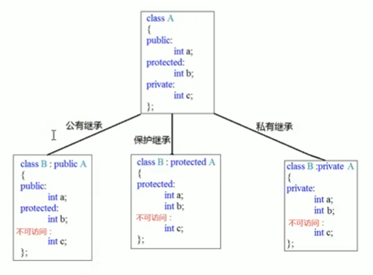

# 4 类和对象

C++面向对象的三大特性：**封装、继承、多态**

C++认为**万事万物皆为对象**，对象上有其属性和行为

具有相同性质的对象，可以抽象为类，人属于人类，车属于车类

> 类中的属性和行为统称为**成员**
>
> 属性：成员属性、成员变量
>
> 行为：成员函数、成员方法

## 4.1 封装

### 4.1.1 封装的意义

- 将属性和行为作为一个整体，表现生活中的事物
- 将属性和行为加以权限控制

**封装意义一**：

> 在设计类的时候，属性和行为写在一起，表现事物

语法：`class 类名{ 访问权限：属性 / 行为};`

```cpp
#include <iostream>
using namespace std;

// 设计一个⚪类，求周长
// 周长公式：2*PI*半径
const double PI = 3.14;
class Circle{
public: // 访问权限
    double r;   // 属性
    double perimeter(){ // 行为
        return 2 * PI * r;
    }
};

int main()
{
    // 创建对象
    Circle c1;  // 实例化：通过一个类 创建一个对象的过程
    c1.r = 1;
    cout << "周长: " << c1.perimeter() << endl;

    return 0;
}
```

示例2：设计一个学生类，属性有姓名和学号，可以给姓名和学号赋值，可以显示学生的姓名和学号

```cpp
#include <iostream>
#include <string>
using namespace std;

// 学生类
class Student{
public:
    void showStu(){
        cout << "姓名: " << Name
        << " 学号: " << Id << endl;
    }
    void set(const string &name, const int &id){    // 通过行为给属性赋值
        Name = name;
        Id = id;
    }

private:
    string Name;
    int Id;
};

int main()
{
    // 创建一个具体学生
    Student s1;
    s1.set("张三", 1);    // 设置信息
    s1.showStu();   // 显示信息

    return 0;
}
```

**封装意义二**：

类在设计时，可以把属性和行为放在不同的权限下，加以控制

访问权限有三种：

1. public：公共权限
2. protected：保护权限
3. private：私有权限

```cpp
#include <iostream>
#include <string>
using namespace std;

// 访问权限
// 三种
// 公共权限 public      成员在类内和类外都可以访问
// 保护权限 protected   类内可以访问，类外不可；子类可以访问父类保护内容
// 私有权限 private     类内可以访问，类外不可；子类不可以父类私有内容

class Person{
public: // 公共权限
    string Name;    // 姓名
protected:  // 保护权限
    string Car; // 汽车
private:    // 私有权限
    string Password;    // 密码

public:
    void set(){ // 类内都可以访问
        Name = "张三";
        Car = "拖拉机";
        Password = "123456";
    }
};

int main()
{
    Person p1;  // 实例化对象
    p1.Name = "李四";   // 公有属性可以类外访问
    // p1.Car = "大众";    // 错误：类外不可以访问保护权限内容
    // p1.Password = "0000";   // 错误：类外不可以访问私有权限内容
    p1.set();

    return 0;
}
```

### 4.1.2 struct和class区别

在C++中struct和class唯一区别在于**默认访问的权限不同**

- struct默认权限为**公共(public)**
- class默认权限为**私有(private)**

```cpp
#include <iostream>
#include <string>
using namespace std;

// struct和class区别
class C1{
    int A;  // 默认为私有权限(private)
};

struct C2{
    int A;  // 默认为公有权限(public)
};

int main()
{
    C1 a;
    // a.A = 6;    // 错误：私有权限，类外不可访问

    C2 b;
    b.A = 5;    // struct默认公有权限，类外可以访问

    return 0;
}
```

### 4.1.3 成员属性设置为私有

优点1：将所有成员属性设置为私有，可以自己控制读写权限

优点2：对于写权限，可以检测数据的有效性

```cpp
#include <iostream>
#include <string>
using namespace std;

// 将成员属性设置为私有
class Person{
public:
    Person() = default;
    Person(const string name, const int &age, const string &gender) : Name(name), Age(age), Gender(gender) {}
    void setName(const string &name){   // 设置姓名
        Name = name;
    }
    void setAge(const int &age){    // 设置年龄
        if(age<0 || age>150){
            cout << "Invalid!" << endl;
            Age = 0;
            return;
        }
        Age = age;
    }
    void get(){ // 获取姓名和年龄
        cout << "姓名: " << Name
        << " 年龄: " << Age << endl;
    }
    void getGender(){   // 获取性别
        cout << "性别: " << Gender << endl;
    }

private:
    string Name;    // 可读可写
    int Age;        // 可读可写
    string Gender;  // 只读
};

int main()
{
    Person p1("李四", 25, "男");
    p1.setAge(30);
    p1.get();
    p1.getGender();

    return 0;
}
```

> 练习案例1：设计立方体类
>
> 设计立方体类(Cube)
>
> 求出立方体的面积和体积
>
> 分别用全局函数和成员函数判断两个立方体是否相等

```cpp
#include <iostream>
#include <string>

using namespace std;

// 案例1：立方体
// 1.创建立方体类
// 2.设计属性
// 3.设计行为 获取立方体面积和体积
// 4.分别用全局函数和成员函数 判断两个立方体是否相等

class Cube{
public:
    // 设置长宽高
    void setCube(const int &l, const int &w, const int &h){
        L = l;
        W = w;
        H = h;
    }
    int getL() const {return L;}
    int getW() const {return W;}
    int getH() const {return H;}
    // 获取立方体面积
    int getS(){
        return 2*L*W + 2*L*H + 2*W*H;
    }
    // 获取立方体体积
    int getV(){
        return L*W*H;
    }

    // 通过成员函数判断两个立方体是否相等
    bool IsEqual(const Cube &c2){
        if(L==c2.getL() && W==c2.getW() && H==c2.getH()){
            return true;
        }
        return false;
    }

private:
    int L;  // 长
    int W;  // 宽
    int H;  // 高
};

// 利用全局函数判断 两个立方体是否相等
bool isEqual(const Cube &c1, const Cube &c2){
    if(c1.getL()==c2.getL() && c1.getH()==c2.getH() && c1.getW()==c2.getW()){
        return true;
    }
    return false;
}

int main()
{
    Cube c1;
    c1.setCube(10, 10, 10);
    cout << "面积: " << c1.getS() << endl;  // 600
    cout << "体积: " << c1.getV() << endl;  // 1000

    Cube c2;
    c2.setCube(10, 10, 10);

    if(isEqual(c1, c2)){    // 全局函数
        cout << "全局函数: c1和c2相等" << endl;
    }else{
        cout << "全局函数: c1和c2不相等" << endl;
    }

    if(c1.IsEqual(c2)){     // 成员函数
        cout << "成员函数: c1和c2相等" << endl;
    }else{
        cout << "成员函数: c1和c2不相等" << endl;
    }

    return 0;
}
```

> 练习案例2：点和⚪的关系
>
> 设计一个圆形类(Circle)，和一个点类(Point)，计算点和圆的关系

```cpp
#include <iostream>
#include <string>
using namespace std;
// 点和圆关系案例

class Point{    // 点类
public:
    // 设置X
    void setP(const int &x, const int &y){
        X = x;
        Y = y;
    }
    int getX() const {
        return X;
    }
    int getY() const {
        return Y;
    }

private:
    int X;
    int Y;
};

class Circle{   // 圆类
public:
    // 设置半径
    void setR(const int &r){
        R = r;
    }
    // 获取半径
    int getR() const {
        return R;
    }
    // 设置圆心
    void setO(const Point &center){
        O = center;
    }
    // 获取圆心
    Point getCenter() const {
        return O;
    }

private:
    int R;  // 半径
    // 在类中可以让另一个类，作为本类的成员
    Point O; // 圆心
};

// 判断点和圆关系
void isInCircle(const Circle &c, const Point &p){
    // 计算两点之间的距离 平方
    int d1 = (c.getCenter().getX()-p.getX())*(c.getCenter().getX()-p.getX())
            + (c.getCenter().getY()-p.getY())*(c.getCenter().getY()-p.getY());
    // 计算半径的平方
    int d2 = c.getR() * c.getR();
    // 判断
    if(d1 == d2){
        cout << "点在圆上" << endl;
    }else if(d1 < d2){
        cout << "点在圆内" << endl;
    }else{
        cout << "点在圆外" << endl;
    }
}

int main()
{
    // 圆心
    Point center;
    center.setP(10, 0);
    // 圆
    Circle c;
    c.setR(10);
    c.setO(center);

    // 点
    Point p1, p2, p3;
    p1.setP(10, 10);
    p2.setP(10, 11);
    p3.setP(10, 0);

    isInCircle(c, p1);  // 点在圆上
    isInCircle(c, p2);  // 点在圆外
    isInCircle(c, p3);  // 点在圆内


    return 0;
}
```

## 4.2 对象的初始化和清理

### 4.2.1 构造函数和析构函数

对象的初始化和清理是两个非常重要的安全问题

- 一个对象或者变量没有初始状态，对其使用后果是未知
- 同样的使用完一个对象或变量，没有及时清理，也会造成一定的安全问题

C++利用了**构造函数**和**析构函数**解决上述问题，这两个函数将会被编译器自动调用，完成对象初始化和清理工作。

对象的初始化和清理工作是编译器强制要求我们做的事情，因此如果我们**不提供构造和析构，编译器会提供，编译器提供的构造函数和析构函数是空实现**。

- 构造函数：主要作用在于创建对象时为对象的成员属性赋值，构造函数由编译器自动调用，无须手动调用
- 析构函数：主要作用在于对象**销毁前**系统自动调用，执行一些清理工作

**构造函数语法**：`类名() {}`

1. 构造函数，没有返回值也不写 `void`
2. 函数名称与类名相同
3. 构造函数可以有参数，因此可以发生重载
4. 程序在创造对象时会自动调用构造函数，无须手动调用，而且指挥调用一次

**析构函数语法**：`~类名() {}`

1. 析构函数，没有返回值也不写 `void`
2. 函数名称与类名相同，在名称前加上符号 `~`
3. **析构函数不可以有参数，因此不可以发生重载**
4. 程序在对象销毁前会自动调用析构，无须手动调用，而且指挥调用一次

```cpp
#include <iostream>
using namespace std;

// 对象的初始化和清理
// 1、构造函数 进行初始化操作

class Person{
public:
    // 1.构造函数
    // 没有返回值 不用写void
    // 函数名 与类名相同
    // 构造函数可以有参数，可以发生重载
    // 创建对象时，构造函数会自动调用，而且只调用一次
    // Person () = default;    // 合成默认构造函数
    Person() {
        cout << "Person()" << endl;
    }

    // 2.析构函数 进行清理操作
    // 没有返回值，不写void
    // 函数名和类名相同 在名称前加 ~
    // 析构函数没有参数，不可以重载
    // 对象在销毁前 会自动调用析构函数，而且只会调用一次
    ~Person(){
        cout << "~Person()" << endl;
    }
};

// 构造和析构都是必须实现的，如果不提供，编译器会提供
void test01(){
    Person p;   // 在栈上的数据，test01执行完毕后，释放这个对象
}

int main()
{
    test01();

    return 0;
}
```

### 4.2.2 构造函数的分类及调用

两种分类方式：

- 按参数分为：有参数构造和无参数构造
- 按类型分为：普通构造和拷贝构造

**三种调用方式：括号法、显示法、隐式转换法**

```cpp
#include <iostream>
using namespace std;

// 构造函数的分类及调用
class Person{
public:
    Person() {  // 默认构造函数(无参构造)
        cout << "Person()" << endl;
    }

    Person(int a) { // 有参构造
        Age = a;
        cout << "Person(int a)" << endl;
    }

    // 拷贝构造函数
    Person(const Person &p){    // 将传入对象的所有属性拷贝
        Age = p.Age;
        cout << "Person(const Person &p)" << endl;
    }

    ~Person(){
        cout << "~Person()" << endl;
    }

    int Age;
};

// 调用
void test01(){
    // 1.括号法
    Person p1;   // 默认构造函数；调用默认构造函数时，不要加括号 `()`
    // Person p1();    // 编译器会认为是一个函数声明
    Person p2(10);  // 有参构造函数
    Person p3(p2);  // 拷贝构造函数
    cout << "p3.Age = " << p3.Age << endl;  // 10
  
    // 2.显式法
    Person p4 = Person(6);  // 有参构造
    Person p5 = Person(p4); // 拷贝构造
    // Person(10); // 匿名对象；特点：当前行执行结束后，系统会立即回收掉匿名对象
    // 不要用拷贝构造函数，初始化匿名对象
    // Person(p5); // 编译器会认为 Person(p5) == Person p5; 对象声明

    // 3.隐式转换法
    Person p6 = 10; // 相当于 Person p6 = Person(10);
    Person p7 = p6; // 相当于 Person p7 = Person(p6);

}

int main()
{
    test01();
    return 0;
}
```

### 4.2.3 拷贝构造函数调用时机

C++中拷贝构造函数调用时机通常有三种情况

- 使用一个已经创建完毕的对象来初始化一个新对象
- 值转递的方式给函数参数传值
- 以值方式返回局部对象

```cpp
#include <iostream>
using namespace std;

// 拷贝构造函数调用时机
// 1.使用一个已经创建完毕的对象来初始化一个新对象
// 2.值传递的方式给函数参数传值
// 3.值方式返回局部对象

class Person{
public:
    Person(){
        cout << "Person默认构造函数" << endl;
    }

    Person(int age){
        Age = age;
        cout << "Person有参构造函数" << endl;
    }

    Person(const Person &p){
        Age = p.Age;
        cout << "Person拷贝构造函数" << endl;
    }

    ~Person(){
        cout << "Person析构函数调用" << endl;
    }

int Age;
};

// 1.使用一个已经创建完毕的对象来初始化一个新对象
void test01(){
    Person p1(20);
    Person p2(p1);  // 拷贝
}

// 2.值传递的方式给函数参数传值
void doWork(Person p){}
void test02(){
    Person p;
    doWork(p);  // 值传递
}

// 3.值方式返回局部对象
Person doWork2(){
    Person p1;
    cout << "doWork2()" << endl;
    return p1;  // 返回p1的拷贝
}
void test03(){
    cout << "test03()" << endl;
    Person p = doWork2();
    cout << "test03()结束" << endl;
}

int main()
{
    // test01();
    // test02();
    test03();
    return 0;
}
```

### 4.2.4 构造函数的调用规则

默认情况下，C++编译器至少给一个类添加3个函数

1. 默认构造函数(无参，函数体为空)
2. 默认析构函数(无参，函数体为空)
3. 默认拷贝构造函数，对属性进行值拷贝

构造函数调用规则如下：

- 如果用户定义有参构造函数，C++不在提供默认无参构造，但是会提供默认拷贝构造
- 如果用户定义拷贝构造函数，C++不会再提供其他构造函数

### 4.2.5 深拷贝和浅拷贝

深拷贝是卖你是经典问题，也是常见的一个坑

浅拷贝：简单的赋值拷贝操作

深拷贝：在堆区重新申请空间，进行拷贝操作

```cpp
#include <iostream>
using namespace std;

// 深拷贝与浅拷贝
// 1. 编译器自动生成的拷贝构造函数执行 浅拷贝 操作
//      函数体在栈区，先进后出，p2先销毁，导致p1执行析构操作时出错
// 2.用户自定义拷贝

class Person{
public:
    Person(){
        cout << "Person默认构造函数" << endl;
    }

    Person(int age, int height){
        Age = age;
        Height = new int(height);   // 在堆区开辟内存
        cout << "Person有参构造函数" << endl;
    }

    // 通过自定义拷贝构造函数，解决浅拷贝带来的问题
    Person(const Person &p){
        cout << "Person 拷贝构造函数" << endl;
        Age = p.Age;
        // Height = p.Height;   // 浅拷贝：编译器默认实现的就是这行代码
  
        // 深拷贝操作
        Height = new int(*p.Height);    // 重新在堆区创建内存
    }

    ~Person(){
        // 析构代码，将堆区开辟数据做释放操作
        if(Height){
            delete Height;
            Height = 0;
        }
        cout << "Person析构函数调用" << endl;
    }

    int Age;
    int *Height;
};

void test01(){
    Person p1(18, 160);
    cout << "p1.Age = " << p1.Age << " 身高 " << *p1.Height << endl;
    Person p2(p1);
    cout << "p2.Age = " << p2.Age << " 身高 " << *p2.Height << endl;
}

int main()
{
    test01();
    return 0;
}
```

> 总结：如果属性有在堆区开辟的，一定要自己提供拷贝构造函数，防止浅拷贝带来的问题

### 4.2.6 初始化列表

作用：C++提供了初始化列表语法，用来初始化属性

语法：`构造函数() : 属性1(值1), 属性2(值2) ... {}`

```cpp
// 初始化列表
class Person{
public:
    // 传统初始化操作
    // Person(const int &a, const int &b, const int &c){
    //     A = a;
    //     B = b;
    //     C = c;
    // }

    // 初始化列表 初始属性
    Person() : A(10), B(20), C(30)  {}  // 默认构造函数
    Person(const int &a, const int &b, const int &c) : A(a), B(b), C(c) {}

    int A;
    int B;
    int C;
};
```

### 4.2.7 类对象作为类成员

C++类中的成员可以是另一个类的对象，称该成员为对象成员

```cpp
class A{};
class B{
    A a;
};
```

B类中有对象A作为成员，A为对象成员

那么当创建B对象时，A与B的构造和析构的顺序是谁先谁后？

```cpp
#include <iostream>
#include <string>
using namespace std;

// 类对象作为类成员
class Phone{
public:
    Phone(const string &s) : PName(s)   {   cout << "Phone构造函数" << endl;}
    ~Phone() {  cout << "Phone析构函数" << endl;}
    string PName;
};

class Person{
public:
    // Phone P = PName; // 隐式转换法
    Person(const string name, const string PName) : Name(name), P(PName)    {   cout << "Person构造函数" << endl;}
    ~Person() { cout << "Person析构函数" << endl;}

    // 姓名
    string Name;
    // 手机
    Phone P;
};

// 当其他类对象作为本类成员，构造时候先构造类对象，再构造自身，析构顺序与构造顺序相反
// 当对象销毁时，先销毁本对象，再销毁类对象
void test01(){
    Person p1("张三", "iPhone18");  // 先构造Phone对象，然后构造Person对象
    cout << p1.Name << " 拿着：" << p1.P.PName << endl;
}

int main()
{
    test01();

    return 0;
}
```

### 4.2.8 静态成员

静态成员就是成员变量和成员函数前加上关键字 `static`，称为静态成员

静态成员分为：

- 静态成员变量
  - **所有对象共享同一份数据**
  - **在编译阶段分配内存**（全局区）
  - **类内声明，类外初始化**
- 静态成员函数
  - 所有对象共享同一个函数
  - 静态成员函数只能访问静态成员变量

**示例1**：静态成员变量

```cpp
#include <iostream>
using namespace std;

// 静态成员变量
class Person{
public:
    // 所有类对象共享同一份数据
    // 编译阶段分配内存
    // 类内声明，类外初始化操作
    static int A;

    // 静态成员变量也是有访问权限的
private:
    static int B;
};

int Person::A = 100;    // 类外初始化
int Person::B = 500;


void test01(){
    Person p;
    cout << p.A << endl;    // 100

    Person p1;
    p1.A = 200;
    cout << p.A << endl;    // 200
}

void test02(){
    // 静态成员变量，不属于某个对象，所有对象都共享同一份数据
    // 因此静态成员变量有两种访问方式

    // 1.通过对象访问
    Person p;
    cout << p.A << endl;    // 100
    // 2.通过类名访问
    cout << Person::A << endl;  // 100
    // cout << Person::B << endl;  // 类外访问不到私有权限的静态成员变量
}

int main()
{
    // test01();
    test02();
    return 0;
}
```

**示例2**：静态成员函数

```cpp
#include <iostream>
using namespace std;

// 静态成员函数
// 所有对象共享同一个函数
// 静态成员函数只能访问静态成员变量

class Person{
public:
    static void func(){
        A = 100;    // 静态成员函数可以访问 静态成员变量
        // B = 200;    // 静态成员函数不可以访问非静态成员变量；无法区分到底是哪个对象的成员变量
        cout << "static void func() 调用" << endl;
    }

private:
    static int A;
    int B;
    // 静态成员函数也有访问权限
    static void func2(){
        cout << "static void func2()调用" << endl;
    }
};

int Person::A = 500;

// 有两种访问方式
void test01(){
    // 1.通过对象访问呢
    Person p;
    p.func();
    // 2.通过类名访问
    Person::func();

    // Person::func2();    // 类外访问不到私有静态成员函数
}

int main()
{
    test01();
    return 0;
}
```

### 4.3 C++对象模型和this指针

### 4.3.1 成员变量和成员函数分开存储

在C++中，类内的成员变量和成员函数分开存储。只有非静态成员变量才属于类的对象上

```cpp
#include <iostream>
using namespace std;

// 成员变量和成员函数分开存储

class Person{
    int A;  // 非静态成员变量，属于类的对象
    static int B;   // 静态成员变量，不属于类的对象
    void func() {}  // 非静态成员函数，也不属于类对象
    static void func2() {}  // 静态成员函数，不属于类对象
};

int Person::B = 10;

void test01(){
    Person p;
    // 空对象占用内存空间为：1
    // C++编译器会给每个空对象分配一个字节空间，是为了区分空对象占内存的位置
    // 每个空对象有独一无二的内存地址
    cout << "size of p = " << sizeof(p) << endl;    // 1
}

void test02(){
    Person p;
    // 非空类中，对象所占内存为非静态成员变量的内存
    cout << "size of p = " << sizeof(p) << endl;    // 4
}

int main()
{
    // test01();
    test02();
    return 0;
}
```

### 4.3.2 this指针概念

每一个非静态成员函数只会诞生一份函数实例，也就是说多个同类型的对象会共用一块代码。

问题：这一块代码是如何区分哪个对象调用自己的呢？

C++通过提供特殊的对象指针，`this`指针，解决上述问题。**this指针指向被调用的成员函数所属的对象**

- this指针是隐含每一个非静态成员函数内的一种指针
- this指针不需要定义，直接使用即可

this指针的用途：

- 当形参和成员变量同名时，可用 `this`指针来区分
- 在类的非静态成员函数中返回对象本身，可使用 `return *this`

```cpp
#include <iostream>
using namespace std;

// this指针
// 1.解决名称冲突
// 2.返回对象本身 *this

class Person{
public:
    Person() = default;
    Person(const int &age){
        this->age = age;    // this指针指向调用函数的对象
    }

    Person& PersonAddAge(const Person &p){
        this->age += p.age;
        return *this;   // 返回对象本身
    }

    int age;
};

// 1.解决名称冲突
void test01(){
    Person p1(18);  // this指向p1
    cout << "p1.age = " << p1.age << endl;
}

// 2.返回对象本身用 *this
void test02(){
    Person p1(10);
    Person p2(20);

    p1.PersonAddAge(p2).PersonAddAge(p2);   // 链式编程思想
    cout << "p1.age = " << p1.age << endl;  // 10 + 20 + 20 = 50
}

int main()
{
    // test01();
    test02();
    return 0;
}
```

### 4.3.3 空指针访问成员函数

C++中空指针也可以调用成员函数，但是也要注意有没有用到 `this`指针

如果用到 `this`指针，需要加以判断保证代码的健壮性

```cpp
#include <iostream>
using namespace std;

// 空指针调用成员函数

class Person{
public:
    void showClassName(){
        cout << "this is Person class" << endl;
    }

    void showPersonAge(){
        if(!this)   return; // 保证代码的健壮性
        cout << "age = " << Age << endl;    // 默认为 this->Age
    }

    int Age;
};

void test01(){
    Person *p = 0;  // 空指针
    p->showClassName(); // 正确
    // p->showPersonAge();  // 函数中包含隐式this，传入指针为空，报错
}

void test02(){
    Person *p = 0;
    p->showPersonAge();
}

int main()
{
    // test01();
    test02();
    return 0;
}
```

### 4.3.4 const修饰成员函数

**常函数**：

- 成员函数后加 `const`，称为常函数
- **常函数内不可以修改成员属性**
- **成员属性声明时加关键字 `mutable`后，在常函数中依然可以修改**

**常对象**：

- 声明对象前加 `const`，称为常对象
- **常对象只能调用常函数**

```cpp
#include <iostream>
using namespace std;

// const修饰成员函数

class Person{
public:
    // this指针的本质是 指针常量 指针的指向是不可以修改的
    // 在成员函数后面加 const，修饰的是this指向的对象，让指针指向的值也不可以修改
    void showPerson() const {   // 常函数
        // this = 0;   // 不可以修改this指针的指向(Person *const this)
        // this->Age = 10; // 常函数内不可以修改对象属性(const Person *const this)
        this->B = 16;   
    }

    void func(){
        cout << "void func()" << endl;
    }

    int Age;
    mutable int B;  // 特殊变量，即使在常函数中，也可以修改这个值，加关键字 mutable
};

// 1.常函数
void test01(){
    Person p;
    p.showPerson();
}

// 2.常对象
void test02(){
    const Person p1;    // 在对象前加 const，变为常对象
    // p1.Age = 10;    // 错误：p1是常对象，属性不可以修改
    p1.B = 20;  // 特殊变量在常对象下，也可以修改

    // 常对象只能调用常函数
    p1.showPerson();    // 正确：常对象调用常函数
    // p1.func();  // 错误：func不是常函数
}

int main()
{
    test01();
    // test02();
    return 0;
}
```

## 4.4 友元

在程序里，有些私有属性也想让类外特殊的一些函数或者类进行访问，就需要用到友元的技术

友元的关键字为：`friend`

友元的三种实现：

- 全局函数做友元
- 类做友元
- 成员函数做友元

### 4.4.1 全局函数做友元

```cpp
#include <iostream>
#include <string>
using namespace std;

// 全局函数做友元

class Building{
    friend void func1(const Building &b);   // func1全局函数是Building的友元函数，可以访问Building中私有成员
public:
    Building(){
        SittingRoom = "客厅";
        BedRoom = "卧室";
    }

    string SittingRoom; // 客厅

private:
    string BedRoom; // 卧室
};

// 全局函数
void func1(const Building &b){
    cout << "func1正在访问 " << b.SittingRoom << endl;
    cout << "func1正在访问 " << b.BedRoom << endl;
}

void test01(){
    Building b;
    func1(b);
}

int main()
{
    test01();
    return 0;
}
```

### 4.4.2 类做友元

```cpp
#include <iostream>
#include <string>
using namespace std;

// 类做友元
class Building;
class Person{
public:
    Person();
    void visit();   // 参观函数，访问Building中的属性
    Building *building;
};

class Building{
    friend class Person;    // 友元类，可以访问本类的成员函数
public:
    Building();
    string SittingRoom; // 客厅
private:
    string BedRoom; // 卧室
};

// 类外写成员函数
Building::Building(){
    SittingRoom = "客厅";
    BedRoom = "卧室";
}

// Person类成员函数
Person::Person(){
    // 创建建筑物对象
    building = new Building;
}
void Person::visit(){
    cout << "Person类正在访问: " << building->SittingRoom << endl;
    cout << "Person类正在访问: " << building->BedRoom << endl;
}

void test01(){
    Person p;
    p.visit();
}

int main()
{
    test01();

    return 0;
}
```

### 4.4.3 成员函数做友元

```cpp
#include <iostream>
#include <string>
using namespace std;

// 成员函数做友元
class Building;
class Person{
public:
    Person();
    void visit();   // 让visit函数可以访问Building中私有成员
    Building *building;
};

class Building{
    friend void Person::visit();    // Person的成员函数visit作为友元
public:
    Building();
    string SittingRoom;
private:
    string BedRoom;
};

Building::Building(){
    SittingRoom = "客厅";
    BedRoom = "卧室";
}

Person::Person(){
    building = new Building;
}

void Person::visit(){
    cout << "Person::visit()正在访问: " << building->SittingRoom << endl;
    cout << "Person::visit()正在访问: " << building->BedRoom << endl;
}

void test01(){
    // Building b;
    Person p;
    p.visit();
    cout << "Person对象正在访问: " << p.building->SittingRoom << endl;
    // cout << "Person对象正在访问: " << p.building->BedRoom << endl;   // 错误：Person对象无法访问Building的私有成员
}

int main()
{
    test01();
    return 0;
}
```

### 4.5 运算符重载

运算符重载概念：对已有的运算符重新进行定义，赋予其另一种功能，以适应不同的数据类型

### 4.5.1 加号运算符重载

作用：实现两个自定义数据类型相加的运算

```cpp
#include <iostream>
using namespace std;

// 加号运算符重载

class Person{
public:
    Person() = default;
    Person(const int &a, const int &b) : A(a), B(b) {}

    // // 1.成员函数 重载+号
    // Person operator+(const Person &p){
    //     Person tmp;
    //     tmp.A = this->A + p.A;
    //     tmp.B = this->B + p.B;
    //     return tmp;
    // }

    int A;
    int B;
};

// 2.全局函数 重载+号
Person operator+(const Person &p1, const Person &p2){
    Person tmp;
    tmp.A = p1.A + p2.A;
    tmp.B = p1.B + p2.B;
    return tmp;
}

Person operator+(const Person &p, const int &num){  // 根据运算对象进行重载
    Person tmp;
    tmp.A = p.A + num;
    tmp.B = p.B + num;
    return tmp;
}

void test01(){
    Person p1(10,10), p2(10,20);
    // 通过成员函数调用
    Person p3 = p1 + p2;    // 等价于 Person p3 = p1.operator+(p2);
    cout << "p3.A = " << p3.A << " p3.B = " << p3.B << endl;
}

void test02(){
    Person p1(10,10), p2(10,20);
    // 通过全局函数调用
    Person p3 = p1 + p2;    // 等价于 Person p3 = operator+(p1, p2);
    cout << "p3.A = " << p3.A << " p3.B = " << p3.B << endl;
    Person p4 = p1 + 5;     // 等价于 Person p4 = operator+(p1, 5);
    cout << "p4.A = " << p4.A << " p4.B = " << p4.B << endl;
}

int main()
{
    // test01();
    test02();
    return 0;
}
```

> 总结1：对于**内置的数据类型**的表达式的运算符是不可能改变的
>
> 总结2：不要滥用运算符重载

### 4.5.2 左移运算符重载(`<<`)

> 作用：可以输出自定义数据类型

```cpp
#include <iostream>
using namespace std;

// 左移运算符重载

class Person{
    friend ostream& operator<<(ostream &, const Person &);
public:
    Person() = default;
    Person(const int &a, const int &b) : A(a), B(b) {}

    // 通常不会利用成员函数重载左移运算符，因为无法实现 cout 在左侧
    // void operator<<(cout){   // p.operator<<(cout)   p << cout
    // }

private:
    int A;
    int B;
};

// 只能利用全局函数重载左移运算符 <<
ostream& operator<<(ostream &os, const Person &p){ // 本质 operator<<(cout, p) 简化 cout << p
    os << "A = " << p.A << " B = " << p.B;
    return os;  // 返回流引用，可以进行链式编程
}

void test01(){
    Person p(10, 10);
    // cout << p.A << endl;
    cout << p << endl;  // A = 10 B = 10
}

int main()
{
    test01();
    return 0;
}
```

> 总结：重载左移运算符配合友元可以实现输出自定义数据类型

### 4.5.3 递增运算符重载

作用：通过重载递增运算符，实现自己的整型数据

```cpp
#include <iostream>
using namespace std;

// 递增运算符重载

class MyInteger{    // 自定义整型变量
    friend ostream& operator<<(ostream&, const MyInteger&);
public:
    MyInteger() : Num(0) {}

    // 重载前置++运算符
    MyInteger& operator++(){    // 前置递增返回引用是为了一直对一个对象进行操作
        ++Num;          // 先进行加运算
        return *this;   // 再将自身返回
    }
    // 重载后置++运算符
    MyInteger operator++(int){ // int代表占位参数，可以用于区分前置和后置递增
        // 先记录当时结果
        MyInteger tmp = *this;
        // 后递增
        Num++;
        return tmp; // 后置递增返回值(不能返回局部对象的引用)
    }

    // 重载前置递减运算符--
    MyInteger& operator--(){
        --Num;
        return *this;
    }
    // 重载后置递减运算符
    MyInteger operator--(int){
        MyInteger tmp = *this;
        Num--;
        return tmp;
    }

private:
    int Num;
};

// 重载左移运算符
ostream& operator<<(ostream &os, const MyInteger &m){
    os << m.Num;
    return os;
}

void test01(){  // 前置递增
    MyInteger a, b;
    cout << "++(++a): " << ++(++a) << endl;
    cout << "--(--b): " << --(--b) << endl;
}

void test02(){  // 后置递增
    MyInteger a, b;
    cout << "a++: " << a++ << endl;
    cout << "b--: " << b-- << endl;
}

int main()
{
    test01();
    test02();
    return 0;
}
```

### 4.5.4 赋值运算符重载

C++编译器至少给一个类添加4个函数

1. 默认构造函数(无参，函数体为空)
2. 默认析构函数(无参，函数体为空)
3. 默认拷贝构造函数，对属性进行值拷贝
4. 赋值运算符 `operator=`，对属性进行值拷贝

> 如果类中有属性指向堆区，做赋值操作时也会出现深浅拷贝问题

```cpp
#include <iostream>
using namespace std;

// 赋值运算符重载

class Person{
public:
    Person(const int &age){
        Age = new int(age);
    }
    ~Person(){
        if(Age){
            delete Age;
            Age = 0;
        }
    }

    // 重载赋值运算符
    Person& operator=(const Person &p){
        // 编译器提供的是浅拷贝
        // Age = p.Age;

        // 应该先判断是否有属性在堆区；如果有，先释放干净
        if(Age){
            delete Age;
            Age = 0;
        }
        // 深拷贝
        Age = new int(*p.Age);

        return *this;   // 返回自身，允许链式操作 p1 = p2 = p3
    }

    int *Age;
};

void test01(){
    Person p1(18), p2(20), p3(30);
    cout << "p1.age = " << *p1.Age << endl;
    cout << "p2.age = " << *p2.Age << endl;
    p2 = p1;    // 如果不重载赋值运算符，默认浅拷贝下会导致堆区内存重复释放
    cout << "p1.age = " << *p1.Age << endl;
    cout << "p2.age = " << *p2.Age << endl;

    p1 = p2 = p3;
    cout << "p1.age = " << *p1.Age << ", p2.age = " << *p2.Age << ", p3.age = " << *p3.Age << endl;
}

int main()
{
    test01();

    int a = 10, b = 20, c = 30;
    c = b = a;
    cout << "a = " << a << ", b = " << b << ", c = " << c << endl;    // a = 10, b = 10, c = 10

    return 0;
}
```

### 4.5.5 关系运算符重载

作用：重载关系运算符，可以让两个自定义类型对象进行比较

```cpp
#include <iostream>
#include <string>
using namespace std;

// 关系运算符重载

class Person{
public:
    Person(const string &name, const int &age) : Name(name), Age(age) {}
    bool operator==(const Person &p){   // 关系运算符 ==
        return Name==p.Name && Age==p.Age;
    }
    bool operator!=(const Person &p){   // 关系运算符 !=
        return Name!=p.Name || Age!=p.Age;
    }
private:
    string Name;
    int Age;
};

void test01(){
    Person p1("Tom", 20), p2("Tom", 20), p3("Jack", 19);
    if(p1 == p2){
        cout << "p1 == p2" << endl;
    }
    if(p1 != p3){
        cout << "p1 != p3" << endl;
    }
}

int main()
{
    test01();
    return 0;
}
```

### 4.5.6 函数调用运算符重载

- 函数调用运算符 `()`也可以重载
- 由于重载后使用的方式非常像函数的调用，因此称为**仿函数**
- 仿函数没有固定的写法，非常灵活

```cpp
#include <iostream>
#include <string>
using namespace std;

// 函数调用运算符重载

// 打印输出类
class MyPrint{
public:
    // 重载函数调用运算符
    void operator()(const string &s){
        cout << s << endl;
    }
};

void MyPrint02(const string &s){
    cout << s << endl;
}

void test01(){
    MyPrint p;
    p("Hello, World!"); // 对象调用()符号，类似函数调用，因此称为仿函数
    MyPrint02("TEST!");
}

// 仿函数非常灵活，没有固定的写法
// 加法类
class MyAdd{
public:
    int operator()(const int &a, const int &b){
        return a+b;
    }
};

void test02(){
    MyAdd m;
    int res = m(100, 200);
    cout << res << endl;    // 300
}

void test03(){
    // 匿名函数对象；匿名对象：类名加小括号 MyAdd()
    cout << MyAdd()(10, 20) << endl;    // 30
}

int main()
{
    test01();
    test02();
    test03();
    return 0;
}
```

## 4.6 继承

**继承是面向对象三大特性之一**

继承的优点：减少重复代码

### 4.6.1 继承的基本语法

**语法**：`class 子类 : 继承方式 父类`

子类也成为派生类，父类也成为基类

```cpp
#include <iostream>
using namespace std;

// 普通实现

// Java页面
class Java{
public:
    void header(){
        cout << "首页、公开课、登录、注册...(公共头部)" << endl;
    }
    void footer(){
        cout << "帮助中心、交流中心、站内地图...(公共底部)" << endl;
    }
    void left(){
        cout << "Java、Python、C++...(公共分类列表)" << endl;
    }
    void content(){
        cout << "Java学习路线" << endl;
    }
};

// Python页面
class Python{
public:
    void header(){
        cout << "首页、公开课、登录、注册...(公共头部)" << endl;
    }
    void footer(){
        cout << "帮助中心、交流中心、站内地图...(公共底部)" << endl;
    }
    void left(){
        cout << "Java、Python、C++...(公共分类列表)" << endl;
    }
    void content(){
        cout << "Python学习路线" << endl;
    }
};

// CPP页面
class Cpp{
public:
    void header(){
        cout << "首页、公开课、登录、注册...(公共头部)" << endl;
    }
    void footer(){
        cout << "帮助中心、交流中心、站内地图...(公共底部)" << endl;
    }
    void left(){
        cout << "Java、Python、C++...(公共分类列表)" << endl;
    }
    void content(){
        cout << "Cpp学习路线" << endl;
    }
};

// 继承实现页面：减少重复代码
// 语法：class 子类 : 继承方式 父类

// 公共页面
class BasePage{
public:
    void header(){
        cout << "首页、公开课、登录、注册...(公共头部)" << endl;
    }
    void footer(){
        cout << "帮助中心、交流中心、站内地图...(公共底部)" << endl;
    }
    void left(){
        cout << "Java、Python、C++...(公共分类列表)" << endl;
    }
};

// Java页面
class Java2 : public BasePage{
public:
    void content(){
        cout << "Java学习路线" << endl;
    }
};
// Python页面
class Python2 : public BasePage{
public:
    void content(){
        cout << "Python学习路线" << endl;
    }
};
// Cpp页面
class Cpp2 : public BasePage{
public:
    void content(){
        cout << "C++学习路线" << endl;
    }
};

void test01(){  // 
    cout << "---Java页面---" << endl;
    Java ja;
    ja.header();
    ja.footer();
    ja.left();
    ja.content();
    cout << "---Python页面---" << endl;
    Python py;
    py.header();
    py.footer();
    py.left();
    py.content();
    cout << "---C++页面---" << endl;
    Cpp c;
    c.header();
    c.footer();
    c.left();
    c.content();
}

void test02(){  // 继承实现
    cout << "---Java页面---" << endl;
    Java2 ja;
    ja.header();
    ja.footer();
    ja.left();
    ja.content();
    cout << "---Python页面---" << endl;
    Python2 py;
    py.header();
    py.footer();
    py.left();
    py.content();
    cout << "---C++页面---" << endl;
    Cpp2 c;
    c.header();
    c.footer();
    c.left();
    c.content();
}

int main()
{
    // test01();
    test02();
    return 0;
}
```

总结：

`class A : public B`

A类称为子类 或 派生类

B类称为父类 或 基类

**派生类中的成员，包含两大部分：**

- 一类是从基类继承过来的，一类是自己增加的成员。

- 从基类继承过来的表现其共性，而新增的成员体现了其个性。


### 4.6.2 继承的方式

继承语法：`class 子类 : 继承方式 父类`

**继承方式有三种**：

1. 公共继承
2. 保护继承
3. 私有继承



- 父类中的私有成员，子类无法访问

- 公有继承下，子类中公有成员和保护成员和父类相同

- 保护继承下，父类中公有成员和保护成员在子类中均为保护成员

- 私有继承下，父类中公有成员和保护成员在子类中均为私有成员

```cpp
#include <iostream>
using namespace std;

// 继承方式

// 公共继承
class Base1{
public:
    int A;
protected:
    int B;
private:
    int C;
};

class Son1 : public Base1{
public:
    void func(){
        A = 10; // 父类中的公有权限，在子类中仍然是公有权限
        B = 20; // 父类中的保护权限，在子类中仍然是保护权限
        // C = 30; // 父类中的私有权限成员，子类访问不到
    }
};

class Son2 : protected Base1{
public:
    void func(){    // 父类中的公有权限，在子类中变为保护权限，保护权限不变
        A = 10;
        B = 20;
        // C = 30; // 父类中的私有权限成员，子类访问不到
    }
};

class Son3 : private Base1{
public:
    void func(){    // 父类中的公有权限成员和保护权限成员在子类中均为私有成员
        A = 10;
        B = 20;
        // C = 30; // 父类中的私有权限成员，子类访问不到
    }
};

class GrandSon3 : public Son3{
public:
    void func(){
        // A = 1;  // 错误：A在Son3类中为私有属性，子类无法访问；下同
        // B = 2;
        // C = 3;
    }
};

void test01(){
    Son1 s1;
    Son2 s2;
    Son3 s3;

    // 公有继承
    s1.A = 1;
    // s1.B = 2;   // 错误：保护权限，类外无法访问
    // 保护权限
    // s2.A = 3;   // 错误：保护权限，类外访问不到，下同
    // s2.B = 4;
    // s2.C = 0;   // 成员 Base1::C 无法访问
    // 私有权限
    // s3.A = 5;   // 错误：私有权限，类外无法访问，下同
    // s3.B = 6;
}

int main()
{
    test01();
    return 0;
}
```

### 4.6.3 继承中的对象模型

问题：从父类继承过来的成员，哪些属于子类对象中？

利用开发人员命令提示工具(`Developer Command Prompt for VS 2022`)查看对象模型

- 跳转路径，来到程序文件所在目录位置
  - `cd D:/Code/...`
- 查看命令，报告单个类布局+类名 文件名
  - `cl /d1 reportSingleClassLayout类名 文件名`

> 结论：父类中私有成员也是被子类继承下去了，只是由编译器给隐藏后访问不到

```cpp
#include <iostream>
using namespace std;

// 继承中的对象模型

class Base{
public:
    int A;
protected:
    int B;
private:
    int C;  // 私有成员只是被隐藏了，但是还是会被继承下去
};

// 公共继承
class Son1 : public Base{
public:
    int D;
};

void test01(){
    Son1 s1;
    // 父类中所有非静态成员属性都会被子类继承下来
    // 父类中私有成员属性，被编译器给隐藏了，因此访问不到，但是确实是被继承下来了
    cout << "sizeof(Son): " << sizeof(s1) << endl;  // 16
}

int main()
{
    test01();
    return 0;
}
```

### 4.6.4 继承中构造和析构顺序

子类继承父类后，当创建子类对象，也会调用父类的构造函数

问题：父类和子类的构造和析构顺序是谁先谁后？

> 创建子类对象会先调用父类构造函数，然后调用子类构造函数
>
> 销毁子类对象时，先调用子类析构函数，再调用父类析构函数

```cpp
#include <iostream>
using namespace std;

// 继承中构造和析构顺序

class Base{
public:
    Base()  {   cout << "Base类构造函数" << endl;   }
    ~Base() {   cout << "Base类析构函数" << endl;   }
    int A;
protected:
    int B;
private:
    int C;  // 私有成员只是被隐藏了，但是还是会被继承下去
};

// 公共继承
class Son1 : public Base{
public:
    Son1() {    cout << "Son1类构造函数" << endl;   }
    ~Son1() {   cout << "Son1类析构函数" << endl;     }
    int D;
};

void test01(){
    // Base b;
    Son1 s;     // 先调用父类构造函数，再调用子类构造函数
    // 析构函数调用顺序相反：先调用Son1析构函数，再调用Base析构函数
}

int main()
{
    test01();
    return 0;
}
```


### 4.6.5 继承同名成员处理方式

问题：当子类与父类出现同名的成员，如果通过子类对象，访问到子类或父类中同名的数据？

- 访问子类同名成员，直接访问即可
- 访问父类同名成员，需要加作用域

```cpp
#include <iostream>
using namespace std;

// 继承同名成员处理方式

class Base{
public:
    Base() : A(10) {}
    void func(){
        cout << "Base::func()" << endl;
    }
    void func(const int &a){
        cout  << "Base::func(const int&)" << endl;
    }
    int A;
};

class Son1 : public Base{
public:
    Son1() : A(20) {}
    void func(){
        cout << "Son1::func()" << endl;
    }
    int A;
};

// 同名成员属性
void test01(){
    Son1 s1;
    //                  s1.Son1::A
    cout << "s1.A = " << s1.A << endl;  // 20
    //通过子类对象访问父类成员变量需要加上作用域 Base::A
    cout << "Base::A = " << s1.Base::A << endl; // 10
}

// 同名成员函数
void test02(){
    Son1 s;
    s.func();   // 直接调用，调用的是子类的成员函数
    s.Base::func(); // 调用父类成员函数

    // 如果子类中出现和父类同名的成员函数，子类的同名成员会隐藏掉父类中所有同名成员
    // s.func(100);    // 父类的重载函数也被隐藏，调用需要加上作用域
    s.Base::func(10);
}

int main()
{
    test01();
    test02();
    return 0;
}
```

总结：

1. 子类对象可以直接访问当子类中同名成员
2. 子类对象加作用域可以访问到父类同名成员
3. 当子类与父类拥有同名的成员函数，子类会隐藏父类中同名成员函数，加作用域可以访问到父类中同名函数


### 4.6.6 继承同名静态成员处理方式

问题：继承中同名的静态成员在子类对象中如何进行访问？

静态成员和非静态成员出现同名，处理方式一致

- 访问子类同名成员，直接访问即可
- 访问父类同名成员，需要加作用域

```cpp
#include <iostream>
using namespace std;

// 继承中同名静态成员处理方式

class Base{
public:
    static int A;   // 静态成员类内声明，类外初始化
    static void func(){
        cout << "Base: static void func()" << endl;
    }
};

int Base::A = 10;

class Son1 : public Base{
public:
    static int A;
    static void func(){
        cout << "Son1: static void func()" << endl;
    }
};

int Son1::A = 20;

// 同名静态成员属性
void test01(){

    // 1.通过对象访问
    Son1 s1;
    //                  Son1::A
    cout << "s1.A = " << s1.A << endl;   // 20
    //                      Base::A
    cout << "s1.Base::A = " << s1.Base::A << endl; // 10

    // 2.通过类名访问
    cout << "Son1::A = " << Son1::A << endl;    // 20
    // 第一个::代表通过类名方式访问，第二个::代表访问父类作用域下的
    cout << "Son1::Base::A = " << Son1::Base::A << endl;  // 10   同 Base::A
}

// 同名静态成员函数
void test02(){
    // 通过对象访问
    Son1 s;
    s.func();
    s.Base::func();
    // 通过类名访问
    Son1::func();
    Son1::Base::func();
}

int main()
{
    test01();
    test02();
    return 0;
}
```

> 总结：同名静态成员处理方式和非静态处理方式一样，只不过有两种访问方式(通过对象 和 通过类名)

### 4.6.7 多继承语法

C++允许**一个类继承多个类**

语法：`class 子类 : 继承方式 父类1, 继承方式 父类2...`

多继承可能会引发父类中同名成员出现，需要加作用域区分

**C++实际开发中不建议使用多继承**

```cpp
#include <iostream>
using namespace std;

// 多继承

class Base1{
public:
    Base1() : A(10) {}
    int A;
};

class Base2{
public:
    Base2() : A(20) {}
    int A;
};

// 子类 继承Base1和Base2
// 语法：class 子类 : 继承方式 父类, 继承方式 父类
class Son : public Base1, public Base2{
public:
    Son() : C(30), D(40) {}
    int C;
    int D;
};

void test01(){
    Son s;
    cout << "sizeof(s) = " << sizeof(s) << endl;    // 16
    // 当父类中出现同名成员，需要加作用域区分
    cout << "s.Base1::A = " << s.Base1::A << endl;    // 10
    cout << "s.Base2::A = " << s.Base2::A << endl;    // 20
}

int main()
{
    test01();
    return 0;
}
```

### 4.6.8 菱形继承

菱形继承概念：

- 两个派生类继承同一个基类
- 又有某个类提示继承两个派生类
- 这种继承被称为菱形继承，或钻石继承

菱形继承问题：

1. 羊继承了动物的数据，驼同样继承了动物的数据，当羊驼使用数据时，就会产生二义性
2. 羊驼继承自动物的数据继承了两份，但是只需要一份就可以

```cpp
#include <iostream>
using namespace std;

// 菱形继承

// 动物类
class Animal{
public:
    int A;
};

// 利用虚继承 解决菱形继承问题
// 在继承之前，加上关键字 virtual
// Animal类称为 虚基类

class Sheep : virtual public Animal {}; // 羊类
class Tuo : virtual public Animal {};   // 驼类
class SheepTuo : public Sheep, public Tuo {};   // 羊驼类

void test01(){
    SheepTuo st;
    // st.A = 18;  // SheepTuo::A 不明确
    st.Sheep::A = 18;
    st.Tuo::A = 12;
    // 当菱形继承，两个父类拥有相同数据，需要加上作用域进行区分
    cout << "st.Sheep::A = " << st.Sheep::A << endl;	// 12
    cout << "st.Tuo::A = " << st.Tuo::A << endl;	// 12
    // 菱形数据导致数据有两份，资源浪费
    cout << "st.A = " << st.A << endl;			// 12
}

int main()
{
    test01();
    return 0;
}
```

总结：

- 菱形继承带来的主要问题是子类继承两份相同的数据，导致资源浪费以及毫无意义
- 利用虚继承可以解决菱形继承问题

## 4.7 多态
