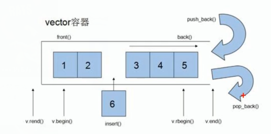
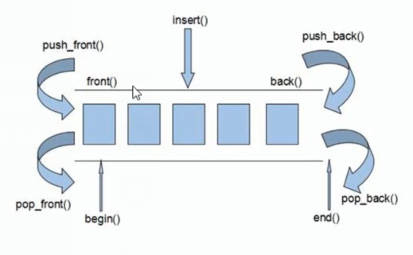
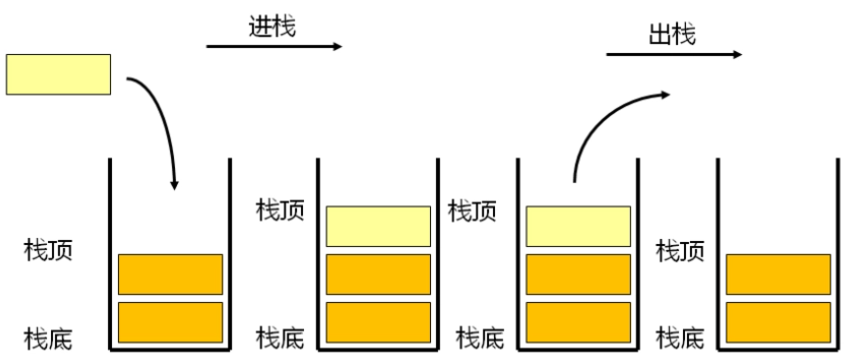
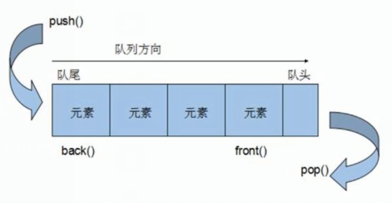
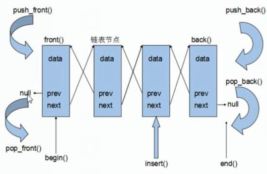

# 2.STL 初识

## 2.1 STL的诞生

- 长久以来，软件界一直希望建立一种可重复利用的东西
- C++的**面向对象**和**泛型编程**思想，目的就是复用性的提升
- 大多情况下，数据结构和算法都未能有一套标准，导致被迫从事大量重复工作
- 为了建立数据结构和算法的一套标准，诞生了STL

## 2.2 STL基本概念

- STL(Standard Template Library，**标准模板库**)
- STL从广义上分为：**容器(container)、算法(algorithm)、迭代器(iterator)**
- **容器**和**算法**之间通过**迭代器**进行无缝连接
- STL几乎所有的代码都采用了模板类或者模板函数

## 2.3 STL六大组件

STL大体分为六大部件，分别是**容器、算法、迭代器、仿函数、适配器(配接器)、空间配置器**

1. 容器：各种数据结构，如vector,list,deque,set,map等，用来存放数据
2. 算法：各种常用的算法，如sort,find,copy,for_each等
3. 迭代器：扮演了容器与算法之间的胶合剂
4. 仿函数：行为类似函数，可作为算法的某种策略
5. 适配器：一种用来修饰容器或者仿函数或迭代器接口的东西
6. 空间配置器：负责空间的配置与管理

## 2.4 STL中容器、算法、迭代器

**容器：置物之所也**

STL容器就是将运用**最广泛的一些数据结构**实现出来

常用的数据结构：数组，链表，树，队列，集合，映射表等

这些容器分为**序列式容器**和**关联式容器**两种：

> **序列容器**：强调值得排序，序列容器中的每个元素均有固定的位置
>
> **关联容器**：二叉树结构，各元素之间没有严格的物理上的顺序关系

**算法：问题之解法也**

有限的步骤，解决逻辑或数学上的问题，这一门学科就做算法(Algorithm)

算法分为：**质变算法**和**非质变算法**

质变算法：是指运算过程中会更改区间内的元素的内容。例如拷贝、替换、删除等等

非质变算法：是指运算过程中不会更改区间内的元素内容，例如查找、计数、遍历、寻找极值等等

**迭代器：容器和算法之间的粘合剂**

提供一种方法，使之能够依序寻访某个容器所含的各个元素，而又无需暴露该容器的内部表示方法。

每个容器都有自己专属的迭代器

迭代器使用非常类似于指针

迭代器种类：

| 种类           | 功能                                                           | 支持运算                                             |
| -------------- | -------------------------------------------------------------- | ---------------------------------------------------- |
| 输入迭代器     | 对数据的只读访问                                               | 只读。支持 `++, ==, !=`                            |
| 输出迭代器     | 对数据的只写访问                                               | 只写，支持 `++`                                    |
| 前向迭代器     | 读写操作，并能向前推进迭代器                                   | 读写，支持 `++, ==, !=`                            |
| 双向迭代器     | 读写操作，并能向前和向后操作                                   | 读写，支持 `++, --`                                |
| 随机访问迭代器 | 读写操作，可以以跳跃的方式访问任意数据，<br />功能更强的迭代器 | 读写，支持 `++, --, [n]`<br />`-n, <, <=, >, >=` |

常用的容器中迭代器种类为双向迭代器，和随机访问迭代器

## 2.5 容器算法迭代器初识

STL中最常用的容器为 `vector`，可以了解为数组

### 2.5.1 vector存放数据

容器：`vector`

算法：`for_each`

迭代器：`vector<int>::iterator`

```cpp
#include <iostream>
#include <string>
#include <vector>
#include <algorithm>

using namespace std;

// vector容器

class Person{
public:
    Person() = default;
    Person(const string &name, const int &age) : Name(name), Age(age) {}

    string Name;
    int Age;
};

void test01(){
    vector<Person> v;
    Person p1("A", 20), p2("B", 26), p3("C", 30);
    v.push_back(p1);
    v.push_back(p2);
    v.push_back(p3);

    // 遍历容器中的数据
    for(vector<Person>::iterator it=v.begin(); it!=v.end(); ++it){
        cout << "姓名：" << it->Name << " 年龄：" << it->Age << endl;
    }
}

void printVec(int val){
    cout << val << endl;
}

int main()
{
    // 创建一个vector容器，数组
    vector<int> v1;

    // 向容器中插入数据
    v1.push_back(10);
    v1.push_back(20);
    v1.push_back(30);
    v1.push_back(40);

    // 通过迭代器访问容器中的数据
    // vector<int>::iterator it = v1.begin();  // 起始迭代器，指向容器中第一个元素

    // 第一种遍历方式
    // while(it != v1.end()){  // v1.end()返回尾后迭代器，指向最后一个元素的下一个位置
    //     cout << *it << endl;
    //     ++it;
    // }

    // 第二种遍历
    // for(vector<int>::iterator it=v1.begin(); it!=v1.end(); ++it){
    //     cout << *it << endl;
    // }

    // 第三种遍历方式，利用STL提供的遍历算法
    for_each(v1.begin(), v1.end(), printVec);

    // vector存放自定义数据类型
    test01();

    return 0;
}
```

### 2.5.2 Vector容器嵌套容器

```cpp
#include <iostream>
#include <string>
#include <algorithm>
#include <vector>

using namespace std;

void test01(){
    vector<vector<int>> v;
    // 创建小容器
    vector<int> v1, v2, v3, v4, v5;
    for(int i=0; i<5; ++i){
        v1.push_back(i+1);
        v2.push_back(i+2);
        v3.push_back(i+3);
        v4.push_back(i+4);
        v5.push_back(i+5);
    }
    // 将小容器插入到大容器中
    v.push_back(v1);
    v.push_back(v2);
    v.push_back(v3);
    v.push_back(v4);
    v.push_back(v5);

    // 通过大容器，把所有容器遍历一遍
    for(vector<vector<int>>::iterator it=v.begin(); it!=v.end(); ++it){
        auto it1 = it->begin(); // vector<int>::iterator
        while(it1 != it->end()){
            cout << *it1 << " ";
            ++it1;
        }
        cout << endl;
    }
}

int main()
{
    test01();
/*
1 2 3 4 5
2 3 4 5 6
3 4 5 6 7
4 5 6 7 8
5 6 7 8 9
*/
    return 0;
}
```

### 3.1 string容器

### 3.1.1 string基本概念

**本质：**

- `string`是C++风格的字符串，本质上是一个类

**`string`和 `char *`的区别：**

- `char *`是一个指针
- `string`是一个类，类内部封装了 `char *`，管理这个字符串，是一个 `char *`型的容器

**特点：**

- `string`类内部封装了很多成员方法
- 例如：查找 `find`，拷贝 `copy`，删除 `delete`，替换 `replace`，插入 `insert`
- `string`管理 `char *`所分配的内存，不用担心复制越界和取值越界等，由类内部进行负责

### 3.1.2 string构造函数

| 构造函数原型                  |                                          |
| ----------------------------- | ---------------------------------------- |
| `string()`                  | 创建一个空的字符串，例如：string std;    |
| `string(const char *s)`     | 使用字符串s初始化                        |
| `string(const string &str)` | 使用一个string对象初始化另一个string对象 |
| `string(int n, char c)`     | 使用n个字符c初始化                       |

```cpp
void test01(){
    string s1;  // 空字符串
    const char *str = "hello";
    string s2(str); // 使用C风格字符串构造
    cout << "s2 = " << s2 << endl;  // hello
    string s3(s2);  // 拷贝构造
    string s4(5, 'h');  // 初始化为5个h
    cout << "s4 = " << s4 << endl;  // hhhhh
}
```

### 3.1.3 string赋值操作

| 赋值的函数原型                            |                                        |
| ----------------------------------------- | -------------------------------------- |
| `string& operator=(const char *s);`     | `char *`类型字符串赋值给当前的字符串 |
| `string& operator=(const string &s);`   | 把字符串s赋值给当前字符串              |
| `string& operator=(char c);`            | 字符赋值给当前字符串                   |
| `string& assign(const char *s);`        | 把字符串s赋值给当前的字符串            |
| `string& assign(const char *s, int n);` | 把字符串s的前n个字符赋值给当前的字符串 |
| `string& assign(const string &s);`      | 把字符串s赋值给当前字符串              |
| `string& assign(int n, char c);`        | 用n个字符c赋值给当前字符串             |

```cpp
void test02(){  // string赋值操作
  
    string str1, str2, str3, str4, str5, str6, str7;
  
    str1 = "hello world";
    cout << "str1 = " << str1 << endl;  // hello world
  
    str2 = str1;
  
    str3 = 'a';
    cout << "str3 = " << str3 << endl;  // a
  
    str4.assign("hello C++");
    cout << "str4 = " << str4 << endl;  // hello C++
  
    str5.assign("hello C++", 2);
    cout << "str5 = " << str5 << endl;  // he
  
    str6.assign(str5);  // he
  
    str7.assign(3, 'w');
    cout << "str7 = " << str7 << endl;  // www
}
```

### 3.1.4 string字符串拼接

| 字符串拼接                                          | 实现在字符串末尾拼接字符串                  |
| --------------------------------------------------- | ------------------------------------------- |
| `string& operator+=(const char *str)`             | 重载 `+=`操作符                           |
| `string& operator+=(const char c)`                | 重载 `+=`操作符                           |
| `string& operator+=(const string &str)`           | 重载 `+=`操作符                           |
| `string& append(const char *s)`                   | 把字符串s连接到当前字符串结尾               |
| `string& append(char char *s, int n)`             | 把字符串s的前n个字符连接到当前字符串结尾    |
| `string& append(const string &s)`                 | 同 `operator+=(const string &s)`          |
| `string& append(const string &s, int pos, int n)` | 字符串s中从pos开始的n个字符连接到字符串结尾 |

```cpp
void test03(){  // 字符串拼接
  
    // +=
    string str1 = "hello", str2 = "Lee";
    str1 += ",world";
    cout << str1 << endl;   // hello,world
    str1 += '.';
    cout << str1 << endl;   // hello,world.
    str1 += str2;
    cout << str1 << endl;   // hello,world.Lee

    // append
    string str3 = "I", str4 = ",Hon";
    str3.append(" love ");
    cout << str3 << endl;   // I love
    str3.append("China,abd", 5);    // 拼接前5个字符
    cout << str3 << endl;   // I love China
    str3.append(str4);
    cout << str3 << endl;   // I love China,Hon
    str3.append(str4, 1,2); // 从位置1截取2个字符
    cout << str3 << endl;   // I love China,HonHo
}
```

### 3.1.5 string查找和替换

功能描述：

- 查找：查找指定字符串是否存在
- 替换：在指定的位置替换字符串

| 查找和替换                                              | 功能描述                             |
| ------------------------------------------------------- | ------------------------------------ |
| `int find(const string &str, int pos = 0) const;`     | 查找str第一次出现位置，从pos开始查找 |
| `int find(const char *s, int pos = 0) const;`         | 查找s第一次出现位置，从pos开始查找   |
| `int find(const char *s, int pos, int n) const;`      | 从pos位置查找s的前n个字符第一次位置  |
| `int find(const char c, int pos = 0) const;`          | 查找字符c第一次出现位置              |
| `int rfind(const string &str, int pos = npos) const;` | 查找str最后一次位置，从pos开始查找   |
| `int rfind(const char *s, int pos = npos) const;`     | 查找s最后一次位置，从pos开始查找     |
| `int rfind(const char *s, int pos, int n) const;`     | 从pos查找s的前n个字符最后一次位置    |
| `int rfind(const char c, int pos = 0) const;`         | 查找字符c最后一次出现位置            |
| `string& replace(int pos, int n, const string &str);` | 替换从pos开始n个字符为字符串str      |
| `string& replace(int pos, int n, const char *s);`     | 替换从pos开始n个字符为字符串st       |

```cpp
void test04(){  // string查找和替换
    // find
    string str1 = "abcdefgde";
    int pos = str1.find("de");
    if(pos == -1){
        cout << "Not Found!" << endl;
    }else{
        cout << "pos = " << pos << endl;    // 3
    }
  
    // rfind：从右往左查找，find从左往右查找
    pos = str1.rfind("de");
    cout << "pos = " << pos << endl;    // 7

    // replace
    string str2 = "hello, world";
    str2.replace(1, 3, "Test"); // 从下标1开始将3个字符替换为 Test
    cout << str2 << endl;   // hTesto, world
}
```

总结：

- find查找从左往右，rfind从右往左
- find找到字符串后返回查找的第一个字符位置，找不到返回-1
- replace在替换时，要指定从哪个位置开始，多少个字符，替换成什么样的字符串

### 3.1.6 string字符串比较

字符串之间的比较是按照字符的ASCII码进行对比

- `==`返回 0
- `>`返回 1
- `<`返回 -1

| 字符串比较                              |               |
| --------------------------------------- | ------------- |
| `int compare(const string &s) const;` | 与字符串s比较 |
| `int compare(const char *s) const;`   | 与字符串s比较 |

```cpp
void test05(){  // 字符串比较
    string str1 = "hello", str2 = "hello";
    if(str1.compare(str2) == 0){
        cout << "str1 == str2" << endl;
    }else if(str1.compare(str2) > 0){
        cout << "str1 > str2" << endl;
    }else{
        cout << "str1 < str2" << endl;
    }
}
```

总结：字符串对比主要是用于比较两个字符串是否相等，判断谁打谁小的意义并不是很大

### 3.1.7 string字符存取

`string`中单个字符存取方式有两种：

- `char& operator[](int n);`	// 通过[]方式取字符
- `char& at(int n);`	// 通过at方式获取字符

```cpp
void test06(){  // string字符存取
    string str = "hello";
    // 通过[]访问单个字符
    for(int i=0; i<str.size(); ++i){
        cout << str[i];
    }
    cout << endl;
    // 通过at方式访问单个字符
    for(int i=0; i<str.size(); ++i){
        cout << str.at(i) << " ";
    }
    cout << endl;

    // 修改单个字符
    str[0] = 'w';
    str.at(1) = 'i';
    cout << str << endl;    // willo
}
```

总结：string字符串中单个字符存取有两种方式，利用 `[]`或 `at`

### 3.1.8 string的插入和删除

| 插入和删除                                      | 对string字符串进行插入和删除字符操作 |
| ----------------------------------------------- | ------------------------------------ |
| `string& insert(int pos, const char *s);`     | 插入字符串                           |
| `string& insert(int pos, const string &str);` | 插入字符串                           |
| `string& insert(int pos, int n, char c);`     | 在指定位置插入n个字符 `c`          |
| `string& erase(int pos, int n = pos);`        | 删除从Pos开始的n个字符               |

```cpp
void test07(){  // 字符串插入和删除
    string str = "hello";
    // 插入
    str.insert(1, "111");
    cout << str << endl;    // h111ello
    str.insert(1, 2, 'c');
    cout << str << endl;    // hcc111ello
    // 删除
    str.erase(1, 5);    // hello
    cout << str << endl;
}
```

总结：插入和删除的起始下标都是从0开始的

### 3.1.9 string子串

| 函数原型                                        | 从字符串中获取想要的子串           |
| ----------------------------------------------- | ---------------------------------- |
| `string substr(int pos=0, int n=npos) const;` | 返回由pos开始的n个字符组成的字符串 |

```cpp
void test08(){  // string子串
    string str = "abcdef";
    string subStr = str.substr(0, 3);   // 从0开始的3个字符
    cout << subStr << endl; // abc

    // 从邮件地址中获取信息
    string address = "2295509496@qq.com";
    string qq = address.substr(0, address.find('@'));
    cout << "qq = " << qq << endl;  // 2295509496
}
```

总结：灵活地运用求子串功能，可以在实际开发中获取有效的信息

## 3.2 vector容器

### 3.2.1 vector基本概念

**功能：**

- vector数据结构**和数组非常相似**，也成为**单端数组**

**vector与普通数组区别：**

- 不同之处在于数组是静态空间，而vector可以**动态扩展**

**动态扩展：**

- 并不是在原空间之后须接新空间，而是找更大的内存空间，然后将原数据拷贝到新空间，释放原空间



- vector容器的迭代器是支持随机访问的迭代器

### 3.2.2 vector构造函数

| 函数原型                        | 创建vector容器                                 |
| ------------------------------- | ---------------------------------------------- |
| `vector<T> v;`                | 采用模板实现类实现，默认构造函数               |
| `vector(v.begin(), v.end());` | 将 `v[begin(), end())`区间中的元素拷贝给本身 |
| `vector(n, elem);`            | 构造函数将n个elem拷贝给本身                    |
| `vector(const vector &vec);`  | 拷贝构造函数                                   |

```cpp
template<class T>
void printVec(const vector<T> &vec){    // vector打印函数
    for(auto it=vec.begin(); it!=vec.end(); ++it){
        cout << *it << " ";
    }
    cout << endl;
}

void test01(){  // vector容器构造

    vector<int> v1; // 默认构造函数
    for(int i=0; i<10; ++i){
        v1.push_back(i);
    }
    printVec(v1);   // 0 1 2 3 4 5 6 7 8 9

    vector<int> v2(v1.begin(), v1.end());   // 通过区间方式进行构造
    printVec(v2);

    vector<int> v3(3, 6);   // 通过n个elem方式构造
    printVec(v3);   // 666

    vector<int> v4(v3); // 拷贝构造
    printVec(v4);   // 666
}
```

### 3.2.3 vector赋值操作

| 函数原型                                  | 给vector容器进行赋值                        |
| ----------------------------------------- | ------------------------------------------- |
| `vector& operator=(const vector &vec);` | 重载等号操作符                              |
| `assign(beg, end);`                     | 将 `[beg, end)`区间中的数据拷贝赋值给本身 |
| `assign(n, elem);`                      | 将n个elem拷贝赋值给本身                     |

```cpp
void test02(){  // vector赋值操作

    vector<int> v1;
    for(int i=0; i<6; ++i){
        v1.push_back(i);
    }
    printVec(v1);   // 0 1 2 3 4 5

    vector<int> v2 = v1;    // =赋值
    printVec(v2);

    vector<int> v3, v4;
    v3.assign(v1.begin(), v1.end());
    printVec(v3);

    v4.assign(3, 6);
    printVec(v4);   // 666
}
```

总结：vector赋值方式比较简单，使用 `operator=`，或者 `assign`都可以

### 3.2.4 vector容量和大小

| 函数原型                   | 对vector容器的容量和大小操作                                                                                    |
| -------------------------- | --------------------------------------------------------------------------------------------------------------- |
| `empty();`               | 判断容器是否为空                                                                                                |
| `capacity();`            | 容器的容量                                                                                                      |
| `size();`                | 返回容器中元素的个数                                                                                            |
| `resize(int num);`       | 重新制定容器的长度为num，若容器变长，则以默认值填充新位置。<br />如果容器变短，则末尾超出容器长度的元素被删除。 |
| `resize(int num, elem);` | 重新制定容器的长度为num，若容器边长，则以elem值填充新位置。<br />如果容器变短，则末尾超出容器长度的元素被删除。 |

```cpp
void test03(){  // vector容量和大小
    vector<int> v1 = {1,9,4,9,2,0,2,3};
    printVec(v1);
    if(!v1.empty()){
        cout << "v1非空" << endl;
    }else{
        cout << "vector is empty!" << endl;
    }
    // vector的容量始终大于等于其大小
    cout << "vector的大小是: " << v1.size() << endl;    // 8
    cout << "vector的容量是: " << v1.capacity() << endl;    // 8
    // 重新指定大小
    v1.resize(4);   // 超出部分会被删除掉
    printVec(v1);   // 1 9 4 9
    v1.resize(8, 1);    // v1.resize(8);    // 1 9 4 9 0 0 0 0 (默认填充值为0)
    printVec(v1);   // 1 9 4 9 1 1 1 1
}
```

### 3.2.5 vector插入和删除

| 函数原型                                             | 对vector容器进行插入和删除操作      |
| ---------------------------------------------------- | ----------------------------------- |
| `push_back(ele);`                                  | 在尾部插入元素ele                   |
| `pop_back();`                                      | 删除最后一个元素                    |
| `insert(const_iterator pos, ele);`                 | 在迭代器指向的位置pos插入元素ele    |
| `insert(const_iterator pos, int count, ele);`      | 迭代器指向位置pos插入count个元素ele |
| `erase(const iterator pos);`                       | 删除迭代器指向的元素                |
| `erase(const_iterator start, const_iterator end);` | 删除迭代器从start到end之间的元素    |
| `clear();`                                         | 删除容器中所有元素                  |

```cpp
void test04(){  // vector插入和删除
    vector<int> v1{1,9,4,9,1,9,7};
  
    // 尾插
    v1.push_back(8);
    v1.push_back(6);
    printVec(v1);   // 1 9 4 9 1 9 7 8 6
  
    // 尾删
    v1.pop_back();  // 1 9 4 9 1 9 7 8
  
    // 插入
    v1.insert(v1.begin(), 100);
    printVec(v1);   // 100 1 9 4 9 1 9 7 8
    v1.insert(v1.begin(), 3, 6);
    printVec(v1);   // 6 6 6 100 1 9 4 9 1 9 7 8
  
    // 删除
    v1.erase(v1.begin());
    printVec(v1);   // 6 6 100 1 9 4 9 1 9 7 8
    v1.erase(v1.begin(), v1.begin()+3);
    printVec(v1);   // 1 9 4 9 1 9 7 8
    v1.clear(); // 清空
}
```

### 3.2.6 vector数据存取

| 函数原型         | 对vector中的数据的存取操作 |
| ---------------- | -------------------------- |
| `at(int idx);` | 返回索引idx所指的数据      |
| `operator[];`  | 同上                       |
| `front();`     | 返回容器中第一个数据元素   |
| `back();`      | 返回容器中最后一个数据元素 |

```cpp
void test05(){  // vector容器的数据存取
    vector<int> v1{2,0,0,1};
    for(int i=0; i<v1.size(); ++i){
        // cout << v1[i] << " ";
        cout << v1.at(i) << " ";    // 2 0 0 1
    }
    cout << endl;
    cout << "v1.front() = " << v1.front() << endl;  // 2
    cout << "v1.back() = " << v1.back() << endl;    // 1
}
```

### 3.2.7 vector互换空间

- 实现两个容器内元素进行互换
- `swap(vec);`	// 将vec与本身的元素互换

```cpp
void test05(){  // vector容器的数据存取
    vector<int> v1{2,0,0,1};
    for(int i=0; i<v1.size(); ++i){
        // cout << v1[i] << " ";
        cout << v1.at(i) << " ";    // 2 0 0 1
    }
    cout << endl;
    cout << "v1.front() = " << v1.front() << endl;  // 2
    cout << "v1.back() = " << v1.back() << endl;    // 1
}

void test06(){  // vector互换容器
    vector<int> v1{2,0,1,9}, v2{2,0,2,3};
    v1.swap(v2);    // 将两个容器中的元素互换，即v1和v2中元素互换
    printVec(v1);   // 2 0 2 3
    printVec(v2);   // 2 0 1 9

    // 巧用swap可以收缩内存空间
    vector<int> v3;
    for(int i=0; i<1000; ++i){
        v3.push_back(i);
    }
    cout << "v3.capacity() = " << v3.capacity() << endl;    // 1024
    cout << "v3.size() = " << v3.size() << endl;    // 1000
    v3.resize(6);
    cout << "v3.capacity() = " << v3.capacity() << endl;    // 1024
    cout << "v3.size() = " << v3.size() << endl;    // 6
    // 
    cout << "使用swap收缩内存空间: " << endl;
    vector<int>(v3).swap(v3);   // vector<int>(v3); // 匿名对象
    cout << "v3.capacity() = " << v3.capacity() << endl;    // 6
    cout << "v3.size() = " << v3.size() << endl;    // 6
}
```

### 3.2.8 vector预留空间

- 减少vector在动态扩展容量时的扩展次数
- `reserve(int len);`	// 容器预留len个元素长度，预留位置不初始化，元素不可访问

```cpp
void test07(){  // vector预留空间
    vector<int> v;
    int num = 0;    // 统计开辟次数
    int *p = 0;
    v.reserve(100000); // 预留空间 -> 1
    for(int i=0; i<100000; ++i){
        v.push_back(i);
        if(p != &v[0]){
            p = &v[0];  // 当开辟新内存空间时，容器首地址也会发生改变
            ++num;
        }
    }
    cout << "一共开辟了 " << num << " 次内存空间！" << endl;    // 1    不预留空间 -> 18
  
}
```

## 3.3 deque容器

### 3.3.1 deque容器基本概念

功能：**双端数组**，可以对头端进行插入删除操作

**`deque`和 `vector`区别：**

- vector对于头部的插入和删除效率低，数据量越大，效率越低
- deque相对而言，对头部的插入删除速度比vector快
- vector访问元素时的速度会比deque快，这和两者内部实现有关



deque内部工作原理：

- deque内部有个**中控器**，维护每段缓冲区中的内容，缓冲区中存放真实数据
- 中控器维护的是每个缓冲区的地址，使得使用deque时像一片连续的内存空间
- deque容器的迭代器也是**支持随机访问**的

### 3.3.2 deque构造函数

| 函数原型                     | deque容器构造                                   |
| ---------------------------- | ----------------------------------------------- |
| `deque<T> deq;`            | 默认构造函数                                    |
| `deque(beg, end);`         | 构造函数将 `[beg, end)`区间中的元素拷贝给本身 |
| `deque(n, elem);`          | 构造函数将n个elem拷贝给本身                     |
| `deque(const deque &deq);` | 拷贝构造函数                                    |

```cpp
template<class T>
void printDeq(const deque<T> &deq){
    for(auto it=deq.cbegin(); it!=deq.cend(); ++it){
        cout << *it << " ";
    }
    cout << endl;
}

void test01(){  // deque容器构造

    deque<int> d1;
    for(int i=0; i<7; ++i){
        d1.push_back(i);
    }
    printDeq(d1);

    deque<int> d2(d1.begin(), d1.end());
    deque<int> d3(3, 6);    // 6 6 6
    deque<int> d4(d3);  // 拷贝构造

}
```

**总结：**deque容器和vector容器的构造方式几乎一致，灵活使用即可

### 3.3.3 deque赋值操作

| 函数原型                                | 给deque容器进行赋值                         |
| --------------------------------------- | ------------------------------------------- |
| `deque& operator=(const deque &deq);` | 重载等号操作符                              |
| `assign(beg, end);`                   | 将 `[beg, end)`区间中的数据拷贝赋值给本身 |
| `assign(n, elem);`                    | 将n个elem拷贝赋值给本身                     |

```cpp
void test02(){  // deque赋值操作
    deque<int> d1;
    for(int i=0; i<7; ++i){
        d1.push_back(i);
    }

    // operator= 赋值
    deque<int> d2;
    d2 = d1;    // 0 1 2 3 4 5 6
  
    // assign 赋值
    deque<int> d3;
    d3.assign(d2.begin(), d2.end());    // 0 1 2 3 4 5 6
  
    deque<int> d4;
    d4.assign(3, 6);    // 6 6 6
}
```

### 3.3.4 deque大小操作

| 函数原型                     | 对deque容器的大小进行操作                                                                                       |
| ---------------------------- | --------------------------------------------------------------------------------------------------------------- |
| `deque.empty();`           | 判断容器是否为空                                                                                                |
| `deque.size();`            | 返回容器中元素的个数                                                                                            |
| `deque.resize(num);`       | 重新指定容器的长度为num，若容器变长，则以默认值填充新位置。<br />如果容器变短，则末尾超出容器长度的元素被删除。 |
| `deque.resize(num, elem);` | 重新指定容器的长度为num，若容器变长，则以elem值填充新位置。<br />如果容器变短，则末尾超出容器长度的元素被删除   |

```cpp
void test03(){  // deque大小操作 
    deque<int> d1 = {2,0,2,3,2,4,6,0,3,3};
    printDeq(d1);
    if(d1.empty()){
        cout << "d1 is empty!" << endl;
    }else{
        cout << "Not empty." << endl;
    }
    cout << "d1.size() = " << d1.size() << endl;    // 10
    d1.resize(4);
    printDeq(d1);   // 2 0 2 3
    d1.resize(6, 3);  
    printDeq(d1);   // 2 0 2 3 3 3
}
```

总结：

- deque没有容量的概念
- 判断是否为空 `empty`
- 返回元素个数 `size`
- 重新指定个数 `resize`

### 3.3.5 deque插入和删除

| 函数原型              | 两端插入               |
| --------------------- | ---------------------- |
| `push_back(elem);`  | 在容器尾部添加一个数据 |
| `push_front(elem);` | 在容器头部插入一个数据 |
| `pop_bakc();`       | 删除容器最后一个数据   |
| `pop_front();`      | 删除容器第一个数据     |

| 函数原型                   | 指定位置操作                                        |
| -------------------------- | --------------------------------------------------- |
| `insert(pos, elem);`     | 在pos位置插入一个elem元素的拷贝，返回新数据的位置   |
| `insert(pos, n, elem);`  | 在pos位置插入n个elem数据，无返回值                  |
| `insert(pos, beg, end);` | 在pos位置插入 `[beg, end)`区间的数据，无返回值    |
| `clear();`               | 清空容器的所有数据                                  |
| `erase(beg, end);`       | 删除 `[beg, end)`区间的数据，返回下一个数据的位置 |
| `erase(pos);`            | 删除pos位置的数据，返回下一个数据的位置             |

```cpp
void test04(){  // deque容器插入和删除操作
  
    // 在头尾插入和删除元素
    deque<int> d1;
    // 尾插
    d1.push_back(6);
    d1.push_back(7);
    printDeq(d1);   // 6 7
    // 头插
    d1.push_front(5);
    d1.push_front(3);
    printDeq(d1);   // 3 5 6 7
    // 尾删
    d1.pop_back();
    // 头删
    d1.pop_front();
    printDeq(d1);   // 5 6

    // 在指定位置删除元素
    deque<int> d2 = {4,7,6,4,1,1};
    auto it = d2.begin();
    it = d2.erase(it+1);    // 返回删除元素后面的一个元素
    printDeq(d2);   // 4 (7) 6 4 1 1
    d2.erase(it, d2.end());
    printDeq(d2);   // 4

    // 插入
    deque<int> d3 = {4,3};
    d3.insert(d3.end(), 2, 9);  // 在d3.end()前插入2个9
    printDeq(d3);   // 4 3 9 9
    d3.insert(d3.begin(), d1.begin(), d1.end());    // 按照区间进行插入
    printDeq(d3);   // 5 6 4 3 9 9

    d3.clear(); // 清空
}
```

### 3.3.6 deque数据存取

| 函数原型         | 对deque中的数据的存取操作  |
| ---------------- | -------------------------- |
| `at(int idx);` | 返回索引idx所指的数据      |
| `operator[];`  | 返回索引idx所指的数据      |
| `front();`     | 返回容器中的第一个数据元素 |
| `back();`      | 返回容器中最后一个数据元素 |

```cpp
void test05(){  // deque数据存取
    deque<int> d = {2,0,2,4,2,7};
    for(int i=0; i<d.size(); ++i){
        // cout << d.at(i) << " "; // 2 0 2 4 2 7
        cout << d[i] << " ";    // 同上
    }
    cout << endl;
    cout << "d.front() = " << d.front() << endl;    // 2
    cout << "d.back() = " << d.back() << endl;  // 7
}
```

### 3.3.7 deque排序

| 算法                                  | 利用算法实现对deque容器进行排序 |
| ------------------------------------- | ------------------------------- |
| `sort(iterator beg, iterator end);` | 对beg和end区间内的元素进行排序  |

```cpp
void test06(){  // deque排序
    deque<int> d = {0,1,2,3,50,6,4};
    d.push_back(3);
    d.push_front(12);
    printDeq(d);    // 12 0 1 2 3 50 6 4 3
    // 对于支持随机访问的迭代器的容器，都可以利用sort算法直接对其进行排序
    sort(d.begin(), d.end());   // 排序：默认排序规则，从小到大升序
    printDeq(d);    // 0 1 2 3 3 4 6 12 50
}
```

## 3.4 案例-评委打分

> 有5名选手：选手ABCDE，10个评委分别对每一名选手打分，去除最高分和最低分，然后取平均分。

1. 创建五名选手，放到vector中
2. 遍历vector容器，取出来每一个选手，执行for循环，可以把10个评委打分存到deque容器中
3. sort算法对deque容器中分数排序，去除最高和最低分
4. deque容器遍历一遍，累加总分
5. 获取平均分

```cpp
#include <iostream>
#include <string>
#include <vector>
#include <deque>
#include <algorithm>

using namespace std;

// 案例-评委打分

class Person{
public:
    Person() = default;
    Person(const string &name) : Name(name) {}
    Person(const string &name, const int &s) : Name(name), Score(s) {}
    void getScore(const int &s){    // 评委打分
        this->Score.push_back(s);
    }
    void getAvg(){
        double avg = 0.0;
        int i;
        for(i=0; i<Score.size(); ++i){
            avg += double(Score[i]);
        }
        this->Avg_Price =  avg / i;
    }

    string Name;
    deque<int> Score;
    double Avg_Price;
};

bool compare(const Person &p1, const Person &p2){
    return p1.Avg_Price < p2.Avg_Price; // 按平均分从小到大排序
}

int main()
{
    // 1.创建五名选手
    Person p1("Tom"), p2("David"), p3("Yi"), p4("Charlie"), p5("Bruce");
    vector<Person> vecP = {p1, p2, p3, p4, p5};
    for(auto it=vecP.begin(); it!=vecP.end(); ++it){
        // 2.给五名选手打分
        for(int i=0; i<10; ++i){
            int x;
            cin >> x;
            it->getScore(x);
        }
        // 3.去除最高分、最低分，获取评分值
        sort(it->Score.begin(), it->Score.end());
        it->Score.pop_front();
        it->Score.pop_back();
        it->getAvg();
    }
    // 4.按照平均分排序vector数组
    sort(vecP.begin(), vecP.end(), compare);
    for(int i=0; i<vecP.size(); ++i){
        cout << "Name: " << vecP[i].Name
        << "\tAverage_Score: " << vecP[i].Avg_Price << endl;
    }
    return 0;
}
```

## 3.5 stack容器

### 3.5.1 stack基本概念

**概念**：`stack`是一种**先进后出(First In Last Out, FILO)**的数据结构，只有一个出口。

- 栈中元素只有栈顶的元素才可以被外界使用，因此栈不允许有遍历行为
- 栈中进入数据称为 --- 入栈 `push`
- 栈中弹出数据称为 --- 出栈 `pop`



### 3.5.2 stack常用接口

| 函数原型                     | 构造函数                                     |
| ---------------------------- | -------------------------------------------- |
| `stack<T> stk;`            | stack采用模板类实现，stack对象的默认构造形式 |
| `stack(const stack &stk);` | 拷贝构造函数                                 |

| 赋值操作                                |                |
| --------------------------------------- | -------------- |
| `stack& operator-(const stack &stk);` | 重载符号操作符 |

| 数据存取        |                      |
| --------------- | -------------------- |
| `push(elem);` | 向栈顶添加元素       |
| `pop();`      | 从栈顶移除第一个元素 |
| `top();`      | 返回栈顶元素         |

| 大小操作     |                  |
| ------------ | ---------------- |
| `empty();` | 判断堆栈是否为空 |
| `size();`  | 返回栈的大小     |

```cpp
void test01(){
    // 特点：先进后出的数据结构
    stack<int> stk;
    // 入栈
    stk.push(10);
    stk.push(20);
    stk.push(30);
    // 只要栈不为空，查看栈顶，并且执行栈操作
    while(!stk.empty()){
        // 查看栈顶元素
        cout << "栈顶元素：" << stk.top() << endl;  // 30 20 10
        // 出栈
        stk.pop();
    }
    cout << "栈的大小：" << stk.size() << endl; // 0
}
```

## 3.6 queue容器

### 3.6.1 queue基本概念

**概念**：Queue是一种**先进先出**(First In First Out, FIFO)的数据结构，它有两个出口



队列容器允许从一端新增元素，从另一端移除元素

队列中只有队头和队尾可以被外界使用，因此队列**不允许有遍历行为**

队列中进数据称为 --- **入队** `push`

队列中出数据称为 --- **出队** `pop`

### 3.6.2 queue常用接口

| 函数原型                     | 构造函数                                     |
| ---------------------------- | -------------------------------------------- |
| `queue<t> que;`            | queue采用模板类实现，queue对象的默认构造形式 |
| `queue(const queue &que);` | 拷贝构造函数                                 |

| 赋值操作                                |                |
| --------------------------------------- | -------------- |
| `queue& operator=(const queue &que);` | 重载等号操作符 |

| 数据存取        |                      |
| --------------- | -------------------- |
| `push(elem);` | 往队尾添加元素       |
| `pop();`      | 从队头移除第一个元素 |
| `back();`     | 返回最后一个元素     |
| `front();`    | 返回第一个元素       |

| 大小操作     |                  |
| ------------ | ---------------- |
| `empty();` | 判断堆栈是否为空 |
| `size();`  | 返回栈的大小     |

```cpp
class Person{
public:
    Person(const string &name, const int &a) : Name(name), Age(a) {}
    string Name;
    int Age;
};

void test01(){
    // 创建队列
    queue<Person> q;
    // 准备数据
    Person p1("Tom", 25), p2("Bruce", 22), p3("Charlie", 27);
    // 入队
    q.push(p1);
    q.push(p2);
    q.push(p3);
    // 只要队列不为空，查看队头/尾，出队
    while(!q.empty()){
        // 查看队头
        cout << "队头元素 --- 姓名：" << q.front().Name << " 年龄：" << q.front().Age << endl;
        cout << "队尾元素 --- 姓名：" << q.back().Name << " 年龄：" << q.back().Age << endl;
        q.pop();
    }
    cout << "队列大小：" << q.size() << endl;   // 0
}
```

## 3.7 list容器

### 3.7.1 list基本概念

**功能**：将数据进行链式存储

**链表(list)**是一种物理存储单元上非连续的存储结构，数据元素的逻辑顺序是通过链表中的指针链表实现的

链表的组成：链表由一系列**结点**组成

结点的组成：一个是存储数据元素的**数据域**，另一个是存储下一个结点地址的**指针域**

STL中的链表是一个**双向循环链表**



由于链表的存储方式并不是连续的空间，因此链表list中的迭代器**只支持前移和后**移，属于**双向迭代器**

**list的优点：**

- 采用动态存储分配，不会造成内存浪费和溢出
- 链表执行插入和删除操作十分方便，修改指针即可，不需要移动大量元素

**list的缺点：**

- 链表灵活，但是空间(指针域)和时间(遍历)额外耗费较大

List有一个重要的性质，插入操作和删除操作都不会造成原有list迭代器的失效，这在vector是不成立的。

总结：STL中**list和vector是两个最常被使用的容器**，各有优缺点

### 3.7.2 list构造函数

| 函数原型                   | 创建list容器                                    |
| -------------------------- | ----------------------------------------------- |
| `list<T> lst;`           | list采用模板类实现，对象的默认构造形式          |
| `list(beg, end);`        | 构造函数将 `[beg, end)`区间中的元素拷贝给本身 |
| `list(n, elem);`         | 构造函数将n个elem拷贝给本身                     |
| `list(const list &lst);` | 拷贝构造函数                                    |

```cpp
template<class T>
void printList(const list<T> &lst){ // 打印list容器
    for(auto it = lst.cbegin(); it != lst.cend(); ++it){
        cout << *it << " ";
    }
    cout << endl;
}

void test01(){  // list构造
    list<int> l1;   // 默认构造
    l1.push_back(10);
    l1.push_back(20);
    l1.push_back(30);
    l1.push_back(40);
    printList(l1);  // 10 20 30 40
    list<int> l2(l1.begin(), l1.end()); // 区间构造
    list<int> l3(l2);   // 拷贝构造
    list<int> l4(3, 6); // 6 6 6
    printList(l4);
}
```

### 3.7.3 list赋值和交换

| 函数原型                              | 给list容器进行赋值，以及交换list容器        |
| ------------------------------------- | ------------------------------------------- |
| `assign(beg, end);`                 | 将 `[beg, end)`区间中的数据拷贝赋值给本身 |
| `assign(n, elem);`                  | 将n个elem拷贝赋值给本身                     |
| `list& operator=(const list &lst);` | 重载等号操作符                              |
| `swap(lst);`                        | 将lst与本身元素互换                         |

```cpp
void test02(){  // list赋值和交换
    // 赋值
    list<int> l1 = {2, 0, 2, 3}, l2, l3, l4, l5;
    printList(l1);  // 2 0 2 3
  
    l2 = l1;
    printList(l2);  // 2 0 2 3
  
    l3.assign(l2.begin(), l2.end());
    printList(l3);  // 2 0 2 3

    l4.assign(3, 6);
    printList(l4);  // 6 6 6

    // 交换
    l3.swap(l4);
    printList(l3);  // 6 6 6
    printList(l4);  // 2 0 2 3
}
```

### 3.7.4 list大小操作

| 函数原型               | 对list容器的大小进行操作                                                                                        |
| ---------------------- | --------------------------------------------------------------------------------------------------------------- |
| `size();`            | 返回容器中元素的个数                                                                                            |
| `empty();`           | 判断容器是否为空                                                                                                |
| `resize(num);`       | 重新指定容器的长度为num，若容器变长，则以默认值填充新位置。<br />如果容器变短，则末尾超出容器长度的元素被删除。 |
| `resize(num, elem);` | 重新指定容器的长度为num，若容器变长，则以elem值填充新位置。<br />如果容器变短，则末尾超出容器长度的元素被删除。 |

```cpp
void test03(){  // list大小操作
    list<int> l1 = {1,9,7,8};
    printList(l1);  // 1 9 7 8
    if(l1.empty()){
        cout << "l1 is empty!" << endl;
    }else{
        cout << "l1.size() = " << l1.size() << endl;
    }
    l1.resize(6, 3);    // 重新指定大小，链表长度增加时以3填充
    printList(l1);  // 1 9 7 8 3 3
    l1.resize(2);   // 链表长度缩小，超出范围的元素删除
    printList(l1);  // 1 9
}
```

### 3.7.5 list插入和删除

| 函数原型                   | 对list容器进行数据的插入和删除                      |
| -------------------------- | --------------------------------------------------- |
| `push_back(elem);`       | 在容器尾部加入一个元素                              |
| `pop_back();`            | 删除容器中最后一个元素                              |
| `push_front(elem);`      | 在容器开头插入一个元素                              |
| `pop_front();`           | 在容器开头移除第一个元素                            |
| `insert(pos, elem);`     | 在pos位置插入elem元素的拷贝，返回新数据的位置       |
| `insert(pos, n, elem);`  | 在pos位置插入n个elem数据，无返回值                  |
| `insert(pos, beg, end);` | 在pos位置插入 `[beg, end)`区间的数据，无返回值    |
| `clear();`               | 移除容器中所有数据                                  |
| `erase(beg, end);`       | 删除 `[beg, end)`区间的数据，返回下一个数据的位置 |
| `erase(pos);`            | 删除pos位置的数据，返回下一个数据的位置             |
| `remove(elem);`          | 删除容器中所有与elem值匹配的元素                    |

```cpp
void test04(){  // list插入和删除
    list<int> l;
    l.push_back(9); // 尾插
    l.push_back(8);
    l.push_back(5);
    l.push_front(6);    // 头插
    printList(l);   // 6 9 8 5

    l.pop_back();   // 尾删
    l.pop_front();  // 头删
    printList(l);   // 9 8

    auto it = l.begin();
    it = l.insert(++it, 10); // 返回新元素的位置
    printList(l);   // 9 10 8
    l.erase(++it);  // 删除8，返回下一个元素(end())的位置
    printList(l);   // 9 10

    list<int> l2 = {2,0,1,9};
    l2.insert(l2.begin(), l.begin(), l.end());
    printList(l2);  // 9 10 2 0 1 9

    // 按值移除
    l2.remove(9);
    printList(l2);  // 10 2 0 1

    // 清空
    l2.clear();
    // l2.erase(l2.begin(), l2.end());  // 效果同上
}
```

### 3.7.6 list数据存取

| 函数原型     | 对list容器中数据进行存取 |
| ------------ | ------------------------ |
| `front();` | 返回第一个元素           |
| `back();`  | 返回最后一个元素         |

```cpp
void test05(){  // list数据存取
    list<int> l = {6, 7, 8};
    // 不可以使用[]和at方式访问list容器中的元素
    // list本质是链表，不是用连续线性空间存储数据，迭代器也是支持随机访问的
    cout << "l.front() = " << l.front() << endl;    // 6
    cout << "l.back() = " << l.back() << endl;  // 8

    // 迭代器是不支持随机访问的
    auto it = l.begin();
    ++it;   // 正确：支持递增/减
    --it;   // 支持双向
    // it = it + 1;    // 错误：不支持随机访问
}
```

### 3.7.7 list反转和排序

| 函数原型       | 将容器中的元素反转，以及将容器中的数据进行排序 |
| -------------- | ---------------------------------------------- |
| `reverse();` | 反转链表                                       |
| `sort();`    | 链表排序                                       |

```cpp
bool compare(int a, int b){ // 排序规则
    // 降序，就让第一个数 > 第二个数
    return a > b;
}
void test06(){  // list反转和排序
    list<int> l1 = {4,7,6,9,2,3,5};
    printList(l1);  // 4 7 6 9 2 3 5
    l1.reverse();   // 反转
    printList(l1);  // 5 3 2 9 6 7 4
    // 所有不支持随机访问迭代器的容器，不支持标准算法
    // sort(l1.begin(), l2.end());  // 错误：不支持
    l1.sort();  // 成员函数，排序 默认规则从小到大
    printList(l1);  // 2 3 4 5 6 7 9
    l1.sort(compare);   // 降序排序
    printList(l1);  // 9 7 6 5 4 3 2
}
```

### 3.7.8 排序案例

案例描述：将Person自定义数据类型进行排序，Person中属性有姓名、年龄、身高

排序规则：按照年龄进行升序，如果年龄相同按照身高进行降序

```cpp
#include <iostream>
#include <string>
#include <list>

using namespace std;

// list排序案例

class Person{
    friend ostream& operator<<(ostream&, const Person&);
    friend bool compare(const Person&, const Person&);
public:
    Person() = default;
    Person(const string &name) : Name(name) {
        this->Age = 18;
        this->Height = 180;
    }
    Person(const string &name, const int &age, const int &height) : Name(name), Age(age), Height(height) {}
    Person(const Person &p){
        this->Age = p.Age;
        this->Height = p.Height;
    }

    Person& operator=(const Person &p){
        this->Age = p.Age;
        this->Height = p.Height;
        return *this;
    }

private:
    string Name;
    int Age;
    int Height;
};

ostream& operator<<(ostream &os, const Person &p){
    os << "name: " << p.Name << " age: " << p.Age << " height: " << p.Height;
    return os;
}

bool compare(const Person &p1, const Person &p2){
    // if(p1.Age == p2.Age){
    //     return p1.Height > p2.Height;
    // }else{
    //     return p1.Age > p2.Age;
    // }
    return (p1.Age!=p2.Age) ? p1.Age<p2.Age : p1.Height>p2.Height;
}

template<class T>
void printList(const list<T> &lst){
    for(auto it=lst.cbegin(); it!=lst.cend(); ++it){
        cout << *it << endl;
    }
}

int main()
{
    Person p1("Tom", 18, 175), p2("Charlie", 22, 180), p3("Bruce", 18, 170), p4("David", 30, 185), p5("Lee", 37, 172);
    list<Person> lst;
    lst.push_front(p1);
    lst.push_back(p2);
    lst.push_back(p3);
    lst.push_back(p4);
    lst.push_back(p5);

    cout << "排序前：" << endl;
    printList(lst);
    lst.sort(compare);
    cout << "排序后：" << endl;
    printList(lst);

    return 0;
}
```

总结：

- 对于自定义数据类型，必须指定排序规则，否则编译器不知道如何进行排序
- 高级排序只是在排序规则上再进行一次逻辑规则制定，并不复杂

## 3.8 set/multiset容器

### 3.8.1 set基本概念

**简介**：

- 所有元素都会再插入时**自动被排序**

**本质**：

- set/multiset属于**关联式容器**，底层结构是用**二叉树**实现

**set和multiset区别**：

- set不允许容器中有重复的元素
- multiset预序容器中有重复的元素

### 3.8.2 set构造和赋值

| 函数原型                | set容器构造  |
| ----------------------- | ------------ |
| `set<T> st;`          | 默认构造函数 |
| `set(const set &st);` | 拷贝构造函数 |

| 函数原型                           | 赋值           |
| ---------------------------------- | -------------- |
| `set& operator=(const set &st);` | 重载等号操作符 |

```cpp
template<class T>
void printSet(const set<T> &st){    // set容器打印输出
    for(auto it=st.cbegin(); it!=st.cend(); ++it){
        cout << *it << " ";
    }
    cout << endl;
}

void test01(){  // set容器构造和赋值
    set<int> s1;
    // 插入数据，只有insert方式
    s1.insert(10);
    s1.insert(10);
    s1.insert(10);
    s1.insert(20);
    s1.insert(30);
    // 遍历容器
    // set容器的特点：所有元素插入时会自动被排序
    // set容器不允许插入重复值
    printSet(s1);   // 10 20 30
    set<int> s2(s1);    // 拷贝构造
    set<int> s3 = s2;   // 赋值操作
}
```

### 3.8.3 set大小和交换

| 函数原型      | 统计set容器大小以及交换set容器 |
| ------------- | ------------------------------ |
| `size();`   | 返回容器中元素的数目           |
| `empty();`  | 判断容器是否为空               |
| `swap(st);` | 交换两个集合容器               |

```cpp
void test02(){  // set大小和交换
    set<int> s1;
    s1.insert(20);
    s1.insert(30);
    s1.insert(10);
    s1.insert(40);
    if(!s1.empty()){
        cout << "s1.size = " << s1.size() << endl;  // 4
        printSet(s1);   // 10 20 30 40
    }else{
        cout << "s1 is empty!" << endl;
    }

    set<int> s2 = {80, 50, 60};
    printSet(s2);   // 50 60 80

    // 交换
    s1.swap(s2);
    cout << "交换后：" << endl;
    printSet(s1);   // 50 60 80
    printSet(s2);   // 10 20 30 40
}
```

### 3.8.4 set插入和删除

| 函数原型             | set容器继续插入数据和删除数据                             |
| -------------------- | --------------------------------------------------------- |
| `insert(elem);`    | 在容器中插入元素                                          |
| `clear();`         | 清空所有元素                                              |
| `erase(pos);`      | 删除pos迭代器所指的元素，返回下一个元素的迭代器           |
| `erase(beg, end);` | 删除区间 `[beg, end)`中所有元素，返回下一个元素的迭代器 |
| `erase(elem);`     | 删除容器中值为elem的元素                                  |

```cpp
void test03(){
    set<int> s1 = {1,9,4,9,2,0,2,3};
    printSet(s1);   // 0 1 2 3 4 9

    // 删除
    s1.erase(s1.begin());
    printSet(s1);   // 1 2 3 4 9
    // 删除的重载版本
    s1.erase(2);
    printSet(s1);   // 1 3 4 9
    s1.clear(); // 清空
    // s1.erase(s1.begin(), s1.end()); // 同上
    printSet(s1);   // 
}
```

### 3.8.5 set查找和统计

| 函数原型        | 对set容器进行查找数据以及统计数据                                                   |
| --------------- | ----------------------------------------------------------------------------------- |
| `find(key);`  | 查找key是否存在，若存在，返回该键的元素的迭代器；<br />若不存在，返回 `set.end()` |
| `count(key);` | 统计key的元素个数                                                                   |

```cpp
void test04(){  // set查找和统计
    set<int> s1{4,7,6,4,1,1};
    // 查找
    auto iter = s1.find(6);
    if(iter!=s1.end()){
        cout << "find: " << *iter << endl;
    }else{
        cout << "Not Found!" << endl;
    }
    // 统计
    int num = s1.count(1);  // 对于set而言，统计的结果要么是0，要么是1
    cout << "num = " << num << endl;    // 1
}
```

总结：

- 查找 --- find(返回的是迭代器)
- 统计 --- count(对于set，结果为0或者1)

### 3.8.6 set和multiset区别

区别：

- set不可以插入重复数据，而multiset可以
- set插入数据的同时会返回插入结果，表示插入是否成功
- multiset不会检测数据，因此可以插入重复数据

```cpp
void test05(){  // set容器和multiset区别
    set<int> s1;
    pair<set<int>::iterator, bool> res = s1.insert(10);  // 返回类型 pair<iterator, bool>
    if(res.second){
        cout << "第一次插入成功" << endl;   // 成功
    }else{
        cout << "第一次插入失败" << endl;
    }
    res = s1.insert(10);
    if(res.second){
        cout << "第二次插入成功" << endl;
    }else{
        cout << "第二次插入失败" << endl;   // 失败
    }

    // multiset允许插入重复值
    multiset<int> ms;
    ms.insert(10);  // 返回类型 iterator
    ms.insert(10);
    ms.insert(6);
    ms.insert(7);
    for(auto it=ms.cbegin(); it!=ms.end(); ++it){
        cout << *it << " "; // 6 7 10 10
    }
    cout << endl;
}
```

总结：

- 如果不允许插入重复数据可以利用set
- 如果需要插入重复数据利用multiset

### 3.8.7 pair对组创建

功能描述：

- 成对出现的数据，利用对组可以返回两个数据

两种创建方式：

- `pair<type, type> p(val1, val2);`
- `pair<type, type> p = make_pair(val1, val2);`

```cpp
void test06(){  // pair对组创建
    // 第一种方式
    pair<string, int> p1("Tom", 20);
    cout << "姓名：" << p1.first << " 年龄：" << p1.second << endl;
    pair<string, int> p2 = make_pair("Jerry", 18);
    cout << "姓名：" << p2.first << " 年龄：" << p2.second << endl;
}
```

### 3.8.8 set容器排序

- `set`容器默认排序规则为从小到大，如果改变排序规则
- 利用**仿函数**，可以改变排序规则

```cpp
class MyCompare1{
public:
    bool operator()(const int &v1, const int &v2){
        return v1 > v2; // 从大到小
    }
};

class MyCompare2{
public:
    bool operator()(const Person &p1, const Person &p2){
        return p1.Age > p2.Age; // 按年龄从大到小
    }
};


void test07(){  // set容器排序
    set<int> s1;
    s1.insert(10);
    s1.insert(50);
    s1.insert(20);
    s1.insert(60);
    printSet(s1);   // 10 20 50 60
  
    // 指定排序规则为从大大小
  
    // 示例一：set存放内置数据类型
    set<int, MyCompare1> s2; // 第个参数放一个用于排序的类
    s2.insert(16);
    s2.insert(20);
    s2.insert(30);
    s2.insert(10);
    // printSet(s2);   // 错误：没有与参数列表匹配的函数
    for(auto it=s2.cbegin(); it!=s2.end(); ++it){
        cout << *it << " "; // 30 20 16 10
    }
    cout << endl;

    // 示例二：set存放自定义数据类型
    set<Person, MyCompare2> s3;
    Person p1("刘备", 43), p2("关羽", 40), p3("张飞", 36), p4("黄忠", 45);
    s3.insert(p1);
    s3.insert(p2);
    s3.insert(p3);
    s3.insert(p4);
    for(auto it=s3.cbegin(); it!=s3.cend(); ++it){
        cout << *it << endl;
    }
/*
姓名：黄忠 年龄：45
姓名：刘备 年龄：43
姓名：关羽 年龄：40
姓名：张飞 年龄：36
*/
}
```

总结：

- 利用仿函数可以指定set容器的排序规则
- 对于自定义数据类型，set必须指定排序规则才可以插入数据

## 3.9 map/multimap容器

### 3.9.1 map基本概念

**简介：**

- map中所有元素都是 `pair`
- pair中第一个元素为key(键值)，起到索引作用，第二个元素为value(实值)
- 所有元素都会**根据元素的键值自动排序**

**本质：**

- map/multimap属于**关联式容器**，底层结构是用二叉树实现

**优点：**

- 可以根据key值快速找到value值

**map和multimap区别：**

- map不允许容器中有重复key值元素
- multimap允许容器中**有重复key值**元素

### 3.9.2 map构造和赋值

| 函数原型                           | 对map容器进行构造和赋值操作 |
| ---------------------------------- | --------------------------- |
| `map<T1, T2> mp;`                | map默认构造函数             |
| `map(const map &mp);`            | 拷贝构造函数                |
| `map& operator=(const map &mp);` | 重载等号操作                |

```cpp
template<class T1, class T2>
void printMap(map<T1, T2> &mp){   // 打印输出map容器
    for(auto it=mp.cbegin(); it!=mp.cend(); ++it){
        cout << "key: " << (*it).first << " value: " << it->second << endl;
    }
}

void test01(){  // map容器构造和赋值
    map<int, int> m;    // 创建map容器
    m.insert(pair<int, int>(1, 10));
    m.insert(pair<int, int>(3, 30));
    m.insert(pair<int, int>(2, 20));
    m.insert(pair<int, int>(4, 40));
    printMap(m);
/*
key: 1 value: 10
key: 2 value: 20
key: 3 value: 30
key: 4 value: 40
*/
    map<int, int> m2(m);    // 拷贝构造
    map<int, int> m3 = m;   // 赋值操作
}
```

> 总结：`map`中所有元素都是成对出现，插入数据时要使用对组。

### 3.9.3 map大小和交换

| 函数原型      | 统计map容器大小以及交换map容器 |
| ------------- | ------------------------------ |
| `size();`   | 返回容器中元素的数目           |
| `empty();`  | 判断容器是否为空               |
| `swap(mp);` | 交换两个集合容器               |

```cpp
void test02(){  // map容器大小和交换
    map<int, int> m1;
    m1.insert(pair<int, int>(1, 10));
    m1.insert(pair<int, int>(3, 30));
    m1.insert(pair<int, int>(2, 20));
    if(m1.empty()){
        cout << "m1 is empty!" << endl;
    }else{
        cout << "m1.size = " << m1.size() << endl;  // 3
    }

    // 交换
    map<int, int> m2;
    m2.insert(pair<int, int>(4, 100));
    m2.insert(pair<int, int>(5, 200));
    m2.insert(pair<int, int>(6, 300));
    m1.swap(m2);
    cout << "交换后：" << endl;
    printMap(m1);
    printMap(m2);
/*
key: 4 value: 100
key: 5 value: 200
key: 6 value: 300

key: 1 value: 10
key: 2 value: 20
key: 3 value: 30
*/
}
```

### 3.9.4 map插入和删除

| 函数原型             | map容器进行插入数据和删除数据                             |
| -------------------- | --------------------------------------------------------- |
| `insert(elem);`    | 在容器中插入元素                                          |
| `clear();`         | 清除所有元素                                              |
| `erase(pos);`      | 删除pos迭代器所指的元素，返回下一个元素的迭代器           |
| `erase(beg, end);` | 删除区间 `[beg, end)`中所有元素，返回下一个元素的迭代器 |
| `erase(key);`      | 删除容器中值为key的元素                                   |

```cpp
void test03(){  // map容器 插入和删除
    map<int, int> m;
    // 插入：方式一
    m.insert(pair<int, int>(1, 10));
    // 插入：方式二
    m.insert(make_pair(2, 60));
    // 插入：方式三
    m.insert(map<int, int>::value_type(3, 30));
    // 插入：方式四
    m[4] = 40;
    // []不建议插入，可以用key访问到value
    // cout << m[5] << endl;   // 0 当map中没有键为5的对时，会自动创建一个
    printMap(m);    // (1,10) (2,60), (3,30) (4,40)

    // 删除
    m.erase(m.begin());
    printMap(m);    // (2,60) (3,30) (4,40)
    m.erase(3); // 按照key删除，没有也不会报错
    printMap(m);    // (2,60) (4,40)
    // m.erase(m.begin(), m.end());
    m.clear();  // 效果同上
}

```

### 3.9.5 map查找和统计

| 函数原型        | 对map容器进行查找数据以及统计数据                                                   |
| --------------- | ----------------------------------------------------------------------------------- |
| `find(key);`  | 查找key是否存在，若存在，返回该键的元素的迭代器；<br />若不存在，返回 `map.end()` |
| `count(key);` | 统计key的元素个数                                                                   |

```cpp
void test04(){  // map查找和统计
    map<int, int> m;
    m.insert(make_pair(1, 10));
    m.insert(make_pair(2, 5));
    m.insert(make_pair(3, 6));
    m.insert(make_pair(3, 60)); // 并没有插入进去
    map<int, int>::iterator pos = m.find(3);
    if(pos != m.end()){
        cout << "查到了元素 key = " << pos->first << " value = " << (*pos).second << endl;
        // 查到了元素 key = 3 value = 6
    }else{
        cout << "Not Found!" << endl;
    }

    // 统计
    // map不允许插入重复key元素，count结果要么为0，要么为1
    // multimap可能大于1
    int num = m.count(3);
    cout << "num = " << num << endl;    // 1
}
```

### 3.9.6 map容器排序

- map容器默认排序规则为按照key值进行从大到小排序
- 利用**仿函数**，可以改变排序规则

```cpp
class MyCompare1{
public:
    bool operator()(const int &v1, const int &v2){
        return v1 > v2; // 按照值从大到小排序
    }
};

void test05(){  // map容器排序
    map<int, int> m;
    m.insert(make_pair(1, 10));
    m.insert(make_pair(2, 20));
    m.insert(make_pair(3, 30));
    m.insert(make_pair(5, 50));
    m.insert(make_pair(4, 40));
    printMap(m);
/*
key: 1 value: 10
key: 2 value: 20
key: 3 value: 30
key: 4 value: 40
key: 5 value: 50
*/

    map<int, int, MyCompare1> m2;
    m2.insert(make_pair(1, 10));
    m2.insert(make_pair(2, 20));
    m2.insert(make_pair(3, 30));
    m2.insert(make_pair(5, 50));
    m2.insert(make_pair(4, 40));
    for(auto it=m2.cbegin(); it!=m2.cend(); ++it){
        cout << "key: " << it->first << " value:" << (*it).second << endl;
    }
/*
key: 5 value:50
key: 4 value:40
key: 3 value:30
key: 2 value:20
key: 1 value:10
*/
}
```

## 3.10 案例-员工分组

```cpp
#include <iostream>
#include <string>
#include <vector>
#include <map>
#include <ctime>

using namespace std;

#define CEHUA 1
#define MEISHU 2
#define YANFA 3

// 员工分组案例
class Worker{
public:
    Worker() = default;
    Worker(const string &name, const int &salary) : Name(name), Salary(salary) {}
    string Name;
    int Salary;
};

// 创建员工数组
void createWorker(vector<Worker> &vW){
    string nameSeed = "ABCDEFGHIJK";
    for(int i=0; i<10; ++i){
        Worker w;
        w.Name = string("员工") + nameSeed[i];
        w.Salary = rand()%10001 + 10000;
        // 将员工放到容器中
        vW.push_back(w);
    }
}

// 员工分组
void setGroup(const vector<Worker> &vW, multimap<int, Worker> &mp){
    for(auto it=vW.cbegin(); it!=vW.cend(); ++it){
        // 产生随机部门编号
        int deptId = rand()%3 + 1;
        // 将员工擦汗如到分组中
        // key为部门编号，value为worker
        mp.insert(make_pair(deptId, *it));
    }
}

// 分组显示员工
void showWorkerByGroup(const multimap<int, Worker> &m){
    cout << "策划部门：" << endl;
    multimap<int, Worker>::const_iterator pos = m.find(CEHUA);
    int count = m.count(CEHUA);
    int index = 0;
    for(; index<count && pos!=m.cend(); ++pos, ++index){
        cout << "姓名：" << pos->second.Name << " 工资：" << pos->second.Salary << endl;
    }
    cout << "美术部门：" << endl;
    pos = m.find(MEISHU);
    count = m.count(MEISHU);
    index = 0;
    for(; index<count && pos!=m.cend(); ++pos, ++index){
        cout << "姓名：" << pos->second.Name << " 工资：" << pos->second.Salary << endl;
    }
    cout << "研发部门：" << endl;
    pos = m.find(YANFA);
    count = m.count(YANFA);
    index = 0;
    for(; index<count && pos!=m.cend(); ++pos, ++index){
        cout << "姓名：" << pos->second.Name << " 工资：" << pos->second.Salary << endl;
    }
}

void printWorker(vector<Worker> &vW){   // 打印输出vector中员工信息
    for(auto it=vW.cbegin(); it!=vW.cend(); ++it){
        cout << "姓名：" << it->Name << " 年龄：" << (*it).Salary << endl;
    }
    cout << endl;
}

int main()
{
    srand((unsigned int)time(NULL));
    // 1.创建员工
    vector<Worker> w;
    createWorker(w);    // 创建员工
    // printWorker(w); // 打印员工信息

    // 2.员工分组
    multimap<int, Worker> mp;
    setGroup(w, mp);

    // 3.分组显示成员
    showWorkerByGroup(mp);

    return 0;
}
```

## 4.1 函数对象

### 4.1.1 函数对象概念

**概念：**

- 重载**函数调用操作符**的类，其对象常称为**函数对象**
- **函数对象**使用重载的 `()`时，行为类似函数调用，也叫**仿函数**

**本质：**

- 函数对象(仿函数)**是一个类**，不是一个函数

### 4.1.2 函数对象使用

**特点：**

- 函数对象在使用时，可以像普通函数那样调用，可以有参数，可以有返回值
- 函数对象超出普通函数的概念，函数对象可以有自己的状态
- 函数对象可以作为参数传递

```cpp
#include <iostream>
#include <string>

using namespace std;

// 函数对象(仿函数)
/*
1.函数对象在使用时，可以像普通函数那样调用，可以有参数，可以有返回值
2.函数对象超出普通函数的概念，函数对象可以有自己的状态
3.函数对象可以作为参数传递
*/
class MyAdd{
public:
    int operator()(int v1, int v2){
        return v1 + v2;
    }
};

// 1.函数对象在使用时，可以像普通函数那样调用，可以有参数，可以有返回值
void test01(){
    MyAdd myadd;
    cout << myadd(10, 10) << endl;  // 20
}

// 2.函数对象超出普通函数的概念，函数对象可以有自己的状态
class MyPrint{
public:
    MyPrint() : count(0) {}
    void operator()(string test){
        cout << test << endl;
        ++count;
    }
    int count;  // 内部自己状态
};

void test02(){
    MyPrint myprint;
    myprint("Hello, world");    // Hello, world
    myprint("Hello, world");
    myprint("Hello, world");
    cout << "myprint调用次数：" << myprint.count << endl;
}

// 3.函数对象可以作为参数传递
void doPrint(MyPrint &mp, const string &s){
    mp(s);
}
void test03(){
    MyPrint myPrint;
    doPrint(myPrint, "Hello, C++");
}

int main()
{
    // test01();
    // test02();
    test03();
    return 0;
}
```

## 4.2 谓词

### 4.2.1 谓词概念

概念：

- **返回 `bool`类型的仿函数称为 谓词**
- 如果operator()接受一个参数，那么叫做一元谓词
- 如果operator()接受两个参数，那么叫做二元谓词

### 4.2.2 一元谓词

```cpp
class GreaterFive{  // 一元谓词
public:
    bool operator()(int val){   // 返回bool类型的仿函数角坐谓词
        return val > 5;
    }
};

void test01(){
    vector<int> v;
    for(int i=0; i<10; ++i){
        v.push_back(i);
    }
    // 查找容器中 有没有大于5的数字
    // GreaterFive() 匿名函数对象
    vector<int>::iterator pos = find_if(v.begin(), v.end(), GreaterFive());
    if(pos == v.end()){
        cout << "未找到" << endl;
    }else{
        cout << "找到了大于5的数字为：" << *pos << endl;    // 6
    }
}
```

### 4.2.3 二元谓词

```cpp
void test02(){
    vector<int> v = {10, 40, 20, 30, 50};
    sort(v.begin(), v.end());
    for(auto it=v.cbegin(); it!=v.cend(); ++it){
        cout << *it << " "; // 10 20 30 40 50
    }
    cout << endl;
    cout << "----" << endl;

    // 使用函数对象，改变算法策略，将排序规则变为从大到小
    sort(v.begin(), v.end(), Compare());    // Compare() 函数对象
    for(auto it=v.cbegin(); it!=v.cend(); ++it){
        cout << *it << " "; // 50 40 30 20 10
    }
    cout << endl;
}
```

## 4.3 内建函数对象

### 4.3.1 内建函数对象意义

**概念：**

- **STL内建了一些函数对象**

**分类：**

- 算术仿函数
- 关系仿函数
- 逻辑仿函数

**用法：**

- 这些仿函数所产生的对象，用法和一般函数完全相同
- 使用内建函数对象，需要引入头文件 `#include <functional>`

### 4.3.2 算术仿函数

**功能描述：**

- 其中**negate是一元运算**，其他都是二元运算

| 仿函数原型                            | 实现四则运算 |
| ------------------------------------- | ------------ |
| `template<class T> T plus<T>`       | 加法仿函数   |
| `template<class T> T minus<T>`      | 减法~        |
| `template<class T> T multiolies<T>` | 乘法         |
| `template<class T> T divides<T>`    | 除法         |
| `template<class T> T modulus<T>`    | 取模         |
| `template<class T> T negate<T>`     | 取反         |

```cpp
void test01(){
    // negate 一元仿函数 取反仿函数
    negate<int> n;
    cout << n(50) << endl;  // -50
    // plus 二元仿函数 加法
    plus<int> add;
    cout << add(12, 9) << endl; // 21
}
```

### 4.3.3 关系仿函数

| 仿函数原型                                  | 实现关系对比 |
| ------------------------------------------- | ------------ |
| `template<class T> bool equal_to<T>`      | 等于         |
| `template<class T> bool not_equal_to<T>`  | 不等于       |
| `template<class T> bool greater<T>`       | 大于         |
| `template<class T> bool greater_equal<T>` | 大于等于     |
| `template<class T> bool less<T>`          | 小于         |
| `template<class T> bool less_equal<T>`    | 小于等于     |

```cpp
void test02(){  // 关系仿函数 greater大于
    vector<int> v{4,7,6,4,1,1};
    // greater<int> g;
    // sort(v.begin(), v.end(), g);    // 从大到小排序
    sort(v.begin(), v.end(), greater<int>());
    for(auto it=v.cbegin(); it!=v.cend(); ++it){
        cout << *it << " "; // 7 6 4 4 1 1
    }
    cout << endl;
}
```

### 4.3.4 逻辑仿函数

| 函数原型                                  | 实现逻辑运算 |
| ----------------------------------------- | ------------ |
| `template<class T> bool logical_and<T>` | 逻辑与       |
| `template<class T> bool logical_or<T>`  | 逻辑或       |
| `template<class T> bool logical_not<T>` | 逻辑非       |

```cpp
void test03(){  // 逻辑仿函数
    vector<bool> v{true, false, true, false};
    for(auto it=v.begin(); it!=v.end(); ++it){
        cout << *it << " "; // 1 0 1 0
    }
    cout << endl;
    // 利用逻辑非，将容器 v 搬运到 容器 v2 中，并执行取反操作
    vector<bool> v2;
    v2.resize(v.size());    // 需要先开辟空间再搬运
    transform(v.begin(), v.end(), v2.begin(), logical_not<bool>());
    cout << "------" << endl;
    for(auto it=v2.begin(); it!=v2.end(); ++it){
        cout << *it << " "; // 0 1 0 1
    }
    cout << endl;
}
```

总结：逻辑仿函数实际应用较少，了解即可

## 5 STL-常用算法

**概述：**

- 算法主要是由头文件 `<algorithm>` `<functional>` `<numeric>`
- `<algorithm>`是所有STL头文件中最大的一个，范围涉及到比较、交换、查找、遍历操作、复制、修改等等
- `<numeric>`体积很小，只包括几个在序列上面进行**简单数学运算**的模板函数
- `<functional>`定义了一些模板类，用以声明函数对象

## 5.1 常用遍历算法

| 函数原型                                                          | 算法简介               |
| ----------------------------------------------------------------- | ---------------------- |
| `for_each(iterator beg, iterator end, _func);`                  | 遍历容器               |
| `transform(iterator beg1, iterator end1, iterator beg2, _func)` | 搬运容器到另一个容器中 |

```cpp
void print01(int val){
    cout << val << " ";
}

class print02{
public:
    void operator()(int val){
        cout << val << " ";
    }
};

void test01(){  // 遍历算法 for_each
    vector<int> v;
    for(int i=0; i<10; ++i){
        v.push_back(i);
    }
    // for_each(v.begin(), v.end(), print01);   // 0 1 2 3 4 5 6 7 8 9
    for_each(v.begin(), v.end(), print02());    // 同上
}
```

总结：`for_each`在实际开发中是最常用的遍历算法，需要熟练掌握

```cpp
class Transform{
public:
    int operator()(int val){
        return val*val;
    }
};
void test02(){  // 遍历算法 transform
    vector<int> v{0,1,2,3};
    vector<int> v2;
    v2.resize(v.size());
    transform(v.begin(), v.end(), v2.begin(), Transform());
    for_each(v2.begin(), v2.end(), print01);    // 0 1 4 9
}
```

## 5.2 常用查找算法

算法简介：

- `find`	// 查找元素
- `find_if`	// 按条件查找元素
- `adjacent_find`	// 查找相邻重复元素
- `binary_search`	// 二分查找法
- `count`	// 体积元素个数
- `count_if`	// 按条件体积元素个数

### 5.2.1 find

| 函数原型                                    | 查找指定元素，找到返回指定元素的迭代器<br />找不到返回结束迭代器 end() |
| ------------------------------------------- | ---------------------------------------------------------------------- |
| `find(iterator beg, iterator end, value)` |                                                                        |

```cpp
class Person{
public:
    Person() = default;
    Person(const string &name, const int &age) : Name(name), Age(age) {}
    bool operator==(const Person &rhs) const{   // 使用find查找，需要重载==
        return this->Name==rhs.Name && this->Age==rhs.Age;
    }
    string Name;
    int Age;
};
void test03(){  // 查找算法：find
    // 查找内置数据类型
    vector<int> v{0,1,2,3,4,5,6,7,8,9,10};
    int val = 5;
    auto pos1 = find(v.begin(), v.end(), val);
    if(pos1 == v.end()){
        cout << "Not Found!" << endl;
    }else{
        cout << "Find: " << *pos1 << endl;  // 5
    }
  
    // 查找自定义数据类型
    Person p1("Tom", 21), p2("Jeff", 28), p3("Bruce", 30), p4("Charlie", 23);
    vector<Person> v3{p1, p2, p3, p4};
    auto pos2 = find(v3.begin(), v3.end(), p2);
    if(pos2 == v3.end()){
        cout << "Not Found!" << endl;
    }else{
        cout << "Find: " << pos2->Name << " " << pos2->Age << endl; // Jeff 28
    }
}
```

总结：利用find可以在容器中查找指定的元素，返回值是**迭代器**

### 5.2.2 find_if

| 函数原型                                        | 按条件查找元素                                    |
| ----------------------------------------------- | ------------------------------------------------- |
| `find_if(iterator beg, iterator end, _Pred);` | `_Pred`函数<br />或者谓词(返回bool类型的仿函数) |

```cpp
class GreaterFive{
public:
    bool operator()(int val){   // 返回大于5的值
        return val > 5;
    }
};

class Greater30{
public:
    bool operator()(Person &p){   // 年龄大于30
        return p.Age > 30;
    }
};
void test04(){  // 查找 find_if
    // 1.查找内置数据类型
    vector<int> v{0,1,2,3,4,5,6};
    auto pos1 = find_if(v.begin(), v.end(), GreaterFive());
    if(pos1 == v.end()){
        cout << "Not Found" << endl;
    }else{
        cout << "Find " << *pos1 << " > 5." << endl;    // 6
    }

    // 2.查找自定义数据类型
    Person p1("Tom", 21), p2("Jeff", 28), p3("Bruce", 31), p4("Charlie", 23);
    vector<Person> v2{p1, p2, p3, p4};
    // 找年龄大于30的人
    auto pos2 = find_if(v2.begin(), v2.end(), Greater30());
    if(pos2 == v2.end()){
        cout << "Not Found" << endl;
    }else{
        cout << "Find " << pos2->Name << " > 30." << endl;  // Bruce
    }
}
```

### 5.2.3 adjacent_find

| 函数原型                                       | 查找相邻重复元素                                       |
| ---------------------------------------------- | ------------------------------------------------------ |
| `adjacent_find(iterator beg, iterator end);` | 查找相邻重复元素<br />返回相邻元素的第一个位置的迭代器 |

```cpp
void test05(){  // 查找相邻重复元素 adjacent_find
    vector<int> v{4,7,6,4,1,1};
    auto pos = adjacent_find(v.begin(), v.end());
    if(pos != v.end()){
        cout << "找到相邻重复元素：" << *pos << endl;   // 1
    }else{
        cout << "Not Found!" << endl;
    }
}
```

### 5.2.4 binary_search

| 函数原型                                                   | 查找指定元素是否存在                              |
| ---------------------------------------------------------- | ------------------------------------------------- |
| `bool binary_search(iterator beg, iterator end, value);` | 查找指定的元素，查到返回 `true`，否则 `false` |

```cpp
void test06(){  // binary_search
    vector<int> v{1,8,9,5,2,0,2,3};
    sort(v.begin(), v.end());   // 容器必须是有序序列，否则结果不可靠
    bool flag = binary_search(v.begin(), v.end(), 5);
    if(flag){
        cout << "Found!" << endl;
    }else{
        cout << "Not Found!" << endl;
    }
}
```

> 注意：**在无序序列中不可用**

### 5.2.5 count

| 函数原型                                      | 统计元素个数     |
| --------------------------------------------- | ---------------- |
| `count(iterator beg, iterator end, value);` | 统计元素出现次数 |

```cpp
void test07(){  // count
    // 1.统计内置数据类型
    vector<int> v{4,7,6,4,1,1,0,0};
    int num1 = count(v.begin(), v.end(), 7);
    cout << "7的元素个数是：" << num1 << endl;  // 1
    // 2.统计自定义数据类型
    Person p1("Tom", 21), p2("Charlie", 23), p3("Bruce", 30), p4("Jeff", 23);
    vector<Person> v2{p1, p2, p3, p4};
    Person pp("Lee", 23);
    auto num2 = count(v2.begin(), v2.end(), pp);    // 统计与pp年龄相同的人员个数
    cout << "与 " << pp.Name << " 年龄相同的人数有 " << num2 << endl;   // 2
}
```

**总结**：统计自定义数据类型时，需要配合重载 `operator==`

### 5.2.6 count_if

| 函数原型                                        | 按条件统计             |
| ----------------------------------------------- | ---------------------- |
| `find_if(iterator beg, iterator end, _Pred);` | 按条件统计元素出现次数 |

```cpp
void test08(){  // count_if
    // 1.内置数据类型
    vector<int> v{4,7,6,4,1,1};
    auto num1 = count_if(v.begin(), v.end(), GreaterFive());    // 统计大于5的个数
    cout << "大于5的个数有：" << num1 << endl;  // 2
    // 2.自定义数据类型
    Person p1("Tom", 21), p2("Charlie", 66), p3("Bruce", 30), p4("Jeff", 23);
    vector<Person> v2{p1, p2, p3, p4};
    auto num2 = count_if(v2.begin(), v2.end(), Greater30());    // 年龄大于30的人员个数
    cout << "30多岁的人有：" << num2 << endl;   // 1
}
```

## 5.3 常用排序算法

算法简介：

- `sort`	// 对容器内元素进行排序
- `random_shuffle`	// 洗牌 指定范围内的元素随机调整次序
- `merge`	// 容器元素合并，并存储到另一容器中
- `reverse`	// 反转指定范围的元素

| 函数原型                                                                              |                                                                            |
| ------------------------------------------------------------------------------------- | -------------------------------------------------------------------------- |
| `sort(iterator beg, iterator end, _Pred);`                                          | 对容器内元素进行排序<br />`_Pred`函数或者谓词                            |
| `random_shuffle(iterator beg, iterator end, _Pred);`                                | 指定范围内的元素随机调整次序                                               |
| `merge(iterator beg1, iterator end1, iterator beg2, iterator end2, iterator dest);` | 容器元素合并，并存储到另一容器中<br />注意：两个容器必须是**有序**的 |
| `reverse(iterator beg, iterator end);`                                              | 反转指定范围的元素                                                         |

```cpp
void test09(){
    // sort
    vector<int> v1{1,3,5,7,6,2,0};
    sort(v1.begin(), v1.end());
    printVec(v1);   // 0 1 2 3 5 6 7
    // sort降序排序
    sort(v1.begin(), v1.end(), greater<int>());
    printVec(v1);   // 7 6 5 3 2 1 0

    // random_shuffle
    vector<int> v2{0,1,2,3,4,5,6,7,8,9};
    srand((unsigned)time(NULL));
    random_shuffle(v2.begin(), v2.end());
    printVec(v2);   // 8 1 9 2 0 5 7 3 4 6

    // merge    两个容器必须是有序的，合并后仍有序
    vector<int> v3{1,2,3}, v4{7,8,9}, dest;
    // 目标容器需要提前开辟空间
    dest.resize(v3.size()+v4.size());
    merge(v3.begin(), v3.end(), v4.begin(), v4.end(), dest.begin());
    for_each(dest.begin(), dest.end(), print01);    // 1 2 3 7 8 9
    cout << endl;

    // reverse
    vector<int> v5{1,8,9,5,2,0,2,3};
    reverse(v5.begin(), v5.end());
    printVec(v5);   // 3 2 0 2 5 9 8 1
}
```

## 5.4 常用拷贝和替换算法

算法简介：

- `copy`	// 容器内指定范围的元素拷贝到另一容器中
- `replace`	// 将容器中指定范围的旧元素修改为新元素
- `replace_if`	// 容器内指定范围满足条件的元素替换为新元素
- `swap`	// 互换两个容器的元素

| 函数原型                                                     | 功能                                                      |
| ------------------------------------------------------------ | --------------------------------------------------------- |
| `copy(iterator beg, iterator end, iterator dest);`         | 容器内指定范围内的元素拷贝到另一容器                      |
| `replace(iterator beg, iterator end, oldvalue, newvalue);` | 将区间内旧元素替换成新元素                                |
| `replace_if(iterator beg, iterator end, _Pred, newvalue);` | 将区间内满足条件的元素，替换成指定元素<br />`_Pred`谓词 |
| `swap(container c1, container c2);`                        | 互换两个容器的元素                                        |

```cpp
void test10(){  // 常用拷贝和替换算法
    // copy
    vector<int> v1(3,6), dest;
    dest.resize(v1.size());
    copy(v1.begin(), v1.end(), dest.begin());
    printVec(dest); // 6 6 6

    // replace
    vector<int> v2{3,2,1,5,7,9,5,6};
    replace(v2.begin(), v2.end(), 5, 50);    // 将所有5替换为6
    printVec(v2);   // 3 2 1 50 7 9 50 6

    // replace_if
    vector<int> v3{2,5,8,3,6,1,3};
    replace_if(v3.begin(), v3.end(), GreaterFive(), 0); // 将大于5的数替换为0
    printVec(v3);   // 2 5 0 3 0 1 3

    // swap
    vector<int> v4{1,8,9,5}, v5{2,0,0,1,1,2,2,0};
    swap(v4, v5);
    printVec(v4);   // 2 0 0 1 1 2 2 0
    printVec(v5);   // 1 8 9 5
}
```

- `replace_if`按条件查找，可以利用仿函数灵活筛选满足的条件

## 5.5 常用算术生成算法

- 算术生成算法属于小型算法，使用时包含的头文件为 `<numeric>`
- `accumulate`	// 计算容器元素累计总和
- `fill`	// 向容器中添加元素

| 函数原型                                           | 功能描述                                                    |
| -------------------------------------------------- | ----------------------------------------------------------- |
| `accumulate(iterator beg, iterator end, value);` | 计算区间内容器元素累计总和<br />**value为起始累加值** |
| `fill(iterator beg, iterator end, value);`       | 向容器中填充元素                                            |

```cpp
void test11(){  // 算术生成算法
    // accumulate
    vector<int> v1;
    for(int i=1; i<=100; ++i){
        v1.push_back(i);
    }
    cout << "Sum from 1 to 100 is " << accumulate(v1.begin(), v1.end(), 0) << endl; // 5050

    // fill
    vector<int> v2{0,1,2,3,4,5,6,7};
    fill(v2.begin(), v2.end(), 1);  // 1 1 1 1 1 1 1 1
}
```


## 5.6 常用集合算法

算法简介：

- `set_intersection`	// 求两个容器的交集
- `set_union`	// 求两个容器的并集
- `set_difference`	// 求两个容器的差集
- 两个集合必须是**有序序列**

| 函数原型                                                                                         | 功能描述 |
| ------------------------------------------------------------------------------------------------ | -------- |
| `set_intersection(iterator beg1, iterator end1, iterator beg2, iterator end2, iterator dest);` | 求交集   |
| `set_union(iterator beg1, iterator end1, iterator beg2, iterator end2, iterator dest);`        | 求并集   |
| `set_difference(iterator beg1, iterator end1, iterator beg2, iterator end2, iterator dest);`   | 求差集   |

```cpp
void test12(){  // 常用集合算法
    vector<int> v1{1,2,3,4,5}, v2{3,4,5,6,7};
    vector<int> dest1, dest2, dest3;
    // set_intersection 交集
    dest1.resize(min(v1.size(), v2.size()));    // 取交集的特殊情况是其中一个完全包含于另一个
    // 返回最后交集结束的位置迭代器
    auto pos1 = set_intersection(v1.begin(), v1.end(), v2.begin(), v2.end(), dest1.begin());
    // pos1为目标容器中指向交集尾后的迭代器
    for_each(dest1.begin(), pos1, print01); // 3 4 5 开始开辟的空间可能过大，导致容器中产生多余的0
    cout << endl;
    // printVec(dest1);    // 3 4 5 0 0

    // set_union    并集
    dest2.resize(v1.size()+v2.size());
    auto pos2 = set_union(v1.begin(), v1.end(), v2.begin(), v2.end(), dest2.begin());
    for_each(dest2.begin(), pos2, print01); // 1 2 3 4 5 6 7
    cout << endl;
    // printVec(dest2);    // 1 2 3 4 5 6 7 0 0 0

    // set_difference   差集
    dest3.resize(max(v1.size(), v2.size()));
    auto pos3 = set_difference(v1.begin(), v1.end(), v2.begin(), v2.end(), dest3.begin());
    for_each(dest3.begin(), pos3, print02());   // 1 2
    cout << endl;
    // printVec(dest3);    // 1 2 0 0 0
}
```

- 求**交集/并集/差集**的两个集合必须是有序序列
- 目标容器开辟空间需要从两个容器中取特殊情况值
- **返回值即是求集合中最后一个元素的位置**
