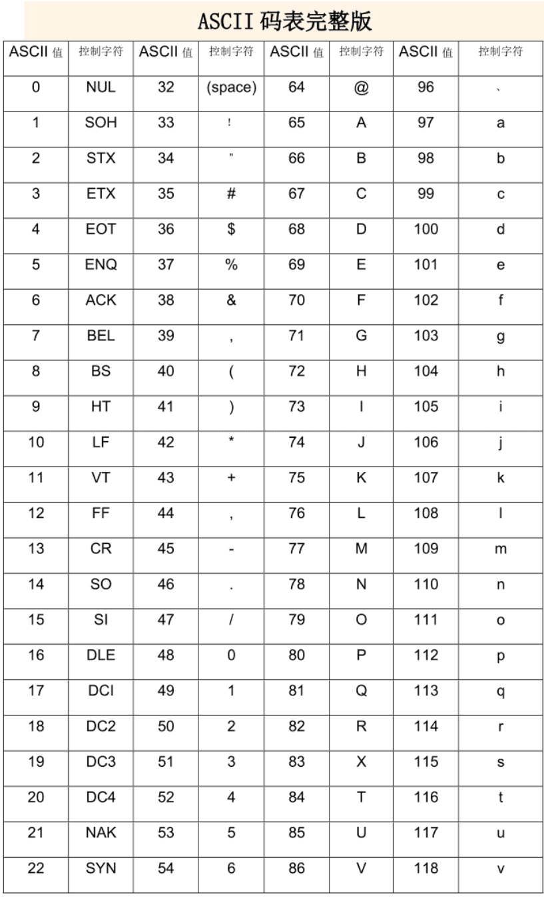
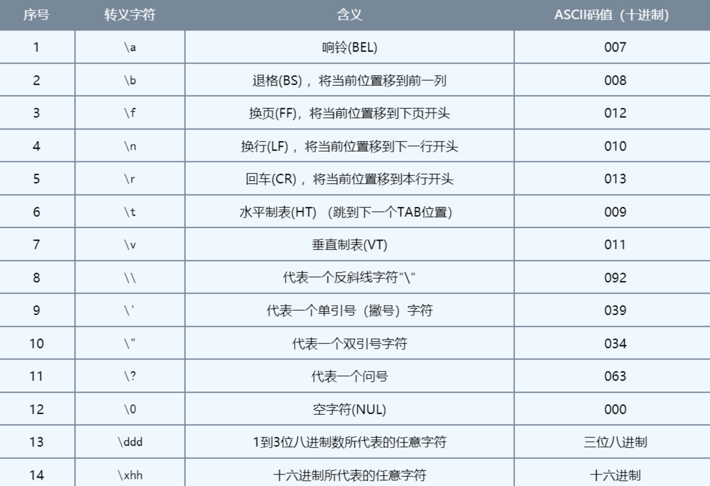
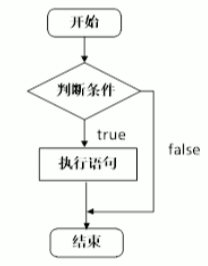
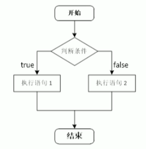
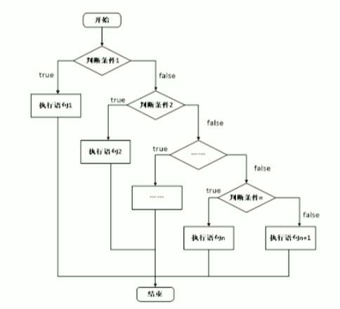
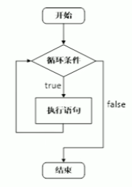
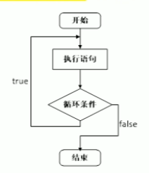
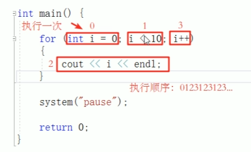

# heima_cpp

[黑马程序员|C++教程从0到1入门编程](https://www.bilibili.com/video/BV1et411b73Z/?spm_id_from=333.999.0.0&vd_source=e4a60aec69011298c6689621c8498cb6)

## 1 C++初识

### 1.1 第一个C++程序

### 1.2 注释

作用：在代码中加一些说明和解释，方便自己或其他程序员阅读代码

两种格式：

1. 单行注释：`//描述信息`
   - 通常放在一行代码的上方，或者一条语句的末尾，==对该行代码说明==
2. 多行注释：`/*描述信息*/`
   - 通常放在一段代码的上方，==对该段代码整体说明==

> 编辑器在编译代码时，会忽略注释的内容

```cpp
#include<iostream>
using namespace std;

//单行注释
/*
	main是一个程序的入口
	每个程序都必须有这么一个函数
	有且仅有一个
*/
int main()
{
	//在屏幕中输出hello world
	cout << "Hello world" << endl;
	system("pause");
	return 0;
}

```

### 1.3 变量

**作用**： 给一段指定的内存空间起名，方便操作这段内存

**语法**： `数据类型 变量名 = 初始值;`

```cpp
#include<iostream>
using namespace std;

int main()
{
	//变量的定义
	//语法：数据类型 变量名 = 初始值
	int a = 10;
	cout << "a = " << a << endl;
	system("pause");
	return 0;
}
```

### 1.4 常量

**作用**：用于记录程序中不可更改的数据

C++定义常量两种方式：

1. **`#define`宏定义常量**：`#define 常量名 常量值`
   - ==通常在文件上方定义==，表示一个常量
2. **`const`修饰的变量**：`const 数据类型 常量名 = 常量值`
   - ==通常在变量定义前加上关键字const==，修饰该变量为常量，不可修改

```cpp
//1.宏定义
#define week_day 7

int main()
{
	//week_day = 14; //错误，常量值不可修改
	cout << "一周里总共有：" << week_day << "天" << endl;
	//2.const修饰的变量
	const int month = 12;
	//month = 24; //错误，const修饰的变量也成为常量
	cout << "一年总共有 " << month << "月" << endl;
	return 0;
}
```

### 1.5 关键字

**作用**：关键字是C++中预先保留的单词(标识符)
	- 在定义变量或者常量时，不要用关键字

C++关键字如下：

| asm        | do           | if               | return      | typedef  |
| ---------- | ------------ | ---------------- | ----------- | -------- |
| auto       | double       | inline           | short       | typeid   |
| bool       | dynamic_cast | int              | signed      | typename |
| break      | else         | long             | sizeof      | unsiged  |
| case       | enum         | mutable          | static      | unsigned |
| catch      | explicit     | namespace        | static_cast | using    |
| char       | export       | new              | struct      | virtual  |
| class      | extern       | operator         | switch      | void     |
| const      | false        | private          | template    | volatile |
| const_cast | float        | protected        | this        | wchar_t  |
| continue   | for          | public           | throw       | while    |
| default    | friend       | register         | true        |          |
| delete     | goto         | reinterpret_cast | try         |          |

> 在给变量或者常量起名时，不要使用C++的关键字，否则会产生歧义

### 1.6 标识符命名规则

**作用**：C++规定给标识符(变量、常量)命名时，有一套自己的规则

- 标识符不能是关键字
- **标识符只能由字母、数字、下划线组成**
- 第一个字符必须为**字母或下划线**
- 标识符中字母区分大小写

> 给标识符命名时，争取做到见名知意的效果，方便自己和他人的阅读

```cpp
#include<iostream>
using namespace std;

int main()
{
	int num1 = 10, num2 = 20;
	cout << "sum = " << num1 + num2 << endl;
	return 0;
}

```

## 2 数据类型

C++规定在创建一个变量或者常量时，必须要指定出相应的数据类型，否则无法给变量分配内存。

### 2.1 整型

**作用**：整型变量表示的是==整数类型==的数据

C++中能够表示整型的类型有以下几种方式，**区别在于所占内存空间不同**：

| 数据类型            | 占用空间                                        | 取值范围       |
| ------------------- | ----------------------------------------------- | -------------- |
| short(短整型)       | 2字节                                           | (-2^15~2^15-1) |
| int(整型)           | 4字节                                           | (-2^31~2^31-1) |
| long(长整型)        | Windows为4字节，Linux为4字节(32位)，8字节(64位) | (-2^31~2^31-1) |
| long long(长长整型) | 8字节                                           | (-2^63~2^63-1) |

```cpp
#include<iostream>
using namespace std;

int main()
{
	//整数
	//1.短整型 (-32768~32767)
	short num1 = 32768; //输出为-1
	//2.整型
	int num2 = 10;
	//3.长整型
	long num3 = 10;
	//4.长长整型
	long long num4 = 10;
	return 0;
}
```

### 2.2 sizeof关键字

**作用**：利用 `sizeof`关键字可以==统计数据类型所占内存大小==

语法：`sizoef(数据类型/变量)`

```cpp
#include<iostream>
using namespace std;

int main()
{
	cout << "short 类型所占内存空间为：" << sizeof(short) << endl;
	cout << "int 类型所占内存空间为：" << sizeof(int) << endl;
	cout << "long 类型所占内存空间为：" << sizeof(long) << endl;
	cout << "long long 类型所占内存空间为：" << sizeof(int) << endl;
	system("pause");
	return 0;
}
```

> 整型数据大小比较：==short < int <= long <= long long==.

### 2.3 实型(浮点型)

**作用**：用于表示==小数==

浮点型变量分为两种：

1. 单精度float
2. 双精度double

两者的区别在于表示的有效数字范围不同。

| 数据类型 | 占用空间 | 有效数字范围    |
| -------- | -------- | --------------- |
| float    | 4字节    | 7位有效数字     |
| double   | 8字节    | 15~16位有效数字 |

```cpp
int main()
{
    //1.单精度 float
    //2.双精度 double
    //默认情况下，输出一个小数，会显示出6位有效数字
    float f1 = 3.1415926f;   //编辑器会将小数默认为double型，在末尾加上f则表示其为float型
    cout << "f1 = " << f1 << endl;

    double d1 = 3.1415926;
    cout << "d1 = " << d1 << endl;

    //统计float和都变了占用内存空间
    cout << "float占用内存空间: " << sizeof(float) << endl;
    cout << "double占用内存空间: " << sizeof(double) << endl;

    //科学计数法
    float f2 = 3e2;
    cout << "f2 = " << f2 << endl;  //300

    float f3 = 3e-2;
    cout << "f3 = " << f3 << endl;  //0.03

    return 0;
}
```

### 2.4 字符型

**字符型**：字符型变量用于显示单个字符

**语法**：`char ch = 'a'`

> 注意1：在显示字符型变量时，用单引号将字符括起来，不要用双引号
>
> 注意2：单引号内智能有一个字符，不可以是字符串

- C/C++中字符型变量只占==1个字节==
- 字符型变量并不是把字符本身放到内存中存储，而是将对应的ASCII编码放入到存储单元

```cpp
int main()
{
    //1、字符型变量创建方式
    char ch = 'a';
    cout << ch << endl;
    //2、字符型变量所占内存大小
    cout << "char字符型变量所占内存: " << sizeof(char) << endl;
    //3、字符型变量常见错误
    // char ch2 = "b";  //创建字符型变量时，要用单引号
    // char ch3 = 'abcd';  //单引号内只能有一个字符
    //4、字符型变量对应ASCII编码
    // a-97 A-65
    cout << (int)ch << endl;    //97为字符a对应的ASCII值
    return 0;
}
```



ASCII码大致由以下**两部分**组成：

- ASCII非打印控制字符：ASCII表上的数字**0-31**分配给了 `控制字符`，用于控制像打印机等一些外部设备。
- ASCII打印字符：数字**32-126**分配给了能在键盘上找到的字符，当查看或打印文档时就会出现。

### 2.5 转义字符

**作用**：用于表示一些==不能显示出来的ASCII字符==。常用的转移字符有：`\n \\ \t`



```cpp
int main()
{
    //转义字符
    //换行符    \n
    cout << "hello world\n";

    //反斜杠    "\\"
    cout << "\\" << endl;

    //水平制表符    \t 可以整齐地输出数据
    cout << "aa\thello world" << endl;
    cout << "aaa\thello world" << endl;

    return 0;
}
```

### 2.6 字符串

**作用**：用于表示一串字符

**两种风格**

1. C风格字符串：`char 变量名[] = "字符串值";`
2. C++风格字符串：`string 变量名 = "字符串值";`

```cpp
int main()
{
    //1、C风格字符串
    //char 字符串 []
    //等号后面要用双引号包含起来字符串
    char str1[] = "hello world";
    cout << str1 << endl;

    //2、C++风格字符串
    //包含头文件 #include<string>
    string str2 = "hello world";
    cout << str2 << endl;

    return 0;
}
```

### 2.7 布尔类型 bool

**作用**：布尔数据类型代表真或假的值

bool类型只有两个值：

- true: 真(本质为1)
- false: 假(本质为0)

**bool类型占==1个字节==大小**

```cpp
int main()
{
    //1、创建bool数据类型
    bool flag = true;   //true代表真
    cout << flag << endl;

    flag = false;       //false代表假
    cout << flag << endl;

    //2、查看bool类型所占空间
    cout << "bool类型所占内存空间: " << sizeof(bool) << endl;

    return 0;
}
```

### 2.8 数据的输入

**作用**：用于从键盘获取数据

**关键字**：`cin`

**语法**：`cin >> 变量;`

```cpp
int main()
{
    //1、整型
    int a;
    cout << "请给整型变量a赋值:" << endl;
    cin >> a;
    cout << "a = " << a << endl;

    //2、浮点型
    float f = 3.14f;
    cout << "请给浮点型变量f赋值:" << endl;
    cin >> f;
    cout << "f = " << f << endl;

    //3、字符型
    char ch = 'a';
    cout << "请给字符型变量ch赋值:" << endl;
    cin >> ch;
    cout << "ch = " << ch << endl;

    //4、字符串型
    string str = "hello";
    cout << "请给字符串str赋值:" << endl;
    cin >> str;
    cout << "str = " << str << endl;


    //5、bool型
    bool flag = true;
    cout << "请给布尔变量flag赋值:" << endl;
    cin >> flag;
    cout << "flag = " << flag << endl;

    system("pause");
    return 0;
}
```

## 3 运算符

**作用**：用于执行代码的运算

| 运算符类型 | 作用                                   |
| ---------- | -------------------------------------- |
| 算数运算符 | 用于处理四则运算                       |
| 赋值运算符 | 用于将表达式的值赋给变量               |
| 比较运算符 | 用于表达式的比较，并返回一个真值或假值 |
| 逻辑运算符 | 用于根据表达式的值返回真值或假值       |

### 3.1 算数运算符

**作用**：用于处理四则运算

算数运算符包括以下符号：

| 运算符 | 术语       | 示例       | 结果     |
| ------ | ---------- | ---------- | -------- |
| +      | 正号       | +3         | 3        |
| -      | 负号       | -3         | -3       |
| +      | 加         | 10+5       | 15       |
| -      | 减         | 10-5       | 5        |
| *      | 乘         | 10*5       | 50       |
| /      | 除         | 10/5       | 2        |
| %      | 取模(取余) | 10%3       | 1        |
| ++     | 前置递增   | a=2;b=++a  | a=3;b=3; |
| ++     | 后置递增   | a=2;b=a++; | a=3;b=2; |
| --     | 前置递减   | a=2;b=--a; | a=1;b=1; |
| --     | 后置递减   | a=2;b=a--; | a=1;b=2; |

```cpp
int main()
{
    //加减乘除
    int a1 = 10;
    int b1 = 3;

    cout << a1 + b1 << endl;
    cout << a1 - b1 << endl;
    cout << a1 * b1 << endl;
    cout << a1 / b1 << endl;    //两个整数相除，结果仍是整数，将小数部分去除

    int a2 = 10;
    int b2 = 20;
    int c2 = 0;

    cout << a2 / b2 << endl;    //0
    // cout << a2 / c2 << endl;    //错误！两个数相除，除数不可以为0

    //两个小数相除
    double d1 = 0.5;
    double d2 = 0.22;
    cout << d1 / d2 << endl;    //2.27273

    return 0;
}
```

> 总结：在除法运算中，除数不能为0

```cpp
    //取模就是求余数
    int a3 = 10;
    int b3 = 3;
    int c3 = 20;
    int d3 = 0;

    cout << a3 % b3 << endl;    //1
    cout << a3 % c3 << endl;    //10
    // cout << a3 % d3 << endl;    //保存，两个数相除，除数不能为0，也不能取模

    //两个小数是不可以做取模运算的
```

> 只有整数变量可以进行取模运算

```cpp
    //1、前置递增
    int a = 10;
    ++a;
    cout << "a = " << a << endl;    //11

    //2、后置递增
    int b = 10;
    b++;
    cout << "b = " << b << endl;    //11

    //前置递增：先让变量+1，然后进行表达式运算
    int x1 = 10;
    int y1 = ++x1 * 10;
    cout << "x1 = " << x1 << endl;  //11
    cout << "y1 = " << y1 << endl;  //110
    //后置递增：先进行表达式运算，后让变量+1
    int x2 = 10;
    int y2 = x2++ * 10;
    cout << "x2 = " << x2 << endl;  //11
    cout << "y2 = " << y2 << endl;  //100
```

> 总结：前置递增先对变量进行++，再计算表达式，后置递增相反。

### 3.2 赋值运算符

作用：用于将表达式的值赋给变量

赋值运算符包含以下几个符号：

| 运算符 | 术语   | 示例       | 结果     |
| ------ | ------ | ---------- | -------- |
| =      | 赋值   | a=2;b=3;   | a=2;b=3; |
| +=     | 加等于 | a=0;a+=2;  | a=2;     |
| -=     | 减等于 | a=5;a-=2;  | a=3;     |
| *=     | 乘等于 | a=2;a*=3;  | a=6;     |
| /=     | 除等于 | a=10;a/=2; | a=5;     |
| %=     | 模等于 | a=3;a%=2;  | a=1;     |

### 3.3 比较运算符

**作用**：用于表达式的比较，并返回一个真值或假值

比较运算符有以下符号：

| 运算符 | 术语     | 示例 | 结果 |
| ------ | -------- | ---- | ---- |
| ==     | 相等于   | 4==3 | 0    |
| !=     | 不等于   | 4!=3 | 1    |
| <      | 小于     | 4<3  | 0    |
| >      | 多于     | 4>3  | 1    |
| <=     | 小于等于 | 4<=3 | 0    |
| >=     | 大于等于 | 4>=3 | 1    |

```cpp
    //比较运算符
    // ==
    int a = 10;
    int b = 20;
    cout << (a == b) << endl;   // 0
    cout << (a != b) << endl;   // 1

    // < >
    cout << (a < b) << endl;    // 1
    cout << (a > b) << endl;    // 0

    // <= >=
    cout << (a <= b) << endl;   // 1
    cout << (a >= b) << endl;   // 0
```

### 3.4 逻辑运算符

**作用**：用于根据表达式的值返回真值或假值

逻辑运算符有以下符号：

| 运算符 | 术语 | 示例     | 结果                                                     |
| ------ | ---- | -------- | -------------------------------------------------------- |
| !      | 非   | !a       | 如果a为假，则!a为真；如果a为真，则!a为假。               |
| &&     | 与   | a && b   | 如果a和b都为真，则结果为真，否则为假。                   |
| `\\` | 或   | `a\\b` | 如果a和b有一个为真，则结果为真，二者都为假时，结果为假。 |

> 表格中打不出 `|`符号，所以以 `\`代替之。
>
> 逻辑与 `&&`：同真为真，其余为假
>
> 逻辑或 `||`：桶假为假，其余为真

```cpp
int main()
{
    //逻辑运算符 --- 非 !：真变假，假变真
    int a = 10;
    cout << !a << endl;     //0
    cout << !!a << endl;    //1

    //逻辑运算符 --- 与 &&: 同真为真，其余为假
    int b = 10;
    cout << (a && b) << endl;   //1
    a = 0, b = 10;
    cout << (a && b) << endl;   //0
    a = 0, b = 0;
    cout << (a && b) << endl;   //0

    //逻辑运算符 --- 或 ||: 
    a = 10, b = 10;
    cout << (a || b) << endl;   //1
    a = 0, b = 10;
    cout << (a || b) << endl;   //1
    a = 0, b = 0;
    cout << (a || b) << endl;   //0
    return 0;
}
```

## 4 程序流程结构

C/C++支持最基本的三种程序运行结构：==顺序结构、选择结构、循环结构==

- 顺序结构：程序按顺序执行，不发生跳转
- 选择结构：依据条件是否满足，有选择地执行相应功能
- 循环结构：依据条件是否满足，循环多次值行某段代码

### 4.1 选择结构

#### 4.1.1 if语句

**作用**：执行满足条件地语句

if语句地三种形式：

- 单行格式if语句
- 多行格式if语句
- 多条件地if语句

1. 单行格式if语句：`if(条件){ 条件满足执行的语句 }`
   
   > 注意：if条件表达式后不要加分号
   >
2. 多行格式if语句：`if(条件){ 条件满足执行的语句 }else{ 条件不满足执行的语句 };`
   
3. 多条件的if语句：`if(){}else if(){}...else{}`
   

```cpp
int main()
{
    //输入一个分数，如果分数大于600，考上一本大学
    //如果没考上，打印未考上一本
    int n;
    cout << "请输入一个考试分数:" << endl;
    cin >> n;
    cout << "您输入的分数是: " << n << endl;
    if(n > 600){
        cout << "恭喜考上一本大学" << endl;
    }else if(n > 500){
        cout << "恭喜考上二本大学" << endl;
    }else if(n > 400){
        cout << "恭喜考上三本大学" << endl;
    }else{
        cout << "未考上大学，请再接再厉" << endl;
    }

    return 0;
}
```

**嵌套if语句**：在if语句中，可以嵌套使用if语句，达到更精确的条件判断

```cpp
int main()
{
    //输入一个分数，如果分数大于600，考上一本大学
    //如果没考上，打印未考上一本
    int n;
    cout << "请输入一个考试分数:" << endl;
    cin >> n;
    cout << "您输入的分数是: " << n << endl;
    if(n > 600){
        // cout << "恭喜考上一本大学" << endl;
        if(n > 700){
            cout << "TsingHua" << endl;
        }else if(n > 689){
            cout << "Peiking" << endl;
        }else{
            cout << "TJU" << endl;
        }
    }else if(n > 500){
        cout << "恭喜考上二本大学" << endl;
    }else if(n > 400){
        cout << "恭喜考上三本大学" << endl;
    }else{
        cout << "未考上大学" << endl;
    }

    return 0;
}
```

案例：三只小猪称体重，哪知最重？

```cpp
#include<iostream>
using namespace std;
int main()
{
	int a, b, c;
	cin >> a >> b >> c;
	if(a >= b){
		if(a >= c)	cout << "a: " << a << endl;
		else		cout << "c: " << c << endl;
	}else{
		if(b >=c )	cout << "b: " << b << endl;
		else		cout << "c: " << c << endl;
	}
	return 0;
}
```

#### 4.1.2 三目运算符

**作用**：通过三目运算符实现简单的判断

**语法**：`表达式1 ? 表达式2 : 表达式3`

**含义**：如果表达式1的值为真，则执行表达式2，并返回表达式2的结果；如果表达式1的值为假，则执行表达式3，并返回表达式3的结果。

```cpp
int main()
{
    //三目运算符
    //创建3个变量a b c，将a和b作比较，将变量大的值赋值给变量c
    int a = 10, b = 20, c;
    c = a > b ? a : b;
    cout << "c = " << c << endl;    //c = 20

    //在C++中三目运算符返回的是变量，可以继续赋值
    ((a > b) ? a : b) = 100;
    cout << "a = " << a << endl; // 10
    cout << "b = " << b << endl; // 100

    return 0;
}
```

> **三目运算符可以作为右值，将计算的结果赋值给左边变量；也可以将结果作为左值，进行后续运算**

#### 4.1.3 switch语句

**作用**：执行多条分支语句

**语法**：

```cpp
switch(表达式){
    case 结果1: 执行语句1;
    break;
    case 结果2: 执行语句2;
    break;
    //...
    default: 执行语句;
    break;
}
```

电影打分案例：

```cpp
int main()
{
    //switch: 给电影打分
    int score;
    cout << "Enter your score: " << endl;
    cin >> score;
    cout << "You scored: " << score << endl;
    switch(score){
        case 5:
            cout << "Best" << endl;
            break;
        case 4:
            cout << "Good" << endl;
            break;
        case 3:
            cout << "OK" << endl;
            break;
        default:
            cout << "Low" << endl;
            break;
    }

    return 0;
}
```

> 注意1：`switch`语句中表达式类型只能是整型或字符型
>
> 注意2：`case`里如果没有 `break`，那么程序会一直向下执行
>
> 总结：与 `if`语句比，对于多条件判断时，`switch`的结构清晰，执行效率高，缺点是 `switch`不可以判断区间。

### 4.2 循环结构

#### 4.2.1 while循环语句

**作用**：满足循环条件，执行循环语句

**语法**：`while(循环条件){ 循环语句 }`

**功能**：==只要循环条件的结果为真，就执行循环语句==



```cpp
int main()
{
    //while循环
    //在屏幕中打印0~9，这10个数字
    int num = 0;
    while(num < 10){
        cout << num++ << endl;
    }

    return 0;
}
```

> 注意：在执行循环语句时，程序必须提供跳出循环的窗口，否则会出现死循环

猜数字案例：系统生成0~100之间的随机数，玩家进行猜数。如果猜对，推出循环；如果猜错，则提示过大或过小。

```cpp
int main()
{
    //添加随机数种子，利用当前系统时间生成随机数，防止每次随机数都一样
    //需要添加头文件 #include<ctime>
    srand((unsigned int)time(NULL));

    //1、系统生成随机数(0~100)
    int x = rand() % 100 + 1;   //生成[0, 99] + 1之间的随机数
    // cout << "x = " << x << endl;
    int val = 0, i = 0;
    while(true){
        //2、玩家输入猜测数值
        cin >> val;
        if(val > x){
            cout << "过大" << endl;
        }else if(val < x){
            cout << "过小" << endl;
        }else{
            //3、猜对退出循环
            cout << "猜对了" << endl;
            break;  //break退出当前循环
        }
        ++i;
        if(i > 6){
            cout << "错误超过6次 游戏结束!" << endl;
            break;
        }
    }

    return 0;
}
```

#### 4.2.2 do...while循环语句

作用：满足循环条件，执行循环语句

语法：`do(循环语句)while(循环条件);`

注意：与 `while`的区别在于==`do...while`会先执行一次循环语句==，再判断循环条件



```cpp
int main()
{
    //do...while语句
    //do...while和while循环区别在于do...while会先执行一次循环语句
    //在屏幕上输出0到9，这10个数字
    int num = 0;
    do{
        cout << num++ << endl;
    }while(num < 10);

    return 0;
}
```

> 注意：do...while和while循环区别在于do...while会先执行一次循环语句

**练习案例：水仙花数**

**案例描述**：水仙花数是指一个3位数，它的每个位上的数字的3次幂之和等于它本身

**例如**：1^3+5^3+3^3 = 153

```cpp
int main()
{
    //使用do...while循环，输出所有3位数中的水仙花数
    int x = 100, a, b, c;
    do{
        a = x / 100;
        b = x % 100 / 10;
        c = x % 10;
        if((a*a*a + b*b*b + c*c*c) == x){
            cout << "x = " << x << endl;
        }
        ++x;
    }while(x < 1000);

    return 0;
}
```

#### 4.2.3 for循环语句

**作用**：满足循环条件，执行循环语句

**语法**：`for(起始条件;条件表达式;末尾循环体){ 循环语句; }`

**示例**：

```cpp
int main()
{
    //for循环，打印数字0~9
    for(int i=0; i<10; ++i){
        cout << i << endl;
    }

    return 0;
}
```



> 注意：`for`循环中的表达式，要用分号 `;`分隔开
>
> 总结：`while`, `do...while`, `for`都是开发中常用的循环语句，`for`循环结构比较清晰，比较常用

**练习案例：敲桌子**

案例描述：从1开始数到数字100，如果数字个位含有7，或者数字十位含有7，或者该数字是7的倍数，则打印敲桌子，其余数字直接打印输出。

```cpp
int main()
{
    //敲桌子案例
    for(int i=1; i<=100; ++i){
        if((i%7==0) || (i%10==7) || (i/10==7)){
            cout << "敲桌子" << endl;
        }else{
            cout << i << endl;
        }
    }

    return 0;
}
```

#### 4.2.4 嵌套循环

**作用**：在循环体中再嵌套一层循环，解决一些实际问题

```cpp
    for(int i=0; i<10; ++i){
        for(int j=0; j<10; ++j){
            cout << "* ";
        }
        cout << endl;
    }
```

**练习案例**：乘法口诀表

案例描述：利用嵌套循环，实现九九乘法表

```cpp
    //九九乘法表
    for(int i=1; i<=9; ++i){    //行数
        for(int j=1; j<=i; ++j){    //列数
            cout << j << "*" << i << "=" << j*i << "\t";
            if(j == i)
                cout << endl;
        }
    }
```

### 4.3 跳转语句

#### 4.3.1 break语句

作用：用于跳出==选择结构==或者==循环结构==

break使用的场合：

- 出现在 `switch`条件语句中，作用是终止 `case`并跳出 `switch`
- 出现在循环语句中，作用是跳出当前的循环语句
- 出现在嵌套循环中，跳出最近的内层循环语句

```cpp
int main()
{
    //break使用场景
    //1、switch语句中
    cout << "请选择游戏模式：" << endl;
    cout << "1、简单" << endl;
    cout << "2、普通" << endl;
    cout << "3、困难" << endl;
    int select = 0;
    cin >> select;
    switch(select){
        case 1:
            //简单模式
            cout << "游戏模式：简单" << endl;
            break;
        case 2:
            //普通模式
            cout << "游戏模式：普通" << endl;
            break;
        case 3:
            //困难模式
            cout << "游戏模式：困难" << endl;
            break;
        default:
            break;
    }
    //2、出现在循环语句中
    for(int i=0; i<10; ++i){
        if(i == 5)
            break;  //退出循环
        cout << i << endl;
    }

    //3、在嵌套循环语句中
    for(int i=0; i<10; ++i){
        for(int j=0; j<10; ++j){
            if(j ==5)
                break;  //退出内层循环
            cout << "*";
        }
        cout << endl;
    }
    return 0;
}
```

#### 4.3.2 continue语句

作用：在==循环语句==中，跳过本次循环中余下尚未执行的语句，继续执行下一次循环

```cpp
int main()
{
    //continue语句
    for(int i=1; i<=100; ++i){
        if(i % 2)
            continue;   //可以筛选条件，执行到此就不再向下执行，而是执行下一次循环
        cout << i << endl;
    }

    return 0;
}
```

> continue并不会使整个循环终止，而break会跳出循环

#### 4.3.3 goto语句

作用：无条件跳转语句

语法：`goto`标记；

功能：如果标记的名称存在，执行到goto语句时，会跳转到标记的位置

```cpp
int main()
{
    //goto语句
    cout << "1.xxxx" << endl;
    cout << "2.xxxx" << endl;
    goto FLAG;
    cout << "3.xxxx" << endl;
    FLAG:
    cout << "4.xxxx" << endl;
    return 0;
}
```

> 注意：在程序中不建议使用goto语句，以免造成程序流程混乱

## 5 数组

### 5.1 概述

所谓数组，就是一个集合，里面存放了相同类型的数据元素

特点1：数组中的每个**数据元素都是相同的数据类型**

特点2：数组是由**连续的内存**位置组成的

### 5.2 一维数组

#### 5.2.1 一维数组定义方式

一维数组定义的三种方式：

1. `数据类型 数组名[数组长度]; `
2. `数据类型 数组名[数组长度] = {值1, 值2 ...};`
3. `数据类型 数组名[] = {值1, 值2, ...};`

```cpp
int main()
{
    //数组
    /*
    1. `数据类型 数组名[数组长度]; `
    2. `数据类型 数组名[数组长度] = {值1, 值2 ...};`
    3. `数据类型 数组名[] = {值1, 值2, ...};`
    */
    int arr[3];
    //给数组中的元素进行赋值
    arr[0] = 1, arr[1] = 2, arr[2] = 3;
    //访问数据元素
    cout << arr[0] << endl;
    cout << arr[1] << endl;
    cout << arr[2] << endl;

    int arr2[5] = {9, 8, 5};
    //利用循环 输出数组中的元素
    //如果在初始化数据时，没有全部填写完，会用0来填补剩余数据
    for(int i=0; i<5; ++i){
        cout << arr2[i] << endl;
    }

    //定义数组时，必须有初始长度
    int arr3[] = {2, 0, 2, 3, 0, 3, 2, 7};
    for(int i=0; i<8; ++i){
        cout << arr3[i] << endl;
    }

    return 0;
}
```

> 注意1：数组名的命名规范与变量名命名规范一致，不要和变量重名
>
> 注意2：数组中下标是从0开始索引

#### 5.2.2 一维数组的组名

一维数组名称的**用途**：

1. 可以统计整个**数组在内存中的长度**
2. 可以获取数组在**内存中的首地址**

```cpp
int main()
{
    //一维数组名称用途
    /*
    1. 可以统计整个**数组在内存中的长度**
    2. 可以获取数组在**内存中的首地址**
     */

    int arr[] = {1, 2, 3, 4, 5, 6, 7, 8, 9, 10};
    cout << "整个数组占用内存空间为：" << sizeof(arr) << endl;  //40=4*10
    cout << "每个元素占用内存空间为：" << sizeof(arr[0]) << endl;   //4
    cout << "数组中元素个数：" << sizeof(arr)/sizeof(arr[0]) << endl;   //10

    cout << "数组的首地址：" << arr << endl;    //0x61fdf0
    cout << "数组中第一个元素的地址：" << &arr[0] << endl;  //0x61fdf0
    cout << "数组中第二个元素的地址：" << &arr[1] << endl;  //0x61fdf4 相差4个字节

    //数组名是常量，不可以进行赋值操作

    return 0;
}
```

**练习案例1**：五只小猪称体重

**案例描述**：在一个数组中记录五只小猪的体重，如：`int arr[5] = {300,3500,200,400,250};`找出并打印最重的小猪体重。

**练习案例2**：数组元素逆置

**案例描述**：声明一个5个元素的数组，并且将元素逆置。(如原数组元素为：1，2，3，4，5；逆置后输出结果为：5，4，3，2，1).

```cpp
void print_array(int *a, const int n){
    for(int i=0; i<n; ++i){
        cout << a[i];
        if(i != n-1)
            cout << " ";
    }
    cout << endl;
}

int main()
{
    int arr1[5];
    for(int i=0; i<5; ++i){
        cin >> arr1[i];
    }
    //寻找最大值
    int max = -1;
    for(int i=0; i<5; ++i){
        if(arr1[i] > max)
            max = arr1[i];
    }

    cout << "最大值为：" << max << endl;

    int length = sizeof(arr1)/sizeof(arr1[0]);
    cout << "原始数组为：" << endl;
    print_array(arr1, length);

    //two pointer
    int start = 0, end = length-1;
    for(int i=0, j=end; i<j; ++i,--j){
        int temp = arr1[i];
        arr1[i] = arr1[j];
        arr1[j] = temp;
    }
    cout << "逆置后数组为：" << endl;
    print_array(arr1, length);

    return 0;
}
```

5.2.3 冒泡排序

作用：最常用的排序算法，对数组内元素进行排序

1. 比较相邻的元素。如果第一个比第二个大，就交换他们两个。
2. 对每一对相邻元素做同样的工作，执行完毕后，找到第一个最大值。
3. 重复以上步骤，每次比较次数-1，知道不需要比较。

示例：将数组{4,2,8,0,5,7,1,3,9}进行升序排序

```cpp
#include<iostream>
using namespace std;

//打印输出数组a,长度为n
void print_array(int *a, const int n){
    for(int i=0; i<n; ++i){
        cout << a[i];
        if(i < n-1)
            cout << " ";
    }
    cout << endl;
}

void bubble_sort(int *a, const int n){
    for(int i=0; i<n-1; ++i){
        for(int j=0; j<n-1-i; ++j){
            if(a[j]>a[j+1]){
                int temp = a[j];
                a[j] = a[j+1];
                a[j+1] = temp;
            }
        }
    }
}

int main()
{
    int a[] = {4, 2, 8, 0, 5, 7, 1, 3, 9};
    int n = sizeof(a)/sizeof(a[0]); //数组大小

    print_array(a, n);  //4 2 8 0 5 7 1 3 9
    bubble_sort(a, n);
    print_array(a, n);  //0 1 2 3 4 5 7 8 9

    return 0;
}
```

### 5.3 二维数组

二维数组就是在一维数组上，多加一个维度。

#### 5.3.1 二维数组定义方式

二维数组定义的四种方式：

1. `数据类型 数组名[行数][列数];`
2. `数据类型 数组名[行数][列数] = {{数据1, 数据2}, {数据3, 数据4}}；`
3. `数据类型 数组名[行数][列数] = {数据1, 数据2, 数据3, 数据4}；`
4. `数据类型 数组名[][列数] = {数据1, 数据2, 数据3, 数据4}；`

> 以上4种方式，利用第二种更加直观，提高代码的可读性。
>
> 在定义二维数组时，如果初始化了数据，可以**省略行数**。

#### 5.3.2 二维数组数组名

- 查看二维数组所占内存空间
- 获取二维数组首地址

```cpp
int main()
{
    //二维数组定义方式
    /*
    1. `数据类型 数组名[行数][列数];`
    2. `数据类型 数组名[行数][列数] = {{数据1, 数据2}, {数据3, 数据4}}；`
    3. `数据类型 数组名[行数][列数] = {数据1, 数据2, 数据3, 数据4}；`
    4. `数据类型 数组名[][列数] = {数据1, 数据2, 数据3, 数据4}；`
    */

    //二维数组数组名
    int arr[2][3] = {
        {1, 2, 3},
        {4, 5, 6}
    };
    for(int i=0; i<2; ++i){
        for(int j=0; j<3; ++j)
            cout << arr[i][j] << " ";
        cout << endl;
    }
    //1.查看所占内存空间大小
    cout << "二维数组占用内存空间为：" << sizeof(arr) << endl;  //24
    cout << "二维数组第0行占用内存空间为: " << sizeof(arr[0]) << endl;  //12
    //2.查看二维数组的首地址
    cout << "二维数组首地址: " << arr << endl;              //0x61fe00
    cout << "二维数组第0行的首地址: " << arr[0] << endl;    //0x61fe00
    cout << "二维数组第一个元素的地址: " << &arr[0][0] << endl;    //0x61fe00
    cout << "二维数组第1行的首地址: " << arr[1] << endl;    //0x61fe0c  差12个字节
    return 0;
}
```

#### 5.3.3 二维数组应用案例

考试成绩统计：有三名同学（张三，李四，王五），上一次考试中的成绩分别如下表，请分别输出三名同学的总成绩

|      | 语文 | 数学 | 英语 |
| ---- | ---- | ---- | ---- |
| 张三 | 100  | 100  | 100  |
| 李四 | 90   | 50   | 100  |
| 王五 | 60   | 70   | 80   |

```cpp
int main()
{
    int scores[][3] = {
        {100, 100, 100},
        {90, 50, 100},
        {60, 70, 80}
    };
    string names[3] = {"张三", "李四", "王五"};
    for(int i=0; i<3; ++i){
        int sum = 0;
        for(int j=0; j<3; ++j){
            sum += scores[i][j];
        }
        cout << names[i] << "的总分为：" << sum << endl;
    }
  
    return 0;
}
```

## 6 函数

### 6.1 概述

**作用**：将一段经常使用的代码封装起来，减少重复代码

一个较大的程序，一般分为若干个程序块，每个模块实现特定的功能。

### 6.2 函数的定义

函数的定义一般主要有5个步骤：

1. 返回值类型
2. 函数名
3. 参数列表
4. 函数体语句
5. return表达式

**语法**：

```cpp
返回值类型 函数名(参数列表){
	函数体
	return 语句;
}
```

- 返回值类型：一个函数可以返回一个值。在函数定义中
- 函数名：给函数起个名称
- 参数列表：使用该函数时，传入的数据
- 函数体语句：花括号内的代码，函数内需要执行的语句
- return表达式：和返回值类型挂钩，函数执行完成后，返回相应的数据

```cpp
//返回值类型 函数名 参数列表{函数体 return 表达式}
int add(int a, int b){
    int sum = a + b;
    return sum;
}
```

### 6.3 函数的调用

功能：使用定义好的函数

语法：`函数名(参数)`

```cpp
int main()
{
    int a, b;
    cout << "请输入两个数：" << endl;
    cin >> a >> b;
    int sum = add(a, b);
    cout << a << " + " << b << " = "
        << sum << endl;

    return 0;
}
```

> 总结：函数定义里小括号内成为**形参**，函数调用时传入的参数成为**实参。**

### 6.4 值传递

- 所谓值传递，就是函数调用时实参将数值传入给形参
- 值传递时，如果**修改形参，实参不会受影**响

```cpp
//定义函数，实现两个数字进行交换
void swap(int a, int b){
    int temp = a;
    a = b;
    b = temp;
}

int main()
{
    //值传递
    cout << "交换前：" << endl;
    cout << "a: " << a
        << " b: " << b << endl;
    cout << "交换后：" << endl;
    swap(a, b);
    cout << "a: " << a
        << " b: " << b << endl;


    return 0;
}
```

> 当值传递时，形参发生任何的改变，都不会影响实参。

### 6.5 函数的常见样式

常见的函数样式有4种

1. 无参数无返回值
2. 有参数无返回值
3. 无参数有返回值
4. 有参数有返回值

```cpp
//函数常见样式
// 1. 无参数无返回值
void test1(){
    cout << "test1()" << endl;
}
// 2. 有参数无返回值
void test2(int a){
    cout << "test2() " << a << endl;
}
// 3. 无参数有返回值
int test3(){
    cout << "test3()" << endl;
    return 12;
}
// 4. 有参数有返回值
int test4(int a){
    cout << "test4()" << endl;
    return a;
}
```

### 6.6 函数的声明

**作用**：告诉编译器函数名称及如何调用函数。函数的实际主体可以单独定义。

- 函数的**声明可以多次**，但是函数的**定义只能有一次**。

```cpp
//函数的声明
//提前告诉编译器函数的存在
int max(int , int);

int main()
{
    int a, b;
    cout << "请输入两个数：" << endl;
    cin >> a >> b;
    cout << "max(a, b) = " << max(a, b) << endl;

    return 0;
}

//函数定义
int max(int a, int b){
    return a > b ? a : b;
}
```

### 6.7 函数的分文件编写

作用：让代码结构更加清晰

函数分文件编写一般有4个步骤

1. 创建后缀名为 `.h`的头文件
2. 创建后缀名为 `.cpp`的源文件
3. 在有文件中写函数的声明
4. 在源文件中写函数的定义

```cpp
//swap.h文件
#include <iostream>
using namespace std;

void swap(int, int);

```

```cpp
//swap.cpp文件
#include "swap.h"
void swap(int a, int b){
    int temp = a;
    a = b;
    b = temp;
    cout << "a = " << a
	<< " b = " << b << endl;
}
```

```cpp
//main.cpp
#include<iostream>
#include "swap.h"
using namespace std;

int main()
{
    int a = 10, b = 20;
    swap(a, b);
    return 0;
}

```
