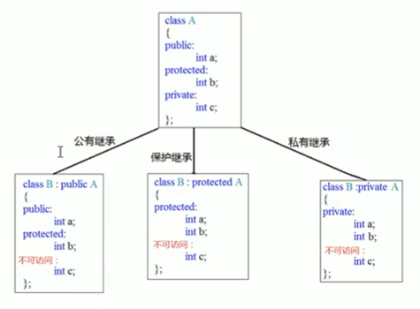
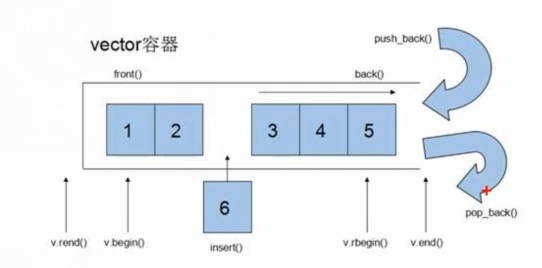
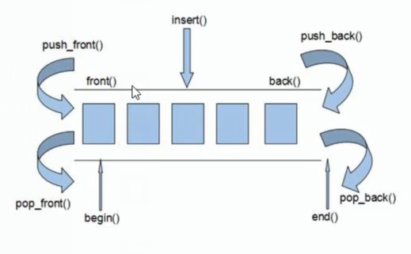
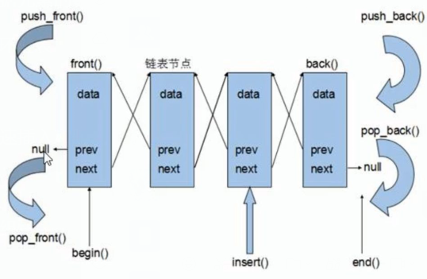

# heima_cpp

[黑马程序员|C++教程从0到1入门编程](https://www.bilibili.com/video/BV1et411b73Z/?spm_id_from=333.999.0.0&vd_source=e4a60aec69011298c6689621c8498cb6)

| 阶段     | 内容            |                                      |
| -------- | --------------- | ------------------------------------ |
| 第一阶段 | C++基础语法入门 | `1.C++初始` ~ `8.结构体`        |
| 第二阶段 | C++核心编程     | `1.内存分区模型` ~ `5.文件操作` |
| 第三阶段 | C++提高编程     | `1.模板` ~` 5.STL常用算法`       |

## 1 C++初识

### 1.1 第一个C++程序

### 1.2 注释

作用：在代码中加一些说明和解释，方便自己或其他程序员阅读代码

两种格式：

1. 单行注释：`//描述信息`
   - 通常放在一行代码的上方，或者一条语句的末尾，==对该行代码说明==
2. 多行注释：`/*描述信息*/`
   - 通常放在一段代码的上方，==对该段代码整体说明==

> 编辑器在编译代码时，会忽略注释的内容

```cpp
#include<iostream>
using namespace std;

//单行注释
/*
	main是一个程序的入口
	每个程序都必须有这么一个函数
	有且仅有一个
*/
int main()
{
	//在屏幕中输出hello world
	cout << "Hello world" << endl;
	system("pause");
	return 0;
}

```

### 1.3 变量

**作用**： 给一段指定的内存空间起名，方便操作这段内存

**语法**： `数据类型 变量名 = 初始值;`

```cpp
#include<iostream>
using namespace std;

int main()
{
	//变量的定义
	//语法：数据类型 变量名 = 初始值
	int a = 10;
	cout << "a = " << a << endl;
	system("pause");
	return 0;
}
```

### 1.4 常量

**作用**：用于记录程序中不可更改的数据

C++定义常量两种方式：

1. **`#define`宏定义常量**：`#define 常量名 常量值`
   - ==通常在文件上方定义==，表示一个常量
2. **`const`修饰的变量**：`const 数据类型 常量名 = 常量值`
   - ==通常在变量定义前加上关键字const==，修饰该变量为常量，不可修改

```cpp
//1.宏定义
#define week_day 7

int main()
{
	//week_day = 14; //错误，常量值不可修改
	cout << "一周里总共有：" << week_day << "天" << endl;
	//2.const修饰的变量
	const int month = 12;
	//month = 24; //错误，const修饰的变量也成为常量
	cout << "一年总共有 " << month << "月" << endl;
	return 0;
}
```

### 1.5 关键字

**作用**：关键字是C++中预先保留的单词(标识符)
	- 在定义变量或者常量时，不要用关键字

C++关键字如下：

| asm        | do           | if               | return      | typedef  |
| ---------- | ------------ | ---------------- | ----------- | -------- |
| auto       | double       | inline           | short       | typeid   |
| bool       | dynamic_cast | int              | signed      | typename |
| break      | else         | long             | sizeof      | unsiged  |
| case       | enum         | mutable          | static      | unsigned |
| catch      | explicit     | namespace        | static_cast | using    |
| char       | export       | new              | struct      | virtual  |
| class      | extern       | operator         | switch      | void     |
| const      | false        | private          | template    | volatile |
| const_cast | float        | protected        | this        | wchar_t  |
| continue   | for          | public           | throw       | while    |
| default    | friend       | register         | true        |          |
| delete     | goto         | reinterpret_cast | try         |          |

> 在给变量或者常量起名时，不要使用C++的关键字，否则会产生歧义

### 1.6 标识符命名规则

**作用**：C++规定给标识符(变量、常量)命名时，有一套自己的规则

- 标识符不能是关键字
- **标识符只能由字母、数字、下划线组成**
- 第一个字符必须为**字母或下划线**
- 标识符中字母区分大小写

> 给标识符命名时，争取做到见名知意的效果，方便自己和他人的阅读

```cpp
#include<iostream>
using namespace std;

int main()
{
	int num1 = 10, num2 = 20;
	cout << "sum = " << num1 + num2 << endl;
	return 0;
}

```

## 2 数据类型

C++规定在创建一个变量或者常量时，必须要指定出相应的数据类型，否则无法给变量分配内存。

### 2.1 整型

**作用**：整型变量表示的是==整数类型==的数据

C++中能够表示整型的类型有以下几种方式，**区别在于所占内存空间不同**：

| 数据类型            | 占用空间                                        | 取值范围       |
| ------------------- | ----------------------------------------------- | -------------- |
| short(短整型)       | 2字节                                           | (-2^15~2^15-1) |
| int(整型)           | 4字节                                           | (-2^31~2^31-1) |
| long(长整型)        | Windows为4字节，Linux为4字节(32位)，8字节(64位) | (-2^31~2^31-1) |
| long long(长长整型) | 8字节                                           | (-2^63~2^63-1) |

```cpp
#include<iostream>
using namespace std;

int main()
{
	//整数
	//1.短整型 (-32768~32767)
	short num1 = 32768; //输出为-1
	//2.整型
	int num2 = 10;
	//3.长整型
	long num3 = 10;
	//4.长长整型
	long long num4 = 10;
	return 0;
}
```

### 2.2 sizeof关键字

**作用**：利用 `sizeof`关键字可以==统计数据类型所占内存大小==

语法：`sizoef(数据类型/变量)`

```cpp
#include<iostream>
using namespace std;

int main()
{
	cout << "short 类型所占内存空间为：" << sizeof(short) << endl;
	cout << "int 类型所占内存空间为：" << sizeof(int) << endl;
	cout << "long 类型所占内存空间为：" << sizeof(long) << endl;
	cout << "long long 类型所占内存空间为：" << sizeof(int) << endl;
	system("pause");
	return 0;
}
```

> 整型数据大小比较：==short < int <= long <= long long==.

### 2.3 实型(浮点型)

**作用**：用于表示==小数==

浮点型变量分为两种：

1. 单精度float
2. 双精度double

两者的区别在于表示的有效数字范围不同。

| 数据类型 | 占用空间 | 有效数字范围    |
| -------- | -------- | --------------- |
| float    | 4字节    | 7位有效数字     |
| double   | 8字节    | 15~16位有效数字 |

```cpp
int main()
{
    //1.单精度 float
    //2.双精度 double
    //默认情况下，输出一个小数，会显示出6位有效数字
    float f1 = 3.1415926f;   //编辑器会将小数默认为double型，在末尾加上f则表示其为float型
    cout << "f1 = " << f1 << endl;

    double d1 = 3.1415926;
    cout << "d1 = " << d1 << endl;

    //统计float和都变了占用内存空间
    cout << "float占用内存空间: " << sizeof(float) << endl;
    cout << "double占用内存空间: " << sizeof(double) << endl;

    //科学计数法
    float f2 = 3e2;
    cout << "f2 = " << f2 << endl;  //300

    float f3 = 3e-2;
    cout << "f3 = " << f3 << endl;  //0.03

    return 0;
}
```

### 2.4 字符型

**字符型**：字符型变量用于显示单个字符

**语法**：`char ch = 'a'`

> 注意1：在显示字符型变量时，用单引号将字符括起来，不要用双引号
>
> 注意2：单引号内智能有一个字符，不可以是字符串

- C/C++中字符型变量只占==1个字节==
- 字符型变量并不是把字符本身放到内存中存储，而是将对应的ASCII编码放入到存储单元

```cpp
int main()
{
    //1、字符型变量创建方式
    char ch = 'a';
    cout << ch << endl;
    //2、字符型变量所占内存大小
    cout << "char字符型变量所占内存: " << sizeof(char) << endl;
    //3、字符型变量常见错误
    // char ch2 = "b";  //创建字符型变量时，要用单引号
    // char ch3 = 'abcd';  //单引号内只能有一个字符
    //4、字符型变量对应ASCII编码
    // a-97 A-65
    cout << (int)ch << endl;    //97为字符a对应的ASCII值
    return 0;
}
```


ASCII码大致由以下**两部分**组成：

- ASCII非打印控制字符：ASCII表上的数字**0-31**分配给了 `控制字符`，用于控制像打印机等一些外部设备。
- ASCII打印字符：数字**32-126**分配给了能在键盘上找到的字符，当查看或打印文档时就会出现。

### 2.5 转义字符

**作用**：用于表示一些==不能显示出来的ASCII字符==。常用的转移字符有：`\n \\ \t`


```cpp
int main()
{
    //转义字符
    //换行符    \n
    cout << "hello world\n";

    //反斜杠    "\\"
    cout << "\\" << endl;

    //水平制表符    \t 可以整齐地输出数据
    cout << "aa\thello world" << endl;
    cout << "aaa\thello world" << endl;

    return 0;
}
```

### 2.6 字符串

**作用**：用于表示一串字符

**两种风格**

1. C风格字符串：`char 变量名[] = "字符串值";`
2. C++风格字符串：`string 变量名 = "字符串值";`

```cpp
int main()
{
    //1、C风格字符串
    //char 字符串 []
    //等号后面要用双引号包含起来字符串
    char str1[] = "hello world";
    cout << str1 << endl;

    //2、C++风格字符串
    //包含头文件 #include<string>
    string str2 = "hello world";
    cout << str2 << endl;

    return 0;
}
```

### 2.7 布尔类型 bool

**作用**：布尔数据类型代表真或假的值

bool类型只有两个值：

- true: 真(本质为1)
- false: 假(本质为0)

**bool类型占==1个字节==大小**

```cpp
int main()
{
    //1、创建bool数据类型
    bool flag = true;   //true代表真
    cout << flag << endl;

    flag = false;       //false代表假
    cout << flag << endl;

    //2、查看bool类型所占空间
    cout << "bool类型所占内存空间: " << sizeof(bool) << endl;

    return 0;
}
```

### 2.8 数据的输入

**作用**：用于从键盘获取数据

**关键字**：`cin`

**语法**：`cin >> 变量;`

```cpp
int main()
{
    //1、整型
    int a;
    cout << "请给整型变量a赋值:" << endl;
    cin >> a;
    cout << "a = " << a << endl;

    //2、浮点型
    float f = 3.14f;
    cout << "请给浮点型变量f赋值:" << endl;
    cin >> f;
    cout << "f = " << f << endl;

    //3、字符型
    char ch = 'a';
    cout << "请给字符型变量ch赋值:" << endl;
    cin >> ch;
    cout << "ch = " << ch << endl;

    //4、字符串型
    string str = "hello";
    cout << "请给字符串str赋值:" << endl;
    cin >> str;
    cout << "str = " << str << endl;


    //5、bool型
    bool flag = true;
    cout << "请给布尔变量flag赋值:" << endl;
    cin >> flag;
    cout << "flag = " << flag << endl;

    system("pause");
    return 0;
}
```

## 3 运算符

**作用**：用于执行代码的运算

| 运算符类型 | 作用                                   |
| ---------- | -------------------------------------- |
| 算数运算符 | 用于处理四则运算                       |
| 赋值运算符 | 用于将表达式的值赋给变量               |
| 比较运算符 | 用于表达式的比较，并返回一个真值或假值 |
| 逻辑运算符 | 用于根据表达式的值返回真值或假值       |

### 3.1 算数运算符

**作用**：用于处理四则运算

算数运算符包括以下符号：

| 运算符 | 术语       | 示例       | 结果     |
| ------ | ---------- | ---------- | -------- |
| +      | 正号       | +3         | 3        |
| -      | 负号       | -3         | -3       |
| +      | 加         | 10+5       | 15       |
| -      | 减         | 10-5       | 5        |
| *      | 乘         | 10*5       | 50       |
| /      | 除         | 10/5       | 2        |
| %      | 取模(取余) | 10%3       | 1        |
| ++     | 前置递增   | a=2;b=++a  | a=3;b=3; |
| ++     | 后置递增   | a=2;b=a++; | a=3;b=2; |
| --     | 前置递减   | a=2;b=--a; | a=1;b=1; |
| --     | 后置递减   | a=2;b=a--; | a=1;b=2; |

```cpp
int main()
{
    //加减乘除
    int a1 = 10;
    int b1 = 3;

    cout << a1 + b1 << endl;
    cout << a1 - b1 << endl;
    cout << a1 * b1 << endl;
    cout << a1 / b1 << endl;    //两个整数相除，结果仍是整数，将小数部分去除

    int a2 = 10;
    int b2 = 20;
    int c2 = 0;

    cout << a2 / b2 << endl;    //0
    // cout << a2 / c2 << endl;    //错误！两个数相除，除数不可以为0

    //两个小数相除
    double d1 = 0.5;
    double d2 = 0.22;
    cout << d1 / d2 << endl;    //2.27273

    return 0;
}
```

> 总结：在除法运算中，除数不能为0

```cpp
    //取模就是求余数
    int a3 = 10;
    int b3 = 3;
    int c3 = 20;
    int d3 = 0;

    cout << a3 % b3 << endl;    //1
    cout << a3 % c3 << endl;    //10
    // cout << a3 % d3 << endl;    //保存，两个数相除，除数不能为0，也不能取模

    //两个小数是不可以做取模运算的
```

> 只有整数变量可以进行取模运算

```cpp
    //1、前置递增
    int a = 10;
    ++a;
    cout << "a = " << a << endl;    //11

    //2、后置递增
    int b = 10;
    b++;
    cout << "b = " << b << endl;    //11

    //前置递增：先让变量+1，然后进行表达式运算
    int x1 = 10;
    int y1 = ++x1 * 10;
    cout << "x1 = " << x1 << endl;  //11
    cout << "y1 = " << y1 << endl;  //110
    //后置递增：先进行表达式运算，后让变量+1
    int x2 = 10;
    int y2 = x2++ * 10;
    cout << "x2 = " << x2 << endl;  //11
    cout << "y2 = " << y2 << endl;  //100
```

> 总结：前置递增先对变量进行++，再计算表达式，后置递增相反。

### 3.2 赋值运算符

作用：用于将表达式的值赋给变量

赋值运算符包含以下几个符号：

| 运算符 | 术语   | 示例       | 结果     |
| ------ | ------ | ---------- | -------- |
| =      | 赋值   | a=2;b=3;   | a=2;b=3; |
| +=     | 加等于 | a=0;a+=2;  | a=2;     |
| -=     | 减等于 | a=5;a-=2;  | a=3;     |
| *=     | 乘等于 | a=2;a*=3;  | a=6;     |
| /=     | 除等于 | a=10;a/=2; | a=5;     |
| %=     | 模等于 | a=3;a%=2;  | a=1;     |

### 3.3 比较运算符

**作用**：用于表达式的比较，并返回一个真值或假值

比较运算符有以下符号：

| 运算符 | 术语     | 示例 | 结果 |
| ------ | -------- | ---- | ---- |
| ==     | 相等于   | 4==3 | 0    |
| !=     | 不等于   | 4!=3 | 1    |
| <      | 小于     | 4<3  | 0    |
| >      | 多于     | 4>3  | 1    |
| <=     | 小于等于 | 4<=3 | 0    |
| >=     | 大于等于 | 4>=3 | 1    |

```cpp
    //比较运算符
    // ==
    int a = 10;
    int b = 20;
    cout << (a == b) << endl;   // 0
    cout << (a != b) << endl;   // 1

    // < >
    cout << (a < b) << endl;    // 1
    cout << (a > b) << endl;    // 0

    // <= >=
    cout << (a <= b) << endl;   // 1
    cout << (a >= b) << endl;   // 0
```

### 3.4 逻辑运算符

**作用**：用于根据表达式的值返回真值或假值

逻辑运算符有以下符号：

| 运算符 | 术语 | 示例     | 结果                                                     |
| ------ | ---- | -------- | -------------------------------------------------------- |
| !      | 非   | !a       | 如果a为假，则!a为真；如果a为真，则!a为假。               |
| &&     | 与   | a && b   | 如果a和b都为真，则结果为真，否则为假。                   |
| `\\` | 或   | `a\\b` | 如果a和b有一个为真，则结果为真，二者都为假时，结果为假。 |

> 表格中打不出 `|`符号，所以以 `\`代替之。
>
> 逻辑与 `&&`：同真为真，其余为假
>
> 逻辑或 `||`：桶假为假，其余为真

```cpp
int main()
{
    //逻辑运算符 --- 非 !：真变假，假变真
    int a = 10;
    cout << !a << endl;     //0
    cout << !!a << endl;    //1

    //逻辑运算符 --- 与 &&: 同真为真，其余为假
    int b = 10;
    cout << (a && b) << endl;   //1
    a = 0, b = 10;
    cout << (a && b) << endl;   //0
    a = 0, b = 0;
    cout << (a && b) << endl;   //0

    //逻辑运算符 --- 或 ||: 
    a = 10, b = 10;
    cout << (a || b) << endl;   //1
    a = 0, b = 10;
    cout << (a || b) << endl;   //1
    a = 0, b = 0;
    cout << (a || b) << endl;   //0
    return 0;
}
```

## 4 程序流程结构

C/C++支持最基本的三种程序运行结构：==顺序结构、选择结构、循环结构==

- 顺序结构：程序按顺序执行，不发生跳转
- 选择结构：依据条件是否满足，有选择地执行相应功能
- 循环结构：依据条件是否满足，循环多次值行某段代码

### 4.1 选择结构

#### 4.1.1 if语句

**作用**：执行满足条件地语句

if语句地三种形式：

- 单行格式if语句
- 多行格式if语句
- 多条件地if语句

1. 单行格式if语句：`if(条件){ 条件满足执行的语句 }`
   
   > 注意：if条件表达式后不要加分号
   >
2. 多行格式if语句：`if(条件){ 条件满足执行的语句 }else{ 条件不满足执行的语句 };`
   
3. 多条件的if语句：`if(){}else if(){}...else{}`
   

```cpp
int main()
{
    //输入一个分数，如果分数大于600，考上一本大学
    //如果没考上，打印未考上一本
    int n;
    cout << "请输入一个考试分数:" << endl;
    cin >> n;
    cout << "您输入的分数是: " << n << endl;
    if(n > 600){
        cout << "恭喜考上一本大学" << endl;
    }else if(n > 500){
        cout << "恭喜考上二本大学" << endl;
    }else if(n > 400){
        cout << "恭喜考上三本大学" << endl;
    }else{
        cout << "未考上大学，请再接再厉" << endl;
    }

    return 0;
}
```

**嵌套if语句**：在if语句中，可以嵌套使用if语句，达到更精确的条件判断

```cpp
int main()
{
    //输入一个分数，如果分数大于600，考上一本大学
    //如果没考上，打印未考上一本
    int n;
    cout << "请输入一个考试分数:" << endl;
    cin >> n;
    cout << "您输入的分数是: " << n << endl;
    if(n > 600){
        // cout << "恭喜考上一本大学" << endl;
        if(n > 700){
            cout << "TsingHua" << endl;
        }else if(n > 689){
            cout << "Peiking" << endl;
        }else{
            cout << "TJU" << endl;
        }
    }else if(n > 500){
        cout << "恭喜考上二本大学" << endl;
    }else if(n > 400){
        cout << "恭喜考上三本大学" << endl;
    }else{
        cout << "未考上大学" << endl;
    }

    return 0;
}
```

案例：三只小猪称体重，哪知最重？

```cpp
#include<iostream>
using namespace std;
int main()
{
	int a, b, c;
	cin >> a >> b >> c;
	if(a >= b){
		if(a >= c)	cout << "a: " << a << endl;
		else		cout << "c: " << c << endl;
	}else{
		if(b >=c )	cout << "b: " << b << endl;
		else		cout << "c: " << c << endl;
	}
	return 0;
}
```

#### 4.1.2 三目运算符

**作用**：通过三目运算符实现简单的判断

**语法**：`表达式1 ? 表达式2 : 表达式3`

**含义**：如果表达式1的值为真，则执行表达式2，并返回表达式2的结果；如果表达式1的值为假，则执行表达式3，并返回表达式3的结果。

```cpp
int main()
{
    //三目运算符
    //创建3个变量a b c，将a和b作比较，将变量大的值赋值给变量c
    int a = 10, b = 20, c;
    c = a > b ? a : b;
    cout << "c = " << c << endl;    //c = 20

    //在C++中三目运算符返回的是变量，可以继续赋值
    ((a > b) ? a : b) = 100;
    cout << "a = " << a << endl; // 10
    cout << "b = " << b << endl; // 100

    return 0;
}
```

> **三目运算符可以作为右值，将计算的结果赋值给左边变量；也可以将结果作为左值，进行后续运算**

#### 4.1.3 switch语句

**作用**：执行多条分支语句

**语法**：

```cpp
switch(表达式){
    case 结果1: 执行语句1;
    break;
    case 结果2: 执行语句2;
    break;
    //...
    default: 执行语句;
    break;
}
```

电影打分案例：

```cpp
int main()
{
    //switch: 给电影打分
    int score;
    cout << "Enter your score: " << endl;
    cin >> score;
    cout << "You scored: " << score << endl;
    switch(score){
        case 5:
            cout << "Best" << endl;
            break;
        case 4:
            cout << "Good" << endl;
            break;
        case 3:
            cout << "OK" << endl;
            break;
        default:
            cout << "Low" << endl;
            break;
    }

    return 0;
}
```

> 注意1：`switch`语句中表达式类型只能是整型或字符型
>
> 注意2：`case`里如果没有 `break`，那么程序会一直向下执行
>
> 总结：与 `if`语句比，对于多条件判断时，`switch`的结构清晰，执行效率高，缺点是 `switch`不可以判断区间。

### 4.2 循环结构

#### 4.2.1 while循环语句

**作用**：满足循环条件，执行循环语句

**语法**：`while(循环条件){ 循环语句 }`

**功能**：==只要循环条件的结果为真，就执行循环语句==


```cpp
int main()
{
    //while循环
    //在屏幕中打印0~9，这10个数字
    int num = 0;
    while(num < 10){
        cout << num++ << endl;
    }

    return 0;
}
```

> 注意：在执行循环语句时，程序必须提供跳出循环的窗口，否则会出现死循环

猜数字案例：系统生成0~100之间的随机数，玩家进行猜数。如果猜对，推出循环；如果猜错，则提示过大或过小。

```cpp
int main()
{
    //添加随机数种子，利用当前系统时间生成随机数，防止每次随机数都一样
    //需要添加头文件 #include<ctime>
    srand((unsigned int)time(NULL));

    //1、系统生成随机数(0~100)
    int x = rand() % 100 + 1;   //生成[0, 99] + 1之间的随机数
    // cout << "x = " << x << endl;
    int val = 0, i = 0;
    while(true){
        //2、玩家输入猜测数值
        cin >> val;
        if(val > x){
            cout << "过大" << endl;
        }else if(val < x){
            cout << "过小" << endl;
        }else{
            //3、猜对退出循环
            cout << "猜对了" << endl;
            break;  //break退出当前循环
        }
        ++i;
        if(i > 6){
            cout << "错误超过6次 游戏结束!" << endl;
            break;
        }
    }

    return 0;
}
```

#### 4.2.2 do...while循环语句

作用：满足循环条件，执行循环语句

语法：`do(循环语句)while(循环条件);`

注意：与 `while`的区别在于==`do...while`会先执行一次循环语句==，再判断循环条件


```cpp
int main()
{
    //do...while语句
    //do...while和while循环区别在于do...while会先执行一次循环语句
    //在屏幕上输出0到9，这10个数字
    int num = 0;
    do{
        cout << num++ << endl;
    }while(num < 10);

    return 0;
}
```

> 注意：do...while和while循环区别在于do...while会先执行一次循环语句

**练习案例：水仙花数**

**案例描述**：水仙花数是指一个3位数，它的每个位上的数字的3次幂之和等于它本身

**例如**：1^3+5^3+3^3 = 153

```cpp
int main()
{
    //使用do...while循环，输出所有3位数中的水仙花数
    int x = 100, a, b, c;
    do{
        a = x / 100;
        b = x % 100 / 10;
        c = x % 10;
        if((a*a*a + b*b*b + c*c*c) == x){
            cout << "x = " << x << endl;
        }
        ++x;
    }while(x < 1000);

    return 0;
}
```

#### 4.2.3 for循环语句

**作用**：满足循环条件，执行循环语句

**语法**：`for(起始条件;条件表达式;末尾循环体){ 循环语句; }`

**示例**：

```cpp
int main()
{
    //for循环，打印数字0~9
    for(int i=0; i<10; ++i){
        cout << i << endl;
    }

    return 0;
}
```


> 注意：`for`循环中的表达式，要用分号 `;`分隔开
>
> 总结：`while`, `do...while`, `for`都是开发中常用的循环语句，`for`循环结构比较清晰，比较常用

**练习案例：敲桌子**

案例描述：从1开始数到数字100，如果数字个位含有7，或者数字十位含有7，或者该数字是7的倍数，则打印敲桌子，其余数字直接打印输出。

```cpp
int main()
{
    //敲桌子案例
    for(int i=1; i<=100; ++i){
        if((i%7==0) || (i%10==7) || (i/10==7)){
            cout << "敲桌子" << endl;
        }else{
            cout << i << endl;
        }
    }

    return 0;
}
```

#### 4.2.4 嵌套循环

**作用**：在循环体中再嵌套一层循环，解决一些实际问题

```cpp
    for(int i=0; i<10; ++i){
        for(int j=0; j<10; ++j){
            cout << "* ";
        }
        cout << endl;
    }
```

**练习案例**：乘法口诀表

案例描述：利用嵌套循环，实现九九乘法表

```cpp
    //九九乘法表
    for(int i=1; i<=9; ++i){    //行数
        for(int j=1; j<=i; ++j){    //列数
            cout << j << "*" << i << "=" << j*i << "\t";
            if(j == i)
                cout << endl;
        }
    }
```

### 4.3 跳转语句

#### 4.3.1 break语句

作用：用于跳出==选择结构==或者==循环结构==

break使用的场合：

- 出现在 `switch`条件语句中，作用是终止 `case`并跳出 `switch`
- 出现在循环语句中，作用是跳出当前的循环语句
- 出现在嵌套循环中，跳出最近的内层循环语句

```cpp
int main()
{
    //break使用场景
    //1、switch语句中
    cout << "请选择游戏模式：" << endl;
    cout << "1、简单" << endl;
    cout << "2、普通" << endl;
    cout << "3、困难" << endl;
    int select = 0;
    cin >> select;
    switch(select){
        case 1:
            //简单模式
            cout << "游戏模式：简单" << endl;
            break;
        case 2:
            //普通模式
            cout << "游戏模式：普通" << endl;
            break;
        case 3:
            //困难模式
            cout << "游戏模式：困难" << endl;
            break;
        default:
            break;
    }
    //2、出现在循环语句中
    for(int i=0; i<10; ++i){
        if(i == 5)
            break;  //退出循环
        cout << i << endl;
    }

    //3、在嵌套循环语句中
    for(int i=0; i<10; ++i){
        for(int j=0; j<10; ++j){
            if(j ==5)
                break;  //退出内层循环
            cout << "*";
        }
        cout << endl;
    }
    return 0;
}
```

#### 4.3.2 continue语句

作用：在==循环语句==中，跳过本次循环中余下尚未执行的语句，继续执行下一次循环

```cpp
int main()
{
    //continue语句
    for(int i=1; i<=100; ++i){
        if(i % 2)
            continue;   //可以筛选条件，执行到此就不再向下执行，而是执行下一次循环
        cout << i << endl;
    }

    return 0;
}
```

> continue并不会使整个循环终止，而break会跳出循环

#### 4.3.3 goto语句

作用：无条件跳转语句

语法：`goto`标记；

功能：如果标记的名称存在，执行到goto语句时，会跳转到标记的位置

```cpp
int main()
{
    //goto语句
    cout << "1.xxxx" << endl;
    cout << "2.xxxx" << endl;
    goto FLAG;
    cout << "3.xxxx" << endl;
    FLAG:
    cout << "4.xxxx" << endl;
    return 0;
}
```

> 注意：在程序中不建议使用goto语句，以免造成程序流程混乱

## 5 数组

### 5.1 概述

所谓数组，就是一个集合，里面存放了相同类型的数据元素

特点1：数组中的每个**数据元素都是相同的数据类型**

特点2：数组是由**连续的内存**位置组成的

### 5.2 一维数组

#### 5.2.1 一维数组定义方式

一维数组定义的三种方式：

1. `数据类型 数组名[数组长度]; `
2. `数据类型 数组名[数组长度] = {值1, 值2 ...};`
3. `数据类型 数组名[] = {值1, 值2, ...};`

```cpp
int main()
{
    //数组
    /*
    1. `数据类型 数组名[数组长度]; `
    2. `数据类型 数组名[数组长度] = {值1, 值2 ...};`
    3. `数据类型 数组名[] = {值1, 值2, ...};`
    */
    int arr[3];
    //给数组中的元素进行赋值
    arr[0] = 1, arr[1] = 2, arr[2] = 3;
    //访问数据元素
    cout << arr[0] << endl;
    cout << arr[1] << endl;
    cout << arr[2] << endl;

    int arr2[5] = {9, 8, 5};
    //利用循环 输出数组中的元素
    //如果在初始化数据时，没有全部填写完，会用0来填补剩余数据
    for(int i=0; i<5; ++i){
        cout << arr2[i] << endl;
    }

    //定义数组时，必须有初始长度
    int arr3[] = {2, 0, 2, 3, 0, 3, 2, 7};
    for(int i=0; i<8; ++i){
        cout << arr3[i] << endl;
    }

    return 0;
}
```

> 注意1：数组名的命名规范与变量名命名规范一致，不要和变量重名
>
> 注意2：数组中下标是从0开始索引

#### 5.2.2 一维数组的组名

一维数组名称的**用途**：

1. 可以统计整个**数组在内存中的长度**
2. 可以获取数组在**内存中的首地址**

```cpp
int main()
{
    //一维数组名称用途
    /*
    1. 可以统计整个**数组在内存中的长度**
    2. 可以获取数组在**内存中的首地址**
     */

    int arr[] = {1, 2, 3, 4, 5, 6, 7, 8, 9, 10};
    cout << "整个数组占用内存空间为：" << sizeof(arr) << endl;  //40=4*10
    cout << "每个元素占用内存空间为：" << sizeof(arr[0]) << endl;   //4
    cout << "数组中元素个数：" << sizeof(arr)/sizeof(arr[0]) << endl;   //10

    cout << "数组的首地址：" << arr << endl;    //0x61fdf0
    cout << "数组中第一个元素的地址：" << &arr[0] << endl;  //0x61fdf0
    cout << "数组中第二个元素的地址：" << &arr[1] << endl;  //0x61fdf4 相差4个字节

    //数组名是常量，不可以进行赋值操作

    return 0;
}
```

**练习案例1**：五只小猪称体重

**案例描述**：在一个数组中记录五只小猪的体重，如：`int arr[5] = {300,3500,200,400,250};`找出并打印最重的小猪体重。

**练习案例2**：数组元素逆置

**案例描述**：声明一个5个元素的数组，并且将元素逆置。(如原数组元素为：1，2，3，4，5；逆置后输出结果为：5，4，3，2，1).

```cpp
void print_array(int *a, const int n){
    for(int i=0; i<n; ++i){
        cout << a[i];
        if(i != n-1)
            cout << " ";
    }
    cout << endl;
}

int main()
{
    int arr1[5];
    for(int i=0; i<5; ++i){
        cin >> arr1[i];
    }
    //寻找最大值
    int max = -1;
    for(int i=0; i<5; ++i){
        if(arr1[i] > max)
            max = arr1[i];
    }

    cout << "最大值为：" << max << endl;

    int length = sizeof(arr1)/sizeof(arr1[0]);
    cout << "原始数组为：" << endl;
    print_array(arr1, length);

    //two pointer
    int start = 0, end = length-1;
    for(int i=0, j=end; i<j; ++i,--j){
        int temp = arr1[i];
        arr1[i] = arr1[j];
        arr1[j] = temp;
    }
    cout << "逆置后数组为：" << endl;
    print_array(arr1, length);

    return 0;
}
```

5.2.3 冒泡排序

作用：最常用的排序算法，对数组内元素进行排序

1. 比较相邻的元素。如果第一个比第二个大，就交换他们两个。
2. 对每一对相邻元素做同样的工作，执行完毕后，找到第一个最大值。
3. 重复以上步骤，每次比较次数-1，知道不需要比较。

示例：将数组{4,2,8,0,5,7,1,3,9}进行升序排序

```cpp
#include<iostream>
using namespace std;

//打印输出数组a,长度为n
void print_array(int *a, const int n){
    for(int i=0; i<n; ++i){
        cout << a[i];
        if(i < n-1)
            cout << " ";
    }
    cout << endl;
}

void bubble_sort(int *a, const int n){
    for(int i=0; i<n-1; ++i){
        for(int j=0; j<n-1-i; ++j){
            if(a[j]>a[j+1]){
                int temp = a[j];
                a[j] = a[j+1];
                a[j+1] = temp;
            }
        }
    }
}

int main()
{
    int a[] = {4, 2, 8, 0, 5, 7, 1, 3, 9};
    int n = sizeof(a)/sizeof(a[0]); //数组大小

    print_array(a, n);  //4 2 8 0 5 7 1 3 9
    bubble_sort(a, n);
    print_array(a, n);  //0 1 2 3 4 5 7 8 9

    return 0;
}
```

### 5.3 二维数组

二维数组就是在一维数组上，多加一个维度。

#### 5.3.1 二维数组定义方式

二维数组定义的四种方式：

1. `数据类型 数组名[行数][列数];`
2. `数据类型 数组名[行数][列数] = {{数据1, 数据2}, {数据3, 数据4}}；`
3. `数据类型 数组名[行数][列数] = {数据1, 数据2, 数据3, 数据4}；`
4. `数据类型 数组名[][列数] = {数据1, 数据2, 数据3, 数据4}；`

> 以上4种方式，利用第二种更加直观，提高代码的可读性。
>
> 在定义二维数组时，如果初始化了数据，可以**省略行数**。

#### 5.3.2 二维数组数组名

- 查看二维数组所占内存空间
- 获取二维数组首地址

```cpp
int main()
{
    //二维数组定义方式
    /*
    1. `数据类型 数组名[行数][列数];`
    2. `数据类型 数组名[行数][列数] = {{数据1, 数据2}, {数据3, 数据4}}；`
    3. `数据类型 数组名[行数][列数] = {数据1, 数据2, 数据3, 数据4}；`
    4. `数据类型 数组名[][列数] = {数据1, 数据2, 数据3, 数据4}；`
    */

    //二维数组数组名
    int arr[2][3] = {
        {1, 2, 3},
        {4, 5, 6}
    };
    for(int i=0; i<2; ++i){
        for(int j=0; j<3; ++j)
            cout << arr[i][j] << " ";
        cout << endl;
    }
    //1.查看所占内存空间大小
    cout << "二维数组占用内存空间为：" << sizeof(arr) << endl;  //24
    cout << "二维数组第0行占用内存空间为: " << sizeof(arr[0]) << endl;  //12
    //2.查看二维数组的首地址
    cout << "二维数组首地址: " << arr << endl;              //0x61fe00
    cout << "二维数组第0行的首地址: " << arr[0] << endl;    //0x61fe00
    cout << "二维数组第一个元素的地址: " << &arr[0][0] << endl;    //0x61fe00
    cout << "二维数组第1行的首地址: " << arr[1] << endl;    //0x61fe0c  差12个字节
    return 0;
}
```

#### 5.3.3 二维数组应用案例

考试成绩统计：有三名同学（张三，李四，王五），上一次考试中的成绩分别如下表，请分别输出三名同学的总成绩

| 空   | 语文 | 数学 | 英语 |
| ---- | ---- | ---- | ---- |
| 张三 | 100  | 100  | 100  |
| 李四 | 90   | 50   | 100  |
| 王五 | 60   | 70   | 80   |

```cpp
int main()
{
    int scores[][3] = {
        {100, 100, 100},
        {90, 50, 100},
        {60, 70, 80}
    };
    string names[3] = {"张三", "李四", "王五"};
    for(int i=0; i<3; ++i){
        int sum = 0;
        for(int j=0; j<3; ++j){
            sum += scores[i][j];
        }
        cout << names[i] << "的总分为：" << sum << endl;
    }
  
    return 0;
}
```

## 6 函数

### 6.1 概述

**作用**：将一段经常使用的代码封装起来，减少重复代码

一个较大的程序，一般分为若干个程序块，每个模块实现特定的功能。

### 6.2 函数的定义

函数的定义一般主要有5个步骤：

1. 返回值类型
2. 函数名
3. 参数列表
4. 函数体语句
5. return表达式

**语法**：

```cpp
返回值类型 函数名(参数列表){
	函数体
	return 语句;
}
```

- 返回值类型：一个函数可以返回一个值。在函数定义中
- 函数名：给函数起个名称
- 参数列表：使用该函数时，传入的数据
- 函数体语句：花括号内的代码，函数内需要执行的语句
- return表达式：和返回值类型挂钩，函数执行完成后，返回相应的数据

```cpp
//返回值类型 函数名 参数列表{函数体 return 表达式}
int add(int a, int b){
    int sum = a + b;
    return sum;
}
```

### 6.3 函数的调用

功能：使用定义好的函数

语法：`函数名(参数)`

```cpp
int main()
{
    int a, b;
    cout << "请输入两个数：" << endl;
    cin >> a >> b;
    int sum = add(a, b);
    cout << a << " + " << b << " = "
        << sum << endl;

    return 0;
}
```

> 总结：函数定义里小括号内成为**形参**，函数调用时传入的参数成为**实参。**

### 6.4 值传递

- 所谓值传递，就是函数调用时实参将数值传入给形参
- 值传递时，如果**修改形参，实参不会受影**响

```cpp
//定义函数，实现两个数字进行交换
void swap(int a, int b){
    int temp = a;
    a = b;
    b = temp;
}

int main()
{
    //值传递
    cout << "交换前：" << endl;
    cout << "a: " << a
        << " b: " << b << endl;
    cout << "交换后：" << endl;
    swap(a, b);
    cout << "a: " << a
        << " b: " << b << endl;


    return 0;
}
```

> 当值传递时，形参发生任何的改变，都不会影响实参。

### 6.5 函数的常见样式

常见的函数样式有4种

1. 无参数无返回值
2. 有参数无返回值
3. 无参数有返回值
4. 有参数有返回值

```cpp
//函数常见样式
// 1. 无参数无返回值
void test1(){
    cout << "test1()" << endl;
}
// 2. 有参数无返回值
void test2(int a){
    cout << "test2() " << a << endl;
}
// 3. 无参数有返回值
int test3(){
    cout << "test3()" << endl;
    return 12;
}
// 4. 有参数有返回值
int test4(int a){
    cout << "test4()" << endl;
    return a;
}
```

### 6.6 函数的声明

**作用**：告诉编译器函数名称及如何调用函数。函数的实际主体可以单独定义。

- 函数的**声明可以多次**，但是函数的**定义只能有一次**。

```cpp
//函数的声明
//提前告诉编译器函数的存在
int max(int , int);

int main()
{
    int a, b;
    cout << "请输入两个数：" << endl;
    cin >> a >> b;
    cout << "max(a, b) = " << max(a, b) << endl;

    return 0;
}

//函数定义
int max(int a, int b){
    return a > b ? a : b;
}
```

### 6.7 函数的分文件编写

作用：让代码结构更加清晰

函数分文件编写一般有4个步骤

1. 创建后缀名为 `.h`的头文件
2. 创建后缀名为 `.cpp`的源文件
3. 在有文件中写函数的声明
4. 在源文件中写函数的定义

```cpp
//swap.h文件
#include <iostream>
using namespace std;

void swap(int, int);

```

```cpp
//swap.cpp文件
#include "swap.h"
void swap(int a, int b){
    int temp = a;
    a = b;
    b = temp;
    cout << "a = " << a
	<< " b = " << b << endl;
}
```

```cpp
//main.cpp
#include<iostream>
#include "swap.h"
using namespace std;

int main()
{
    int a = 10, b = 20;
    swap(a, b);
    return 0;
}

```

## 7 指针

### 7.1 指针的基本概念

指针的作用：可以通过指针间接访问内存

- 内存编号是从0开始记录的，一般用十六进制数字表示
- 可以利用指针变量保存地址

### 7.2 指针变量的定义和使用

指针变量定义语法：`指针类型 *变量名;`

```cpp
int main()
{
    //1.定义指针
    int a = 10;
    int *p;
    p = &a;
    cout << "a的地址为: " << &a << endl;    //a的地址为: 0x61fe14
    cout << "指针p为: " << p << endl;       //指针p为: 0x61fe14

    //2.使用指针
    //可以使用解引用的方式来找到指针指向的内存
    //指针前加 * 代表解引用，找到指针指向的内存中的数据
    *p = 1000;
    cout << "a = " << a << endl;    //a = 1000
    cout << "*p = " << *p << endl;  //*p = 1000

    return 0;
}
```

### 7.3 指针所占内存空间

提问：指针也是种数据类型，那么这种数据类型占用多少内存空间？

```cpp
    //3.指针所在内存空间
    cout << "sizeof(int *) = " << sizeof(p) << endl;    //8
    cout << "sizeof(float *) = " << sizeof(float *) << endl;    //8
    cout << "sizeof(double *) = " << sizeof(double *) << endl;    //8
    cout << "sizeof(char *) = " << sizeof(char *) << endl;    //8

```

> 32位操作系统中，指针占用4个字节内存空间
>
> 64位操作系统中，指针占用8个字节内存空间

### 7.4 空指针和野指针

**空指针**：指针变量指向内存中编号为0的空间

**用途**：初始化指针变量

**注意**：空指针指向的内存是不可以访问的

```cpp
    int *p1 = NULL;
    // cout << *p1 << endl; //不允许访问，报错

```

> 内存编号0~255为系统占用内存，不允许用户访问

**野指针**：指针变量指向非法的内存空间。

```cpp
    //5.野指针
    //在程序中，尽量避免出现野指针
    int *p2 = (int *)0x1100;
    // cout << *p2 << endl;
```

> 空指针和野指针都不是我们申请的空间，因此不要访问。

### 7.5 const修饰指针

const修饰指针有三种情况：

1. const修饰指针--常量指针
2. const修饰变量--指针常量
3. const既修饰指针，又修饰常量

```cpp
int main()
{
    //const修饰指针
    //1.常量指针
    int a = 10;
    int b = 20;
    const int *p1 = &a;
    //指针指向的值不可以修改，指针的指向可以改
    // *p = 20;    //报错：表达式必须是可以修改的左值
    cout << *p1 << endl;    //10
    p1 = &b;
    cout << *p1 << endl;    //20

    //2.指针常量
    int * const p2 = &a;
    //指针的指向不可以修改，指针指向的值可以修改
    cout << *p2 << endl;    //10
    *p2 = b;
    cout << *p2 << endl;    //20
    // p2 = &a;    //报错：表达式必须是可以修改的左值

    //3.const修饰指针和常量
    const int * const p3 = &a;
    // *p3 = b; //报错：表达式必须是可以修改的左值
    // p3 = &b; //报错：表达式必须是可以修改的左值

    return 0;
}
```

> 技巧：看const右侧紧跟着的是指针还是常量，指针就是常量指针，是常量就是指针常量。

### 7.6 指针和数组

**作用**：利用指针访问数组中元素

```cpp
int main()
{
    int arr[10] = {1, 2, 3, 4, 5, 6, 7, 8, 9, 10};
    int *p = arr;   //指向数组首地址的指针

    cout << "第一个元素：" << arr[0] << endl;       //1
    cout << "指针访问第一个元素：" << *p << endl;   //1

    //使用指针遍历数组
    for(int i=0; i<10; ++i){
        cout << *p << endl;
        p++;
    }

    return 0;
}
```

### 7.7 指针和函数

**作用**：利用指针作函数参数，可以修改实参的值

```cpp

void swap1(int a, int b){
    int temp = a;
    a = b;
    b = temp;
}

void swap2(int *a, int *b){
    int temp = *a;
    *a = *b;
    *b = temp;
}

int main()
{
    //2.指针和函数
    //值传递
    int a = 10, b = 20;
    cout << "a = " << a
        << " b = " << b << endl;    //a = 10 b = 20
    swap1(a, b);
    cout << "a = " << a
        << " b = " << b << endl;    //a = 10 b = 20
    //地址传递
    swap2(&a, &b);
    cout << "a = " << a
        << " b = " << b << endl;    //a = 20 b = 10

    return 0;
}
```

### 7.8 指针、数组、函数

案例描述：封装一个函数，利用冒泡排序，实时对整型数组的升序排序。例如数组：`int arr[10] = {4,3,6,9,1,2,10,8,7,5};`

```cpp
void bubbleSort(int *a, const int n){
    for(int i=0; i<n-1; ++i){
        for(int j=0; j<n-i-1; ++j){
            if(a[j] > a[j+1]){
                int temp = a[j];
                a[j] = a[j+1];
                a[j+1] = temp;
            }
        }
    }
}
```

## 8 结构体

### 8.1 结构体基本概念

结构体属于**用户自定义的数据类型**，允许用户存储不同的数据类型。

### 8.2 结构体定义和使用

语法：`struct 结构体名 {结构体成员列表};`

通过结构体创建变量的方式有三种：

- struct结构体名 变量名
- struct结构体名 变量名 = {成员1值, 成员2值...}
- 定义结构体时顺便创建变量

```cpp
#include <iostream>
#include <string>
using namespace std;
//1.创建学生类型数据结构：学生包括（姓名，年龄，分数）
//自定义数据类型，一些类型集合组成的一个类型
struct Student{
    //成员列表
    string name;
    int age;
    double score;
}s3;

int main()
{
    //2.通过学生类型撞见具体学生
    //2.1 struct Student s1;
    struct Student s1;  // 定义变量时 struct 关键字可以省略
    s1.age = 18;
    s1.name = "Bruce";
    s1.score = 99;
    //2.2 struct Student s2 = {...}
    struct Student s2 = {"Leslie", 20, 98};

    //2.3 在定义结构体时顺便创建结构体变量
    s1.age = 20;
    s1.name = "Jack";
    s1.score = 95;

    return 0;
}
```

> 1. 定义结构体时的关键字是 `struct`，不可省略
> 2. 定义结构体变量时，关键字 `struct`可以省略
> 3. 结构体变量利用操作符 `.`访问成员

### 8.3 结构体数组

**作用**：将自定义的结构体放入到数组中方便维护

**语法**：`struct 结构体名 数组名[元素个数] = {{}, {}, ..., {}};`

```cpp
//创建结构体数组
Student s[3] = {
    {"Jack", 19, 95},
    {"Tom", 21, 99},
    {"John", 20, 98}
};

//遍历结构体数组
for(int i=0; i<3; ++i){
    cout << "name: " << s[i].name
            << " age: " << s[i].age
            << " score: " << s[i].score << endl;
}
```

### 8.4 结构体指针

```cpp
Student s = {"Bruce", 22, 97};
//通过指针指向结构体变量
Student *p = &s;
//通过结构体指针访问结构体变量中的数据
//可以使用 `->`
cout << "name: " << p->name << endl;
cout << "age: " << (*p).age << endl;
cout << "score: " << p->score << endl;

```

> 结构体指针可以通过 `->`操作符来访问结构体中的成员

### 8.5 结构体嵌套结构体

作用：结构体中的成员可以是另一个结构体

例如：每个老师辅导一个学员，一个老师的结构体中，记录一个学生的结构体。

```cpp
//学生结构体定义
struct Student{
    string name;
    int age;
    double score;
}s;

//教师结构体
struct Teacher{
    int id;
    string name;
    int age;
    struct Student stu;
}t;
```

### 8.6 结构体做函数参数

作用：将结构体作为参数向函数中传递

传递的方式有两种：

1. 值传递
2. 地址传递

```cpp
#include <iostream>
#include <string>
using namespace std;

//学生结构体定义
struct Student{
    string name;
    int age;
    double score;
};

//值传递
void printStu(Student s){
    cout << "name: " << s.name
            << " age: " << s.age
            << " score: " << s.score << endl;
}

//地址传递
void printStu_(Student *p){
    cout << "name: " << p->name
            << " age: " << p->age
            << " score: " << p->score << endl;
}

int main()
{
    Student s = {"Bruce", 20, 100};
    //传值
    printStu(s);
    //传地址
    printStu_(&s);

    return 0;
}
```

### 8.7 结构体中const使用场景

作用：用 `const`来防止误操作

```cpp
//传引用，节省内存
void printStu(const Student &s){
    cout << "name: " << s.name
            << " age: " << s.age
            << " score: " << s.score << endl;
}

int main()
{
    const Student s = {"Bruce", 23, 98};
    printStu(s);

    return 0;
}
```

### 8.8 结构体案例

```cpp
#include <iostream>
#include <string>
using namespace std;

struct Student{
    string name;
    double score;
};

struct Teacher{
    string name;
    struct Student stuArray[5]; //每名老师带5和学生
};

//给老师和学生赋值的函数
void allocateSpace(Teacher *t, const int n){
    string names = "ABCDEFG";
    for(int i=0; i<n; ++i){
        (t+i)->name = string("Teacher_") + names[i];
        for(int j=0; j<5; ++j){
            (t+i)->stuArray[j].name = string("Stu_") + names[j];
            (t+i)->stuArray[j].score = 60;
        }
    }
}

//打印所有信息
void printInfo(const Teacher *t, const int n){
    for(int i=0; i<n; ++i){
        cout << "Teacher_name: " << (t+i)->name << endl;
        for(int j=0; j<5; ++j){
            cout << "Student_name: " << (t+i)->stuArray[j].name
                << " Student_score: " << (t+i)->stuArray[j].score
                << endl;
        }
    }
}

int main()
{
    //1.创建3名老师的数组
    Teacher t[3];
    const int n = sizeof(t)/sizeof(t[0]);
    //2.通过函数给3名老师的信息赋值，并给老师带的学生信息赋值
    allocateSpace(t, n);
    //3.打印所有老师及其学生信息
    printInfo(t, n);

    return 0;
}
```

```cpp
/*输出结果*/
/*
Teacher_name: Teacher_A
Student_name: Stu_A Student_score: 60
Student_name: Stu_B Student_score: 60
Student_name: Stu_C Student_score: 60
Student_name: Stu_D Student_score: 60
Student_name: Stu_E Student_score: 60
Teacher_name: Teacher_B
Student_name: Stu_A Student_score: 60
Student_name: Stu_B Student_score: 60
Student_name: Stu_C Student_score: 60
Student_name: Stu_D Student_score: 60
Student_name: Stu_E Student_score: 60
Teacher_name: Teacher_C
Student_name: Stu_A Student_score: 60
Student_name: Stu_B Student_score: 60
Student_name: Stu_C Student_score: 60
Student_name: Stu_D Student_score: 60
Student_name: Stu_E Student_score: 60
*/
```

案例2：创建结构体数组，并按年龄进行冒泡排序。

```cpp
#include <iostream>
#include <string>
using namespace std;

//1.设计英雄结构体
struct Hero{
    string name;
    int age;
    string gender;
};

//打印结构体数组
void print_Hero(const Hero *h){
    for(int i=0; i<5; ++i){
        cout << "name: " << (h+i)->name
            << " gender: " << (h+i)->gender
            << " age: " << (h+i)->age
            << endl;
    }
}

//冒泡排序
void bubbleSort(Hero *h, const int n){
    for(int i=0; i<n-1; ++i){
        for(int j=0; j<n-1-i; ++j){
            Hero tmp = h[j+1];
            if(h[j].age > h[j+1].age){
                h[j+1] = h[j];
                h[j] = tmp;
            }
        }
    }
}
int main()
{
    //2.创建数组存放5个英雄
    Hero heroArray[5] = {
        {"刘备", 23, "男"},
        {"关羽", 22, "男"},
        {"张飞", 21, "男"},
        {"赵云", 22, "男"},
        {"貂蝉", 18, "女"},
    };

    cout << "排序前：" << endl;
    print_Hero(heroArray);
    bubbleSort(heroArray, 5);
    cout << "排序后：" << endl;
    print_Hero(heroArray);

    return 0;
}
```

```cpp
/*
排序前：
name: 刘备 gender: 男 age: 23
name: 关羽 gender: 男 age: 22
name: 张飞 gender: 男 age: 21
name: 赵云 gender: 男 age: 22
name: 貂蝉 gender: 女 age: 18
排序后：
name: 貂蝉 gender: 女 age: 18
name: 张飞 gender: 男 age: 21
name: 关羽 gender: 男 age: 22
name: 赵云 gender: 男 age: 22
name: 刘备 gender: 男 age: 23
*/
```

## 1 内存分区模型

C++程序在执行时，将内存大方向划分为4个区域：

- **代码区**：存放函数体的二进制代码，由操作系统进行管理
- **全局区**：存放全局变量和静态变量以及常量
- **栈区**：由编译器自动分配释放，存放函数的参数值，局部变量等
- **堆区**：由程序员分配和释放，若程序员不释放，程序结束时由操作系统回收

> **内存四区意义**：不同区域存放的数据，赋予不同的生命周期，编程更灵活

### 1.1 程序运行前

在程序编译后，生成了 `exe`可执行程序，**未执行该程序前**分为两个区域

代码区：

- 存放CPU执行的机器指令
- 代码区是**共享**的，共享的目的是对于 频繁被执行的程序，只需要在内存重一份代码即可
- 代码区是**只读**的，使其只读的原因是防止程序意外地修改它地指令

全局区：

- 全局变量和静态变量存放在此
- 全局区还包含了常量区，字符窗常量和其他常量也存放在此
- **该区域地数据在程序结束后由操作系统释放**

```cpp
#include <iostream>

using namespace std;

// 全局变量
int g_a = 10, g_b = 20;
// const修饰的全局变量
const int c_g_a = 10, c_g_b = 20;
int main()
{
    // 全局区

    // 静态变量
    static int s_a = 10, s_b = 20;
    // const修饰的局部变量
    const int c_a = 10, c_b = 20;
    // 创建普通局部变量
    int a = 10, b = 10;

    // 不在全局区：局部变量、const修饰的局部变量(局部常量)
    cout << "局部变量a的地址为：" << &a << endl;    // 0x61fe1c
    cout << "局部变量b的地址为：" << &b << endl;    // 0x61fe18

    cout << "局部常量c_a的地址为：" << &c_a << endl;    // 0x61fe1c
    cout << "局部常量c_b的地址为：" << &c_b << endl;    // 0x61fe18

    // 全局区：全局变量、静态常量(static)、常量(字符串常量，const修饰的全局常量)
    cout << "全局变量g_a的地址为：" << &g_a << endl;    // 0x403010
    cout << "全局变量g_b的地址为：" << &g_b << endl;    // 0x403014

    cout << "静态变量s_a的地址为：" << &s_a << endl;    // 0x403018
    cout << "静态变量s_b的地址为：" << &s_b << endl;    // 0x40301c

    cout << "字符串常量的地址为：" << &"hello" << endl; // 0x4040df

    cout << "全局常量c_g_a的地址为：" << &c_g_a << endl;    // 0x404004
    cout << "全局常量c_g_b的地址为：" << &c_g_b << endl;    // 0x404008

    return 0;
}
```

总结：

- C++中在程序运行前分为全局区和代码区
- 代码区的特点是共享和只读
- 全局区中存放全局变量、静态变量、常量
- 常量区中存放**const修饰的全局常量**和**字符串常量**

### 1.2 程序运行后

栈区：

- 由编译器分配释放，存放函数的参数值，局部变量等
- 注意事项：不要返回局部变量的地址，栈区开辟的数据由编译器自动释放

```cpp
#include <iostream>

using namespace std;

// int *func(int b){    // 形参数据也会放在栈区
//     b = 100;
//     int a = 10; // 局部变量，存放在栈区，栈区在的数据在函数执行完后自动释放
//     return &a;  // 返回局部变量的地址
// }

int main()
{

    return 0;
}
```

**堆区**：

- 由程序员分配释放，若程序员不释放，程序结束时由操作系统回收
- 在C++中主要利用 `new`在堆区开辟内存

```cpp
#include <iostream>

using namespace std;

int * func(){
    // 利用new关键字，可以将数据开辟到堆区
    int *p = new int(10);   // 指针本质也是局部变量，放在栈上；指针保存的数据是放在堆区的
    return p;
}

int main()
{
    // 在堆区开辟数据
    int *p = func();

    cout << *p << endl; // 10

    return 0;
}
```

### 1.3 new操作符

- C++中利用 `new`操作符在堆区开辟数据
- 堆区开辟的数据，由程序员手动开辟，手动释放，释放利用操作符 `delete`
- 语法：`new 数据类型`
- 利用 `new`创建的数据，会返回该数据对应的类型的指针

```cpp
#include <iostream>

using namespace std;

// 1.new的基本语法
int *func(){
    // 在堆区创建整型数据
    // new返回的是 该数据类型的指针
    int *p = new int(10);
    return p;
}

// 2.在堆区利用new开辟数组
void test01(){
    int *p = func();
    cout << *p << endl;
    cout << *p << endl;
    // 堆区的数据 由程序员管理开辟和释放

    delete p;
    cout << *p << endl; // 内存已经被释放，再次访问就是非法操作，可能报错
}

void test02(){
    // 创建10个整型数据的数组，在堆区
    int *arr = new int[10]; // 10代表数组中有10个元素
    for(int i=0; i<10; ++i){
        arr[i] = i + 100;   // 给数组赋值
    }
    for(int i=0; i<10; ++i)
        cout << arr[i] << " ";
    cout << endl;
    // 释放堆区数组
    delete[] arr;   // 释放数组是，要加[]才可以
}

int main()
{

    test01();
    test02();

    return 0;
}
```

## 2 引用

### 2.1 引用的基本使用

作用：给变量起别名

语法：`数据类型 &别名 = 原名`

```cpp
int a = 10;
int &b = a;

cout << "a = " << a << endl;    // a = 10
cout << "b = " << b << endl;    // b = 10

b = 100;

cout << "a = " << a << endl;    // a = 100
cout << "b = " << b << endl;    // b = 100
```

### 2.2 引用注意事项

- 引用必须初始化
- 引用在初始化后，不可以改变

```cpp
int a = 10;
// int &b; // 错误
int &b = a; // 引用必须要初始化

cout << "a = " << a << endl;    // a = 10
cout << "b = " << b << endl;    // b = 10

b = 100;

cout << "a = " << a << endl;    // a = 100
cout << "b = " << b << endl;    // b = 100

// 引用在初始化后，不可以改变
int c = 20;
b = c;  // 赋值操作，而不是更改引用

cout << "a = " << a << endl;    // a = 20
cout << "b = " << b << endl;    // b = 20
cout << "c = " << c << endl;    // c = 20
```

### 2.3 引用做函数参数

作用：函数传参时，可以利用引用让形参修饰实参

优点：可以简化指针修改实参

```cpp
#include <iostream>

using namespace std;

// 1.值传递
void swap1(int a, int b){
    int temp = a;
    a = b;
    b = temp;
}

// 2.传地址
void swap2(int *a, int *b){
    int temp = *a;
    *a = *b;
    *b = temp;
}

// 3.传引用
void swap3(int &a, int &b){
    int temp = a;
    a = b;
    b = temp;
}

int main()
{
    int a = 10, b = 20;

    cout << "a = " << a << ", b = " << b << endl;
    // swap1(a, b);
    // swap2(&a, &b);
    swap3(a, b);
    cout << "a = " << a << ", b = " << b << endl;

    return 0;
}
```

### 2.4 引用做函数返回值

作用：引用是可以作为函数的返回值存在的

注意：**不要返回局部变量引用**

用法：函数调用作为左值

```cpp
#include <iostream>

using namespace std;

// 引用做函数的返回值
// 1.不要返回局部变量的引用
// int &test01(){
//     int a = 10; // 局部变量存放在四区中的 栈区
//     return a;   // 错误：返回局部变量的引用
// }

// 2.函数的调用可以作为左值
int &test02(){
    static int a = 10;  // 静态变量，存放在全局区，在程序结束后由系统释放
    return a;
}

int main()
{
    // int &ref = test01();
    // cout << ref << endl;

    int &ref2 = test02();
    cout << ref2 << endl;   // 10

    // 函数的返回值是引用，这个函数调用可以作为左值
    test02() = 1000;    // 作为左值
    cout << ref2 << endl;   // 1000

    return 0;
}
```

### 2.5 引用的本质

本质：**引用的本质是在C++内部实现的一个指针常量**

```cpp
#include <iostream>

using namespace std;

// 发现是引用，转换为 int* const ref = &a;
void func(int &ref){
    ref = 100;  // ref是引用，转换为 *ref = 100
}

int main()
{
    int a = 10;
    // 自动转换为 int *const ref = &a; 指针常量是指针指向不可改，也说明为什么引用不可更改
    int &ref = a;
    ref = 20;   // 内部发现ref是引用，自动转换为：*ref = 20;

    cout << "a = " << a << endl;    // a = 20
    cout << "ref = " << ref << endl;    // ref = 20

    func(a);
    cout << "a = " << a << endl;    // a = 100
    cout << "ref = " << ref << endl;    // ref = 100

    return 0;
}
```

### 2.6 常量引用

作用：常量引用主要用来修饰形参，防止误操作

在函数形参列表中，可以加 `const`修饰形参，防止形参改变实参

```cpp
#include <iostream>

using namespace std;

// 引用的使用场景，通常用来修饰形参
void showValue(const int &val){
    // val = 1000;  // 不可修改
    cout << "val = " << val << endl;
}

int main()
{
    // 加上const之后，编译器将代码修改为 int temp = 10; const int &ref = temp;
    const int &ref = 10;
    // ref = 20;    // 加入const之后变为只读，不可以修改

    int a = 100;
    showValue(a);

    return 0;
}
```

## 3 函数提高

### 3.1 函数默认参数

在C++中，函数的形参列表中的形参是可以有默认值的。

语法：`返回值类型 函数名 (参数 = 默认值) {}`#include `<iostream>`

```cpp
#include <iostream>

using namespace std;

// 函数默认参数
int func(int a, int b = 20, int c = 60){    // 如果传入参数，就用自己的数据；否则，用莫二五年至
    return a + b + c;
}

// 注意事项
// 1.如果某个位置已经有了默认参数，那么这个位置往后，从左到右都必须有默认值
// int func2(int a, int b = 2, int c); // 错误：c也得有默认参数

// 2.如果函数声明有默认参数，函数实现就不能有默认参数
int func3(int a = 10, int b = 20);

int main()
{
    cout << func(10, 20, 30) << endl;
    cout << func(10) << endl;
    cout << func3() << endl;

    return 0;
}

int func3(int a, int b){    // 声明和实现只能有一个有默认参数
    return a + b;
}
```

### 3.2 函数占位参数

C++中函数的形参列表可以有占位参数，用来做占位，调用函数时必须填补该位置

**语法**：`返回值类型 函数名 (数据类型) {}`

> 在现阶段函数的占位参数存在意义不大，但是后面的课程中会用该技术

```cpp
#include <iostream>

using namespace std;

// 占位参数
void func(int a, int){
    cout << "this if a function." << endl;
}

void func2(int a, int = 20){    // 占位参数也可以有默认参数
    cout << "hello world" << endl;
}

int main()
{
    // func(10);    // 错误
    func(10, 20);
    func2(10);

    return 0;
}
```

### 3.3 函数重载

#### 3.3.1 函数重载概述

作用：函数名可以相同，提高复用性

函数重载满足条件：

- 在同一作用域下
- 函数名称相同
- 函数**参数类型不同**或**参数个数不同**或者**顺序不同**

> 注意：函数的返回值类型不同不可以作为函数重载条件

```cpp
#include <iostream>

using namespace std;

// 函数充值该
// 可以让函数名相同，提高复用性

void func(){
    cout << "func()" << endl;
}

void func(int a){
    cout << "func(int a)" << endl;
}

void func(double a){
    cout << "func(double a)" << endl;
}

void func(int a, double b){
    cout << "func(int a, double b)" << endl;
}

void func(double a, int b){
    cout << "func(double a, int b)" << endl;
}

// 函数的返回值类型不同不可以作为重载的条件
// int func(){
//     return 1;
// }

int main()
{

    // 参数个数不同
    func();

    // 参数类型不同
    func(10);
    func(3.14);
  
    // 参数顺序不同
    func(1, 3.14);
    func(3.14, 1);

    return 0;
}
```

#### 3.3.2 函数重载注意事项

- 引用作为重载条件
- 函数重载碰到函数默认参数

```cpp
#include <iostream>

using namespace std;

// 函数重载的注意事项
// 1.引用作为重载的条件
void func(int &a){
    cout << "func(int &a)" << endl;
}

void func(const int &a){
    cout << "func(const int &a)" << endl;
}

// 2.函数重载与默认参数
void func2(int a, int b = 10){
    cout << "func2(int a, int b = 10)" << endl;
}

void func2(int a){
    cout << "func2(int a)" << endl;
}

int main()
{
    int a = 10;
    func(a);    // func(int &a)

    const int b = 12;
    func(b);    // func(const int &a)
    func(20);   // func(const int &a)

    // func2(10);  // 当函数重载碰到默认参数，出现二义性，报错，应尽量避免
    func2(10, 20);  // 正确：唯一

    return 0;
}
```

## 4 类和对象

C++面向对象的三大特性：**封装、继承、多态**

C++认为**万事万物皆为对象**，对象上有其属性和行为

具有相同性质的对象，可以抽象为类，人属于人类，车属于车类

> 类中的属性和行为统称为**成员**
>
> 属性：成员属性、成员变量
>
> 行为：成员函数、成员方法

### 4.1 封装

#### 4.1.1 封装的意义

- 将属性和行为作为一个整体，表现生活中的事物
- 将属性和行为加以权限控制

**封装意义一**：

> 在设计类的时候，属性和行为写在一起，表现事物

语法：`class 类名{ 访问权限：属性 / 行为};`

```cpp
#include <iostream>
using namespace std;

// 设计一个⚪类，求周长
// 周长公式：2*PI*半径
const double PI = 3.14;
class Circle{
public: // 访问权限
    double r;   // 属性
    double perimeter(){ // 行为
        return 2 * PI * r;
    }
};

int main()
{
    // 创建对象
    Circle c1;  // 实例化：通过一个类 创建一个对象的过程
    c1.r = 1;
    cout << "周长: " << c1.perimeter() << endl;

    return 0;
}
```

示例2：设计一个学生类，属性有姓名和学号，可以给姓名和学号赋值，可以显示学生的姓名和学号

```cpp
#include <iostream>
#include <string>
using namespace std;

// 学生类
class Student{
public:
    void showStu(){
        cout << "姓名: " << Name
        << " 学号: " << Id << endl;
    }
    void set(const string &name, const int &id){    // 通过行为给属性赋值
        Name = name;
        Id = id;
    }

private:
    string Name;
    int Id;
};

int main()
{
    // 创建一个具体学生
    Student s1;
    s1.set("张三", 1);    // 设置信息
    s1.showStu();   // 显示信息

    return 0;
}
```

**封装意义二**：

类在设计时，可以把属性和行为放在不同的权限下，加以控制

访问权限有三种：

1. public：公共权限
2. protected：保护权限
3. private：私有权限

```cpp
#include <iostream>
#include <string>
using namespace std;

// 访问权限
// 三种
// 公共权限 public      成员在类内和类外都可以访问
// 保护权限 protected   类内可以访问，类外不可；子类可以访问父类保护内容
// 私有权限 private     类内可以访问，类外不可；子类不可以父类私有内容

class Person{
public: // 公共权限
    string Name;    // 姓名
protected:  // 保护权限
    string Car; // 汽车
private:    // 私有权限
    string Password;    // 密码

public:
    void set(){ // 类内都可以访问
        Name = "张三";
        Car = "拖拉机";
        Password = "123456";
    }
};

int main()
{
    Person p1;  // 实例化对象
    p1.Name = "李四";   // 公有属性可以类外访问
    // p1.Car = "大众";    // 错误：类外不可以访问保护权限内容
    // p1.Password = "0000";   // 错误：类外不可以访问私有权限内容
    p1.set();

    return 0;
}
```

#### 4.1.2 struct和class区别

在C++中struct和class唯一区别在于**默认访问的权限不同**

- struct默认权限为**公共(public)**
- class默认权限为**私有(private)**

```cpp
#include <iostream>
#include <string>
using namespace std;

// struct和class区别
class C1{
    int A;  // 默认为私有权限(private)
};

struct C2{
    int A;  // 默认为公有权限(public)
};

int main()
{
    C1 a;
    // a.A = 6;    // 错误：私有权限，类外不可访问

    C2 b;
    b.A = 5;    // struct默认公有权限，类外可以访问

    return 0;
}
```

#### 4.1.3 成员属性设置为私有

优点1：将所有成员属性设置为私有，可以自己控制读写权限

优点2：对于写权限，可以检测数据的有效性

```cpp
#include <iostream>
#include <string>
using namespace std;

// 将成员属性设置为私有
class Person{
public:
    Person() = default;
    Person(const string name, const int &age, const string &gender) : Name(name), Age(age), Gender(gender) {}
    void setName(const string &name){   // 设置姓名
        Name = name;
    }
    void setAge(const int &age){    // 设置年龄
        if(age<0 || age>150){
            cout << "Invalid!" << endl;
            Age = 0;
            return;
        }
        Age = age;
    }
    void get(){ // 获取姓名和年龄
        cout << "姓名: " << Name
        << " 年龄: " << Age << endl;
    }
    void getGender(){   // 获取性别
        cout << "性别: " << Gender << endl;
    }

private:
    string Name;    // 可读可写
    int Age;        // 可读可写
    string Gender;  // 只读
};

int main()
{
    Person p1("李四", 25, "男");
    p1.setAge(30);
    p1.get();
    p1.getGender();

    return 0;
}
```

> 练习案例1：设计立方体类
>
> 设计立方体类(Cube)
>
> 求出立方体的面积和体积
>
> 分别用全局函数和成员函数判断两个立方体是否相等

```cpp
#include <iostream>
#include <string>

using namespace std;

// 案例1：立方体
// 1.创建立方体类
// 2.设计属性
// 3.设计行为 获取立方体面积和体积
// 4.分别用全局函数和成员函数 判断两个立方体是否相等

class Cube{
public:
    // 设置长宽高
    void setCube(const int &l, const int &w, const int &h){
        L = l;
        W = w;
        H = h;
    }
    int getL() const {return L;}
    int getW() const {return W;}
    int getH() const {return H;}
    // 获取立方体面积
    int getS(){
        return 2*L*W + 2*L*H + 2*W*H;
    }
    // 获取立方体体积
    int getV(){
        return L*W*H;
    }

    // 通过成员函数判断两个立方体是否相等
    bool IsEqual(const Cube &c2){
        if(L==c2.getL() && W==c2.getW() && H==c2.getH()){
            return true;
        }
        return false;
    }

private:
    int L;  // 长
    int W;  // 宽
    int H;  // 高
};

// 利用全局函数判断 两个立方体是否相等
bool isEqual(const Cube &c1, const Cube &c2){
    if(c1.getL()==c2.getL() && c1.getH()==c2.getH() && c1.getW()==c2.getW()){
        return true;
    }
    return false;
}

int main()
{
    Cube c1;
    c1.setCube(10, 10, 10);
    cout << "面积: " << c1.getS() << endl;  // 600
    cout << "体积: " << c1.getV() << endl;  // 1000

    Cube c2;
    c2.setCube(10, 10, 10);

    if(isEqual(c1, c2)){    // 全局函数
        cout << "全局函数: c1和c2相等" << endl;
    }else{
        cout << "全局函数: c1和c2不相等" << endl;
    }

    if(c1.IsEqual(c2)){     // 成员函数
        cout << "成员函数: c1和c2相等" << endl;
    }else{
        cout << "成员函数: c1和c2不相等" << endl;
    }

    return 0;
}
```

> 练习案例2：点和⚪的关系
>
> 设计一个圆形类(Circle)，和一个点类(Point)，计算点和圆的关系

```cpp
#include <iostream>
#include <string>
using namespace std;
// 点和圆关系案例

class Point{    // 点类
public:
    // 设置X
    void setP(const int &x, const int &y){
        X = x;
        Y = y;
    }
    int getX() const {
        return X;
    }
    int getY() const {
        return Y;
    }

private:
    int X;
    int Y;
};

class Circle{   // 圆类
public:
    // 设置半径
    void setR(const int &r){
        R = r;
    }
    // 获取半径
    int getR() const {
        return R;
    }
    // 设置圆心
    void setO(const Point &center){
        O = center;
    }
    // 获取圆心
    Point getCenter() const {
        return O;
    }

private:
    int R;  // 半径
    // 在类中可以让另一个类，作为本类的成员
    Point O; // 圆心
};

// 判断点和圆关系
void isInCircle(const Circle &c, const Point &p){
    // 计算两点之间的距离 平方
    int d1 = (c.getCenter().getX()-p.getX())*(c.getCenter().getX()-p.getX())
            + (c.getCenter().getY()-p.getY())*(c.getCenter().getY()-p.getY());
    // 计算半径的平方
    int d2 = c.getR() * c.getR();
    // 判断
    if(d1 == d2){
        cout << "点在圆上" << endl;
    }else if(d1 < d2){
        cout << "点在圆内" << endl;
    }else{
        cout << "点在圆外" << endl;
    }
}

int main()
{
    // 圆心
    Point center;
    center.setP(10, 0);
    // 圆
    Circle c;
    c.setR(10);
    c.setO(center);

    // 点
    Point p1, p2, p3;
    p1.setP(10, 10);
    p2.setP(10, 11);
    p3.setP(10, 0);

    isInCircle(c, p1);  // 点在圆上
    isInCircle(c, p2);  // 点在圆外
    isInCircle(c, p3);  // 点在圆内


    return 0;
}
```

### 4.2 对象的初始化和清理

#### 4.2.1 构造函数和析构函数

对象的初始化和清理是两个非常重要的安全问题

- 一个对象或者变量没有初始状态，对其使用后果是未知
- 同样的使用完一个对象或变量，没有及时清理，也会造成一定的安全问题

C++利用了**构造函数**和**析构函数**解决上述问题，这两个函数将会被编译器自动调用，完成对象初始化和清理工作。

对象的初始化和清理工作是编译器强制要求我们做的事情，因此如果我们**不提供构造和析构，编译器会提供，编译器提供的构造函数和析构函数是空实现**。

- 构造函数：主要作用在于创建对象时为对象的成员属性赋值，构造函数由编译器自动调用，无须手动调用
- 析构函数：主要作用在于对象**销毁前**系统自动调用，执行一些清理工作

**构造函数语法**：`类名() {}`

1. 构造函数，没有返回值也不写 `void`
2. 函数名称与类名相同
3. 构造函数可以有参数，因此可以发生重载
4. 程序在创造对象时会自动调用构造函数，无须手动调用，而且指挥调用一次

**析构函数语法**：`~类名() {}`

1. 析构函数，没有返回值也不写 `void`
2. 函数名称与类名相同，在名称前加上符号 `~`
3. **析构函数不可以有参数，因此不可以发生重载**
4. 程序在对象销毁前会自动调用析构，无须手动调用，而且指挥调用一次

```cpp
#include <iostream>
using namespace std;

// 对象的初始化和清理
// 1、构造函数 进行初始化操作

class Person{
public:
    // 1.构造函数
    // 没有返回值 不用写void
    // 函数名 与类名相同
    // 构造函数可以有参数，可以发生重载
    // 创建对象时，构造函数会自动调用，而且只调用一次
    // Person () = default;    // 合成默认构造函数
    Person() {
        cout << "Person()" << endl;
    }

    // 2.析构函数 进行清理操作
    // 没有返回值，不写void
    // 函数名和类名相同 在名称前加 ~
    // 析构函数没有参数，不可以重载
    // 对象在销毁前 会自动调用析构函数，而且只会调用一次
    ~Person(){
        cout << "~Person()" << endl;
    }
};

// 构造和析构都是必须实现的，如果不提供，编译器会提供
void test01(){
    Person p;   // 在栈上的数据，test01执行完毕后，释放这个对象
}

int main()
{
    test01();

    return 0;
}
```

#### 4.2.2 构造函数的分类及调用

两种分类方式：

- 按参数分为：有参数构造和无参数构造
- 按类型分为：普通构造和拷贝构造

**三种调用方式：括号法、显示法、隐式转换法**

```cpp
#include <iostream>
using namespace std;

// 构造函数的分类及调用
class Person{
public:
    Person() {  // 默认构造函数(无参构造)
        cout << "Person()" << endl;
    }

    Person(int a) { // 有参构造
        Age = a;
        cout << "Person(int a)" << endl;
    }

    // 拷贝构造函数
    Person(const Person &p){    // 将传入对象的所有属性拷贝
        Age = p.Age;
        cout << "Person(const Person &p)" << endl;
    }

    ~Person(){
        cout << "~Person()" << endl;
    }

    int Age;
};

// 调用
void test01(){
    // 1.括号法
    Person p1;   // 默认构造函数；调用默认构造函数时，不要加括号 `()`
    // Person p1();    // 编译器会认为是一个函数声明
    Person p2(10);  // 有参构造函数
    Person p3(p2);  // 拷贝构造函数
    cout << "p3.Age = " << p3.Age << endl;  // 10
  
    // 2.显式法
    Person p4 = Person(6);  // 有参构造
    Person p5 = Person(p4); // 拷贝构造
    // Person(10); // 匿名对象；特点：当前行执行结束后，系统会立即回收掉匿名对象
    // 不要用拷贝构造函数，初始化匿名对象
    // Person(p5); // 编译器会认为 Person(p5) == Person p5; 对象声明

    // 3.隐式转换法
    Person p6 = 10; // 相当于 Person p6 = Person(10);
    Person p7 = p6; // 相当于 Person p7 = Person(p6);

}

int main()
{
    test01();
    return 0;
}
```

#### 4.2.3 拷贝构造函数调用时机

C++中拷贝构造函数调用时机通常有三种情况

- 使用一个已经创建完毕的对象来初始化一个新对象
- 值转递的方式给函数参数传值
- 以值方式返回局部对象

```cpp
#include <iostream>
using namespace std;

// 拷贝构造函数调用时机
// 1.使用一个已经创建完毕的对象来初始化一个新对象
// 2.值传递的方式给函数参数传值
// 3.值方式返回局部对象

class Person{
public:
    Person(){
        cout << "Person默认构造函数" << endl;
    }

    Person(int age){
        Age = age;
        cout << "Person有参构造函数" << endl;
    }

    Person(const Person &p){
        Age = p.Age;
        cout << "Person拷贝构造函数" << endl;
    }

    ~Person(){
        cout << "Person析构函数调用" << endl;
    }

int Age;
};

// 1.使用一个已经创建完毕的对象来初始化一个新对象
void test01(){
    Person p1(20);
    Person p2(p1);  // 拷贝
}

// 2.值传递的方式给函数参数传值
void doWork(Person p){}
void test02(){
    Person p;
    doWork(p);  // 值传递
}

// 3.值方式返回局部对象
Person doWork2(){
    Person p1;
    cout << "doWork2()" << endl;
    return p1;  // 返回p1的拷贝
}
void test03(){
    cout << "test03()" << endl;
    Person p = doWork2();
    cout << "test03()结束" << endl;
}

int main()
{
    // test01();
    // test02();
    test03();
    return 0;
}
```

#### 4.2.4 构造函数的调用规则

默认情况下，C++编译器至少给一个类添加3个函数

1. 默认构造函数(无参，函数体为空)
2. 默认析构函数(无参，函数体为空)
3. 默认拷贝构造函数，对属性进行值拷贝

构造函数调用规则如下：

- 如果用户定义有参构造函数，C++不在提供默认无参构造，但是会提供默认拷贝构造
- 如果用户定义拷贝构造函数，C++不会再提供其他构造函数

#### 4.2.5 深拷贝和浅拷贝

深拷贝是卖你是经典问题，也是常见的一个坑

浅拷贝：简单的赋值拷贝操作

深拷贝：在堆区重新申请空间，进行拷贝操作

```cpp
#include <iostream>
using namespace std;

// 深拷贝与浅拷贝
// 1. 编译器自动生成的拷贝构造函数执行 浅拷贝 操作
//      函数体在栈区，先进后出，p2先销毁，导致p1执行析构操作时出错
// 2.用户自定义拷贝

class Person{
public:
    Person(){
        cout << "Person默认构造函数" << endl;
    }

    Person(int age, int height){
        Age = age;
        Height = new int(height);   // 在堆区开辟内存
        cout << "Person有参构造函数" << endl;
    }

    // 通过自定义拷贝构造函数，解决浅拷贝带来的问题
    Person(const Person &p){
        cout << "Person 拷贝构造函数" << endl;
        Age = p.Age;
        // Height = p.Height;   // 浅拷贝：编译器默认实现的就是这行代码
  
        // 深拷贝操作
        Height = new int(*p.Height);    // 重新在堆区创建内存
    }

    ~Person(){
        // 析构代码，将堆区开辟数据做释放操作
        if(Height){
            delete Height;
            Height = 0;
        }
        cout << "Person析构函数调用" << endl;
    }

    int Age;
    int *Height;
};

void test01(){
    Person p1(18, 160);
    cout << "p1.Age = " << p1.Age << " 身高 " << *p1.Height << endl;
    Person p2(p1);
    cout << "p2.Age = " << p2.Age << " 身高 " << *p2.Height << endl;
}

int main()
{
    test01();
    return 0;
}
```

> 总结：如果属性有在堆区开辟的，一定要自己提供拷贝构造函数，防止浅拷贝带来的问题

#### 4.2.6 初始化列表

作用：C++提供了初始化列表语法，用来初始化属性

语法：`构造函数() : 属性1(值1), 属性2(值2) ... {}`

```cpp
// 初始化列表
class Person{
public:
    // 传统初始化操作
    // Person(const int &a, const int &b, const int &c){
    //     A = a;
    //     B = b;
    //     C = c;
    // }

    // 初始化列表 初始属性
    Person() : A(10), B(20), C(30)  {}  // 默认构造函数
    Person(const int &a, const int &b, const int &c) : A(a), B(b), C(c) {}

    int A;
    int B;
    int C;
};
```

#### 4.2.7 类对象作为类成员

C++类中的成员可以是另一个类的对象，称该成员为对象成员

```cpp
class A{};
class B{
    A a;
};
```

B类中有对象A作为成员，A为对象成员

那么当创建B对象时，A与B的构造和析构的顺序是谁先谁后？

```cpp
#include <iostream>
#include <string>
using namespace std;

// 类对象作为类成员
class Phone{
public:
    Phone(const string &s) : PName(s)   {   cout << "Phone构造函数" << endl;}
    ~Phone() {  cout << "Phone析构函数" << endl;}
    string PName;
};

class Person{
public:
    // Phone P = PName; // 隐式转换法
    Person(const string name, const string PName) : Name(name), P(PName)    {   cout << "Person构造函数" << endl;}
    ~Person() { cout << "Person析构函数" << endl;}

    // 姓名
    string Name;
    // 手机
    Phone P;
};

// 当其他类对象作为本类成员，构造时候先构造类对象，再构造自身，析构顺序与构造顺序相反
// 当对象销毁时，先销毁本对象，再销毁类对象
void test01(){
    Person p1("张三", "iPhone18");  // 先构造Phone对象，然后构造Person对象
    cout << p1.Name << " 拿着：" << p1.P.PName << endl;
}

int main()
{
    test01();

    return 0;
}
```

#### 4.2.8 静态成员

静态成员就是成员变量和成员函数前加上关键字 `static`，称为静态成员

静态成员分为：

- 静态成员变量
  - **所有对象共享同一份数据**
  - **在编译阶段分配内存**（全局区）
  - **类内声明，类外初始化**
- 静态成员函数
  - 所有对象共享同一个函数
  - 静态成员函数只能访问静态成员变量

**示例1**：静态成员变量

```cpp
#include <iostream>
using namespace std;

// 静态成员变量
class Person{
public:
    // 所有类对象共享同一份数据
    // 编译阶段分配内存
    // 类内声明，类外初始化操作
    static int A;

    // 静态成员变量也是有访问权限的
private:
    static int B;
};

int Person::A = 100;    // 类外初始化
int Person::B = 500;


void test01(){
    Person p;
    cout << p.A << endl;    // 100

    Person p1;
    p1.A = 200;
    cout << p.A << endl;    // 200
}

void test02(){
    // 静态成员变量，不属于某个对象，所有对象都共享同一份数据
    // 因此静态成员变量有两种访问方式

    // 1.通过对象访问
    Person p;
    cout << p.A << endl;    // 100
    // 2.通过类名访问
    cout << Person::A << endl;  // 100
    // cout << Person::B << endl;  // 类外访问不到私有权限的静态成员变量
}

int main()
{
    // test01();
    test02();
    return 0;
}
```

**示例2**：静态成员函数

```cpp
#include <iostream>
using namespace std;

// 静态成员函数
// 所有对象共享同一个函数
// 静态成员函数只能访问静态成员变量

class Person{
public:
    static void func(){
        A = 100;    // 静态成员函数可以访问 静态成员变量
        // B = 200;    // 静态成员函数不可以访问非静态成员变量；无法区分到底是哪个对象的成员变量
        cout << "static void func() 调用" << endl;
    }

private:
    static int A;
    int B;
    // 静态成员函数也有访问权限
    static void func2(){
        cout << "static void func2()调用" << endl;
    }
};

int Person::A = 500;

// 有两种访问方式
void test01(){
    // 1.通过对象访问呢
    Person p;
    p.func();
    // 2.通过类名访问
    Person::func();

    // Person::func2();    // 类外访问不到私有静态成员函数
}

int main()
{
    test01();
    return 0;
}
```

### 4.3 C++对象模型和this指针

#### 4.3.1 成员变量和成员函数分开存储

在C++中，类内的成员变量和成员函数分开存储。只有非静态成员变量才属于类的对象上

```cpp
#include <iostream>
using namespace std;

// 成员变量和成员函数分开存储

class Person{
    int A;  // 非静态成员变量，属于类的对象
    static int B;   // 静态成员变量，不属于类的对象
    void func() {}  // 非静态成员函数，也不属于类对象
    static void func2() {}  // 静态成员函数，不属于类对象
};

int Person::B = 10;

void test01(){
    Person p;
    // 空对象占用内存空间为：1
    // C++编译器会给每个空对象分配一个字节空间，是为了区分空对象占内存的位置
    // 每个空对象有独一无二的内存地址
    cout << "size of p = " << sizeof(p) << endl;    // 1
}

void test02(){
    Person p;
    // 非空类中，对象所占内存为非静态成员变量的内存
    cout << "size of p = " << sizeof(p) << endl;    // 4
}

int main()
{
    // test01();
    test02();
    return 0;
}
```

#### 4.3.2 this指针概念

每一个非静态成员函数只会诞生一份函数实例，也就是说多个同类型的对象会共用一块代码。

问题：这一块代码是如何区分哪个对象调用自己的呢？

C++通过提供特殊的对象指针，`this`指针，解决上述问题。**this指针指向被调用的成员函数所属的对象**

- this指针是隐含每一个非静态成员函数内的一种指针
- this指针不需要定义，直接使用即可

this指针的用途：

- 当形参和成员变量同名时，可用 `this`指针来区分
- 在类的非静态成员函数中返回对象本身，可使用 `return *this`

```cpp
#include <iostream>
using namespace std;

// this指针
// 1.解决名称冲突
// 2.返回对象本身 *this

class Person{
public:
    Person() = default;
    Person(const int &age){
        this->age = age;    // this指针指向调用函数的对象
    }

    Person& PersonAddAge(const Person &p){
        this->age += p.age;
        return *this;   // 返回对象本身
    }

    int age;
};

// 1.解决名称冲突
void test01(){
    Person p1(18);  // this指向p1
    cout << "p1.age = " << p1.age << endl;
}

// 2.返回对象本身用 *this
void test02(){
    Person p1(10);
    Person p2(20);

    p1.PersonAddAge(p2).PersonAddAge(p2);   // 链式编程思想
    cout << "p1.age = " << p1.age << endl;  // 10 + 20 + 20 = 50
}

int main()
{
    // test01();
    test02();
    return 0;
}
```

#### 4.3.3 空指针访问成员函数

C++中空指针也可以调用成员函数，但是也要注意有没有用到 `this`指针

如果用到 `this`指针，需要加以判断保证代码的健壮性

```cpp
#include <iostream>
using namespace std;

// 空指针调用成员函数

class Person{
public:
    void showClassName(){
        cout << "this is Person class" << endl;
    }

    void showPersonAge(){
        if(!this)   return; // 保证代码的健壮性
        cout << "age = " << Age << endl;    // 默认为 this->Age
    }

    int Age;
};

void test01(){
    Person *p = 0;  // 空指针
    p->showClassName(); // 正确
    // p->showPersonAge();  // 函数中包含隐式this，传入指针为空，报错
}

void test02(){
    Person *p = 0;
    p->showPersonAge();
}

int main()
{
    // test01();
    test02();
    return 0;
}
```

#### 4.3.4 const修饰成员函数

**常函数**：

- 成员函数后加 `const`，称为常函数
- **常函数内不可以修改成员属性**
- **成员属性声明时加关键字 `mutable`后，在常函数中依然可以修改**

**常对象**：

- 声明对象前加 `const`，称为常对象
- **常对象只能调用常函数**

```cpp
#include <iostream>
using namespace std;

// const修饰成员函数

class Person{
public:
    // this指针的本质是 指针常量 指针的指向是不可以修改的
    // 在成员函数后面加 const，修饰的是this指向的对象，让指针指向的值也不可以修改
    void showPerson() const {   // 常函数
        // this = 0;   // 不可以修改this指针的指向(Person *const this)
        // this->Age = 10; // 常函数内不可以修改对象属性(const Person *const this)
        this->B = 16;   
    }

    void func(){
        cout << "void func()" << endl;
    }

    int Age;
    mutable int B;  // 特殊变量，即使在常函数中，也可以修改这个值，加关键字 mutable
};

// 1.常函数
void test01(){
    Person p;
    p.showPerson();
}

// 2.常对象
void test02(){
    const Person p1;    // 在对象前加 const，变为常对象
    // p1.Age = 10;    // 错误：p1是常对象，属性不可以修改
    p1.B = 20;  // 特殊变量在常对象下，也可以修改

    // 常对象只能调用常函数
    p1.showPerson();    // 正确：常对象调用常函数
    // p1.func();  // 错误：func不是常函数
}

int main()
{
    test01();
    // test02();
    return 0;
}
```

### 4.4 友元

在程序里，有些私有属性也想让类外特殊的一些函数或者类进行访问，就需要用到友元的技术

友元的关键字为：`friend`

友元的三种实现：

- 全局函数做友元
- 类做友元
- 成员函数做友元

#### 4.4.1 全局函数做友元

```cpp
#include <iostream>
#include <string>
using namespace std;

// 全局函数做友元

class Building{
    friend void func1(const Building &b);   // func1全局函数是Building的友元函数，可以访问Building中私有成员
public:
    Building(){
        SittingRoom = "客厅";
        BedRoom = "卧室";
    }

    string SittingRoom; // 客厅

private:
    string BedRoom; // 卧室
};

// 全局函数
void func1(const Building &b){
    cout << "func1正在访问 " << b.SittingRoom << endl;
    cout << "func1正在访问 " << b.BedRoom << endl;
}

void test01(){
    Building b;
    func1(b);
}

int main()
{
    test01();
    return 0;
}
```

#### 4.4.2 类做友元

```cpp
#include <iostream>
#include <string>
using namespace std;

// 类做友元
class Building;
class Person{
public:
    Person();
    void visit();   // 参观函数，访问Building中的属性
    Building *building;
};

class Building{
    friend class Person;    // 友元类，可以访问本类的成员函数
public:
    Building();
    string SittingRoom; // 客厅
private:
    string BedRoom; // 卧室
};

// 类外写成员函数
Building::Building(){
    SittingRoom = "客厅";
    BedRoom = "卧室";
}

// Person类成员函数
Person::Person(){
    // 创建建筑物对象
    building = new Building;
}
void Person::visit(){
    cout << "Person类正在访问: " << building->SittingRoom << endl;
    cout << "Person类正在访问: " << building->BedRoom << endl;
}

void test01(){
    Person p;
    p.visit();
}

int main()
{
    test01();

    return 0;
}
```

#### 4.4.3 成员函数做友元

```cpp
#include <iostream>
#include <string>
using namespace std;

// 成员函数做友元
class Building;
class Person{
public:
    Person();
    void visit();   // 让visit函数可以访问Building中私有成员
    Building *building;
};

class Building{
    friend void Person::visit();    // Person的成员函数visit作为友元
public:
    Building();
    string SittingRoom;
private:
    string BedRoom;
};

Building::Building(){
    SittingRoom = "客厅";
    BedRoom = "卧室";
}

Person::Person(){
    building = new Building;
}

void Person::visit(){
    cout << "Person::visit()正在访问: " << building->SittingRoom << endl;
    cout << "Person::visit()正在访问: " << building->BedRoom << endl;
}

void test01(){
    // Building b;
    Person p;
    p.visit();
    cout << "Person对象正在访问: " << p.building->SittingRoom << endl;
    // cout << "Person对象正在访问: " << p.building->BedRoom << endl;   // 错误：Person对象无法访问Building的私有成员
}

int main()
{
    test01();
    return 0;
}
```

### 4.5 运算符重载

运算符重载概念：对已有的运算符重新进行定义，赋予其另一种功能，以适应不同的数据类型

#### 4.5.1 加号运算符重载

作用：实现两个自定义数据类型相加的运算

```cpp
#include <iostream>
using namespace std;

// 加号运算符重载

class Person{
public:
    Person() = default;
    Person(const int &a, const int &b) : A(a), B(b) {}

    // // 1.成员函数 重载+号
    // Person operator+(const Person &p){
    //     Person tmp;
    //     tmp.A = this->A + p.A;
    //     tmp.B = this->B + p.B;
    //     return tmp;
    // }

    int A;
    int B;
};

// 2.全局函数 重载+号
Person operator+(const Person &p1, const Person &p2){
    Person tmp;
    tmp.A = p1.A + p2.A;
    tmp.B = p1.B + p2.B;
    return tmp;
}

Person operator+(const Person &p, const int &num){  // 根据运算对象进行重载
    Person tmp;
    tmp.A = p.A + num;
    tmp.B = p.B + num;
    return tmp;
}

void test01(){
    Person p1(10,10), p2(10,20);
    // 通过成员函数调用
    Person p3 = p1 + p2;    // 等价于 Person p3 = p1.operator+(p2);
    cout << "p3.A = " << p3.A << " p3.B = " << p3.B << endl;
}

void test02(){
    Person p1(10,10), p2(10,20);
    // 通过全局函数调用
    Person p3 = p1 + p2;    // 等价于 Person p3 = operator+(p1, p2);
    cout << "p3.A = " << p3.A << " p3.B = " << p3.B << endl;
    Person p4 = p1 + 5;     // 等价于 Person p4 = operator+(p1, 5);
    cout << "p4.A = " << p4.A << " p4.B = " << p4.B << endl;
}

int main()
{
    // test01();
    test02();
    return 0;
}
```

> 总结1：对于**内置的数据类型**的表达式的运算符是不可能改变的
>
> 总结2：不要滥用运算符重载

#### 4.5.2 左移运算符重载(`<<`)

> 作用：可以输出自定义数据类型

```cpp
#include <iostream>
using namespace std;

// 左移运算符重载

class Person{
    friend ostream& operator<<(ostream &, const Person &);
public:
    Person() = default;
    Person(const int &a, const int &b) : A(a), B(b) {}

    // 通常不会利用成员函数重载左移运算符，因为无法实现 cout 在左侧
    // void operator<<(cout){   // p.operator<<(cout)   p << cout
    // }

private:
    int A;
    int B;
};

// 只能利用全局函数重载左移运算符 <<
ostream& operator<<(ostream &os, const Person &p){ // 本质 operator<<(cout, p) 简化 cout << p
    os << "A = " << p.A << " B = " << p.B;
    return os;  // 返回流引用，可以进行链式编程
}

void test01(){
    Person p(10, 10);
    // cout << p.A << endl;
    cout << p << endl;  // A = 10 B = 10
}

int main()
{
    test01();
    return 0;
}
```

> 总结：重载左移运算符配合友元可以实现输出自定义数据类型

#### 4.5.3 递增运算符重载

作用：通过重载递增运算符，实现自己的整型数据

```cpp
#include <iostream>
using namespace std;

// 递增运算符重载

class MyInteger{    // 自定义整型变量
    friend ostream& operator<<(ostream&, const MyInteger&);
public:
    MyInteger() : Num(0) {}

    // 重载前置++运算符
    MyInteger& operator++(){    // 前置递增返回引用是为了一直对一个对象进行操作
        ++Num;          // 先进行加运算
        return *this;   // 再将自身返回
    }
    // 重载后置++运算符
    MyInteger operator++(int){ // int代表占位参数，可以用于区分前置和后置递增
        // 先记录当时结果
        MyInteger tmp = *this;
        // 后递增
        Num++;
        return tmp; // 后置递增返回值(不能返回局部对象的引用)
    }

    // 重载前置递减运算符--
    MyInteger& operator--(){
        --Num;
        return *this;
    }
    // 重载后置递减运算符
    MyInteger operator--(int){
        MyInteger tmp = *this;
        Num--;
        return tmp;
    }

private:
    int Num;
};

// 重载左移运算符
ostream& operator<<(ostream &os, const MyInteger &m){
    os << m.Num;
    return os;
}

void test01(){  // 前置递增
    MyInteger a, b;
    cout << "++(++a): " << ++(++a) << endl;
    cout << "--(--b): " << --(--b) << endl;
}

void test02(){  // 后置递增
    MyInteger a, b;
    cout << "a++: " << a++ << endl;
    cout << "b--: " << b-- << endl;
}

int main()
{
    test01();
    test02();
    return 0;
}
```

#### 4.5.4 赋值运算符重载

C++编译器至少给一个类添加4个函数

1. 默认构造函数(无参，函数体为空)
2. 默认析构函数(无参，函数体为空)
3. 默认拷贝构造函数，对属性进行值拷贝
4. 赋值运算符 `operator=`，对属性进行值拷贝

> 如果类中有属性指向堆区，做赋值操作时也会出现深浅拷贝问题

```cpp
#include <iostream>
using namespace std;

// 赋值运算符重载

class Person{
public:
    Person(const int &age){
        Age = new int(age);
    }
    ~Person(){
        if(Age){
            delete Age;
            Age = 0;
        }
    }

    // 重载赋值运算符
    Person& operator=(const Person &p){
        // 编译器提供的是浅拷贝
        // Age = p.Age;

        // 应该先判断是否有属性在堆区；如果有，先释放干净
        if(Age){
            delete Age;
            Age = 0;
        }
        // 深拷贝
        Age = new int(*p.Age);

        return *this;   // 返回自身，允许链式操作 p1 = p2 = p3
    }

    int *Age;
};

void test01(){
    Person p1(18), p2(20), p3(30);
    cout << "p1.age = " << *p1.Age << endl;
    cout << "p2.age = " << *p2.Age << endl;
    p2 = p1;    // 如果不重载赋值运算符，默认浅拷贝下会导致堆区内存重复释放
    cout << "p1.age = " << *p1.Age << endl;
    cout << "p2.age = " << *p2.Age << endl;

    p1 = p2 = p3;
    cout << "p1.age = " << *p1.Age << ", p2.age = " << *p2.Age << ", p3.age = " << *p3.Age << endl;
}

int main()
{
    test01();

    int a = 10, b = 20, c = 30;
    c = b = a;
    cout << "a = " << a << ", b = " << b << ", c = " << c << endl;    // a = 10, b = 10, c = 10

    return 0;
}
```

#### 4.5.5 关系运算符重载

作用：重载关系运算符，可以让两个自定义类型对象进行比较

```cpp
#include <iostream>
#include <string>
using namespace std;

// 关系运算符重载

class Person{
public:
    Person(const string &name, const int &age) : Name(name), Age(age) {}
    bool operator==(const Person &p){   // 关系运算符 ==
        return Name==p.Name && Age==p.Age;
    }
    bool operator!=(const Person &p){   // 关系运算符 !=
        return Name!=p.Name || Age!=p.Age;
    }
private:
    string Name;
    int Age;
};

void test01(){
    Person p1("Tom", 20), p2("Tom", 20), p3("Jack", 19);
    if(p1 == p2){
        cout << "p1 == p2" << endl;
    }
    if(p1 != p3){
        cout << "p1 != p3" << endl;
    }
}

int main()
{
    test01();
    return 0;
}
```

#### 4.5.6 函数调用运算符重载

- 函数调用运算符 `()`也可以重载
- 由于重载后使用的方式非常像函数的调用，因此称为**仿函数**
- 仿函数没有固定的写法，非常灵活

```cpp
#include <iostream>
#include <string>
using namespace std;

// 函数调用运算符重载

// 打印输出类
class MyPrint{
public:
    // 重载函数调用运算符
    void operator()(const string &s){
        cout << s << endl;
    }
};

void MyPrint02(const string &s){
    cout << s << endl;
}

void test01(){
    MyPrint p;
    p("Hello, World!"); // 对象调用()符号，类似函数调用，因此称为仿函数
    MyPrint02("TEST!");
}

// 仿函数非常灵活，没有固定的写法
// 加法类
class MyAdd{
public:
    int operator()(const int &a, const int &b){
        return a+b;
    }
};

void test02(){
    MyAdd m;
    int res = m(100, 200);
    cout << res << endl;    // 300
}

void test03(){
    // 匿名函数对象；匿名对象：类名加小括号 MyAdd()
    cout << MyAdd()(10, 20) << endl;    // 30
}

int main()
{
    test01();
    test02();
    test03();
    return 0;
}
```

### 4.6 继承

**继承是面向对象三大特性之一**

继承的优点：减少重复代码

#### 4.6.1 继承的基本语法

**语法**：`class 子类 : 继承方式 父类`

子类也成为派生类，父类也成为基类

```cpp
#include <iostream>
using namespace std;

// 普通实现

// Java页面
class Java{
public:
    void header(){
        cout << "首页、公开课、登录、注册...(公共头部)" << endl;
    }
    void footer(){
        cout << "帮助中心、交流中心、站内地图...(公共底部)" << endl;
    }
    void left(){
        cout << "Java、Python、C++...(公共分类列表)" << endl;
    }
    void content(){
        cout << "Java学习路线" << endl;
    }
};

// Python页面
class Python{
public:
    void header(){
        cout << "首页、公开课、登录、注册...(公共头部)" << endl;
    }
    void footer(){
        cout << "帮助中心、交流中心、站内地图...(公共底部)" << endl;
    }
    void left(){
        cout << "Java、Python、C++...(公共分类列表)" << endl;
    }
    void content(){
        cout << "Python学习路线" << endl;
    }
};

// CPP页面
class Cpp{
public:
    void header(){
        cout << "首页、公开课、登录、注册...(公共头部)" << endl;
    }
    void footer(){
        cout << "帮助中心、交流中心、站内地图...(公共底部)" << endl;
    }
    void left(){
        cout << "Java、Python、C++...(公共分类列表)" << endl;
    }
    void content(){
        cout << "Cpp学习路线" << endl;
    }
};

// 继承实现页面：减少重复代码
// 语法：class 子类 : 继承方式 父类

// 公共页面
class BasePage{
public:
    void header(){
        cout << "首页、公开课、登录、注册...(公共头部)" << endl;
    }
    void footer(){
        cout << "帮助中心、交流中心、站内地图...(公共底部)" << endl;
    }
    void left(){
        cout << "Java、Python、C++...(公共分类列表)" << endl;
    }
};

// Java页面
class Java2 : public BasePage{
public:
    void content(){
        cout << "Java学习路线" << endl;
    }
};
// Python页面
class Python2 : public BasePage{
public:
    void content(){
        cout << "Python学习路线" << endl;
    }
};
// Cpp页面
class Cpp2 : public BasePage{
public:
    void content(){
        cout << "C++学习路线" << endl;
    }
};

void test01(){  // 
    cout << "---Java页面---" << endl;
    Java ja;
    ja.header();
    ja.footer();
    ja.left();
    ja.content();
    cout << "---Python页面---" << endl;
    Python py;
    py.header();
    py.footer();
    py.left();
    py.content();
    cout << "---C++页面---" << endl;
    Cpp c;
    c.header();
    c.footer();
    c.left();
    c.content();
}

void test02(){  // 继承实现
    cout << "---Java页面---" << endl;
    Java2 ja;
    ja.header();
    ja.footer();
    ja.left();
    ja.content();
    cout << "---Python页面---" << endl;
    Python2 py;
    py.header();
    py.footer();
    py.left();
    py.content();
    cout << "---C++页面---" << endl;
    Cpp2 c;
    c.header();
    c.footer();
    c.left();
    c.content();
}

int main()
{
    // test01();
    test02();
    return 0;
}
```

总结：

`class A : public B`

A类称为子类 或 派生类

B类称为父类 或 基类

**派生类中的成员，包含两大部分：**

- 一类是从基类继承过来的，一类是自己增加的成员。
- 从基类继承过来的表现其共性，而新增的成员体现了其个性。

#### 4.6.2 继承的方式

继承语法：`class 子类 : 继承方式 父类`

**继承方式有三种**：

1. 公共继承
2. 保护继承
3. 私有继承



- 父类中的私有成员，子类无法访问
- 公有继承下，子类中公有成员和保护成员和父类相同
- 保护继承下，父类中公有成员和保护成员在子类中均为保护成员
- 私有继承下，父类中公有成员和保护成员在子类中均为私有成员

```cpp
#include <iostream>
using namespace std;

// 继承方式

// 公共继承
class Base1{
public:
    int A;
protected:
    int B;
private:
    int C;
};

class Son1 : public Base1{
public:
    void func(){
        A = 10; // 父类中的公有权限，在子类中仍然是公有权限
        B = 20; // 父类中的保护权限，在子类中仍然是保护权限
        // C = 30; // 父类中的私有权限成员，子类访问不到
    }
};

class Son2 : protected Base1{
public:
    void func(){    // 父类中的公有权限，在子类中变为保护权限，保护权限不变
        A = 10;
        B = 20;
        // C = 30; // 父类中的私有权限成员，子类访问不到
    }
};

class Son3 : private Base1{
public:
    void func(){    // 父类中的公有权限成员和保护权限成员在子类中均为私有成员
        A = 10;
        B = 20;
        // C = 30; // 父类中的私有权限成员，子类访问不到
    }
};

class GrandSon3 : public Son3{
public:
    void func(){
        // A = 1;  // 错误：A在Son3类中为私有属性，子类无法访问；下同
        // B = 2;
        // C = 3;
    }
};

void test01(){
    Son1 s1;
    Son2 s2;
    Son3 s3;

    // 公有继承
    s1.A = 1;
    // s1.B = 2;   // 错误：保护权限，类外无法访问
    // 保护权限
    // s2.A = 3;   // 错误：保护权限，类外访问不到，下同
    // s2.B = 4;
    // s2.C = 0;   // 成员 Base1::C 无法访问
    // 私有权限
    // s3.A = 5;   // 错误：私有权限，类外无法访问，下同
    // s3.B = 6;
}

int main()
{
    test01();
    return 0;
}
```

#### 4.6.3 继承中的对象模型

问题：从父类继承过来的成员，哪些属于子类对象中？

利用开发人员命令提示工具(`Developer Command Prompt for VS 2022`)查看对象模型

- 跳转路径，来到程序文件所在目录位置
  - `cd D:/Code/...`
- 查看命令，报告单个类布局+类名 文件名
  - `cl /d1 reportSingleClassLayout类名 文件名`

> 结论：父类中私有成员也是被子类继承下去了，只是由编译器给隐藏后访问不到

```cpp
#include <iostream>
using namespace std;

// 继承中的对象模型

class Base{
public:
    int A;
protected:
    int B;
private:
    int C;  // 私有成员只是被隐藏了，但是还是会被继承下去
};

// 公共继承
class Son1 : public Base{
public:
    int D;
};

void test01(){
    Son1 s1;
    // 父类中所有非静态成员属性都会被子类继承下来
    // 父类中私有成员属性，被编译器给隐藏了，因此访问不到，但是确实是被继承下来了
    cout << "sizeof(Son): " << sizeof(s1) << endl;  // 16
}

int main()
{
    test01();
    return 0;
}
```

#### 4.6.4 继承中构造和析构顺序

子类继承父类后，当创建子类对象，也会调用父类的构造函数

问题：父类和子类的构造和析构顺序是谁先谁后？

> 创建子类对象会先调用父类构造函数，然后调用子类构造函数
>
> 销毁子类对象时，先调用子类析构函数，再调用父类析构函数

```cpp
#include <iostream>
using namespace std;

// 继承中构造和析构顺序

class Base{
public:
    Base()  {   cout << "Base类构造函数" << endl;   }
    ~Base() {   cout << "Base类析构函数" << endl;   }
    int A;
protected:
    int B;
private:
    int C;  // 私有成员只是被隐藏了，但是还是会被继承下去
};

// 公共继承
class Son1 : public Base{
public:
    Son1() {    cout << "Son1类构造函数" << endl;   }
    ~Son1() {   cout << "Son1类析构函数" << endl;     }
    int D;
};

void test01(){
    // Base b;
    Son1 s;     // 先调用父类构造函数，再调用子类构造函数
    // 析构函数调用顺序相反：先调用Son1析构函数，再调用Base析构函数
}

int main()
{
    test01();
    return 0;
}
```

#### 4.6.5 继承同名成员处理方式

问题：当子类与父类出现同名的成员，如果通过子类对象，访问到子类或父类中同名的数据？

- 访问子类同名成员，直接访问即可
- 访问父类同名成员，需要加作用域

```cpp
#include <iostream>
using namespace std;

// 继承同名成员处理方式

class Base{
public:
    Base() : A(10) {}
    void func(){
        cout << "Base::func()" << endl;
    }
    void func(const int &a){
        cout  << "Base::func(const int&)" << endl;
    }
    int A;
};

class Son1 : public Base{
public:
    Son1() : A(20) {}
    void func(){
        cout << "Son1::func()" << endl;
    }
    int A;
};

// 同名成员属性
void test01(){
    Son1 s1;
    //                  s1.Son1::A
    cout << "s1.A = " << s1.A << endl;  // 20
    //通过子类对象访问父类成员变量需要加上作用域 Base::A
    cout << "Base::A = " << s1.Base::A << endl; // 10
}

// 同名成员函数
void test02(){
    Son1 s;
    s.func();   // 直接调用，调用的是子类的成员函数
    s.Base::func(); // 调用父类成员函数

    // 如果子类中出现和父类同名的成员函数，子类的同名成员会隐藏掉父类中所有同名成员
    // s.func(100);    // 父类的重载函数也被隐藏，调用需要加上作用域
    s.Base::func(10);
}

int main()
{
    test01();
    test02();
    return 0;
}
```

总结：

1. 子类对象可以直接访问当子类中同名成员
2. 子类对象加作用域可以访问到父类同名成员
3. 当子类与父类拥有同名的成员函数，子类会隐藏父类中同名成员函数，加作用域可以访问到父类中同名函数

#### 4.6.6 继承同名静态成员处理方式

问题：继承中同名的静态成员在子类对象中如何进行访问？

静态成员和非静态成员出现同名，处理方式一致

- 访问子类同名成员，直接访问即可
- 访问父类同名成员，需要加作用域

```cpp
#include <iostream>
using namespace std;

// 继承中同名静态成员处理方式

class Base{
public:
    static int A;   // 静态成员类内声明，类外初始化
    static void func(){
        cout << "Base: static void func()" << endl;
    }
};

int Base::A = 10;

class Son1 : public Base{
public:
    static int A;
    static void func(){
        cout << "Son1: static void func()" << endl;
    }
};

int Son1::A = 20;

// 同名静态成员属性
void test01(){

    // 1.通过对象访问
    Son1 s1;
    //                  Son1::A
    cout << "s1.A = " << s1.A << endl;   // 20
    //                      Base::A
    cout << "s1.Base::A = " << s1.Base::A << endl; // 10

    // 2.通过类名访问
    cout << "Son1::A = " << Son1::A << endl;    // 20
    // 第一个::代表通过类名方式访问，第二个::代表访问父类作用域下的
    cout << "Son1::Base::A = " << Son1::Base::A << endl;  // 10   同 Base::A
}

// 同名静态成员函数
void test02(){
    // 通过对象访问
    Son1 s;
    s.func();
    s.Base::func();
    // 通过类名访问
    Son1::func();
    Son1::Base::func();
}

int main()
{
    test01();
    test02();
    return 0;
}
```

> 总结：同名静态成员处理方式和非静态处理方式一样，只不过有两种访问方式(通过对象 和 通过类名)

#### 4.6.7 多继承语法

C++允许**一个类继承多个类**

语法：`class 子类 : 继承方式 父类1, 继承方式 父类2...`

多继承可能会引发父类中同名成员出现，需要加作用域区分

**C++实际开发中不建议使用多继承**

```cpp
#include <iostream>
using namespace std;

// 多继承

class Base1{
public:
    Base1() : A(10) {}
    int A;
};

class Base2{
public:
    Base2() : A(20) {}
    int A;
};

// 子类 继承Base1和Base2
// 语法：class 子类 : 继承方式 父类, 继承方式 父类
class Son : public Base1, public Base2{
public:
    Son() : C(30), D(40) {}
    int C;
    int D;
};

void test01(){
    Son s;
    cout << "sizeof(s) = " << sizeof(s) << endl;    // 16
    // 当父类中出现同名成员，需要加作用域区分
    cout << "s.Base1::A = " << s.Base1::A << endl;    // 10
    cout << "s.Base2::A = " << s.Base2::A << endl;    // 20
}

int main()
{
    test01();
    return 0;
}
```

#### 4.6.8 菱形继承

菱形继承概念：

- 两个派生类继承同一个基类
- 又有某个类提示继承两个派生类
- 这种继承被称为菱形继承，或钻石继承

菱形继承问题：

1. 羊继承了动物的数据，驼同样继承了动物的数据，当羊驼使用数据时，就会产生二义性
2. 羊驼继承自动物的数据继承了两份，但是只需要一份就可以

```cpp
#include <iostream>
using namespace std;

// 菱形继承

// 动物类
class Animal{
public:
    int A;
};

// 利用虚继承 解决菱形继承问题
// 在继承之前，加上关键字 virtual
// Animal类称为 虚基类

class Sheep : virtual public Animal {}; // 羊类
class Tuo : virtual public Animal {};   // 驼类
class SheepTuo : public Sheep, public Tuo {};   // 羊驼类

void test01(){
    SheepTuo st;
    // st.A = 18;  // SheepTuo::A 不明确
    st.Sheep::A = 18;
    st.Tuo::A = 12;
    // 当菱形继承，两个父类拥有相同数据，需要加上作用域进行区分
    cout << "st.Sheep::A = " << st.Sheep::A << endl;	// 12
    cout << "st.Tuo::A = " << st.Tuo::A << endl;	// 12
    // 菱形数据导致数据有两份，资源浪费
    cout << "st.A = " << st.A << endl;			// 12
}

int main()
{
    test01();
    return 0;
}
```

总结：

- 菱形继承带来的主要问题是子类继承两份相同的数据，导致资源浪费以及毫无意义
- 利用虚继承可以解决菱形继承问题

### 4.7 多态

#### 4.7.1 多态的基本概念

**多态是C++面向对象三大特性之一**

多态分为两类：

- **静态多态**：**函数重载** 和 **运算符重载**  属于静态多态，复用函数名
- **动态多态**：**派生类**和**虚函数**实现运行时多态

静态多态和动态多态的区别：

- 静态多态的函数地址早绑定 - **编译阶段**确定函数地址
- 多态多态的函数地址晚绑定 - **运行阶段**确定函数地址

```cpp
#include <iostream>
using namespace std;

// 多态的基本概念

class Animal{
public:
    // 虚函数
    // 在函数前面加上 virtual 关键字，编程虚函数，那么编译器在编译时就不能确定函数调用了
    virtual void bark() const { // 
        cout << "动物叫" << endl;
    }
};

class Cat : public Animal{  // 猫
public:
    // 重写父类函数 函数返回类型 函数名 参数列表 完全相同
    virtual void bark() const {
        cout << "Cat: 喵~" << endl;
    }
};

class Dog : public Animal{  // 狗
public:
    void bark() const { // virtual关键字 可不写
        cout << "Dog: 汪~" << endl;
    }
};

// 执行函数
// 地址早绑定 在编译阶段就确定了函数地址
// 如果像执行让猫叫，那么这个函数地址就不能提前绑定，需要在运行阶段进行绑定，地址晚绑定

// 动态多态满足条件
// 1.有继承关系
// 2.子类要重写父类的虚函数

// 动态多态使用
// 父类的指针或者引用，执行子类对象

void doBark(const Animal &a){
    a.bark();
}

void test01(){
    Cat c;
    doBark(c);  // Cat: 喵~
    Dog d;
    doBark(d);  // Dog: 汪~
}

int main()
{
    test01();
    return 0;
}
```

总结：

多态满足条件

- 有继承关系
- 子类重写父类中的虚函数

多态使用条件

- 父类指针或引用指向子类对象

**重写**：函数返回类型、函数名、参数列表完全一致称为重写

```cpp
#include <iostream>
using namespace std;

// 多态的基本概念

class Animal{
public:
    // 虚函数
    // 在函数前面加上 virtual 关键字，编程虚函数，那么编译器在编译时就不能确定函数调用了
    virtual void bark() const { // 
        cout << "动物叫" << endl;
    }
};

class Cat : public Animal{  // 猫
public:
    // 重写父类函数 函数返回类型 函数名 参数列表 完全相同
    virtual void bark() const {
        cout << "Cat: 喵~" << endl;
    }
};

class Dog : public Animal{  // 狗
public:
    void bark() const { // virtual关键字 可不写
        cout << "Dog: 汪~" << endl;
    }
};

// 执行函数
// 地址早绑定 在编译阶段就确定了函数地址
// 如果像执行让猫叫，那么这个函数地址就不能提前绑定，需要在运行阶段进行绑定，地址晚绑定

// 动态多态满足条件
// 1.有继承关系
// 2.子类要重写父类的虚函数

// 动态多态使用
// 父类的指针或者引用，执行子类对象

void doBark(const Animal &a){
    a.bark();
}

void test01(){
    Cat c;
    doBark(c);  // Cat: 喵~
    Dog d;
    doBark(d);  // Dog: 汪~
}

void test02(){
    cout << "sizeof Animal = " << sizeof(Animal) << endl;   // 8
    cout << "sizeof Cat = " << sizeof(Cat) << endl;   // 8
    cout << "sizeof Dog = " << sizeof(Dog) << endl;   // 8
}

int main()
{
    test01();
    test02();
    return 0;
}
```

#### 4.7.2 多态案例一——计算器类

> 案例描述：分别利用普通写法和多态技术，设计实现两个操作数进行运算的计算器类

多态的优点：

- 代码组织结构清晰
- 可读性强
- 利于前期和后期的扩展以及维护

```cpp
#include <iostream>
#include <string>
using namespace std;

// 计算器类

class Calculator{   // 普通函数实现
public:
    Calculator(const int &n1, const int n2) : Num1(n1), Num2(n2) {}
    int getRes(const string &op){
        if(op == "+"){
            return Num1 + Num2;
        }else if(op == "-"){
            return Num1 - Num2;
        }else if(op == "*"){
            return Num1 * Num2;
        }else if(op == "/"){
            return Num1 / Num2;
        }else{
            cout << "Invalid operator!" << endl;
            return -1;
        }
        // 如果想扩展新的功能，需要修改源码
        // 在真实开发中提倡 开闭原则
        // 开闭原则：对拓展进行开放，对修改进行关闭
    }
    int Num1;
    int Num2;
};

// 利用多态实现计算器
// 优点：
// 1.组织结构清晰
// 2.可读性强
// 3.扩展性高，方便维护
class AbstractCalculator{
public:
    virtual int getRes(){
        return 0;
    }
    int Num1;
    int Num2;
};

// 加法计算器类
class Add : public AbstractCalculator{
public:
    int getRes(){
        return Num1 + Num2;
    }
};
// 减法计算器类
class Sub : public AbstractCalculator{
public:
    int getRes(){
        return Num1 - Num2;
    }
};
// 乘法计算器类
class Multi : public AbstractCalculator{
public:
    int getRes(){
        return Num1 * Num2;
    }
};
// 除法计算器类
class Divide : public AbstractCalculator{
public:
    int getRes(){
        return Num1 / Num2;
    }
};

void test01(){  // 测试 普通函数实现的计算器
    Calculator c(10, 5);
    cout << c.Num1 << " + " << c.Num2 << " = " << c.getRes("+") << endl;
    cout << c.Num1 << " - " << c.Num2 << " = " << c.getRes("-") << endl;
    cout << c.Num1 << " * " << c.Num2 << " = " << c.getRes("*") << endl;
    cout << c.Num1 << " / " << c.Num2 << " = " << c.getRes("/") << endl;
}

void test02(){  // 测试 多态实现的计算器
    // 多态使用条件
    // 父类指针或引用指向子类对象
    // 加法计算
    AbstractCalculator *abc = new Add;  // 指向
    abc->Num1 = 10;
    abc->Num2 = 5;
    cout << abc->Num1 << " + " << abc->Num2 << " = " << abc->getRes() << endl;
    // 用完后销毁
    delete abc;
    // 减法运算
    abc = new Sub;
    abc->Num1 = 10;
    abc->Num2 = 5;
    cout << abc->Num1 << " - " << abc->Num2 << " = " << abc->getRes() << endl;
    delete abc;
    // 乘法运算
    abc = new Multi;
    abc->Num1 = 10;
    abc->Num2 = 5;
    cout << abc->Num1 << " * " << abc->Num2 << " = " << abc->getRes() << endl;
    delete abc;
    // 除法运算
    abc = new Divide;
    abc->Num1 = 10;
    abc->Num2 = 5;
    cout << abc->Num1 << " / " << abc->Num2 << " = " << abc->getRes() << endl;
    delete abc;
}

int main()
{
    // test01();
    test02();
    return 0;
}

```

> 总结：C++开发提倡利用多态设计程序架构，因为多态优点多

#### 4.7.3 纯虚函数和抽象类

在多态中，通常父类中虚函数的实现是毫无意义的，主要都是调用子类重写的内容

因此可以将虚函数改为**纯虚函数**

纯虚函数语法：`virtual 返回值类型 函数名 (参数列表) = 0;`

**抽象类特点：**

- 无法实例化对象
- 子类必须重写抽象类中的纯虚函数，否则也属于抽象类

```cpp
#include <iostream>
using namespace std;

// 纯虚函数和抽象类
class Base{
public:
    // virtual 函数返回类型 函数名(参数列表) = 0;
    // 只要有一个纯虚函数，这个类就称为抽象类
    // 1.无法实例化对象
    // 2.抽象类的子类必须要重写父类中的纯虚函数，否则也是抽象类
    virtual void func() = 0;    // 纯虚函数
};

class Son : public Base{
public:
    virtual void func() {
        cout << "func()" << endl;
    }
};

void test01(){
    // Base b; // 抽象类是无法实例化对象
    // new Base;   // 抽象类无法实例化对象
    Base *base = new Son;
    base->func();
}

int main()
{
    test01();
    return 0;
}
```

#### 4.7.4 多态案例二——制作饮品

**案例描述**：

制作饮品的大致流程未：煮水 - 冲泡 - 倒入杯中 - 加入辅料

利用多态技术实现本例案例，提供抽象制作饮品基类，提供子类制作咖啡和茶叶

```cpp
#include <iostream>
using namespace std;

// 多态案例二-制作饮品
class Abstract{
public:
    virtual void Boil() = 0;    // 煮水
    virtual void Brew() = 0;    // 冲泡
    virtual void PourInCup() = 0;       // 倒入杯中
    virtual void PutSomething() = 0;    // 加入辅料
    void makeDrink(){   // 制作饮品
        Boil();
        Brew();
        PourInCup();
        PutSomething();
    }
};

class Coffee : public Abstract{
public:
    virtual void Boil(){
        cout << "Boil: 农夫山泉" << endl;
    }
    virtual void Brew(){
        cout << "Brew: 冲泡咖啡" << endl;
    }
    virtual void PourInCup(){
        cout << "PourInCup: 倒入杯中" << endl;
    }
    virtual void PutSomething(){
        cout << "PutSomething: 加点卡布奇诺" << endl;
    }
};

class Tea : public Abstract{
public:
    virtual void Boil(){
        cout << "Boil: 矿泉水" << endl;
    }
    virtual void Brew(){
        cout << "Brew: 冲泡茶叶" << endl;
    }
    virtual void PourInCup(){
        cout << "PourInCup: 倒入杯中" << endl;
    }
    virtual void PutSomething(){
        cout << "PutSomething: 加点枸杞" << endl;
    }
};

// 制作函数
void doWork(Abstract *abs){
    abs->makeDrink();
    delete abs; // 释放内存
}

void test01(){
    // 制作咖啡
    doWork(new Coffee);
    cout << "--------" << endl;
    // 制作茶叶
    doWork(new Tea);
}

int main()
{
    test01();
/*
Boil: 农夫山泉
Brew: 冲泡咖啡
PourInCup: 倒入杯中
PutSomething: 加点卡布奇诺
Boil: 矿泉水
Brew: 冲泡茶叶
PourInCup: 倒入杯中
PutSomething: 加点枸杞
*/
    return 0;
}
```

#### 4.7.5 虚析构和纯虚析构

多态使用时，如果子类中有属性开辟到堆区，那么父类指针在释放时无法调用到子类的析构代码

解决方法：将父类中的析构函数改为**虚析构**或者**纯虚析构**

虚析构和纯虚析构：

- **可以解决父类指针释放子类对象**
- **都需要有具体的函数实现。**既需要声明，也需要实现

虚构和纯虚析构区别：

- 如果是纯虚析构，该类属于抽象类，无法实例化对象

虚析构语法：`virtual ~类名(){}`

纯虚构语法：`virtual ~类名() = 0;`

`类名::~类名(){}`

```cpp
#include <iostream>
#include <string>
using namespace std;

// 虚析构和纯虚析构
class Animal{
public:
    Animal(){
        cout << "Animal()" << endl;
    }
    // 纯虚函数
    virtual void speak() = 0;
    // 可以虚析构可以解决 父类指针释放子类对象时不干净的问题
    // virtual ~Animal(){
    //     cout << "~Animal()" << endl;
    // }
    // 纯虚析构：需要声明也要实现
    virtual ~Animal() = 0;  // 有了纯虚析构之后，这个类也属于抽象类，无法实例化对象
};

Animal::~Animal(){
    cout << "纯虚析构: ~Animal()" << endl;
}

class Cat : public Animal{
public:
    Cat(const string &name){
        cout << "Cat(const string &)" << endl;
        pName = new string(name);   // 堆区数据
    }
    virtual void speak(){
        cout << *pName << " Cat: Meow~" << endl;
    }
    ~Cat(){
        if(pName){
            cout << "~Cat()" << endl;
            delete pName;
            pName = 0;
        }
    }
    string *pName;
};

void test01(){
    Animal *animal = new Cat("Tom");
    animal->speak();
    // 父类指针在析构时，不会调用子类析构函数，导致子类如果有堆区数据，会出现内存泄漏情况
    delete animal;
}

int main()
{
    test01();
/*
Animal()
Cat(const string &)
Tom Cat: Meow~
~Cat()
纯虚析构: ~Animal()
*/
    return 0;
}
```

总结：

1. 虚析构或纯虚析构就是用来解决父类指针释放子类对象问题
2. 如果子类中没有堆区数据，可以不写虚析构或纯虚析构
3. 拥有纯虚析构函数的类也属于抽象类

#### 4.7.6 多态案例三——电脑组装

**案例描述**：

电脑主要组成部件CPU（用于计算）、显卡（用于显示），内存条（用于存储）

将每个零件封装出抽象基类，并且提供不同的厂商生产不同的零件，例如Intel厂商和Lenovo厂商

创建电脑类提供让电脑工作的函数，并且调用的每个零件工作的接口

测试时组装三台不同的电脑进行工作

```cpp
#include <iostream>
#include <string>
using namespace std;

// 多态案例三-电脑组装
// 抽象CPU类
class CPU{
public:
    // 抽象的计算函数
    virtual void calculate() = 0;
};

// 抽象显卡
class VideoCard{
public:
    // 抽象的计算函数
    virtual void display() = 0;
};

// 抽象内存
class Memory{
public:
    // 抽象的计算函数
    virtual void storage() = 0;
};

// 电脑类
class Computer{
public:
    Computer(CPU *c, VideoCard *v, Memory *m){
        cpu = c;
        vc = v;
        mem = m;
    }
    // 提供工作的函数
    void work(){
        // 让零件工作起来
        cpu->calculate();
        vc->display();
        mem->storage();
    }
    // 提供析构函数，释放3个电脑零件
    ~Computer(){
        if(cpu){
            delete cpu;
            cpu = 0;
        }
        if(vc){
            delete vc;
            vc = 0;
        }
        if(mem){
            delete mem;
            mem = 0;
        }
    }
private:
    CPU *cpu;       // CPU零件指针
    VideoCard *vc;  // 显卡零件指针
    Memory *mem;  // 内存条零件指针
};

// Intel厂商
class IntelCPU : public CPU{
public:
    virtual void calculate(){
        cout << "Intel CPU计算" << endl;
    }
};
class IntelVideoCard : public VideoCard{
public:
    virtual void display(){
        cout << "Intel 显卡显示" << endl;
    }
};
class IntelMemory : public Memory{
public:
    virtual void storage(){
        cout << "Intel Memory存储" << endl;
    }
};
// Lenovo厂商
class LenovoCPU : public CPU{
public:
    virtual void calculate(){
        cout << "Lenovo CPU计算" << endl;
    }
};
class LenovoVideoCard : public VideoCard{
public:
    virtual void display(){
        cout << "Lenovo 显卡显示" << endl;
    }
};
class LenovoMemory : public Memory{
public:
    virtual void storage(){
        cout << "Lenovo Memory存储" << endl;
    }
};

void test01(){
    // 第一台电脑零件
    CPU *intelC = new IntelCPU;
    VideoCard *intelV = new IntelVideoCard;
    Memory *intelM = new IntelMemory;
  
    // 创建第一台电脑
    Computer *c1 = new Computer(intelC, intelV, intelM);
    c1->work();
    delete c1;

    // 第二台电脑
    Computer *c2 = new Computer(new LenovoCPU, new LenovoVideoCard, new LenovoMemory);
    c2->work();
    delete c2;

    // 第二台电脑
    Computer *c3 = new Computer(new IntelCPU, new LenovoVideoCard, new IntelMemory);
    c3->work();
    delete c3;
}

int main()
{
    test01();
    return 0;
}
```

## 5 文件操作

程序运行时产生的数据都属于临时数据，程序一旦运行结束都会被释放

**通过文件可以将数据持久化**

C++中对文件操作需要包含头文件 `<fstream>`

文件类型分为两种：

1. **文本文件**：以文本的**ASCII码**形式存储在计算机中
2. **二进制文件**：以文本的**二进制**形式存储在计算机中，用户一般不能直接读懂它们

操作文件的三大类“

1. ofstream: 写操作
2. ifstream: 读操作
3. fstream: 读写操作

### 5.1 文本文件

#### 5.1.1 写文件

写文件步骤如下：

1. 包含头文件 `#inlcude <iostream>`
2. 创建流对象 `ofstream pfs`
3. 打开文件 `ofs.open('文件路径', 打开方式)`
4. 写数据 `ofs << "写入的数据"`
5. 关闭文件 `ofs.close()`

文件打开方式：

| 打开方式        | 解释                       |
| --------------- | -------------------------- |
| `ios::in`     | 为读文件而打开文件         |
| `ios::out`    | 为写文件而打开文件         |
| `ios::ate`    | 初始位置：文件尾           |
| `ios::app`    | 追加方式写文件             |
| `ios::trunc`  | 如果文件存在先删除，再创建 |
| `ios::binary` | 二进制方式                 |

**注意**：文件打开方式可以配合使用，利用 `|`操作符

**例如**：用二进制方式写文件 `ios::binary | ios::out`

```cpp
#include <iostream>
#include <fstream>
using namespace std;

// 文本文件 写文件

void test01(){
    // 1.包含头文件
    // 2.创建流对象
    ofstream ofs;
    // 3.绑定文件，指定打开方式
    ofs.open("test.txt", ios::out); // 如果不指定路径，默认为程序所在当前路径
    // 4.写内容
    ofs << "姓名：张三" << endl;
    ofs << "性别：张三" << endl;
    ofs << "年龄：28" << endl;
}

int main()
{
    test01();
    return 0;
}
```

总结：

- 文件操作必须包含头文件 `fstream`
- 读文件可以利用 `ofstream`，或者 `fstream`类
- 打开文件时需要指定操作文件的路径，以及打开方式
- 利用 `<<`可以向文件中写数据
- 操作完毕，要关闭文件

#### 5.1.2 读文件

读文件与写文件步骤相似，但是读取方式相对比较多

读文件步骤如下：

1. 包含头文件 `#include <fstream>`
2. 创建流对象 `ifstream ifs;`
3. 打开文件并判断文件是否打开成功 `ifs.open("文件路径", 打开方式);`
4. 读数据：四种方式读取
5. 关闭文件 `ifs.close();`

```cpp
#include <iostream>
#include <fstream>
#include <string>
using namespace std;

// 文本文件 读文件

void test01(){
    // 1.包含头文件
    // 2.创建流对象
    ifstream ifs;
    // 3.打开文件
    ifs.open("test.txt", ios::in);
    if(!ifs.is_open()){
        cout << "文件打开失败" << endl;
        return;
    }
    // 4.读数据
  
    // 第一种
    // char buf[1024] = {0};
    // while(ifs >> buf){
    //     cout << buf << endl;
    // }

    // 第二种
    // char buf[1024] = {0};
    // while(ifs.getline(buf, sizeof(buf))){
    //     cout << buf << endl;
    // }

    // 第三种
    // string buf;
    // while(getline(ifs, buf)){
    //     cout << buf << endl;
    // }

    // 第四种
    char c;
    while((c = ifs.get()) != EOF){  // EOF: End Of File
        cout << c;
    }

    // 5.关闭文件
    ifs.close();
}

int main()
{
    test01();
    return 0;
}
```

总结：

- 读文件可以利用 `fstream`，或者 `fstream`类
- 利用 `is_open`函数可以判断文件是否打开成功
- `close`关闭文件

### 5.2 二进制文件

以二进制的方式对文件进行读写操作

打开方式要指定为 `ios::binary`

#### 5.2.1 写文件

二进制方式写文件主要利用流对象调用成员函数 `write`

函数原型：`ostream& write(const char *buffer, int len);`

参数解释：字符指针buffer指向内存种一段存储空间，len是读写的字节数

总结：文件输出流对象可以通过 `write`函数，以二进制方式写数据

#### 5.2.2 读文件

二进制方式读文件主要利用流对象调用成员函数 `read`

函数原型：`istream& read(char *buffer, int len);`

参数解释：字符指针buffer指向内存中一段存储空间。len是读写的字节数

- 文件输入流对象可以通过 `read`函数，以二进制方式读取数据

```cpp
#include <iostream>
#include <fstream>
#include <string>
using namespace std;

// 二进制文件 读写文件
class Person{
public:
    char Name[64];  // 姓名
    int Age;    // 年龄
};

void test01(){  // 写文件
    // 1.包含头文件
    // 2.创建流对象
    ofstream ofs("person.txt", ios::out | ios::binary); // 初始化
    // 3.打开文件
    // ofs.open("person.txt", ios::out | ios::binary);
    // 4.写数据
    Person p = {"张三", 23};
    ofs.write((const char *)&p, sizeof(Person));
    // 5.关闭文件
    ofs.close();
}

void test02(){  // 读文件
    // 1.包含头文件
    // 2.创建流对象
    ifstream ifs("person.txt", ios::in | ios::binary);
    // 3.打开文件
    // ifs.open();
    if(!ifs.is_open()){ // 判断文件是否打开成功
        cout << "文件打开失败" << endl;
    }
    // 4.读取文件
    Person p;
    ifs.read((char*)&p, sizeof(Person));
    cout << "姓名：" << p.Name << " 年龄：" << p.Age << endl;
    // 5.关闭文件
    ifs.close();
}

int main()
{
    // test01();
    test02();   // 姓名：张三 年龄：23
    return 0;
}
```

## 1 模板

### 1.1 模板的感念

模板就是**建立通用的模具**，大大提高**复用性**

模板的特点：

- 模板不可以直接使用，它只是一个框架
- 模板的图用并不是万能的

### 1.2 函数模板

- C++另一种编程思想称为**泛型编程**，主要利用的技术就是模板
- C++提供两种模板机制：**函数模板**和**类模板**

#### 1.2.1 函数模板语法

函数模板作用：

**建立一个通用函数，其函数返回值类型和形参类型可以不具体指定**，用一个**虚拟的类型**来代表

语法：

```cpp
template<typename T>
// 函数声明或定义
```

解释：

`template` -- 声明创建模板

`typename` -- 表明其后面的符号是一种数据类型，可以用 `class`代替

`T` -- 通用的数据类型，名称可以替换，通常为大写字母

示例：

```cpp
#include <iostream>
using namespace std;

// 函数模板

// 交换两个整数函数
void swapInt(int &a, int &b){
    int temp = a;
    a = b;
    b = temp;
}

// 交换两个浮点型函数
void swapDouble(double &a, double &b){
    double tmp = a;
    a = b;
    b = tmp;
}

// 函数模板
template<typename T>    // 声明一个模板，告诉编译器后面T是一个通用数据类型
void mySwap(T &a, T &b){
    T tmp = a;
    a = b;
    b = tmp;
}


int main()
{
    int a = 10, b = 20;
    double c = 3.1, d = 4.5;
    // swapInt(a, b);
    // swapDouble(c, d);
  
    // 使用函数模板，有两种方式使用函数模板
    // 1.自动类型推导
    mySwap(a, b);
    // 2.显示指定类型
    mySwap<double>(c, d);
  
    cout << "a = " << a << " b = " << b << endl;
    cout << "c = " << c << " d = " << d << endl;

    return 0;
}
```

总结：

- 函数模板利用关键字 `template`
- 使用函数模板有两种方式：**自动类型推导、显示指定类型**
- 模板的目的是为了提高复用性，将**类型参数化**

#### 1.2.2 函数模板注意事项

注意事项：

- 自动类型推导，必须推导出一致的数据类型 `T`，才可以使用
- 模板必须要确定出 `T`的数据类型，才可以使用

示例

```cpp
#include <iostream>
using namespace std;

// 函数模板
// 模板注意事项
// 1.自动类型推导，必须推导出一致的数据类型T才可以使用
// 2.模板必须要确定出T的数据类型，才可以使用

// typename可以替换成class
template<typename T>    // 声明一个模板，告诉编译器后面T是一个通用数据类型
void mySwap(T &a, T &b){
    T tmp = a;
    a = b;
    b = tmp;
}

// 1.自动类型推导，必须推导出一致的数据类型T才可以使用
void test01(){
    int a = 10, b = 20;
    char c = 'j';
    mySwap(a, b);
    cout << "a = " << a << " b = " << b << endl;
    // mySwap(a, c);   // 错误！
}

// 2.模板必须要确定出T的数据类型，才可以使用
template<class T>
void func(){
    cout << "func()" << endl;
}

int main()
{
    test01();
    // func(); // 错误：没有与参数列表匹配的函数模板 "func" 实例
    func<int>();    // 正确！

    return 0;
}
```

#### 1.2.3 函数模板案例

案例描述：

- 利用函数模板封装一个排序的函数，可以**对不同数据类型数据进行排序**
- 排序规则从大到小，排序算法为**选择排序**
- 分别使用 `char[]`和 `int[]`进行测试

```cpp
#include <iostream>
using namespace std;

// 函数模板案例：实现通用对数组进行排序的函数
// 规则：从大到小

template<class T>
void mySwap(T &a, T &b){
    T tmp = a;
    a = b;
    b = tmp;
}

template<typename T>
void mySort(T *a, const int n){ // 选择排序
    for(int i=0; i<n-1; ++i){
        int tmp = i;
        for(int j=i+1; j<n; ++j){
            if(a[j] > a[tmp])
                tmp = j;
        }
        mySwap(a[i], a[tmp]);
    }
}

template<typename T>
void printArr(T *a, const int n){   // 通用数组打印函数
    for(int i=0; i<n; ++i){
        cout << a[i] << " ";
    }
    cout << endl;
}

int main()
{
    // char a[] = {'c', 'h', 'i', 'n', 'a'};
    char a[] = "china";
    int lena = sizeof(a)/sizeof(*a);
    int b[] = {1, 9, 4, 9, 2, 0, 2, 3};
    int lenb = sizeof(b)/sizeof(*b);

    printArr(a, lena);
    printArr(b, lenb);

    mySort(a, lena);
    mySort(b, lenb);

    printArr(a, lena);
    printArr(b, lenb);

    return 0;
}
```

#### 1.2.4 普通函数与函数模板的区别

普通函数与函数模板区别：

- 普通函数调用时可以发生自动类型转换(隐式类型转换)
- 函数模板调用时，如果利用自动类型推导，不会发生隐式类型转换
- 如果利用显示指定类型的方式，可以发生隐式类型转换

示例

```cpp
#include <iostream>
using namespace std;

// 普通函数与函数模板的区别
// 1.普通函数调用时可以发生隐式类型转换
// 2.函数模板 用自动类型推导，不可以发生隐式类型转换
// 3.           显示指定类型，可以

// 普通函数
int myAdd1(int a, int b){
    return a + b;
}

// 函数模板
template<class T>
T myAdd2(T a, T b){
    return a + b;
}

void test01(){
    int a = 10, b = 20;
    char c = 'c';   // a - 97 c - 99
    cout << "10 + 20 = " << myAdd1(a, b) << endl;   // 30
    cout << "10 + c = " << myAdd1(a, c) << endl;    // 109
}

void test02(){
    int a = 10, b = 20;
    char c = 'c';   // a - 97 c - 99
    cout << "10 + 20 = " << myAdd2(a, b) << endl;   // 30
    // cout << "10 + c = " << myAdd2(a, c) << endl;    // 报错：自动类型推导下，不能进行隐式类型转换
}

void test03(){
    int a = 10, b = 20;
    char c = 'c';   // a - 97 c - 99
    cout << "10 + 20 = " << myAdd2<int>(a, b) << endl;   // 30
    cout << "10 + c = " << myAdd2<int>(a, c) << endl;    // 正确：显示指定类型，可以进行类型转换
}

int main()
{
    // test01();
    // test02();
    test03();
    return 0;
}
```

总结：建议使用显示指定类型方式，调用函数模板，因为可以自己确定通用类型 `T`

#### 1.2.5 普通函数与函数模板的调用规则

调用规则如下：

1. 如果函数模板和普通函数都可以调用，优先调用普通函数
2. 可以通过空模板参数列表来强制调用函数模板
3. 函数模板也可以发生重载
4. 如果函数模板可以产生更好的匹配，优先调用函数模板

```cpp
#include <iostream>
using namespace std;

// 普通函数与函数模板的调用规则

void myPrint(int a, int b){
    cout << "调用的普通函数" << endl;
}

template<class T>
void myPrint(T a, T b){
    cout << "调用的模板" << endl;
}

template<class T>
void myPrint(T a, T b, T c){
    cout << "重载的模板" << endl;
}

void test01(){
    int a = 10, b = 20;
    myPrint(a, b);  // 调用普通函数，即使普通函数仅有声明(会报错)
    myPrint<>(a, b);    // 通过空模板参数列表，强制调用函数模板
    myPrint(a, b, 10);  // 调用重载的模板

    // 如果函数模板产生更好的匹配，优先调用函数模板
    char c1 = 'a', c2 = 'h';
    myPrint(c1, c2);    // 调用的模板：普通函数 > 模板 > 隐式类型转换

}

int main()
{
    test01();
    return 0;
}
```

总结：既然提供了函数模板，最好就不要提供普通函数，否则容器出现二义性

#### 1.2.6 模板的局限性

局限性：

- 模板的通用性并不是万能的

例如：下面代码中提供的赋值操作，如果传入的a和b是一个数组，就无法实现了

```cpp
template<class T>
void f(T a, T b){
    a = b;
}
```

再例如：下面代码中，如果 `T`的数据类型传入的是像Person这样的自定义数据类型，也无法正常运行

因此C++为了解决这些问题，提供了模板的重载，可以为这些**特定的类型**提供**具体化的模板**

```cpp
template<class T>
void f(T a, T b){
    if(a > b) {...}
}
```

示例

```cpp
#include <iostream>
#include <string>
using namespace std;

// 模板的局限性
// 模板不是万能的，有些特定数据类型，需要用具体化方式做特殊实现

class Person{
public:
    Person(const string &n, const int &a) : Name(n), Age(a) {}

    string Name;
    int Age;
};

// 对比两个数据是否相等函数
template<class T>
bool myCompare(T &a, T &b){
    return a == b;
}

// 利用具体化Person的版本实现代码，具体化优先调用
template<> bool myCompare(Person &p1, Person &p2){
    return p1.Name==p2.Name && p1.Age==p2.Age;
}

void test01(){
    int a = 10, b = 20;
    bool res = myCompare(a, b);
    if(res){
        cout << "a == b" << endl;
    }else{
        cout << "a != b" << endl;
    }
}

void test02(){
    Person p1("Tom", 12), p2("Tom", 10);
    bool res = myCompare(p1, p2);
    if(res){
        cout << "p1 == p2" << endl;
    }else{
        cout << "p1 != p2" << endl;
    }
}

int main()
{
    // test01();
    test02();
    return 0;
}
```

总结：

- 利用具体化的模板，可以解决自定义类型的通用化
- 学习模板并不是为了写模板，而是在STL能够运用系统提供的模板

### 1.3 类模板

#### 1.3.1 类模板语法

类模板作用：

- 建立一个通用类，类中的成员、数据类型可以不具体制定，用一个**虚拟的类型**来代表

**语法**：

```cpp
template<typename T>
类
```

**解释**：

template -- 声明创建模板

typename -- 表明其后面的符号是一种数据类型，可以用 `class`代替

T -- 通用的数据类型，名称可以替换，通常为大写字母

**示例**：

```cpp
#include <iostream>
#include <string>
using namespace std;

// 类模板
template<class NameType, class AgeType>
class Person{
public:
    Person(NameType name, AgeType age) : Name(name), Age(age) {}
    void showInfo() const{
        cout << "name: " << Name
            << ", age: " << Age << endl;
    }
    NameType Name;
    AgeType Age;
};

void test01(){
    Person<string, int> p1("Tom", 21);
    p1.showInfo();  // name: Tom, age: 21
}

int main()
{
    test01();
    return 0;
}
```

总结：类模板和函数模板语法相似，在声明模板 `template`后面加类，此类称为类模板

#### 1.3.2 类模板与函数模板区别

类模板与函数模板的区别主要有两点：

1. 类模板没有自动类型推导的使用
2. **类模板**在模板参数列表中**可以有默认参数**

```cpp
#include <iostream>
#include <string>
using namespace std;

// 类模板
template<class NameType, class AgeType = int>   // 类模板的模板参数列表中可以有默认参数
class Person{
public:
    Person(NameType name, AgeType age) : Name(name), Age(age) {}
    void showInfo() const{
        cout << "name: " << Name
            << ", age: " << Age << endl;
    }
    NameType Name;
    AgeType Age;
};

void test01(){
    Person<string, int> p1("Tom", 21);
    p1.showInfo();  // name: Tom, age: 21
}

// 类模板与函数模板区别
// 1.类模板没有自动类型推导使用方式
void test02(){
    // Person s("Charlie", 18);    // 错误：无法用自动类型推导
    Person<string, int> s("Charlie", 18);   // 正确
    s.showInfo();

}
// 2.类模板在模板菜蔬列表中可以有默认参数
void test03(){
    Person<string> p("Tom", 16);
    p.showInfo();
}

int main()
{
    // test01();
    test02();
    test03();
    return 0;
}
```

总结：

- 类模板使用只能用显示指定类型方式
- 类模板中的模板参数列表可以有默认参数

#### 1.3.3 类模板中成员函数创建时机

类模板中成员函数和普通类中成员函数创建时机是有区别的：

- **普通类**中的成员函数**一开始就可以创建**
- **类模板**中的成员函数在**调用时才创建**

```cpp
#include <iostream>
#include <string>

using namespace std;

// 类模板中成员函数创建时机
// - 类模板中成员函数在调用时才去创建
class Person1{
public:
    void showPerson1(){
        cout << "Person1 show" << endl;
    }
};

class Person2{
public:
    void showPerson2(){
        cout << "Person2 show" << endl;
    }
};

template<class T>
class MyClass{
public:
    T obj;
  
    // 类模板中的成员函数
    void func1(){
        obj.showPerson1();
    }
    void func2(){
        obj.showPerson2();
    }
};

void test01(){
    MyClass<Person1> m;
    m.func1();
    // m.func2();	// 编译错误，说明函数调用才会去创建成员函数
}

int main()
{
    test01();
    return 0;
}
```

总结：类模板中的成员函数并不是一开始就创建的，在调用时才去创建

#### 1.3.4 类模板对象做函数参数

类模板实例化对象，像函数传参的方式

一共有三种传入方式：

1. 指定传入的类型：直接显示对象的数据类型
2. 参数模板化：将对象中的参数变为模板进行传递
3. 整个类模板化：将这个对象类型模板化进行传递

```cpp
#include <iostream>
#include <string>

using namespace std;

// 类模板对象做函数参数
template<class T1, class T2>
class Person{
public:
    Person(T1 name, T2 age) : Name(name), Age(age) {}
    void showInfo() const{
        cout << "name: " << Name
            << ", age: " << Age << endl;
    }
    T1 Name;
    T2 Age;
};

// 1.指定传入类型
void printPerson1(Person<string, int> &p){
    p.showInfo();
}
void test01(){
    Person<string, int> p("MonkeySun", 100);
    printPerson1(p);
}

// 2.参数模板化
template<class T1, class T2>
void printPerson2(Person<T1, T2> &p){
    p.showInfo();
    cout << "T1的类型为: " << typeid(T1).name() << endl;
    cout << "T2的类型为: " << typeid(T2).name() << endl;
}
void test02(){
    Person<string, int> p("PigZhu", 100);
    printPerson2(p);
}

// 3.整个类模板化
template<class T>
void printPerson3(T &p){
    p.showInfo();
}
void test03(){
    Person<string, int> p("唐僧", 19);
    printPerson3(p);
    cout << "p的数据类型: " << typeid(p).name() << endl;
}

int main()
{
    // test01();
    // test02();
    test03();
    return 0;
}
```

总结：

- 通过类模板创建的对象，可以有三种方式向函数中进行传参
- 使用比较广泛的是第一种：指定传入的类型

#### 1.3.5 类模板与继承

当类模板碰到继承时，需要注意以下几点：

- 当子类继承的父类是一个类模板时，子类在声明的时候，要制定出父类中 `T`的类型
- 如果不指定，编译器无法给子类分配内存
- 如果想灵活制定父类中 `T`的类型，子类也需要变为类模板

```cpp
#include <iostream>
using namespace std;

// 类模板与继承
template<class T>
class Base{
    T m;
};

class Son : public Base<int>{  // 必须要知道父类中的T的类型，才能继承给子类

};

// 如果想灵活指定父类中T类型，子类也需要变类模板
template<class T1, class T2>
class Son2 : public Base<T2>{
public:
    Son2(){
        cout << "T1的数据类型为: " << typeid(T1).name() << endl;
        cout << "T2的数据类型为: " << typeid(T2).name() << endl;
    }
    T1 obj;
};

void test02(){
    Son2<int, char> s2;
}

void test01(){
    Son s1;
}

int main()
{
    test01();
    test02();
    return 0;
}
```

总结：如果父类是类模板，子类需要指定出父类中T的数据类型

#### 1.3.6 类模板成员函数类外实现

```cpp
#include <iostream>
#include <string>

using namespace std;

// 类模板成员函数类外实现

template<class T1, class T2>
class Person{
public:
    Person(T1 name, T2 age);
    void showInfo();

    T1 Name;
    T2 Age;
};

// 构造函数类外实现
template<class T1, class T2>
Person<T1, T2>::Person(T1 name, T2 age){
    this->Name = name;
    this->Age = age;
}

// 成员函数的类外实现
template<class T1, class T2>
void Person<T1, T2>::showInfo(){
    cout << "姓名: " << this->Name
    << "，年龄: " << this->Age << endl;
}

int main()
{
    Person<string, int> p("Tom", 20);
    p.showInfo();   // 姓名: Tom，年龄: 20
    return 0;
}
```

总结：类模板中成员函数类外实现时，需要加上模板参数列表

#### 1.3.7 类模板分文件编写

问题：

- 类模板中成员函数创建时机是在调用阶段，导致分文件编写的链接不到

解决：

- 解决方式1：直接包含 `.cpp`源文件
- 解决方式2：将声明和实现写到同一个文件中，并更改后缀名为 `.hpp`，hpp是约定的名称，并不是强制

示例：`person.hpp`中代码

```cpp
#include <iostream>
#include <string>
// #include "person.cpp"   // 第一种解决方式：直接包含源文件
#include "person.hpp"   // 第二种解决方式：将.h和.cpp中的内容写到一起，将后缀名改为.hpp文件

using namespace std;

// 类模板分文件编写问题以及解决

// template<class T1, class T2>
// class Person{
// public:
//     Person(T1 name, T2 age);
//     void showInfo();
//     T1 Name;
//     T2 Age;
// };

// template<class T1, class T2>
// Person<T1, T2>::Person(T1 name, T2 age){
//     this->Name = name;
//     this->Age = age;
// }

// template<class T1, class T2>
// void Person<T1, T2>::showInfo(){
//     cout << "姓名: " << this->Name
//     << "，年龄: " << this->Age << endl;
// }

void test01(){
    Person<string, int> p1("Tom", 20);
    p1.showInfo();
}

int main()
{
    test01();   // 姓名: Tom，年龄: 20
    return 0;
}
```

总结：主流的解决方式是第二种，将类模板成员函数写到一起，并将后缀名改为 `.hpp`

#### 1.3.8 类模板与友元

学习目标：掌握类模板配合友元函数的类内和类外实现

全局函数类内实现 - 直接在类内声明友元即可

全局函数类外实现 - 需要提前让编译器知道全局函数的存在

```cpp
#include <iostream>
#include <string>

using namespace std;

// 通过全局函数，打印Person信息

// 提前让编译器知道Person类的存在
template<class T1, class T2>
class Person;

template<class T1, class T2>
void printInfo(Person<T1, T2> p){
    cout << "类外实现 -- 姓名: " << p.Name
    << "，年龄: " << p.Age << endl;
}

template<class T1, class T2>
class Person{
    // 全局函数，类内实现
    // friend void printInfo(Person<T1, T2> p)
    // {
    //     cout << "类内实现 -- 姓名: " << p.Name
    //     << "，年龄: " << p.Age << endl;
    // }
  
    // 全局函数，类外实现
    // 加空模板参数列表
    // 如果全局函数是类外实现的话，需要让编辑器提前知道这个函数的存在
    friend void printInfo<>(Person<T1, T2> p);

public:
    Person(T1 name, T2 age){
        this->Name = name;
        this->Age = age;
    }
    T1 Name;
    T2 Age;
};


void test01(){
    Person<string, int> p("Tom", 20);
    printInfo(p);
}

int main()
{
    test01();
    return 0;
}
```

总结：建议全局函数做类内实现，用法简单，而且编译器可以直接识别

#### 1.3.9 类模板案例

案例描述：实现一条通用的数组类，要求如下：

- 可以对内置数据类型以及自定义数据类型的数据进行存储
- 将数组中的数据存储到堆区
- 构造函数中可以传入数组的容量
- 提供对应的拷贝构造函数以及 `operator=`防止浅拷贝问题
- 提供尾插法和尾删法对数组中的数据进行增加和删除
- 可以通过下标的方式访问数组中的元素
- 可以获取数组中房前元素个数和数组的容量

`MyArray.hpp`

```cpp
// 自定义通用数组类
#pragma once
#include <iostream>

template<class T>
class MyArray{
public:
    // 构造函数
    MyArray(int capacity){
        // std::cout << "MyArray(int)" << std::endl;
        this->Capacity = capacity;
        this->Size = 0;
        this->pAddress = new T[this->Capacity];
    }

    // 拷贝构造
    MyArray(const MyArray &arr){
        // std::cout << "MyArray(const MyArray&)" << std::endl;
        this->Capacity = arr.Capacity;
        this->Size = arr.Size;
        // this->pAddress = arr.pAddress;   // 浅拷贝
        // 深拷贝
        this->pAddress = new T[arr.Capacity];
        // 将arr中的数据都拷贝过来
        for(int i=0; i<this->Size; ++i){
            this->pAddress[i] = arr.pAddress[i];
        }
    }
  
    // operator= 防止浅拷贝问题 a = b = c
    MyArray& operator=(const MyArray &arr){
        // std::cout << "operator=" << std::endl;
        // 先判断原来堆区是否有数据
        if(this->pAddress){
            delete[] this->pAddress;
            this->pAddress = 0;
            this->Capacity = 0;
            this->Size = 0;
        }
        // 深拷贝
        this->Capacity = arr.Capacity;
        this->Size = arr.Size;
        this->pAddress = new T[arr.Capacity];
        for(int i=0; i<arr.Size; ++i){
            this->pAddress[i] = arr.pAddress[i];
        }
        return *this;
    }

    // 尾插法
    void push_back(const T &elem){
        // 判断容量是否等于大小
        if(this->Capacity == this->Size){
            return;
        }
        this->pAddress[this->Size++] = elem;    // 在数组末尾插入数据，并更新数组大小
    }

    // 尾删法
    void pop_back(){
        // 让用户访问不到最后一个元素，即尾删
        if(this->Size == 0){
            return;
        }
        --this->Size;
    }

    // 利用下标方式访问数组中的元素
    T operator[](int ix) const{
        // if(ix >= this->Size){
        // }
        return this->pAddress[ix];
    }

    T& operator[](int ix){  // 可以根据对象是否是const进行函数重载
        // if(ix >= this->Size){
        // }
        return this->pAddress[ix];
    }

    // 获取数组的容量
    int capacity() const{
        return this->Capacity;
    }

    // 获取数组的大小
    int size() const{
        return this->Size;
    }

    // 析构函数
    ~MyArray(){
        if(this->pAddress){
            // std::cout << "~MyArray()" << std::endl;
            delete[] this->pAddress;
            this->pAddress = 0;
        }
    }

private:
    // 数组
    T *pAddress;    // 指针指向堆区开辟的真实数组
    // 容量
    int Capacity;
    // 大小
    int Size;
};
```

`main.cpp`

```cpp
#include "MyArray.hpp"
#include "Person.hpp"
#include <iostream>
#include <string>

using namespace std;

// 1.测试构造函数
void test01(){
    MyArray<int> arr1(5);   // 有参构造

    MyArray<int> arr2(arr1);    // 拷贝构造
  
    MyArray<int> arr3(100);
    arr3 = arr1;    // operator=
/*
MyArray(int)
MyArray(const MyArray&)
MyArray(int)
operator=
~MyArray()
~MyArray()
~MyArray()
*/
}

// 打印输出
template<class T>
void printArr(const MyArray<T> &arr){
    for(int i=0; i<arr.size(); ++i){
        cout << arr[i] << " ";
    }
    cout << endl;
}

// 2.测试容器操作
void test02(){
    MyArray<int> arr1(5);
  
    for(int i=0; i<5; ++i){
        arr1.push_back(i);  // 尾插
    }
    cout << "打印输出：" << endl;
    printArr(arr1); // 0 1 2 3 4
  
    arr1[0] = 6;
    printArr(arr1); // 6 1 2 3 4
  
    cout << "arr1.capacity = " << arr1.capacity() << endl;  // 5
    cout << "arr1.size = " << arr1.size() << endl;  // 5
  
    cout << "arr1.pop_back():" << endl;
    arr1.pop_back();    // 尾删
    cout << "arr1.capacity = " << arr1.capacity() << endl;  // 5
    cout << "arr1.size = " << arr1.size() << endl;  // 4
}

// 3.测试自定义数据类型
void test03(){
    Person p1("Tom", 23), p2("Charlie", 18), p3("Bruce", 37), p4 = p1;
    MyArray<Person> arr(5);
    arr.push_back(p1);
    arr.push_back(p2);
    arr.push_back(p3);
    arr.push_back(p4);
    cout << "arr.capacity: " << arr.capacity() << endl; // 5
    cout << "arr.size: " << arr.size() << endl; // 4
    for(int i=0; i<arr.size(); ++i){
        cout << arr[i] << endl;
    }
}

int main()
{
    // test01();
    // test02();
    test03();
    return 0;
}
```

## 2 STL-初识

### 2.1 STL的诞生

- 长久以来，软件界一直希望建立一种可重复利用的东西
- C++的**面向对象**和**泛型编程**思想，目的就是复用性的提升
- 大多情况下，数据结构和算法都未能有一套标准，导致被迫从事大量重复工作
- 为了建立数据结构和算法的一套标准，诞生了STL

### 2.2 STL基本概念

- STL(Standard Template Library，**标准模板库**)
- STL从广义上分为：**容器(container)、算法(algorithm)、迭代器(iterator)**
- **容器**和**算法**之间通过**迭代器**进行无缝连接
- STL几乎所有的代码都采用了模板类或者模板函数

### 2.3 STL六大组件

STL大体分为六大部件，分别是**容器、算法、迭代器、仿函数、适配器(配接器)、空间配置器**

1. 容器：各种数据结构，如vector,list,deque,set,map等，用来存放数据
2. 算法：各种常用的算法，如sort,find,copy,for_each等
3. 迭代器：扮演了容器与算法之间的胶合剂
4. 仿函数：行为类似函数，可作为算法的某种策略
5. 适配器：一种用来修饰容器或者仿函数或迭代器接口的东西
6. 空间配置器：负责空间的配置与管理

### 2.4 STL中容器、算法、迭代器

**容器：置物之所也**

STL容器就是将运用**最广泛的一些数据结构**实现出来

常用的数据结构：数组，链表，树，队列，集合，映射表等

这些容器分为**序列式容器**和**关联式容器**两种：

> **序列容器**：强调值得排序，序列容器中的每个元素均有固定的位置
>
> **关联容器**：二叉树结构，各元素之间没有严格的物理上的顺序关系

**算法：问题之解法也**

有限的步骤，解决逻辑或数学上的问题，这一门学科就做算法(Algorithm)

算法分为：**质变算法**和**非质变算法**

质变算法：是指运算过程中会更改区间内的元素的内容。例如拷贝、替换、删除等等

非质变算法：是指运算过程中不会更改区间内的元素内容，例如查找、计数、遍历、寻找极值等等

**迭代器：容器和算法之间的粘合剂**

提供一种方法，使之能够依序寻访某个容器所含的各个元素，而又无需暴露该容器的内部表示方法。

每个容器都有自己专属的迭代器

迭代器使用非常类似于指针

迭代器种类：

| 种类           | 功能                                                           | 支持运算                                             |
| -------------- | -------------------------------------------------------------- | ---------------------------------------------------- |
| 输入迭代器     | 对数据的只读访问                                               | 只读。支持 `++, ==, !=`                            |
| 输出迭代器     | 对数据的只写访问                                               | 只写，支持 `++`                                    |
| 前向迭代器     | 读写操作，并能向前推进迭代器                                   | 读写，支持 `++, ==, !=`                            |
| 双向迭代器     | 读写操作，并能向前和向后操作                                   | 读写，支持 `++, --`                                |
| 随机访问迭代器 | 读写操作，可以以跳跃的方式访问任意数据，<br />功能更强的迭代器 | 读写，支持 `++, --, [n]`<br />`-n, <, <=, >, >=` |

常用的容器中迭代器种类为双向迭代器，和随机访问迭代器

### 2.5 容器算法迭代器初识

STL中最常用的容器为 `vector`，可以了解为数组

#### 2.5.1 vector存放数据

容器：`vector`

算法：`for_each`

迭代器：`vector<int>::iterator`

```cpp
#include <iostream>
#include <string>
#include <vector>
#include <algorithm>

using namespace std;

// vector容器

class Person{
public:
    Person() = default;
    Person(const string &name, const int &age) : Name(name), Age(age) {}

    string Name;
    int Age;
};

void test01(){
    vector<Person> v;
    Person p1("A", 20), p2("B", 26), p3("C", 30);
    v.push_back(p1);
    v.push_back(p2);
    v.push_back(p3);

    // 遍历容器中的数据
    for(vector<Person>::iterator it=v.begin(); it!=v.end(); ++it){
        cout << "姓名：" << it->Name << " 年龄：" << it->Age << endl;
    }
}

void printVec(int val){
    cout << val << endl;
}

int main()
{
    // 创建一个vector容器，数组
    vector<int> v1;

    // 向容器中插入数据
    v1.push_back(10);
    v1.push_back(20);
    v1.push_back(30);
    v1.push_back(40);

    // 通过迭代器访问容器中的数据
    // vector<int>::iterator it = v1.begin();  // 起始迭代器，指向容器中第一个元素

    // 第一种遍历方式
    // while(it != v1.end()){  // v1.end()返回尾后迭代器，指向最后一个元素的下一个位置
    //     cout << *it << endl;
    //     ++it;
    // }

    // 第二种遍历
    // for(vector<int>::iterator it=v1.begin(); it!=v1.end(); ++it){
    //     cout << *it << endl;
    // }

    // 第三种遍历方式，利用STL提供的遍历算法
    for_each(v1.begin(), v1.end(), printVec);

    // vector存放自定义数据类型
    test01();

    return 0;
}
```

#### 2.5.2 Vector容器嵌套容器

```cpp
#include <iostream>
#include <string>
#include <algorithm>
#include <vector>

using namespace std;

void test01(){
    vector<vector<int>> v;
    // 创建小容器
    vector<int> v1, v2, v3, v4, v5;
    for(int i=0; i<5; ++i){
        v1.push_back(i+1);
        v2.push_back(i+2);
        v3.push_back(i+3);
        v4.push_back(i+4);
        v5.push_back(i+5);
    }
    // 将小容器插入到大容器中
    v.push_back(v1);
    v.push_back(v2);
    v.push_back(v3);
    v.push_back(v4);
    v.push_back(v5);

    // 通过大容器，把所有容器遍历一遍
    for(vector<vector<int>>::iterator it=v.begin(); it!=v.end(); ++it){
        auto it1 = it->begin(); // vector<int>::iterator
        while(it1 != it->end()){
            cout << *it1 << " ";
            ++it1;
        }
        cout << endl;
    }
}

int main()
{
    test01();
/*
1 2 3 4 5
2 3 4 5 6
3 4 5 6 7
4 5 6 7 8
5 6 7 8 9
*/
    return 0;
}
```

## 3 STL-常用容器

### 3.1 string容器

#### 3.1.1 string基本概念

**本质：**

- `string`是C++风格的字符串，本质上是一个类

**`string`和 `char *`的区别：**

- `char *`是一个指针
- `string`是一个类，类内部封装了 `char *`，管理这个字符串，是一个 `char *`型的容器

**特点：**

- `string`类内部封装了很多成员方法
- 例如：查找 `find`，拷贝 `copy`，删除 `delete`，替换 `replace`，插入 `insert`
- `string`管理 `char *`所分配的内存，不用担心复制越界和取值越界等，由类内部进行负责

#### 3.1.2 string构造函数

| 构造函数原型                  |                                          |
| ----------------------------- | ---------------------------------------- |
| `string()`                  | 创建一个空的字符串，例如：string std;    |
| `string(const char *s)`     | 使用字符串s初始化                        |
| `string(const string &str)` | 使用一个string对象初始化另一个string对象 |
| `string(int n, char c)`     | 使用n个字符c初始化                       |

```cpp
void test01(){
    string s1;  // 空字符串
    const char *str = "hello";
    string s2(str); // 使用C风格字符串构造
    cout << "s2 = " << s2 << endl;  // hello
    string s3(s2);  // 拷贝构造
    string s4(5, 'h');  // 初始化为5个h
    cout << "s4 = " << s4 << endl;  // hhhhh
}
```

#### 3.1.3 string赋值操作

| 赋值的函数原型                            |                                        |
| ----------------------------------------- | -------------------------------------- |
| `string& operator=(const char *s);`     | `char *`类型字符串赋值给当前的字符串 |
| `string& operator=(const string &s);`   | 把字符串s赋值给当前字符串              |
| `string& operator=(char c);`            | 字符赋值给当前字符串                   |
| `string& assign(const char *s);`        | 把字符串s赋值给当前的字符串            |
| `string& assign(const char *s, int n);` | 把字符串s的前n个字符赋值给当前的字符串 |
| `string& assign(const string &s);`      | 把字符串s赋值给当前字符串              |
| `string& assign(int n, char c);`        | 用n个字符c赋值给当前字符串             |

```cpp
void test02(){  // string赋值操作
  
    string str1, str2, str3, str4, str5, str6, str7;
  
    str1 = "hello world";
    cout << "str1 = " << str1 << endl;  // hello world
  
    str2 = str1;
  
    str3 = 'a';
    cout << "str3 = " << str3 << endl;  // a
  
    str4.assign("hello C++");
    cout << "str4 = " << str4 << endl;  // hello C++
  
    str5.assign("hello C++", 2);
    cout << "str5 = " << str5 << endl;  // he
  
    str6.assign(str5);  // he
  
    str7.assign(3, 'w');
    cout << "str7 = " << str7 << endl;  // www
}
```

#### 3.1.4 string字符串拼接

| 字符串拼接                                          | 实现在字符串末尾拼接字符串                  |
| --------------------------------------------------- | ------------------------------------------- |
| `string& operator+=(const char *str)`             | 重载 `+=`操作符                           |
| `string& operator+=(const char c)`                | 重载 `+=`操作符                           |
| `string& operator+=(const string &str)`           | 重载 `+=`操作符                           |
| `string& append(const char *s)`                   | 把字符串s连接到当前字符串结尾               |
| `string& append(char char *s, int n)`             | 把字符串s的前n个字符连接到当前字符串结尾    |
| `string& append(const string &s)`                 | 同 `operator+=(const string &s)`          |
| `string& append(const string &s, int pos, int n)` | 字符串s中从pos开始的n个字符连接到字符串结尾 |

```cpp
void test03(){  // 字符串拼接
  
    // +=
    string str1 = "hello", str2 = "Lee";
    str1 += ",world";
    cout << str1 << endl;   // hello,world
    str1 += '.';
    cout << str1 << endl;   // hello,world.
    str1 += str2;
    cout << str1 << endl;   // hello,world.Lee

    // append
    string str3 = "I", str4 = ",Hon";
    str3.append(" love ");
    cout << str3 << endl;   // I love
    str3.append("China,abd", 5);    // 拼接前5个字符
    cout << str3 << endl;   // I love China
    str3.append(str4);
    cout << str3 << endl;   // I love China,Hon
    str3.append(str4, 1,2); // 从位置1截取2个字符
    cout << str3 << endl;   // I love China,HonHo
}
```

#### 3.1.5 string查找和替换

功能描述：

- 查找：查找指定字符串是否存在
- 替换：在指定的位置替换字符串

| 查找和替换                                              | 功能描述                             |
| ------------------------------------------------------- | ------------------------------------ |
| `int find(const string &str, int pos = 0) const;`     | 查找str第一次出现位置，从pos开始查找 |
| `int find(const char *s, int pos = 0) const;`         | 查找s第一次出现位置，从pos开始查找   |
| `int find(const char *s, int pos, int n) const;`      | 从pos位置查找s的前n个字符第一次位置  |
| `int find(const char c, int pos = 0) const;`          | 查找字符c第一次出现位置              |
| `int rfind(const string &str, int pos = npos) const;` | 查找str最后一次位置，从pos开始查找   |
| `int rfind(const char *s, int pos = npos) const;`     | 查找s最后一次位置，从pos开始查找     |
| `int rfind(const char *s, int pos, int n) const;`     | 从pos查找s的前n个字符最后一次位置    |
| `int rfind(const char c, int pos = 0) const;`         | 查找字符c最后一次出现位置            |
| `string& replace(int pos, int n, const string &str);` | 替换从pos开始n个字符为字符串str      |
| `string& replace(int pos, int n, const char *s);`     | 替换从pos开始n个字符为字符串st       |

```cpp
void test04(){  // string查找和替换
    // find
    string str1 = "abcdefgde";
    int pos = str1.find("de");
    if(pos == -1){
        cout << "Not Found!" << endl;
    }else{
        cout << "pos = " << pos << endl;    // 3
    }
  
    // rfind：从右往左查找，find从左往右查找
    pos = str1.rfind("de");
    cout << "pos = " << pos << endl;    // 7

    // replace
    string str2 = "hello, world";
    str2.replace(1, 3, "Test"); // 从下标1开始将3个字符替换为 Test
    cout << str2 << endl;   // hTesto, world
}
```

总结：

- find查找从左往右，rfind从右往左
- find找到字符串后返回查找的第一个字符位置，找不到返回-1
- replace在替换时，要指定从哪个位置开始，多少个字符，替换成什么样的字符串

#### 3.1.6 string字符串比较

字符串之间的比较是按照字符的ASCII码进行对比

- `==`返回 0
- `>`返回 1
- `<`返回 -1

| 字符串比较                              |               |
| --------------------------------------- | ------------- |
| `int compare(const string &s) const;` | 与字符串s比较 |
| `int compare(const char *s) const;`   | 与字符串s比较 |

```cpp
void test05(){  // 字符串比较
    string str1 = "hello", str2 = "hello";
    if(str1.compare(str2) == 0){
        cout << "str1 == str2" << endl;
    }else if(str1.compare(str2) > 0){
        cout << "str1 > str2" << endl;
    }else{
        cout << "str1 < str2" << endl;
    }
}
```

总结：字符串对比主要是用于比较两个字符串是否相等，判断谁打谁小的意义并不是很大

#### 3.1.7 string字符存取

`string`中单个字符存取方式有两种：

- `char& operator[](int n);`	// 通过[]方式取字符
- `char& at(int n);`	// 通过at方式获取字符

```cpp
void test06(){  // string字符存取
    string str = "hello";
    // 通过[]访问单个字符
    for(int i=0; i<str.size(); ++i){
        cout << str[i];
    }
    cout << endl;
    // 通过at方式访问单个字符
    for(int i=0; i<str.size(); ++i){
        cout << str.at(i) << " ";
    }
    cout << endl;

    // 修改单个字符
    str[0] = 'w';
    str.at(1) = 'i';
    cout << str << endl;    // willo
}
```

总结：string字符串中单个字符存取有两种方式，利用 `[]`或 `at`

#### 3.1.8 string的插入和删除

| 插入和删除                                      | 对string字符串进行插入和删除字符操作 |
| ----------------------------------------------- | ------------------------------------ |
| `string& insert(int pos, const char *s);`     | 插入字符串                           |
| `string& insert(int pos, const string &str);` | 插入字符串                           |
| `string& insert(int pos, int n, char c);`     | 在指定位置插入n个字符 `c`          |
| `string& erase(int pos, int n = pos);`        | 删除从Pos开始的n个字符               |

```cpp
void test07(){  // 字符串插入和删除
    string str = "hello";
    // 插入
    str.insert(1, "111");
    cout << str << endl;    // h111ello
    str.insert(1, 2, 'c');
    cout << str << endl;    // hcc111ello
    // 删除
    str.erase(1, 5);    // hello
    cout << str << endl;
}
```

总结：插入和删除的起始下标都是从0开始的

#### 3.1.9 string子串

| 函数原型                                        | 从字符串中获取想要的子串           |
| ----------------------------------------------- | ---------------------------------- |
| `string substr(int pos=0, int n=npos) const;` | 返回由pos开始的n个字符组成的字符串 |

```cpp
void test08(){  // string子串
    string str = "abcdef";
    string subStr = str.substr(0, 3);   // 从0开始的3个字符
    cout << subStr << endl; // abc

    // 从邮件地址中获取信息
    string address = "2295509496@qq.com";
    string qq = address.substr(0, address.find('@'));
    cout << "qq = " << qq << endl;  // 2295509496
}
```

总结：灵活地运用求子串功能，可以在实际开发中获取有效的信息

### 3.2 vector容器

#### 3.2.1 vector基本概念

**功能：**

- vector数据结构**和数组非常相似**，也成为**单端数组**

**vector与普通数组区别：**

- 不同之处在于数组是静态空间，而vector可以**动态扩展**

**动态扩展：**

- 并不是在原空间之后须接新空间，而是找更大的内存空间，然后将原数据拷贝到新空间，释放原空间



- vector容器的迭代器是支持随机访问的迭代器

#### 3.2.2 vector构造函数

| 函数原型                        | 创建vector容器                                 |
| ------------------------------- | ---------------------------------------------- |
| `vector<T> v;`                | 采用模板实现类实现，默认构造函数               |
| `vector(v.begin(), v.end());` | 将 `v[begin(), end())`区间中的元素拷贝给本身 |
| `vector(n, elem);`            | 构造函数将n个elem拷贝给本身                    |
| `vector(const vector &vec);`  | 拷贝构造函数                                   |

```cpp
template<class T>
void printVec(const vector<T> &vec){    // vector打印函数
    for(auto it=vec.begin(); it!=vec.end(); ++it){
        cout << *it << " ";
    }
    cout << endl;
}

void test01(){  // vector容器构造

    vector<int> v1; // 默认构造函数
    for(int i=0; i<10; ++i){
        v1.push_back(i);
    }
    printVec(v1);   // 0 1 2 3 4 5 6 7 8 9

    vector<int> v2(v1.begin(), v1.end());   // 通过区间方式进行构造
    printVec(v2);

    vector<int> v3(3, 6);   // 通过n个elem方式构造
    printVec(v3);   // 666

    vector<int> v4(v3); // 拷贝构造
    printVec(v4);   // 666
}
```

#### 3.2.3 vector赋值操作

| 函数原型                                  | 给vector容器进行赋值                        |
| ----------------------------------------- | ------------------------------------------- |
| `vector& operator=(const vector &vec);` | 重载等号操作符                              |
| `assign(beg, end);`                     | 将 `[beg, end)`区间中的数据拷贝赋值给本身 |
| `assign(n, elem);`                      | 将n个elem拷贝赋值给本身                     |

```cpp
void test02(){  // vector赋值操作

    vector<int> v1;
    for(int i=0; i<6; ++i){
        v1.push_back(i);
    }
    printVec(v1);   // 0 1 2 3 4 5

    vector<int> v2 = v1;    // =赋值
    printVec(v2);

    vector<int> v3, v4;
    v3.assign(v1.begin(), v1.end());
    printVec(v3);

    v4.assign(3, 6);
    printVec(v4);   // 666
}
```

总结：vector赋值方式比较简单，使用 `operator=`，或者 `assign`都可以

#### 3.2.4 vector容量和大小

| 函数原型                   | 对vector容器的容量和大小操作                                                                                    |
| -------------------------- | --------------------------------------------------------------------------------------------------------------- |
| `empty();`               | 判断容器是否为空                                                                                                |
| `capacity();`            | 容器的容量                                                                                                      |
| `size();`                | 返回容器中元素的个数                                                                                            |
| `resize(int num);`       | 重新制定容器的长度为num，若容器变长，则以默认值填充新位置。<br />如果容器变短，则末尾超出容器长度的元素被删除。 |
| `resize(int num, elem);` | 重新制定容器的长度为num，若容器边长，则以elem值填充新位置。<br />如果容器变短，则末尾超出容器长度的元素被删除。 |

```cpp
void test03(){  // vector容量和大小
    vector<int> v1 = {1,9,4,9,2,0,2,3};
    printVec(v1);
    if(!v1.empty()){
        cout << "v1非空" << endl;
    }else{
        cout << "vector is empty!" << endl;
    }
    // vector的容量始终大于等于其大小
    cout << "vector的大小是: " << v1.size() << endl;    // 8
    cout << "vector的容量是: " << v1.capacity() << endl;    // 8
    // 重新指定大小
    v1.resize(4);   // 超出部分会被删除掉
    printVec(v1);   // 1 9 4 9
    v1.resize(8, 1);    // v1.resize(8);    // 1 9 4 9 0 0 0 0 (默认填充值为0)
    printVec(v1);   // 1 9 4 9 1 1 1 1
}
```

#### 3.2.5 vector插入和删除

| 函数原型                                             | 对vector容器进行插入和删除操作      |
| ---------------------------------------------------- | ----------------------------------- |
| `push_back(ele);`                                  | 在尾部插入元素ele                   |
| `pop_back();`                                      | 删除最后一个元素                    |
| `insert(const_iterator pos, ele);`                 | 在迭代器指向的位置pos插入元素ele    |
| `insert(const_iterator pos, int count, ele);`      | 迭代器指向位置pos插入count个元素ele |
| `erase(const iterator pos);`                       | 删除迭代器指向的元素                |
| `erase(const_iterator start, const_iterator end);` | 删除迭代器从start到end之间的元素    |
| `clear();`                                         | 删除容器中所有元素                  |

```cpp
void test04(){  // vector插入和删除
    vector<int> v1{1,9,4,9,1,9,7};
  
    // 尾插
    v1.push_back(8);
    v1.push_back(6);
    printVec(v1);   // 1 9 4 9 1 9 7 8 6
  
    // 尾删
    v1.pop_back();  // 1 9 4 9 1 9 7 8
  
    // 插入
    v1.insert(v1.begin(), 100);
    printVec(v1);   // 100 1 9 4 9 1 9 7 8
    v1.insert(v1.begin(), 3, 6);
    printVec(v1);   // 6 6 6 100 1 9 4 9 1 9 7 8
  
    // 删除
    v1.erase(v1.begin());
    printVec(v1);   // 6 6 100 1 9 4 9 1 9 7 8
    v1.erase(v1.begin(), v1.begin()+3);
    printVec(v1);   // 1 9 4 9 1 9 7 8
    v1.clear(); // 清空
}
```

#### 3.2.6 vector数据存取

| 函数原型         | 对vector中的数据的存取操作 |
| ---------------- | -------------------------- |
| `at(int idx);` | 返回索引idx所指的数据      |
| `operator[];`  | 同上                       |
| `front();`     | 返回容器中第一个数据元素   |
| `back();`      | 返回容器中最后一个数据元素 |

```cpp
void test05(){  // vector容器的数据存取
    vector<int> v1{2,0,0,1};
    for(int i=0; i<v1.size(); ++i){
        // cout << v1[i] << " ";
        cout << v1.at(i) << " ";    // 2 0 0 1
    }
    cout << endl;
    cout << "v1.front() = " << v1.front() << endl;  // 2
    cout << "v1.back() = " << v1.back() << endl;    // 1
}
```

#### 3.2.7 vector互换空间

- 实现两个容器内元素进行互换
- `swap(vec);`	// 将vec与本身的元素互换

```cpp
void test05(){  // vector容器的数据存取
    vector<int> v1{2,0,0,1};
    for(int i=0; i<v1.size(); ++i){
        // cout << v1[i] << " ";
        cout << v1.at(i) << " ";    // 2 0 0 1
    }
    cout << endl;
    cout << "v1.front() = " << v1.front() << endl;  // 2
    cout << "v1.back() = " << v1.back() << endl;    // 1
}

void test06(){  // vector互换容器
    vector<int> v1{2,0,1,9}, v2{2,0,2,3};
    v1.swap(v2);    // 将两个容器中的元素互换，即v1和v2中元素互换
    printVec(v1);   // 2 0 2 3
    printVec(v2);   // 2 0 1 9

    // 巧用swap可以收缩内存空间
    vector<int> v3;
    for(int i=0; i<1000; ++i){
        v3.push_back(i);
    }
    cout << "v3.capacity() = " << v3.capacity() << endl;    // 1024
    cout << "v3.size() = " << v3.size() << endl;    // 1000
    v3.resize(6);
    cout << "v3.capacity() = " << v3.capacity() << endl;    // 1024
    cout << "v3.size() = " << v3.size() << endl;    // 6
    // 
    cout << "使用swap收缩内存空间: " << endl;
    vector<int>(v3).swap(v3);   // vector<int>(v3); // 匿名对象
    cout << "v3.capacity() = " << v3.capacity() << endl;    // 6
    cout << "v3.size() = " << v3.size() << endl;    // 6
}
```

#### 3.2.8 vector预留空间

- 减少vector在动态扩展容量时的扩展次数
- `reserve(int len);`	// 容器预留len个元素长度，预留位置不初始化，元素不可访问

```cpp
void test07(){  // vector预留空间
    vector<int> v;
    int num = 0;    // 统计开辟次数
    int *p = 0;
    v.reserve(100000); // 预留空间 -> 1
    for(int i=0; i<100000; ++i){
        v.push_back(i);
        if(p != &v[0]){
            p = &v[0];  // 当开辟新内存空间时，容器首地址也会发生改变
            ++num;
        }
    }
    cout << "一共开辟了 " << num << " 次内存空间！" << endl;    // 1    不预留空间 -> 18
  
}
```

### 3.3 deque容器

#### 3.3.1 deque容器基本概念

功能：**双端数组**，可以对头端进行插入删除操作

**`deque`和 `vector`区别：**

- vector对于头部的插入和删除效率低，数据量越大，效率越低
- deque相对而言，对头部的插入删除速度比vector快
- vector访问元素时的速度会比deque快，这和两者内部实现有关



deque内部工作原理：

- deque内部有个**中控器**，维护每段缓冲区中的内容，缓冲区中存放真实数据
- 中控器维护的是每个缓冲区的地址，使得使用deque时像一片连续的内存空间
- deque容器的迭代器也是**支持随机访问**的

#### 3.3.2 deque构造函数

| 函数原型                     | deque容器构造                                   |
| ---------------------------- | ----------------------------------------------- |
| `deque<T> deq;`            | 默认构造函数                                    |
| `deque(beg, end);`         | 构造函数将 `[beg, end)`区间中的元素拷贝给本身 |
| `deque(n, elem);`          | 构造函数将n个elem拷贝给本身                     |
| `deque(const deque &deq);` | 拷贝构造函数                                    |

```cpp
template<class T>
void printDeq(const deque<T> &deq){
    for(auto it=deq.cbegin(); it!=deq.cend(); ++it){
        cout << *it << " ";
    }
    cout << endl;
}

void test01(){  // deque容器构造

    deque<int> d1;
    for(int i=0; i<7; ++i){
        d1.push_back(i);
    }
    printDeq(d1);

    deque<int> d2(d1.begin(), d1.end());
    deque<int> d3(3, 6);    // 6 6 6
    deque<int> d4(d3);  // 拷贝构造

}
```

**总结：**deque容器和vector容器的构造方式几乎一致，灵活使用即可

#### 3.3.3 deque赋值操作

| 函数原型                                | 给deque容器进行赋值                         |
| --------------------------------------- | ------------------------------------------- |
| `deque& operator=(const deque &deq);` | 重载等号操作符                              |
| `assign(beg, end);`                   | 将 `[beg, end)`区间中的数据拷贝赋值给本身 |
| `assign(n, elem);`                    | 将n个elem拷贝赋值给本身                     |

```cpp
void test02(){  // deque赋值操作
    deque<int> d1;
    for(int i=0; i<7; ++i){
        d1.push_back(i);
    }

    // operator= 赋值
    deque<int> d2;
    d2 = d1;    // 0 1 2 3 4 5 6
  
    // assign 赋值
    deque<int> d3;
    d3.assign(d2.begin(), d2.end());    // 0 1 2 3 4 5 6
  
    deque<int> d4;
    d4.assign(3, 6);    // 6 6 6
}
```

#### 3.3.4 deque大小操作

| 函数原型                     | 对deque容器的大小进行操作                                                                                       |
| ---------------------------- | --------------------------------------------------------------------------------------------------------------- |
| `deque.empty();`           | 判断容器是否为空                                                                                                |
| `deque.size();`            | 返回容器中元素的个数                                                                                            |
| `deque.resize(num);`       | 重新指定容器的长度为num，若容器变长，则以默认值填充新位置。<br />如果容器变短，则末尾超出容器长度的元素被删除。 |
| `deque.resize(num, elem);` | 重新指定容器的长度为num，若容器变长，则以elem值填充新位置。<br />如果容器变短，则末尾超出容器长度的元素被删除   |

```cpp
void test03(){  // deque大小操作 
    deque<int> d1 = {2,0,2,3,2,4,6,0,3,3};
    printDeq(d1);
    if(d1.empty()){
        cout << "d1 is empty!" << endl;
    }else{
        cout << "Not empty." << endl;
    }
    cout << "d1.size() = " << d1.size() << endl;    // 10
    d1.resize(4);
    printDeq(d1);   // 2 0 2 3
    d1.resize(6, 3);  
    printDeq(d1);   // 2 0 2 3 3 3
}
```

总结：

- deque没有容量的概念
- 判断是否为空 `empty`
- 返回元素个数 `size`
- 重新指定个数 `resize`

#### 3.3.5 deque插入和删除

| 函数原型              | 两端插入               |
| --------------------- | ---------------------- |
| `push_back(elem);`  | 在容器尾部添加一个数据 |
| `push_front(elem);` | 在容器头部插入一个数据 |
| `pop_bakc();`       | 删除容器最后一个数据   |
| `pop_front();`      | 删除容器第一个数据     |

| 函数原型                   | 指定位置操作                                        |
| -------------------------- | --------------------------------------------------- |
| `insert(pos, elem);`     | 在pos位置插入一个elem元素的拷贝，返回新数据的位置   |
| `insert(pos, n, elem);`  | 在pos位置插入n个elem数据，无返回值                  |
| `insert(pos, beg, end);` | 在pos位置插入 `[beg, end)`区间的数据，无返回值    |
| `clear();`               | 清空容器的所有数据                                  |
| `erase(beg, end);`       | 删除 `[beg, end)`区间的数据，返回下一个数据的位置 |
| `erase(pos);`            | 删除pos位置的数据，返回下一个数据的位置             |

```cpp
void test04(){  // deque容器插入和删除操作
  
    // 在头尾插入和删除元素
    deque<int> d1;
    // 尾插
    d1.push_back(6);
    d1.push_back(7);
    printDeq(d1);   // 6 7
    // 头插
    d1.push_front(5);
    d1.push_front(3);
    printDeq(d1);   // 3 5 6 7
    // 尾删
    d1.pop_back();
    // 头删
    d1.pop_front();
    printDeq(d1);   // 5 6

    // 在指定位置删除元素
    deque<int> d2 = {4,7,6,4,1,1};
    auto it = d2.begin();
    it = d2.erase(it+1);    // 返回删除元素后面的一个元素
    printDeq(d2);   // 4 (7) 6 4 1 1
    d2.erase(it, d2.end());
    printDeq(d2);   // 4

    // 插入
    deque<int> d3 = {4,3};
    d3.insert(d3.end(), 2, 9);  // 在d3.end()前插入2个9
    printDeq(d3);   // 4 3 9 9
    d3.insert(d3.begin(), d1.begin(), d1.end());    // 按照区间进行插入
    printDeq(d3);   // 5 6 4 3 9 9

    d3.clear(); // 清空
}
```

#### 3.3.6 deque数据存取

| 函数原型         | 对deque中的数据的存取操作  |
| ---------------- | -------------------------- |
| `at(int idx);` | 返回索引idx所指的数据      |
| `operator[];`  | 返回索引idx所指的数据      |
| `front();`     | 返回容器中的第一个数据元素 |
| `back();`      | 返回容器中最后一个数据元素 |

```cpp
void test05(){  // deque数据存取
    deque<int> d = {2,0,2,4,2,7};
    for(int i=0; i<d.size(); ++i){
        // cout << d.at(i) << " "; // 2 0 2 4 2 7
        cout << d[i] << " ";    // 同上
    }
    cout << endl;
    cout << "d.front() = " << d.front() << endl;    // 2
    cout << "d.back() = " << d.back() << endl;  // 7
}
```

#### 3.3.7 deque排序

| 算法                                  | 利用算法实现对deque容器进行排序 |
| ------------------------------------- | ------------------------------- |
| `sort(iterator beg, iterator end);` | 对beg和end区间内的元素进行排序  |

```cpp
void test06(){  // deque排序
    deque<int> d = {0,1,2,3,50,6,4};
    d.push_back(3);
    d.push_front(12);
    printDeq(d);    // 12 0 1 2 3 50 6 4 3
    // 对于支持随机访问的迭代器的容器，都可以利用sort算法直接对其进行排序
    sort(d.begin(), d.end());   // 排序：默认排序规则，从小到大升序
    printDeq(d);    // 0 1 2 3 3 4 6 12 50
}
```

### 3.4 案例-评委打分

> 有5名选手：选手ABCDE，10个评委分别对每一名选手打分，去除最高分和最低分，然后取平均分。

1. 创建五名选手，放到vector中
2. 遍历vector容器，取出来每一个选手，执行for循环，可以把10个评委打分存到deque容器中
3. sort算法对deque容器中分数排序，去除最高和最低分
4. deque容器遍历一遍，累加总分
5. 获取平均分

```cpp
#include <iostream>
#include <string>
#include <vector>
#include <deque>
#include <algorithm>

using namespace std;

// 案例-评委打分

class Person{
public:
    Person() = default;
    Person(const string &name) : Name(name) {}
    Person(const string &name, const int &s) : Name(name), Score(s) {}
    void getScore(const int &s){    // 评委打分
        this->Score.push_back(s);
    }
    void getAvg(){
        double avg = 0.0;
        int i;
        for(i=0; i<Score.size(); ++i){
            avg += double(Score[i]);
        }
        this->Avg_Price =  avg / i;
    }

    string Name;
    deque<int> Score;
    double Avg_Price;
};

bool compare(const Person &p1, const Person &p2){
    return p1.Avg_Price < p2.Avg_Price; // 按平均分从小到大排序
}

int main()
{
    // 1.创建五名选手
    Person p1("Tom"), p2("David"), p3("Yi"), p4("Charlie"), p5("Bruce");
    vector<Person> vecP = {p1, p2, p3, p4, p5};
    for(auto it=vecP.begin(); it!=vecP.end(); ++it){
        // 2.给五名选手打分
        for(int i=0; i<10; ++i){
            int x;
            cin >> x;
            it->getScore(x);
        }
        // 3.去除最高分、最低分，获取评分值
        sort(it->Score.begin(), it->Score.end());
        it->Score.pop_front();
        it->Score.pop_back();
        it->getAvg();
    }
    // 4.按照平均分排序vector数组
    sort(vecP.begin(), vecP.end(), compare);
    for(int i=0; i<vecP.size(); ++i){
        cout << "Name: " << vecP[i].Name
        << "\tAverage_Score: " << vecP[i].Avg_Price << endl;
    }
    return 0;
}
```

### 3.5 stack容器

#### 3.5.1 stack基本概念

**概念**：`stack`是一种**先进后出(First In Last Out, FILO)**的数据结构，只有一个出口。

- 栈中元素只有栈顶的元素才可以被外界使用，因此栈不允许有遍历行为
- 栈中进入数据称为 --- 入栈 `push`
- 栈中弹出数据称为 --- 出栈 `pop`


#### 3.5.2 stack常用接口

| 函数原型                     | 构造函数                                     |
| ---------------------------- | -------------------------------------------- |
| `stack<T> stk;`            | stack采用模板类实现，stack对象的默认构造形式 |
| `stack(const stack &stk);` | 拷贝构造函数                                 |

| 赋值操作                                |                |
| --------------------------------------- | -------------- |
| `stack& operator-(const stack &stk);` | 重载符号操作符 |

| 数据存取        |                      |
| --------------- | -------------------- |
| `push(elem);` | 向栈顶添加元素       |
| `pop();`      | 从栈顶移除第一个元素 |
| `top();`      | 返回栈顶元素         |

| 大小操作     |                  |
| ------------ | ---------------- |
| `empty();` | 判断堆栈是否为空 |
| `size();`  | 返回栈的大小     |

```cpp
void test01(){
    // 特点：先进后出的数据结构
    stack<int> stk;
    // 入栈
    stk.push(10);
    stk.push(20);
    stk.push(30);
    // 只要栈不为空，查看栈顶，并且执行栈操作
    while(!stk.empty()){
        // 查看栈顶元素
        cout << "栈顶元素：" << stk.top() << endl;  // 30 20 10
        // 出栈
        stk.pop();
    }
    cout << "栈的大小：" << stk.size() << endl; // 0
}
```

### 3.6 queue容器

#### 3.6.1 queue基本概念

**概念**：Queue是一种**先进先出**(First In First Out, FIFO)的数据结构，它有两个出口


队列容器允许从一端新增元素，从另一端移除元素

队列中只有队头和队尾可以被外界使用，因此队列**不允许有遍历行为**

队列中进数据称为 --- **入队** `push`

队列中出数据称为 --- **出队** `pop`

#### 3.6.2 queue常用接口

| 函数原型                     | 构造函数                                     |
| ---------------------------- | -------------------------------------------- |
| `queue<t> que;`            | queue采用模板类实现，queue对象的默认构造形式 |
| `queue(const queue &que);` | 拷贝构造函数                                 |

| 赋值操作                                |                |
| --------------------------------------- | -------------- |
| `queue& operator=(const queue &que);` | 重载等号操作符 |

| 数据存取        |                      |
| --------------- | -------------------- |
| `push(elem);` | 往队尾添加元素       |
| `pop();`      | 从队头移除第一个元素 |
| `back();`     | 返回最后一个元素     |
| `front();`    | 返回第一个元素       |

| 大小操作     |                  |
| ------------ | ---------------- |
| `empty();` | 判断堆栈是否为空 |
| `size();`  | 返回栈的大小     |

```cpp
class Person{
public:
    Person(const string &name, const int &a) : Name(name), Age(a) {}
    string Name;
    int Age;
};

void test01(){
    // 创建队列
    queue<Person> q;
    // 准备数据
    Person p1("Tom", 25), p2("Bruce", 22), p3("Charlie", 27);
    // 入队
    q.push(p1);
    q.push(p2);
    q.push(p3);
    // 只要队列不为空，查看队头/尾，出队
    while(!q.empty()){
        // 查看队头
        cout << "队头元素 --- 姓名：" << q.front().Name << " 年龄：" << q.front().Age << endl;
        cout << "队尾元素 --- 姓名：" << q.back().Name << " 年龄：" << q.back().Age << endl;
        q.pop();
    }
    cout << "队列大小：" << q.size() << endl;   // 0
}
```

### 3.7 list容器

#### 3.7.1 list基本概念

**功能**：将数据进行链式存储

**链表(list)**是一种物理存储单元上非连续的存储结构，数据元素的逻辑顺序是通过链表中的指针链表实现的

链表的组成：链表由一系列**结点**组成

结点的组成：一个是存储数据元素的**数据域**，另一个是存储下一个结点地址的**指针域**

STL中的链表是一个**双向循环链表**



由于链表的存储方式并不是连续的空间，因此链表list中的迭代器**只支持前移和后**移，属于**双向迭代器**

**list的优点：**

- 采用动态存储分配，不会造成内存浪费和溢出
- 链表执行插入和删除操作十分方便，修改指针即可，不需要移动大量元素

**list的缺点：**

- 链表灵活，但是空间(指针域)和时间(遍历)额外耗费较大

List有一个重要的性质，插入操作和删除操作都不会造成原有list迭代器的失效，这在vector是不成立的。

总结：STL中**list和vector是两个最常被使用的容器**，各有优缺点

#### 3.7.2 list构造函数

| 函数原型                   | 创建list容器                                    |
| -------------------------- | ----------------------------------------------- |
| `list<T> lst;`           | list采用模板类实现，对象的默认构造形式          |
| `list(beg, end);`        | 构造函数将 `[beg, end)`区间中的元素拷贝给本身 |
| `list(n, elem);`         | 构造函数将n个elem拷贝给本身                     |
| `list(const list &lst);` | 拷贝构造函数                                    |

```cpp
template<class T>
void printList(const list<T> &lst){ // 打印list容器
    for(auto it = lst.cbegin(); it != lst.cend(); ++it){
        cout << *it << " ";
    }
    cout << endl;
}

void test01(){  // list构造
    list<int> l1;   // 默认构造
    l1.push_back(10);
    l1.push_back(20);
    l1.push_back(30);
    l1.push_back(40);
    printList(l1);  // 10 20 30 40
    list<int> l2(l1.begin(), l1.end()); // 区间构造
    list<int> l3(l2);   // 拷贝构造
    list<int> l4(3, 6); // 6 6 6
    printList(l4);
}
```

#### 3.7.3 list赋值和交换

| 函数原型                              | 给list容器进行赋值，以及交换list容器        |
| ------------------------------------- | ------------------------------------------- |
| `assign(beg, end);`                 | 将 `[beg, end)`区间中的数据拷贝赋值给本身 |
| `assign(n, elem);`                  | 将n个elem拷贝赋值给本身                     |
| `list& operator=(const list &lst);` | 重载等号操作符                              |
| `swap(lst);`                        | 将lst与本身元素互换                         |

```cpp
void test02(){  // list赋值和交换
    // 赋值
    list<int> l1 = {2, 0, 2, 3}, l2, l3, l4, l5;
    printList(l1);  // 2 0 2 3
  
    l2 = l1;
    printList(l2);  // 2 0 2 3
  
    l3.assign(l2.begin(), l2.end());
    printList(l3);  // 2 0 2 3

    l4.assign(3, 6);
    printList(l4);  // 6 6 6

    // 交换
    l3.swap(l4);
    printList(l3);  // 6 6 6
    printList(l4);  // 2 0 2 3
}
```

#### 3.7.4 list大小操作

| 函数原型               | 对list容器的大小进行操作                                                                                        |
| ---------------------- | --------------------------------------------------------------------------------------------------------------- |
| `size();`            | 返回容器中元素的个数                                                                                            |
| `empty();`           | 判断容器是否为空                                                                                                |
| `resize(num);`       | 重新指定容器的长度为num，若容器变长，则以默认值填充新位置。<br />如果容器变短，则末尾超出容器长度的元素被删除。 |
| `resize(num, elem);` | 重新指定容器的长度为num，若容器变长，则以elem值填充新位置。<br />如果容器变短，则末尾超出容器长度的元素被删除。 |

```cpp
void test03(){  // list大小操作
    list<int> l1 = {1,9,7,8};
    printList(l1);  // 1 9 7 8
    if(l1.empty()){
        cout << "l1 is empty!" << endl;
    }else{
        cout << "l1.size() = " << l1.size() << endl;
    }
    l1.resize(6, 3);    // 重新指定大小，链表长度增加时以3填充
    printList(l1);  // 1 9 7 8 3 3
    l1.resize(2);   // 链表长度缩小，超出范围的元素删除
    printList(l1);  // 1 9
}
```

#### 3.7.5 list插入和删除

| 函数原型                   | 对list容器进行数据的插入和删除                      |
| -------------------------- | --------------------------------------------------- |
| `push_back(elem);`       | 在容器尾部加入一个元素                              |
| `pop_back();`            | 删除容器中最后一个元素                              |
| `push_front(elem);`      | 在容器开头插入一个元素                              |
| `pop_front();`           | 在容器开头移除第一个元素                            |
| `insert(pos, elem);`     | 在pos位置插入elem元素的拷贝，返回新数据的位置       |
| `insert(pos, n, elem);`  | 在pos位置插入n个elem数据，无返回值                  |
| `insert(pos, beg, end);` | 在pos位置插入 `[beg, end)`区间的数据，无返回值    |
| `clear();`               | 移除容器中所有数据                                  |
| `erase(beg, end);`       | 删除 `[beg, end)`区间的数据，返回下一个数据的位置 |
| `erase(pos);`            | 删除pos位置的数据，返回下一个数据的位置             |
| `remove(elem);`          | 删除容器中所有与elem值匹配的元素                    |

```cpp
void test04(){  // list插入和删除
    list<int> l;
    l.push_back(9); // 尾插
    l.push_back(8);
    l.push_back(5);
    l.push_front(6);    // 头插
    printList(l);   // 6 9 8 5

    l.pop_back();   // 尾删
    l.pop_front();  // 头删
    printList(l);   // 9 8

    auto it = l.begin();
    it = l.insert(++it, 10); // 返回新元素的位置
    printList(l);   // 9 10 8
    l.erase(++it);  // 删除8，返回下一个元素(end())的位置
    printList(l);   // 9 10

    list<int> l2 = {2,0,1,9};
    l2.insert(l2.begin(), l.begin(), l.end());
    printList(l2);  // 9 10 2 0 1 9

    // 按值移除
    l2.remove(9);
    printList(l2);  // 10 2 0 1

    // 清空
    l2.clear();
    // l2.erase(l2.begin(), l2.end());  // 效果同上
}
```

#### 3.7.6 list数据存取

| 函数原型     | 对list容器中数据进行存取 |
| ------------ | ------------------------ |
| `front();` | 返回第一个元素           |
| `back();`  | 返回最后一个元素         |

```cpp
void test05(){  // list数据存取
    list<int> l = {6, 7, 8};
    // 不可以使用[]和at方式访问list容器中的元素
    // list本质是链表，不是用连续线性空间存储数据，迭代器也是支持随机访问的
    cout << "l.front() = " << l.front() << endl;    // 6
    cout << "l.back() = " << l.back() << endl;  // 8

    // 迭代器是不支持随机访问的
    auto it = l.begin();
    ++it;   // 正确：支持递增/减
    --it;   // 支持双向
    // it = it + 1;    // 错误：不支持随机访问
}
```

#### 3.7.7 list反转和排序

| 函数原型       | 将容器中的元素反转，以及将容器中的数据进行排序 |
| -------------- | ---------------------------------------------- |
| `reverse();` | 反转链表                                       |
| `sort();`    | 链表排序                                       |

```cpp
bool compare(int a, int b){ // 排序规则
    // 降序，就让第一个数 > 第二个数
    return a > b;
}
void test06(){  // list反转和排序
    list<int> l1 = {4,7,6,9,2,3,5};
    printList(l1);  // 4 7 6 9 2 3 5
    l1.reverse();   // 反转
    printList(l1);  // 5 3 2 9 6 7 4
    // 所有不支持随机访问迭代器的容器，不支持标准算法
    // sort(l1.begin(), l2.end());  // 错误：不支持
    l1.sort();  // 成员函数，排序 默认规则从小到大
    printList(l1);  // 2 3 4 5 6 7 9
    l1.sort(compare);   // 降序排序
    printList(l1);  // 9 7 6 5 4 3 2
}
```

#### 3.7.8 排序案例

案例描述：将Person自定义数据类型进行排序，Person中属性有姓名、年龄、身高

排序规则：按照年龄进行升序，如果年龄相同按照身高进行降序

```cpp
#include <iostream>
#include <string>
#include <list>

using namespace std;

// list排序案例

class Person{
    friend ostream& operator<<(ostream&, const Person&);
    friend bool compare(const Person&, const Person&);
public:
    Person() = default;
    Person(const string &name) : Name(name) {
        this->Age = 18;
        this->Height = 180;
    }
    Person(const string &name, const int &age, const int &height) : Name(name), Age(age), Height(height) {}
    Person(const Person &p){
        this->Age = p.Age;
        this->Height = p.Height;
    }

    Person& operator=(const Person &p){
        this->Age = p.Age;
        this->Height = p.Height;
        return *this;
    }

private:
    string Name;
    int Age;
    int Height;
};

ostream& operator<<(ostream &os, const Person &p){
    os << "name: " << p.Name << " age: " << p.Age << " height: " << p.Height;
    return os;
}

bool compare(const Person &p1, const Person &p2){
    // if(p1.Age == p2.Age){
    //     return p1.Height > p2.Height;
    // }else{
    //     return p1.Age > p2.Age;
    // }
    return (p1.Age!=p2.Age) ? p1.Age<p2.Age : p1.Height>p2.Height;
}

template<class T>
void printList(const list<T> &lst){
    for(auto it=lst.cbegin(); it!=lst.cend(); ++it){
        cout << *it << endl;
    }
}

int main()
{
    Person p1("Tom", 18, 175), p2("Charlie", 22, 180), p3("Bruce", 18, 170), p4("David", 30, 185), p5("Lee", 37, 172);
    list<Person> lst;
    lst.push_front(p1);
    lst.push_back(p2);
    lst.push_back(p3);
    lst.push_back(p4);
    lst.push_back(p5);

    cout << "排序前：" << endl;
    printList(lst);
    lst.sort(compare);
    cout << "排序后：" << endl;
    printList(lst);

    return 0;
}
```

总结：

- 对于自定义数据类型，必须指定排序规则，否则编译器不知道如何进行排序
- 高级排序只是在排序规则上再进行一次逻辑规则制定，并不复杂

### 3.8 set/multiset容器

#### 3.8.1 set基本概念

**简介**：

- 所有元素都会再插入时**自动被排序**

**本质**：

- set/multiset属于**关联式容器**，底层结构是用**二叉树**实现

**set和multiset区别**：

- set不允许容器中有重复的元素
- multiset预序容器中有重复的元素

#### 3.8.2 set构造和赋值

| 函数原型                | set容器构造  |
| ----------------------- | ------------ |
| `set<T> st;`          | 默认构造函数 |
| `set(const set &st);` | 拷贝构造函数 |

| 函数原型                           | 赋值           |
| ---------------------------------- | -------------- |
| `set& operator=(const set &st);` | 重载等号操作符 |

```cpp
template<class T>
void printSet(const set<T> &st){    // set容器打印输出
    for(auto it=st.cbegin(); it!=st.cend(); ++it){
        cout << *it << " ";
    }
    cout << endl;
}

void test01(){  // set容器构造和赋值
    set<int> s1;
    // 插入数据，只有insert方式
    s1.insert(10);
    s1.insert(10);
    s1.insert(10);
    s1.insert(20);
    s1.insert(30);
    // 遍历容器
    // set容器的特点：所有元素插入时会自动被排序
    // set容器不允许插入重复值
    printSet(s1);   // 10 20 30
    set<int> s2(s1);    // 拷贝构造
    set<int> s3 = s2;   // 赋值操作
}
```

#### 3.8.3 set大小和交换

| 函数原型      | 统计set容器大小以及交换set容器 |
| ------------- | ------------------------------ |
| `size();`   | 返回容器中元素的数目           |
| `empty();`  | 判断容器是否为空               |
| `swap(st);` | 交换两个集合容器               |

```cpp
void test02(){  // set大小和交换
    set<int> s1;
    s1.insert(20);
    s1.insert(30);
    s1.insert(10);
    s1.insert(40);
    if(!s1.empty()){
        cout << "s1.size = " << s1.size() << endl;  // 4
        printSet(s1);   // 10 20 30 40
    }else{
        cout << "s1 is empty!" << endl;
    }

    set<int> s2 = {80, 50, 60};
    printSet(s2);   // 50 60 80

    // 交换
    s1.swap(s2);
    cout << "交换后：" << endl;
    printSet(s1);   // 50 60 80
    printSet(s2);   // 10 20 30 40
}
```

#### 3.8.4 set插入和删除

| 函数原型             | set容器继续插入数据和删除数据                             |
| -------------------- | --------------------------------------------------------- |
| `insert(elem);`    | 在容器中插入元素                                          |
| `clear();`         | 清空所有元素                                              |
| `erase(pos);`      | 删除pos迭代器所指的元素，返回下一个元素的迭代器           |
| `erase(beg, end);` | 删除区间 `[beg, end)`中所有元素，返回下一个元素的迭代器 |
| `erase(elem);`     | 删除容器中值为elem的元素                                  |

```cpp
void test03(){
    set<int> s1 = {1,9,4,9,2,0,2,3};
    printSet(s1);   // 0 1 2 3 4 9

    // 删除
    s1.erase(s1.begin());
    printSet(s1);   // 1 2 3 4 9
    // 删除的重载版本
    s1.erase(2);
    printSet(s1);   // 1 3 4 9
    s1.clear(); // 清空
    // s1.erase(s1.begin(), s1.end()); // 同上
    printSet(s1);   // 
}
```

#### 3.8.5 set查找和统计

| 函数原型        | 对set容器进行查找数据以及统计数据                                                   |
| --------------- | ----------------------------------------------------------------------------------- |
| `find(key);`  | 查找key是否存在，若存在，返回该键的元素的迭代器；<br />若不存在，返回 `set.end()` |
| `count(key);` | 统计key的元素个数                                                                   |

```cpp
void test04(){  // set查找和统计
    set<int> s1{4,7,6,4,1,1};
    // 查找
    auto iter = s1.find(6);
    if(iter!=s1.end()){
        cout << "find: " << *iter << endl;
    }else{
        cout << "Not Found!" << endl;
    }
    // 统计
    int num = s1.count(1);  // 对于set而言，统计的结果要么是0，要么是1
    cout << "num = " << num << endl;    // 1
}
```

总结：

- 查找 --- find(返回的是迭代器)
- 统计 --- count(对于set，结果为0或者1)

#### 3.8.6 set和multiset区别

区别：

- set不可以插入重复数据，而multiset可以
- set插入数据的同时会返回插入结果，表示插入是否成功
- multiset不会检测数据，因此可以插入重复数据

```cpp
void test05(){  // set容器和multiset区别
    set<int> s1;
    pair<set<int>::iterator, bool> res = s1.insert(10);  // 返回类型 pair<iterator, bool>
    if(res.second){
        cout << "第一次插入成功" << endl;   // 成功
    }else{
        cout << "第一次插入失败" << endl;
    }
    res = s1.insert(10);
    if(res.second){
        cout << "第二次插入成功" << endl;
    }else{
        cout << "第二次插入失败" << endl;   // 失败
    }

    // multiset允许插入重复值
    multiset<int> ms;
    ms.insert(10);  // 返回类型 iterator
    ms.insert(10);
    ms.insert(6);
    ms.insert(7);
    for(auto it=ms.cbegin(); it!=ms.end(); ++it){
        cout << *it << " "; // 6 7 10 10
    }
    cout << endl;
}
```

总结：

- 如果不允许插入重复数据可以利用set
- 如果需要插入重复数据利用multiset

#### 3.8.7 pair对组创建

功能描述：

- 成对出现的数据，利用对组可以返回两个数据

两种创建方式：

- `pair<type, type> p(val1, val2);`
- `pair<type, type> p = make_pair(val1, val2);`

```cpp
void test06(){  // pair对组创建
    // 第一种方式
    pair<string, int> p1("Tom", 20);
    cout << "姓名：" << p1.first << " 年龄：" << p1.second << endl;
    pair<string, int> p2 = make_pair("Jerry", 18);
    cout << "姓名：" << p2.first << " 年龄：" << p2.second << endl;
}
```

#### 3.8.8 set容器排序

- `set`容器默认排序规则为从小到大，如果改变排序规则
- 利用**仿函数**，可以改变排序规则

```cpp
class MyCompare1{
public:
    bool operator()(const int &v1, const int &v2){
        return v1 > v2; // 从大到小
    }
};

class MyCompare2{
public:
    bool operator()(const Person &p1, const Person &p2){
        return p1.Age > p2.Age; // 按年龄从大到小
    }
};


void test07(){  // set容器排序
    set<int> s1;
    s1.insert(10);
    s1.insert(50);
    s1.insert(20);
    s1.insert(60);
    printSet(s1);   // 10 20 50 60
  
    // 指定排序规则为从大大小
  
    // 示例一：set存放内置数据类型
    set<int, MyCompare1> s2; // 第个参数放一个用于排序的类
    s2.insert(16);
    s2.insert(20);
    s2.insert(30);
    s2.insert(10);
    // printSet(s2);   // 错误：没有与参数列表匹配的函数
    for(auto it=s2.cbegin(); it!=s2.end(); ++it){
        cout << *it << " "; // 30 20 16 10
    }
    cout << endl;

    // 示例二：set存放自定义数据类型
    set<Person, MyCompare2> s3;
    Person p1("刘备", 43), p2("关羽", 40), p3("张飞", 36), p4("黄忠", 45);
    s3.insert(p1);
    s3.insert(p2);
    s3.insert(p3);
    s3.insert(p4);
    for(auto it=s3.cbegin(); it!=s3.cend(); ++it){
        cout << *it << endl;
    }
/*
姓名：黄忠 年龄：45
姓名：刘备 年龄：43
姓名：关羽 年龄：40
姓名：张飞 年龄：36
*/
}
```

总结：

- 利用仿函数可以指定set容器的排序规则
- 对于自定义数据类型，set必须指定排序规则才可以插入数据

### 3.9 map/multimap容器

#### 3.9.1 map基本概念

**简介：**

- map中所有元素都是 `pair`
- pair中第一个元素为key(键值)，起到索引作用，第二个元素为value(实值)
- 所有元素都会**根据元素的键值自动排序**

**本质：**

- map/multimap属于**关联式容器**，底层结构是用二叉树实现

**优点：**

- 可以根据key值快速找到value值

**map和multimap区别：**

- map不允许容器中有重复key值元素
- multimap允许容器中**有重复key值**元素

#### 3.9.2 map构造和赋值

| 函数原型                           | 对map容器进行构造和赋值操作 |
| ---------------------------------- | --------------------------- |
| `map<T1, T2> mp;`                | map默认构造函数             |
| `map(const map &mp);`            | 拷贝构造函数                |
| `map& operator=(const map &mp);` | 重载等号操作                |

```cpp
template<class T1, class T2>
void printMap(map<T1, T2> &mp){   // 打印输出map容器
    for(auto it=mp.cbegin(); it!=mp.cend(); ++it){
        cout << "key: " << (*it).first << " value: " << it->second << endl;
    }
}

void test01(){  // map容器构造和赋值
    map<int, int> m;    // 创建map容器
    m.insert(pair<int, int>(1, 10));
    m.insert(pair<int, int>(3, 30));
    m.insert(pair<int, int>(2, 20));
    m.insert(pair<int, int>(4, 40));
    printMap(m);
/*
key: 1 value: 10
key: 2 value: 20
key: 3 value: 30
key: 4 value: 40
*/
    map<int, int> m2(m);    // 拷贝构造
    map<int, int> m3 = m;   // 赋值操作
}
```

> 总结：`map`中所有元素都是成对出现，插入数据时要使用对组。

#### 3.9.3 map大小和交换

| 函数原型      | 统计map容器大小以及交换map容器 |
| ------------- | ------------------------------ |
| `size();`   | 返回容器中元素的数目           |
| `empty();`  | 判断容器是否为空               |
| `swap(mp);` | 交换两个集合容器               |

```cpp
void test02(){  // map容器大小和交换
    map<int, int> m1;
    m1.insert(pair<int, int>(1, 10));
    m1.insert(pair<int, int>(3, 30));
    m1.insert(pair<int, int>(2, 20));
    if(m1.empty()){
        cout << "m1 is empty!" << endl;
    }else{
        cout << "m1.size = " << m1.size() << endl;  // 3
    }

    // 交换
    map<int, int> m2;
    m2.insert(pair<int, int>(4, 100));
    m2.insert(pair<int, int>(5, 200));
    m2.insert(pair<int, int>(6, 300));
    m1.swap(m2);
    cout << "交换后：" << endl;
    printMap(m1);
    printMap(m2);
/*
key: 4 value: 100
key: 5 value: 200
key: 6 value: 300

key: 1 value: 10
key: 2 value: 20
key: 3 value: 30
*/
}
```

#### 3.9.4 map插入和删除

| 函数原型             | map容器进行插入数据和删除数据                             |
| -------------------- | --------------------------------------------------------- |
| `insert(elem);`    | 在容器中插入元素                                          |
| `clear();`         | 清除所有元素                                              |
| `erase(pos);`      | 删除pos迭代器所指的元素，返回下一个元素的迭代器           |
| `erase(beg, end);` | 删除区间 `[beg, end)`中所有元素，返回下一个元素的迭代器 |
| `erase(key);`      | 删除容器中值为key的元素                                   |

```cpp
void test03(){  // map容器 插入和删除
    map<int, int> m;
    // 插入：方式一
    m.insert(pair<int, int>(1, 10));
    // 插入：方式二
    m.insert(make_pair(2, 60));
    // 插入：方式三
    m.insert(map<int, int>::value_type(3, 30));
    // 插入：方式四
    m[4] = 40;
    // []不建议插入，可以用key访问到value
    // cout << m[5] << endl;   // 0 当map中没有键为5的对时，会自动创建一个
    printMap(m);    // (1,10) (2,60), (3,30) (4,40)

    // 删除
    m.erase(m.begin());
    printMap(m);    // (2,60) (3,30) (4,40)
    m.erase(3); // 按照key删除，没有也不会报错
    printMap(m);    // (2,60) (4,40)
    // m.erase(m.begin(), m.end());
    m.clear();  // 效果同上
}

```

#### 3.9.5 map查找和统计

| 函数原型        | 对map容器进行查找数据以及统计数据                                                   |
| --------------- | ----------------------------------------------------------------------------------- |
| `find(key);`  | 查找key是否存在，若存在，返回该键的元素的迭代器；<br />若不存在，返回 `map.end()` |
| `count(key);` | 统计key的元素个数                                                                   |

```cpp
void test04(){  // map查找和统计
    map<int, int> m;
    m.insert(make_pair(1, 10));
    m.insert(make_pair(2, 5));
    m.insert(make_pair(3, 6));
    m.insert(make_pair(3, 60)); // 并没有插入进去
    map<int, int>::iterator pos = m.find(3);
    if(pos != m.end()){
        cout << "查到了元素 key = " << pos->first << " value = " << (*pos).second << endl;
        // 查到了元素 key = 3 value = 6
    }else{
        cout << "Not Found!" << endl;
    }

    // 统计
    // map不允许插入重复key元素，count结果要么为0，要么为1
    // multimap可能大于1
    int num = m.count(3);
    cout << "num = " << num << endl;    // 1
}
```

#### 3.9.6 map容器排序

- map容器默认排序规则为按照key值进行从大到小排序
- 利用**仿函数**，可以改变排序规则

```cpp
class MyCompare1{
public:
    bool operator()(const int &v1, const int &v2){
        return v1 > v2; // 按照值从大到小排序
    }
};

void test05(){  // map容器排序
    map<int, int> m;
    m.insert(make_pair(1, 10));
    m.insert(make_pair(2, 20));
    m.insert(make_pair(3, 30));
    m.insert(make_pair(5, 50));
    m.insert(make_pair(4, 40));
    printMap(m);
/*
key: 1 value: 10
key: 2 value: 20
key: 3 value: 30
key: 4 value: 40
key: 5 value: 50
*/

    map<int, int, MyCompare1> m2;
    m2.insert(make_pair(1, 10));
    m2.insert(make_pair(2, 20));
    m2.insert(make_pair(3, 30));
    m2.insert(make_pair(5, 50));
    m2.insert(make_pair(4, 40));
    for(auto it=m2.cbegin(); it!=m2.cend(); ++it){
        cout << "key: " << it->first << " value:" << (*it).second << endl;
    }
/*
key: 5 value:50
key: 4 value:40
key: 3 value:30
key: 2 value:20
key: 1 value:10
*/
}
```

### 3.10 案例-员工分组

```cpp
#include <iostream>
#include <string>
#include <vector>
#include <map>
#include <ctime>

using namespace std;

#define CEHUA 1
#define MEISHU 2
#define YANFA 3

// 员工分组案例
class Worker{
public:
    Worker() = default;
    Worker(const string &name, const int &salary) : Name(name), Salary(salary) {}
    string Name;
    int Salary;
};

// 创建员工数组
void createWorker(vector<Worker> &vW){
    string nameSeed = "ABCDEFGHIJK";
    for(int i=0; i<10; ++i){
        Worker w;
        w.Name = string("员工") + nameSeed[i];
        w.Salary = rand()%10001 + 10000;
        // 将员工放到容器中
        vW.push_back(w);
    }
}

// 员工分组
void setGroup(const vector<Worker> &vW, multimap<int, Worker> &mp){
    for(auto it=vW.cbegin(); it!=vW.cend(); ++it){
        // 产生随机部门编号
        int deptId = rand()%3 + 1;
        // 将员工擦汗如到分组中
        // key为部门编号，value为worker
        mp.insert(make_pair(deptId, *it));
    }
}

// 分组显示员工
void showWorkerByGroup(const multimap<int, Worker> &m){
    cout << "策划部门：" << endl;
    multimap<int, Worker>::const_iterator pos = m.find(CEHUA);
    int count = m.count(CEHUA);
    int index = 0;
    for(; index<count && pos!=m.cend(); ++pos, ++index){
        cout << "姓名：" << pos->second.Name << " 工资：" << pos->second.Salary << endl;
    }
    cout << "美术部门：" << endl;
    pos = m.find(MEISHU);
    count = m.count(MEISHU);
    index = 0;
    for(; index<count && pos!=m.cend(); ++pos, ++index){
        cout << "姓名：" << pos->second.Name << " 工资：" << pos->second.Salary << endl;
    }
    cout << "研发部门：" << endl;
    pos = m.find(YANFA);
    count = m.count(YANFA);
    index = 0;
    for(; index<count && pos!=m.cend(); ++pos, ++index){
        cout << "姓名：" << pos->second.Name << " 工资：" << pos->second.Salary << endl;
    }
}

void printWorker(vector<Worker> &vW){   // 打印输出vector中员工信息
    for(auto it=vW.cbegin(); it!=vW.cend(); ++it){
        cout << "姓名：" << it->Name << " 年龄：" << (*it).Salary << endl;
    }
    cout << endl;
}

int main()
{
    srand((unsigned int)time(NULL));
    // 1.创建员工
    vector<Worker> w;
    createWorker(w);    // 创建员工
    // printWorker(w); // 打印员工信息

    // 2.员工分组
    multimap<int, Worker> mp;
    setGroup(w, mp);

    // 3.分组显示成员
    showWorkerByGroup(mp);

    return 0;
}
```

## 4 STL-函数对象

### 4.1 函数对象

#### 4.1.1 函数对象概念

**概念：**

- 重载**函数调用操作符**的类，其对象常称为**函数对象**
- **函数对象**使用重载的 `()`时，行为类似函数调用，也叫**仿函数**

**本质：**

- 函数对象(仿函数)**是一个类**，不是一个函数

#### 4.1.2 函数对象使用

**特点：**

- 函数对象在使用时，可以像普通函数那样调用，可以有参数，可以有返回值
- 函数对象超出普通函数的概念，函数对象可以有自己的状态
- 函数对象可以作为参数传递

```cpp
#include <iostream>
#include <string>

using namespace std;

// 函数对象(仿函数)
/*
1.函数对象在使用时，可以像普通函数那样调用，可以有参数，可以有返回值
2.函数对象超出普通函数的概念，函数对象可以有自己的状态
3.函数对象可以作为参数传递
*/
class MyAdd{
public:
    int operator()(int v1, int v2){
        return v1 + v2;
    }
};

// 1.函数对象在使用时，可以像普通函数那样调用，可以有参数，可以有返回值
void test01(){
    MyAdd myadd;
    cout << myadd(10, 10) << endl;  // 20
}

// 2.函数对象超出普通函数的概念，函数对象可以有自己的状态
class MyPrint{
public:
    MyPrint() : count(0) {}
    void operator()(string test){
        cout << test << endl;
        ++count;
    }
    int count;  // 内部自己状态
};

void test02(){
    MyPrint myprint;
    myprint("Hello, world");    // Hello, world
    myprint("Hello, world");
    myprint("Hello, world");
    cout << "myprint调用次数：" << myprint.count << endl;
}

// 3.函数对象可以作为参数传递
void doPrint(MyPrint &mp, const string &s){
    mp(s);
}
void test03(){
    MyPrint myPrint;
    doPrint(myPrint, "Hello, C++");
}

int main()
{
    // test01();
    // test02();
    test03();
    return 0;
}
```

### 4.2 谓词

#### 4.2.1 谓词概念

概念：

- **返回 `bool`类型的仿函数称为 谓词**
- 如果operator()接受一个参数，那么叫做一元谓词
- 如果operator()接受两个参数，那么叫做二元谓词

#### 4.2.2 一元谓词

```cpp
class GreaterFive{  // 一元谓词
public:
    bool operator()(int val){   // 返回bool类型的仿函数角坐谓词
        return val > 5;
    }
};

void test01(){
    vector<int> v;
    for(int i=0; i<10; ++i){
        v.push_back(i);
    }
    // 查找容器中 有没有大于5的数字
    // GreaterFive() 匿名函数对象
    vector<int>::iterator pos = find_if(v.begin(), v.end(), GreaterFive());
    if(pos == v.end()){
        cout << "未找到" << endl;
    }else{
        cout << "找到了大于5的数字为：" << *pos << endl;    // 6
    }
}
```

#### 4.2.3 二元谓词

```cpp
void test02(){
    vector<int> v = {10, 40, 20, 30, 50};
    sort(v.begin(), v.end());
    for(auto it=v.cbegin(); it!=v.cend(); ++it){
        cout << *it << " "; // 10 20 30 40 50
    }
    cout << endl;
    cout << "----" << endl;

    // 使用函数对象，改变算法策略，将排序规则变为从大到小
    sort(v.begin(), v.end(), Compare());    // Compare() 函数对象
    for(auto it=v.cbegin(); it!=v.cend(); ++it){
        cout << *it << " "; // 50 40 30 20 10
    }
    cout << endl;
}
```

### 4.3 内建函数对象

#### 4.3.1 内建函数对象意义

**概念：**

- **STL内建了一些函数对象**

**分类：**

- 算术仿函数
- 关系仿函数
- 逻辑仿函数

**用法：**

- 这些仿函数所产生的对象，用法和一般函数完全相同
- 使用内建函数对象，需要引入头文件 `#include <functional>`

#### 4.3.2 算术仿函数

**功能描述：**

- 其中**negate是一元运算**，其他都是二元运算

| 仿函数原型                            | 实现四则运算 |
| ------------------------------------- | ------------ |
| `template<class T> T plus<T>`       | 加法仿函数   |
| `template<class T> T minus<T>`      | 减法~        |
| `template<class T> T multiolies<T>` | 乘法         |
| `template<class T> T divides<T>`    | 除法         |
| `template<class T> T modulus<T>`    | 取模         |
| `template<class T> T negate<T>`     | 取反         |

```cpp
void test01(){
    // negate 一元仿函数 取反仿函数
    negate<int> n;
    cout << n(50) << endl;  // -50
    // plus 二元仿函数 加法
    plus<int> add;
    cout << add(12, 9) << endl; // 21
}
```

#### 4.3.3 关系仿函数

| 仿函数原型                                  | 实现关系对比 |
| ------------------------------------------- | ------------ |
| `template<class T> bool equal_to<T>`      | 等于         |
| `template<class T> bool not_equal_to<T>`  | 不等于       |
| `template<class T> bool greater<T>`       | 大于         |
| `template<class T> bool greater_equal<T>` | 大于等于     |
| `template<class T> bool less<T>`          | 小于         |
| `template<class T> bool less_equal<T>`    | 小于等于     |

```cpp
void test02(){  // 关系仿函数 greater大于
    vector<int> v{4,7,6,4,1,1};
    // greater<int> g;
    // sort(v.begin(), v.end(), g);    // 从大到小排序
    sort(v.begin(), v.end(), greater<int>());
    for(auto it=v.cbegin(); it!=v.cend(); ++it){
        cout << *it << " "; // 7 6 4 4 1 1
    }
    cout << endl;
}
```

#### 4.3.4 逻辑仿函数

| 函数原型                                  | 实现逻辑运算 |
| ----------------------------------------- | ------------ |
| `template<class T> bool logical_and<T>` | 逻辑与       |
| `template<class T> bool logical_or<T>`  | 逻辑或       |
| `template<class T> bool logical_not<T>` | 逻辑非       |

```cpp
void test03(){  // 逻辑仿函数
    vector<bool> v{true, false, true, false};
    for(auto it=v.begin(); it!=v.end(); ++it){
        cout << *it << " "; // 1 0 1 0
    }
    cout << endl;
    // 利用逻辑非，将容器 v 搬运到 容器 v2 中，并执行取反操作
    vector<bool> v2;
    v2.resize(v.size());    // 需要先开辟空间再搬运
    transform(v.begin(), v.end(), v2.begin(), logical_not<bool>());
    cout << "------" << endl;
    for(auto it=v2.begin(); it!=v2.end(); ++it){
        cout << *it << " "; // 0 1 0 1
    }
    cout << endl;
}
```

总结：逻辑仿函数实际应用较少，了解即可

## 5 STL-常用算法

**概述：**

- 算法主要是由头文件 `<algorithm>` `<functional>` `<numeric>`
- `<algorithm>`是所有STL头文件中最大的一个，范围涉及到比较、交换、查找、遍历操作、复制、修改等等
- `<numeric>`体积很小，只包括几个在序列上面进行**简单数学运算**的模板函数
- `<functional>`定义了一些模板类，用以声明函数对象

### 5.1 常用遍历算法

| 函数原型                                                          | 算法简介               |
| ----------------------------------------------------------------- | ---------------------- |
| `for_each(iterator beg, iterator end, _func);`                  | 遍历容器               |
| `transform(iterator beg1, iterator end1, iterator beg2, _func)` | 搬运容器到另一个容器中 |

```cpp
void print01(int val){
    cout << val << " ";
}

class print02{
public:
    void operator()(int val){
        cout << val << " ";
    }
};

void test01(){  // 遍历算法 for_each
    vector<int> v;
    for(int i=0; i<10; ++i){
        v.push_back(i);
    }
    // for_each(v.begin(), v.end(), print01);   // 0 1 2 3 4 5 6 7 8 9
    for_each(v.begin(), v.end(), print02());    // 同上
}
```

总结：`for_each`在实际开发中是最常用的遍历算法，需要熟练掌握

```cpp
class Transform{
public:
    int operator()(int val){
        return val*val;
    }
};
void test02(){  // 遍历算法 transform
    vector<int> v{0,1,2,3};
    vector<int> v2;
    v2.resize(v.size());
    transform(v.begin(), v.end(), v2.begin(), Transform());
    for_each(v2.begin(), v2.end(), print01);    // 0 1 4 9
}
```

### 5.2 常用查找算法

算法简介：

- `find`	// 查找元素
- `find_if`	// 按条件查找元素
- `adjacent_find`	// 查找相邻重复元素
- `binary_search`	// 二分查找法
- `count`	// 体积元素个数
- `count_if`	// 按条件体积元素个数

#### 5.2.1 find

| 函数原型                                    | 查找指定元素，找到返回指定元素的迭代器<br />找不到返回结束迭代器 end() |
| ------------------------------------------- | ---------------------------------------------------------------------- |
| `find(iterator beg, iterator end, value)` |                                                                        |

```cpp
class Person{
public:
    Person() = default;
    Person(const string &name, const int &age) : Name(name), Age(age) {}
    bool operator==(const Person &rhs) const{   // 使用find查找，需要重载==
        return this->Name==rhs.Name && this->Age==rhs.Age;
    }
    string Name;
    int Age;
};
void test03(){  // 查找算法：find
    // 查找内置数据类型
    vector<int> v{0,1,2,3,4,5,6,7,8,9,10};
    int val = 5;
    auto pos1 = find(v.begin(), v.end(), val);
    if(pos1 == v.end()){
        cout << "Not Found!" << endl;
    }else{
        cout << "Find: " << *pos1 << endl;  // 5
    }
  
    // 查找自定义数据类型
    Person p1("Tom", 21), p2("Jeff", 28), p3("Bruce", 30), p4("Charlie", 23);
    vector<Person> v3{p1, p2, p3, p4};
    auto pos2 = find(v3.begin(), v3.end(), p2);
    if(pos2 == v3.end()){
        cout << "Not Found!" << endl;
    }else{
        cout << "Find: " << pos2->Name << " " << pos2->Age << endl; // Jeff 28
    }
}
```

总结：利用find可以在容器中查找指定的元素，返回值是**迭代器**

#### 5.2.2 find_if

| 函数原型                                        | 按条件查找元素                                    |
| ----------------------------------------------- | ------------------------------------------------- |
| `find_if(iterator beg, iterator end, _Pred);` | `_Pred`函数<br />或者谓词(返回bool类型的仿函数) |

```cpp
class GreaterFive{
public:
    bool operator()(int val){   // 返回大于5的值
        return val > 5;
    }
};

class Greater30{
public:
    bool operator()(Person &p){   // 年龄大于30
        return p.Age > 30;
    }
};
void test04(){  // 查找 find_if
    // 1.查找内置数据类型
    vector<int> v{0,1,2,3,4,5,6};
    auto pos1 = find_if(v.begin(), v.end(), GreaterFive());
    if(pos1 == v.end()){
        cout << "Not Found" << endl;
    }else{
        cout << "Find " << *pos1 << " > 5." << endl;    // 6
    }

    // 2.查找自定义数据类型
    Person p1("Tom", 21), p2("Jeff", 28), p3("Bruce", 31), p4("Charlie", 23);
    vector<Person> v2{p1, p2, p3, p4};
    // 找年龄大于30的人
    auto pos2 = find_if(v2.begin(), v2.end(), Greater30());
    if(pos2 == v2.end()){
        cout << "Not Found" << endl;
    }else{
        cout << "Find " << pos2->Name << " > 30." << endl;  // Bruce
    }
}
```

#### 5.2.3 adjacent_find

| 函数原型                                       | 查找相邻重复元素                                       |
| ---------------------------------------------- | ------------------------------------------------------ |
| `adjacent_find(iterator beg, iterator end);` | 查找相邻重复元素<br />返回相邻元素的第一个位置的迭代器 |

```cpp
void test05(){  // 查找相邻重复元素 adjacent_find
    vector<int> v{4,7,6,4,1,1};
    auto pos = adjacent_find(v.begin(), v.end());
    if(pos != v.end()){
        cout << "找到相邻重复元素：" << *pos << endl;   // 1
    }else{
        cout << "Not Found!" << endl;
    }
}
```

#### 5.2.4 binary_search

| 函数原型                                                   | 查找指定元素是否存在                              |
| ---------------------------------------------------------- | ------------------------------------------------- |
| `bool binary_search(iterator beg, iterator end, value);` | 查找指定的元素，查到返回 `true`，否则 `false` |

```cpp
void test06(){  // binary_search
    vector<int> v{1,8,9,5,2,0,2,3};
    sort(v.begin(), v.end());   // 容器必须是有序序列，否则结果不可靠
    bool flag = binary_search(v.begin(), v.end(), 5);
    if(flag){
        cout << "Found!" << endl;
    }else{
        cout << "Not Found!" << endl;
    }
}
```

> 注意：**在无序序列中不可用**

#### 5.2.5 count

| 函数原型                                      | 统计元素个数     |
| --------------------------------------------- | ---------------- |
| `count(iterator beg, iterator end, value);` | 统计元素出现次数 |

```cpp
void test07(){  // count
    // 1.统计内置数据类型
    vector<int> v{4,7,6,4,1,1,0,0};
    int num1 = count(v.begin(), v.end(), 7);
    cout << "7的元素个数是：" << num1 << endl;  // 1
    // 2.统计自定义数据类型
    Person p1("Tom", 21), p2("Charlie", 23), p3("Bruce", 30), p4("Jeff", 23);
    vector<Person> v2{p1, p2, p3, p4};
    Person pp("Lee", 23);
    auto num2 = count(v2.begin(), v2.end(), pp);    // 统计与pp年龄相同的人员个数
    cout << "与 " << pp.Name << " 年龄相同的人数有 " << num2 << endl;   // 2
}
```

**总结**：统计自定义数据类型时，需要配合重载 `operator==`

#### 5.2.6 count_if

| 函数原型                                        | 按条件统计             |
| ----------------------------------------------- | ---------------------- |
| `find_if(iterator beg, iterator end, _Pred);` | 按条件统计元素出现次数 |

```cpp
void test08(){  // count_if
    // 1.内置数据类型
    vector<int> v{4,7,6,4,1,1};
    auto num1 = count_if(v.begin(), v.end(), GreaterFive());    // 统计大于5的个数
    cout << "大于5的个数有：" << num1 << endl;  // 2
    // 2.自定义数据类型
    Person p1("Tom", 21), p2("Charlie", 66), p3("Bruce", 30), p4("Jeff", 23);
    vector<Person> v2{p1, p2, p3, p4};
    auto num2 = count_if(v2.begin(), v2.end(), Greater30());    // 年龄大于30的人员个数
    cout << "30多岁的人有：" << num2 << endl;   // 1
}
```

### 5.3 常用排序算法

算法简介：

- `sort`	// 对容器内元素进行排序
- `random_shuffle`	// 洗牌 指定范围内的元素随机调整次序
- `merge`	// 容器元素合并，并存储到另一容器中
- `reverse`	// 反转指定范围的元素

| 函数原型                                                                              |                                                                            |
| ------------------------------------------------------------------------------------- | -------------------------------------------------------------------------- |
| `sort(iterator beg, iterator end, _Pred);`                                          | 对容器内元素进行排序<br />`_Pred`函数或者谓词                            |
| `random_shuffle(iterator beg, iterator end, _Pred);`                                | 指定范围内的元素随机调整次序                                               |
| `merge(iterator beg1, iterator end1, iterator beg2, iterator end2, iterator dest);` | 容器元素合并，并存储到另一容器中<br />注意：两个容器必须是**有序**的 |
| `reverse(iterator beg, iterator end);`                                              | 反转指定范围的元素                                                         |

```cpp
void test09(){
    // sort
    vector<int> v1{1,3,5,7,6,2,0};
    sort(v1.begin(), v1.end());
    printVec(v1);   // 0 1 2 3 5 6 7
    // sort降序排序
    sort(v1.begin(), v1.end(), greater<int>());
    printVec(v1);   // 7 6 5 3 2 1 0

    // random_shuffle
    vector<int> v2{0,1,2,3,4,5,6,7,8,9};
    srand((unsigned)time(NULL));
    random_shuffle(v2.begin(), v2.end());
    printVec(v2);   // 8 1 9 2 0 5 7 3 4 6

    // merge    两个容器必须是有序的，合并后仍有序
    vector<int> v3{1,2,3}, v4{7,8,9}, dest;
    // 目标容器需要提前开辟空间
    dest.resize(v3.size()+v4.size());
    merge(v3.begin(), v3.end(), v4.begin(), v4.end(), dest.begin());
    for_each(dest.begin(), dest.end(), print01);    // 1 2 3 7 8 9
    cout << endl;

    // reverse
    vector<int> v5{1,8,9,5,2,0,2,3};
    reverse(v5.begin(), v5.end());
    printVec(v5);   // 3 2 0 2 5 9 8 1
}
```

### 5.4 常用拷贝和替换算法

算法简介：

- `copy`	// 容器内指定范围的元素拷贝到另一容器中
- `replace`	// 将容器中指定范围的旧元素修改为新元素
- `replace_if`	// 容器内指定范围满足条件的元素替换为新元素
- `swap`	// 互换两个容器的元素

| 函数原型                                                     | 功能                                                      |
| ------------------------------------------------------------ | --------------------------------------------------------- |
| `copy(iterator beg, iterator end, iterator dest);`         | 容器内指定范围内的元素拷贝到另一容器                      |
| `replace(iterator beg, iterator end, oldvalue, newvalue);` | 将区间内旧元素替换成新元素                                |
| `replace_if(iterator beg, iterator end, _Pred, newvalue);` | 将区间内满足条件的元素，替换成指定元素<br />`_Pred`谓词 |
| `swap(container c1, container c2);`                        | 互换两个容器的元素                                        |

```cpp
void test10(){  // 常用拷贝和替换算法
    // copy
    vector<int> v1(3,6), dest;
    dest.resize(v1.size());
    copy(v1.begin(), v1.end(), dest.begin());
    printVec(dest); // 6 6 6

    // replace
    vector<int> v2{3,2,1,5,7,9,5,6};
    replace(v2.begin(), v2.end(), 5, 50);    // 将所有5替换为6
    printVec(v2);   // 3 2 1 50 7 9 50 6

    // replace_if
    vector<int> v3{2,5,8,3,6,1,3};
    replace_if(v3.begin(), v3.end(), GreaterFive(), 0); // 将大于5的数替换为0
    printVec(v3);   // 2 5 0 3 0 1 3

    // swap
    vector<int> v4{1,8,9,5}, v5{2,0,0,1,1,2,2,0};
    swap(v4, v5);
    printVec(v4);   // 2 0 0 1 1 2 2 0
    printVec(v5);   // 1 8 9 5
}
```

- `replace_if`按条件查找，可以利用仿函数灵活筛选满足的条件

### 5.5 常用算术生成算法

- 算术生成算法属于小型算法，使用时包含的头文件为 `<numeric>`
- `accumulate`	// 计算容器元素累计总和
- `fill`	// 向容器中添加元素

| 函数原型                                           | 功能描述                                                    |
| -------------------------------------------------- | ----------------------------------------------------------- |
| `accumulate(iterator beg, iterator end, value);` | 计算区间内容器元素累计总和<br />**value为起始累加值** |
| `fill(iterator beg, iterator end, value);`       | 向容器中填充元素                                            |

```cpp
void test11(){  // 算术生成算法
    // accumulate
    vector<int> v1;
    for(int i=1; i<=100; ++i){
        v1.push_back(i);
    }
    cout << "Sum from 1 to 100 is " << accumulate(v1.begin(), v1.end(), 0) << endl; // 5050

    // fill
    vector<int> v2{0,1,2,3,4,5,6,7};
    fill(v2.begin(), v2.end(), 1);  // 1 1 1 1 1 1 1 1
}
```

### 5.6 常用集合算法

算法简介：

- `set_intersection`	// 求两个容器的交集
- `set_union`	// 求两个容器的并集
- `set_difference`	// 求两个容器的差集
- 两个集合必须是**有序序列**

| 函数原型                                                                                         | 功能描述 |
| ------------------------------------------------------------------------------------------------ | -------- |
| `set_intersection(iterator beg1, iterator end1, iterator beg2, iterator end2, iterator dest);` | 求交集   |
| `set_union(iterator beg1, iterator end1, iterator beg2, iterator end2, iterator dest);`        | 求并集   |
| `set_difference(iterator beg1, iterator end1, iterator beg2, iterator end2, iterator dest);`   | 求差集   |

```cpp
void test12(){  // 常用集合算法
    vector<int> v1{1,2,3,4,5}, v2{3,4,5,6,7};
    vector<int> dest1, dest2, dest3;
    // set_intersection 交集
    dest1.resize(min(v1.size(), v2.size()));    // 取交集的特殊情况是其中一个完全包含于另一个
    // 返回最后交集结束的位置迭代器
    auto pos1 = set_intersection(v1.begin(), v1.end(), v2.begin(), v2.end(), dest1.begin());
    // pos1为目标容器中指向交集尾后的迭代器
    for_each(dest1.begin(), pos1, print01); // 3 4 5 开始开辟的空间可能过大，导致容器中产生多余的0
    cout << endl;
    // printVec(dest1);    // 3 4 5 0 0

    // set_union    并集
    dest2.resize(v1.size()+v2.size());
    auto pos2 = set_union(v1.begin(), v1.end(), v2.begin(), v2.end(), dest2.begin());
    for_each(dest2.begin(), pos2, print01); // 1 2 3 4 5 6 7
    cout << endl;
    // printVec(dest2);    // 1 2 3 4 5 6 7 0 0 0

    // set_difference   差集
    dest3.resize(max(v1.size(), v2.size()));
    auto pos3 = set_difference(v1.begin(), v1.end(), v2.begin(), v2.end(), dest3.begin());
    for_each(dest3.begin(), pos3, print02());   // 1 2
    cout << endl;
    // printVec(dest3);    // 1 2 0 0 0
}
```

- 求**交集/并集/差集**的两个集合必须是有序序列
- 目标容器开辟空间需要从两个容器中取特殊情况值
- **返回值即是求集合中最后一个元素的位置**
